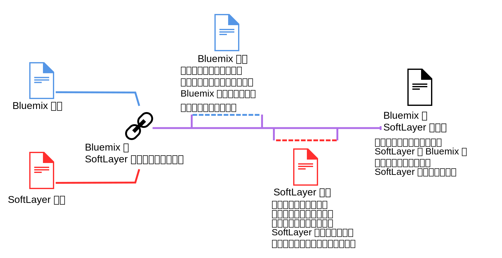

---

 

copyright:

  years: 2016

 

---

{:shortdesc: .shortdesc}
{:codeblock: .codeblock}
{:screen: .screen}
{:new_window: target="_blank"}

<!-- draft - staging only -->

#SoftLayer と {{site.data.keyword.Bluemix_notm}} の請求アカウントのリンク
{: #softlayerlink}
*最終更新日: 2016 年 8 月 15 日*
{: .last-updated}

SoftLayer と {{site.data.keyword.Bluemix_notm}} の請求アカウントをリンクできるようになりました。アカウントをリンクすると、SoftLayer と {{site.data.keyword.Bluemix_notm}} の両方のリソースについて SoftLayer から請求されるようになります。既存のアカウントがある場合、SoftLayer からの {{site.data.keyword.Bluemix_notm}} についての請求は、アカウントのリンク後に開始する次の請求処理サイクルから有効になります。
{:shortdesc}

**重要:** {{site.data.keyword.Bluemix_notm}} でリンクされるアカウントはすべて、従量課金 (PAYG) アカウントでなければなりません。新規従量課金 (PAYG) アカウントを作成するか、既存の従量課金 (PAYG) アカウントをリンクできます。あるいは、既存のトライアル・アカウントをリンクすることもできますが、そのアカウントは従量課金 (PAYG) アカウントにアップグレードされます。  

アカウントがリンクされた後、アカウント間で簡単に切り替えることができます。{{site.data.keyword.Bluemix_notm}} ユーザー・インターフェースで {{site.data.keyword.Bluemix_notm}} リソースの使用量を引き続きモニターできます。ただし、それらのリソースについての請求は、SoftLayer の請求書に表示されるようになっています。

アカウントの請求はリンクされますが、ログイン ID は、SoftLayer アカウントの認証方法に応じて以下のように異なるものになります。
* 認証に IBMid を使用しない SoftLayer アカウントのユーザーの場合、SoftLayer の製品とサービスには引き続き SoftLayer ID を使用し、{{site.data.keyword.Bluemix_notm}} の製品とサービスには IBMid を使用します。
* 認証に IBMid を使用する SoftLayer アカウントのユーザーの場合、SoftLayer アカウントと {{site.data.keyword.Bluemix_notm}} アカウントの両方へのアクセスに IBMid を使用します。

**注意:** リンクされたアカウントをリンク解除することはできません。  

SoftLayer アカウントがあり、SoftLayer アカウントと {{site.data.keyword.Bluemix_notm}} アカウントをリンクする場合は、以下のステップを実行します。
 1. {{site.data.keyword.slportal}} で、**「{{site.data.keyword.Bluemix_notm}} アカウントをリンク (Link a {{site.data.keyword.Bluemix_notm}} Account)」**をクリックします。 
 2. SoftLayer アカウントと {{site.data.keyword.Bluemix_notm}} アカウントをリンクする場合のご利用条件を読み、同意します。
 3. 要求されたら、{{site.data.keyword.Bluemix_notm}} アカウントに関連付けられている E メール・アドレスを指定します。{{site.data.keyword.Bluemix_notm}} アカウントがない場合は、使用する E メール・アドレスを指定し、{{site.data.keyword.Bluemix_notm}} への招待を受けてアカウントを作成するための手順に従います。

アカウントをリンクするには、SoftLayer アカウントのマスター・ユーザーでなければなりません。

アカウントをリンクすると、SoftLayer グローバル・ヘッダーで**「{{site.data.keyword.Bluemix_notm}} に進む」**が使用可能になります。このリンクをクリックすると、{{site.data.keyword.Bluemix_notm}} ログイン・ページに移動します。また、{{site.data.keyword.Bluemix_notm}} ヘッダーで**「SoftLayer」**が使用可能になっています。このリンクをクリックすると、新規ウィンドウで {{site.data.keyword.slportal}} のホーム・ページに移動します。

## アカウントがリンクされている場合の {{site.data.keyword.Bluemix_notm}} 使用量に対するクレジット
{: #slcredit}

{{site.data.keyword.Bluemix_notm}} と SoftLayer の請求アカウントをリンクすると、{{site.data.keyword.Bluemix_notm}} の使用量に対する $200.00 のクレジットが得られます。このクレジットは、アカウントをリンクしてから 30 日以内に使用する必要があります。

クレジットおよび有効期限の表示方法については、『[クレジットの表示](https://console.ng.bluemix.net/docs/pricing/index.html#credits)』を参照してください。

## {{site.data.keyword.Bluemix_notm}} への SoftLayer チーム・メンバーの招待
{: #invite_users}

{{site.data.keyword.Bluemix_notm}} アカウントと SoftLayer アカウントをリンクするときに、{{site.data.keyword.Bluemix_notm}} に参加するように SoftLayer チーム・メンバーを招待できます。あるいは、後で {{site.data.keyword.Bluemix_notm}} ユーザー・インターフェースから SoftLayer チーム・メンバーを招待することもできます。
{:shortdesc}

{{site.data.keyword.Bluemix_notm}} ユーザー・インターフェースから、SoftLayer アカウントのすべてのメンバーを招待することを選択します。また、個別にメンバーを選択することもできます。チーム・メンバーを招待する際には、被招待者の {{site.data.keyword.Bluemix_notm}} アカウントの役割を設定する必要があります。{{site.data.keyword.Bluemix_notm}} の各種役割について詳しくは、[ユーザー役割](https://console.ng.bluemix.net/docs/admin/users_roles.html#userrolesinfo)を参照してください。

チーム・メンバーを {{site.data.keyword.Bluemix_notm}} アカウントに招待するには、SoftLayer アカウントのマスター・ユーザーでなければなりません。

{{site.data.keyword.Bluemix_notm}} を使用してチーム・メンバーを招待するには、以下のようにします。
 1. **「{{site.data.keyword.avatar}}」**アイコン  >**「アカウント」**>**「チーム・メンバーの招待」**に移動します。
 2. **「追加」**をクリックし、SoftLayer アカウントへの認証操作を行い、SoftLayer アカウントからチーム・メンバーのリストを表示します。
 3. 招待するチーム・メンバーを選択し、**「送信」**をクリックします。

チーム・メンバーが SoftLayer アカウントに追加されるごとに、何度もこの操作を実行できます。
 
チーム・メンバーは、**「組織に参加してください (Join the organization)」**リンクが含まれた E メールを受け取ります。メンバーは、IBMid を所有していない場合、登録ページにリダイレクトされます。次に、メンバーは、いくつかの基本情報を入力し、{{site.data.keyword.Bluemix_notm}} アカウントを作成できます。

{{site.data.keyword.Bluemix_notm}} ユーザー・インターフェースを使用したチーム・メンバーの招待について詳しくは、『[チーム・メンバーの招待](https://console.ng.bluemix.net/docs/admin/users_roles.html#inviteteammembers)』を参照してください。

## SoftLayer 資産での {{site.data.keyword.Bluemix_notm}} サービスの使用
{: #bluemix_services}

SoftLayer 資産で API ベースの公開 {{site.data.keyword.Bluemix_notm}} サービスを簡単に使用できます。すべての API はセキュアであり暗号化されているため、データが保護されます。
{:shortdesc}

例えば、SoftLayer からベア・メタル・サーバーで実行されているアプリに Watson のコグニティブ機能を追加したいと思ったことはありませんか。以下の簡単な 4 つのステップで、{{site.data.keyword.personalityinsightsshort}} などのサービスを追加して、アプリのユーザーを把握できるようにすることが可能です。

1. {{site.data.keyword.Bluemix_notm}} カタログでサービスを見つけます。
2. わずか数クリックで、サービスのインスタンスをプロビジョンします。
3. サービス資格情報をコピーし、アプリケーションに追加して、サービスが既存のコードで実行されるようにセットアップします。
4. アプリを更新した後に、SoftLayer インフラストラクチャーで新規バージョンをデプロイします。

SoftLayer のアプリから Watson API を呼び出して*洞察およびコグニティブ* の知識を得ることで、アプリをさらにパーソナライズできます。あるいは、*データおよび分析* サービスを使用して、アプリでハイパフォーマンス分析を利用できます。あるいは、DaaS (Database-as-a-Service) を選択し、管理を {{site.data.keyword.Bluemix_notm}} に任せることができます。

{{site.data.keyword.activedeployshort}} や {{site.data.keyword.deliverypipeline}} などのサービスとともにコンテナーを使用することで、アプリケーション開発を最新化できます。そうすると、{{site.data.keyword.vpn_short}} サービスを使用して SoftLayer にトンネルで戻し、プライベート・ネットワーク内のコンテナーを SoftLayer プライベート・ネットワークに接続できます。計算リソースおよびサービスの使用量に対するすべての課金は、SoftLayer 請求に反映されます。 

### API ベースの {{site.data.keyword.Bluemix_notm}} サービス
一部の {{site.data.keyword.Bluemix_notm}} サービスは、SoftLayer で使用できません。以下のサービスは、アプリケーション・コードを使用して実行するようにセットアップできます。
* {{site.data.keyword.alchemyapishort}}
* {{site.data.keyword.alertnotificationshort}}
* {{site.data.keyword.sparks}}
* {{site.data.keyword.appseccloudshort}}
* {{site.data.keyword.blockchain}}
* {{site.data.keyword.cloudant}}
* {{site.data.keyword.conceptinsightsshort}}
* {{site.data.keyword.iotmapinsights_short}}
* {{site.data.keyword.dashdbshort}}
* {{site.data.keyword.dialogshort}}
* {{site.data.keyword.documentconversionshort}}
* {{site.data.keyword.twittershort}}
* {{site.data.keyword.weather_short}}
* {{site.data.keyword.iotdriverinsights_short}}
* {{site.data.keyword.geospatialshort_Geospatial}}
* {{site.data.keyword.graphshort}}
* {{site.data.keyword.iotelectronics}}
* {{site.data.keyword.languagetranslationshort}}
* {{site.data.keyword.messagehub}}
* {{site.data.keyword.mqa}}
* {{site.data.keyword.mobileappbuilder_short}}
* {{site.data.keyword.mql}}
* {{site.data.keyword.nlclassifierlshort}}
* {{site.data.keyword.objectstorageshort}}
* {{site.data.keyword.personalityinsightsshort}}
* {{site.data.keyword.presenceinsightsshort}}
* {{site.data.keyword.relationshipextractionshort}}
* {{site.data.keyword.retrieveandrankshort}}
* {{site.data.keyword.servicediscoveryshort}}
* {{site.data.keyword.speechtotextshort}}
* {{site.data.keyword.sqldb}}
* {{site.data.keyword.streaminganalyticsshort}}
* {{site.data.keyword.texttospeechshort}}
* {{site.data.keyword.toneanalyzershort}}
* {{site.data.keyword.tradeoffanalyticsshort}}
* {{site.data.keyword.visualinsightsshort}}
* {{site.data.keyword.visualrecognitionshort}}
* {{site.data.keyword.workflow}}
* {{site.data.keyword.workloadscheduler}}

**注:** これらのサービスの一部のプランは使用できません。リンクされたアカウントで使用できるのは、従量課金 (PAYG) アカウント用に有効になっているプランのみです。ただし、個別に請求される個別の {{site.data.keyword.Bluemix_notm}} アカウントがある場合は、これらのすべてのサービスのすべてのプランを使用できます。

## アカウントがリンクされている場合の {{site.data.keyword.Bluemix_notm}} 使用量に対する請求処理
{: #bill_usage}

{{site.data.keyword.Bluemix_notm}} と SoftLayer の請求アカウントをリンクすると、次の請求処理サイクルは、単一の SoftLayer 請求で課金されます。
{:shortdesc}

{{site.data.keyword.Bluemix_notm}} の使用量サイクルは暦月ベースであるため、アカウントは毎月、課金契約に設定された請求日に請求されます。SoftLayer では、使用量サイクルは、SoftLayer の使用を開始したときから始まるため、毎月、SoftLayer アカウントを登録したときと同じ日に請求されます。 

アカウントをリンクした場合、現行月のサイクルの間、{{site.data.keyword.Bluemix_notm}} の使用量が引き続き計測され、その使用量については {{site.data.keyword.Bluemix_notm}} の請求書で請求されます。翌月の初めから、{{site.data.keyword.Bluemix_notm}} の課金は、SoftLayer の請求書に含まれるようになります。

例えば、4 月 16 日にアカウントをリンクした場合、4 月の使用量については Bluemix の請求書を受け取ります。5 月の使用量は、SoftLayer アカウントで請求されます。

請求が結合されると、SoftLayer の請求書のサマリー請求書に **{{site.data.keyword.Bluemix_notm}}** セクションが含まれます。詳細請求ビューで、{{site.data.keyword.Bluemix_notm}} の課金はその他のサービスとして表示され、*"{{site.data.keyword.Bluemix_notm}} Plan..."* から始まります。

{{site.data.keyword.Bluemix_notm}} の使用量を表示する方法については、『[使用量詳細の表示](https://console.ng.bluemix.net/docs/pricing/index.html#usage)』を参照してください。

# 関連リンク
## 一般
* [ビデオ: Link SoftLayer and Bluemix Accounts For a Single Invoice](https://www.youtube.com/watch?v=Xb01idt2NiU&index=1&list=PLzpeuWUENMK2d3L5qCITo2GQEt-7r0oqm)
