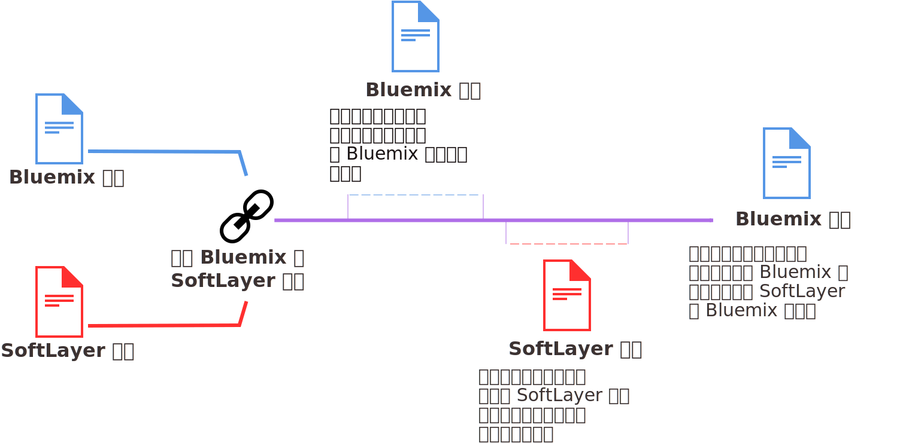

---

 

copyright:

  years: 2016, 2017
lastupdated: "2017-01-11"
 

---

{:shortdesc: .shortdesc}
{:codeblock: .codeblock}
{:screen: .screen}
{:new_window: target="_blank"}

# 升級及統一 {{site.data.keyword.Bluemix_notm}} 與 SoftLayer 計費帳戶
{: #softlayerlink}

如果您有 {{site.data.keyword.Bluemix_notm}} 試用帳戶，並且想要存取「基礎架構」儀表板，則必須升級至 {{site.data.keyword.Bluemix_notm}}「隨收隨付制」帳戶。如果想要使用無法在試用帳戶內使用的其他付費資源，或您的試用帳戶到期，則您也必須升級。 

您可以透過鏈結帳戶，來統一現有的 {{site.data.keyword.Bluemix_notm}} 與 SoftLayer 計費帳戶。鏈結帳戶之後，即會透過 {{site.data.keyword.Bluemix_notm}} 向您收取 {{site.data.keyword.Bluemix_notm}} 和 SoftLayer 資源的費用。

**注意：**{{site.data.keyword.Bluemix_notm}} 訂閱帳戶不能與 SoftLayer 帳戶相鏈結。若要存取「基礎架構」儀表板，您必須建立自動鏈結至 SoftLayer 帳戶的「隨收隨付制」帳戶（第二個帳戶）。您之後會收到兩張發票，一個 {{site.data.keyword.Bluemix_notm}} 帳戶一張。雖然在個別「隨收隨付制」帳戶中會開出基礎架構資源的發票，但是在訂閱帳戶中，可以搭配使用資源與應用程式及服務。例如，如果您在訂閱帳戶中啟動 Watson 服務，則可以複製服務認證，然後將認證新增至源自「隨收隨付制」帳戶的裸機應用程式。
{:shortdesc}

## 升級至 {{site.data.keyword.Bluemix_notm}} 隨收隨付制帳戶
{: #upgradetopayg}

使用試用帳戶登入 {{site.data.keyword.Bluemix_notm}} 時，您無法存取 {{site.data.keyword.Bluemix_notm}}「基礎架構」儀表板。如果您要應用程式使用基礎架構資源，則必須升級至「隨收隨付制」帳戶。

若要將試用帳戶升級至 {{site.data.keyword.Bluemix_notm}}「隨收隨付制」帳戶，請完成下列步驟：

 1. 按一下**帳戶** &gt; **計費**。
 2. 然後，按一下**新增信用卡**。
 3. 輸入必要的計費詳細資料。 
 4. 閱讀並接受「隨收隨付制」帳戶的條款。 
 5. 完成之後，請按一下**升級**。 
 
升級至「隨收隨付制」帳戶之後，{{site.data.keyword.Bluemix_notm}} **型錄**中會列出**基礎架構**選項。如果您的用量超過免費額度，則會收到 {{site.data.keyword.Bluemix_notm}} 的月份發票。發票的計價單位為美元 (USD)，並且會詳細列出資源費用。 

## 統一 {{site.data.keyword.Bluemix_notm}} 與 SoftLayer 帳戶
{: #unifyingaccounts}

您可以統一 {{site.data.keyword.Bluemix_notm}} 與 SoftLayer 帳戶，以利用結合的資源。當您鏈結 {{site.data.keyword.Bluemix_notm}} 與 Softlayer 帳戶時，會收到一張 {{site.data.keyword.Bluemix_notm}} 發票。如果您有現有的 {{site.data.keyword.Bluemix_notm}} 帳戶，則會在帳戶鏈結之後開始的新計費週期，透過 {{site.data.keyword.Bluemix_notm}} 收取 SoftLayer 資源的費用。

**重要事項：**{{site.data.keyword.Bluemix_notm}} 中所有鏈結的帳戶都必須是「隨收隨付制」帳戶。您可以建立新的「隨收隨付制」帳戶，也可以鏈結至現有的「隨收隨付制」帳戶。或者，您可以鏈結現有的試用帳戶，但它將會升級為「隨收隨付制」帳戶。無法鏈結訂閱 {{site.data.keyword.Bluemix_notm}} 帳戶。  

鏈結帳戶之後：

* 您必須使用 IBM ID 認證來存取 SoftLayer 及 {{site.data.keyword.Bluemix_notm}} 帳戶。
* 任何現有 SoftLayer 折扣都會套用至 {{site.data.keyword.Bluemix_notm}} 費用。 
* 您將收到一張計價單位為美元 (USD) 的發票。
* 您可以在 {{site.data.keyword.Bluemix_notm}} 使用者介面中監視 {{site.data.keyword.BluSoftlayer}} 資源的用量。 

**注意：**帳戶鏈結之後，便無法解除鏈結。 

如果您有 SoftLayer 帳戶，而且想要將 SoftLayer 帳戶與 {{site.data.keyword.Bluemix_notm}} 帳戶鏈結，請完成下列步驟：

 1. 從 {{site.data.keyword.slportal}}，按一下**鏈結 {{site.data.keyword.Bluemix_notm}} 帳戶**。
 2. 閱讀並接受將 SoftLayer 帳戶與 {{site.data.keyword.Bluemix_notm}} 帳戶鏈結所適用的條款。
 3. 當系統要求時，提供與 {{site.data.keyword.Bluemix_notm}} 帳戶相關聯的電子郵件位址。如果您沒有 {{site.data.keyword.Bluemix_notm}} 帳戶，請提供您要使用的電子郵件位址，然後遵循指示，以受邀加入 {{site.data.keyword.Bluemix_notm}} 並建立帳戶。

您必須是 SoftLayer 帳戶的「主要使用者」，才能鏈結帳戶。

鏈結帳戶之後，SoftLayer 廣域標頭中會出現**移至 {{site.data.keyword.Bluemix_notm}}** 鏈結。按一下此鏈結，即可讓您進入 {{site.data.keyword.Bluemix_notm}} 登入頁面。此外，{{site.data.keyword.Bluemix_notm}} 標頭中現在也會出現 **SoftLayer** 鏈結。按一下此鏈結，即可讓您進入新視窗中的 {{site.data.keyword.slportal}} 首頁。

{{site.data.keyword.Bluemix_notm}} 基礎架構供應項目是連接至分成公用、專用及管理資料流量的三層網路。客戶 {{site.data.keyword.Bluemix_notm}} 帳戶的基礎架構供應項目可能會跨專用網路彼此傳送資料，而無需任何成本。基礎架構供應項目（例如裸機伺服器、虛擬伺服器及雲端儲存空間）會跨公用網路連接至 {{site.data.keyword.Bluemix_notm}} 型錄中的其他應用程式及服務（例如 Watson 服務、容器或運行環境）。這兩種類型供應項目之間的資料傳送是依標準公用網路頻寬速率進行計量及收費。

## 邀請 SoftLayer 團隊成員加入 {{site.data.keyword.Bluemix_notm}}
{: #invite_users}

鏈結 {{site.data.keyword.Bluemix_notm}} 與 SoftLayer 帳戶時，可以邀請 SoftLayer 團隊成員加入 {{site.data.keyword.Bluemix_notm}}。也可以之後再從 {{site.data.keyword.Bluemix_notm}} 使用者介面來邀請 SoftLayer 團隊成員。
{:shortdesc}

從 {{site.data.keyword.Bluemix_notm}} 使用者介面，您可以選擇邀請 SoftLayer 帳戶的所有成員，也可以選取個別成員。在邀請團隊成員時，您必須為受邀者設定 {{site.data.keyword.Bluemix_notm}} 帳戶角色。如需 {{site.data.keyword.Bluemix_notm}} 中不同角色的相關資訊，請參閱[使用者角色](https://console.ng.bluemix.net/docs/admin/users_roles.html#userrolesinfo)。

您必須是 SoftLayer 帳戶的「主要使用者」，才能邀請團隊成員加入 {{site.data.keyword.Bluemix_notm}} 帳戶。

若要透過 {{site.data.keyword.Bluemix_notm}} 邀請團隊成員，請完成下列步驟：

 1. 按一下**帳戶** &gt; **邀請團隊成員**。
 2. 按一下**新增**以鑑別 SoftLayer 帳戶，並利用 {{site.data.keyword.BluSoftlayer}} 帳戶檢視團隊成員清單。
 3. 選取要邀請的團隊成員，然後按一下**傳送**。
 
團隊成員會收到包含**加入組織**鏈結的電子郵件。如果該團隊成員沒有 IBM ID，則會將其重新導向至登錄頁面。接下來，該團隊成員可以輸入一些基本資訊，並建立自己的 {{site.data.keyword.Bluemix_notm}} 帳戶。

如需透過 {{site.data.keyword.Bluemix_notm}} 使用者介面來邀請團隊成員的相關資訊，請參閱[邀請團隊成員](https://console.ng.bluemix.net/docs/admin/users_roles.html#inviteteammembers)。

## 切換至 IBM ID
{: #ibmid_switch}

SoftLayer 中的鑑別現在使用 IBM ID 來提供所有 {{site.data.keyword.Bluemix_notm}} 的單一登入。將會啟用現有 SoftLayer 帳戶來切換至 IBM ID 鑑別，而且移轉精靈會引導您完成這項切換。
{:shortdesc}

如果您是 {{site.data.keyword.slportal}} 中的主要使用者，而且沒有看到切換至 IBM ID 的提示，請[聯絡 IBM 支援中心](https://console.ng.bluemix.net/docs/support/index.html#contacting-support)以取得啟用此特性的協助。

開始切換至 IBM ID 時，在完成此過程之前隨時都可以取消這項切換。不過，在下次登入時，系統還是會提示您切換至 IBM ID。您計劃要鏈結至 {{site.data.keyword.Bluemix_notm}} 帳戶的每一個帳戶都必須為具有唯一電子郵件位址的唯一 IBM ID 所擁有。

若要將現有 SoftLayer 使用者名稱切換至 IBM ID，請完成下列步驟：

 1. 如果您在登入之後於起始提示時選取**稍後**，但之後決定您要在現行階段作業中開始切換至 IBM ID 鑑別，請移至「編輯使用者設定檔」頁面，然後按一下**切換至 IBM ID**。
 2. 遵循精靈提示，以建立您的 IBM ID。您的 IBM ID 是唯一電子郵件位址，建立之後即無法進行變更。您稍後可以更新與設定檔相關聯的電子郵件，預設電子郵件設定為您針對 IBM ID 所定義的電子郵件。您將會收到一封含有登錄碼的電子郵件，指出您已完成移轉精靈。 
 3. 當您收到電子郵件時，請遵循鏈結，或將 URL 複製到瀏覽器，並輸入登錄碼。此登錄碼的有效時間是 7 天，而且只能使用一次。
 
 
在您切換至 IBM ID 鑑別之後，就只能使用 IBM ID 來登入帳戶。在登入提示處，按一下**使用 IBM ID 登入**，而非輸入 SoftLayer 使用者名稱和密碼。
 
以新客戶身分查看訂單時，系統會要求您輸入現有 IBM ID 帳戶的電子郵件位址，或建立新的 IBM ID 帳戶。如果您建立新的 IBM ID，請輸入新 IBM ID 的電子郵件位址。電子郵件位址是收到邀請電子郵件的電子郵件位址，也是新 IBM ID 的使用者名稱。

### 允許使用者切換至 IBM ID
{: #link_accounts_resellers}

在部分情況下，轉銷商或經銷商必須允許帳戶使用 IBM ID 鑑別，使用者才能切換至 IBM ID。 

 * 若要允許具有舊式 SoftLayer 認證的現有帳戶使用 IBM ID 鑑別，請[聯絡 IBM 支援中心](https://console.ng.bluemix.net/docs/support/index.html#contacting-support)來啟用 IBM ID 移轉。對於每一個您要鏈結至 {{site.data.keyword.Bluemix_notm}} 帳戶的現有一般使用者帳戶都必須予以啟用。
 
 * 若要確保使用 IBM ID 來建立新的使用者帳戶，則必須在立即主要使用者帳戶上設定 `CREATE_NEW_ACCOUNT_WITH_IBMid_AUTHENTICATION` 屬性。請[聯絡 IBM 支援中心](https://console.ng.bluemix.net/docs/support/index.html#contacting-support)或供應商，為您的帳戶設定此項目。
 
### 鏈結使用者帳戶
{: #link_user_accounts}
在您的使用者切換至 IBM ID 鑑別之後，轉銷商及經銷商就可以鏈結 SoftLayer 及 {{site.data.keyword.Bluemix_notm}} 帳戶。

**附註：** 
  * 所鏈結之帳戶的主要使用者必須是 IBM ID。
  * 以主要使用者身分登入每一個一般使用者帳戶。移至使用者設定檔頁面，然後按一下**切換至 IBM ID**。
  * 您鏈結至 {{site.data.keyword.Bluemix_notm}} 帳戶的每一個帳戶都必須為具有唯一電子郵件位址的唯一 IBM ID 所擁有。雖然一個 IBM ID 可以擁有多個 SoftLayer 帳戶，但是您無法將這些帳戶鏈結至 {{site.data.keyword.Bluemix_notm}} 帳戶。如果一個 IBM ID 是多個 SoftLayer 帳戶的主要使用者，而且您要將那些帳戶鏈結至 {{site.data.keyword.Bluemix_notm}} 帳戶，則必須為每一個帳戶將主要使用者變更為唯一的 IBM ID。請與 [IBM SoftLayer 支援中心 ](https://knowledgelayer.softlayer.com/topic/support){: new_window} 聯絡，以變更 SoftLayer 帳戶上的主要使用者。
  
完成下列步驟，以將每一個帳戶鏈結至 {{site.data.keyword.Bluemix_notm}} 帳戶： 

 1. 若要建立新的 {{site.data.keyword.Bluemix_notm}} 帳戶，或鏈結至現有 {{site.data.keyword.Bluemix_notm}} 帳戶，請以主要使用者身分登入 SoftLayer 帳戶，然後按一下 **{{site.data.keyword.Bluemix_notm}}** 鏈結。這可讓您建立新的 {{site.data.keyword.Bluemix_notm}} 帳戶，或者鏈結至現有 {{site.data.keyword.Bluemix_notm}} 帳戶。作為 SoftLayer 帳戶之主要使用者的 IBM ID 必須是您正要鏈結的 Bluemix 帳戶的擁有者。請遵循精靈提示（包括將 SoftLayer 帳戶中的使用者新增至 {{site.data.keyword.Bluemix_notm}} 帳戶）。 
 2. 在您鏈結帳戶之後，請通知帳戶的一般使用者以移轉至 IBM ID。一般使用者接著可以在 {{site.data.keyword.Bluemix_notm}} 主控台中存取「基礎架構」、「應用程式」及「服務」儀表板。
 3. 將新使用者新增至鏈結的帳戶時，您需要將他們新增至 SoftLayer 帳戶及 {{site.data.keyword.Bluemix_notm}} 帳戶，他們才能存取統一主控台內的所有功能。
 
**建議：**僅將一般使用者帳戶移轉至 IBM ID。請不要移轉品牌帳戶，這是一般使用者帳戶的母帳戶，未包含任何資源。移轉至 IBM ID 的品牌帳戶使用者將無法登入 Brand Agent Portal (BAP) 入口網站。

<!--
### Mapping multiple SoftLayer accounts to one IBMid
{: #map_multiple_accounts}

You can associate one IBMid with multiple SoftLayer accounts by using an existing IBMid email address when setting up the account. Only one SoftLayer user for each account can be mapped to the single IBMid. The IBMid must be unique within each SoftLayer account. However, one user with access to multiple SoftLayer accounts can use one IBMid to access multiple SoftLayer accounts.

For example, an IBMid can map to the master user in accounts A and B, and to an additional user in accounts C and D. One of the accounts mapped to that IBMid is the default account.  Usually, the default account is the account that was first mapped to the IBMid. However, you can switch which account is the default account  through an account switching feature in the Customer Portal.

For a user with IBMid access to multiple accounts with two-factor authentication enabled, an appropriate two-factored authentication verification code per account is required during account log in and account switching.
-->

## 將 {{site.data.keyword.Bluemix_notm}} 服務與 SoftLayer 資產搭配使用
{: #bluemix_services}

您可以輕鬆地將 API 型公用 {{site.data.keyword.Bluemix_notm}} 服務與 SoftLayer 資產搭配使用。所有 API 都很安全且經過加密，讓您的資料受到保護。{:shortdesc}

例如，您是否曾經想要將 Watson 的認知功能新增至在 SoftLayer 的裸機伺服器上執行的應用程式？使用四個簡單的步驟，就可以新增 {{site.data.keyword.personalityinsightsshort}} 之類的服務，以協助瞭解您應用程式的使用者：

1. 在 {{site.data.keyword.Bluemix_notm}} 型錄中尋找服務。
2. 只要按幾下滑鼠，即可佈建服務的實例。
3. 複製服務認證，並將其新增至您的應用程式，將服務設定為使用您現有的程式碼來執行。
4. 更新應用程式之後，將新版本部署在 SoftLayer 基礎架構上。

您可以從 SoftLayer 中的應用程式呼叫 Watson API，使其更加個人化，以獲得*見解和認知* 的知識。或者，使用*資料和分析* 服務，為您的應用程式進行高效能分析。或者，選擇資料庫即服務 (database-as-a-service)，將管理工作交給 {{site.data.keyword.Bluemix_notm}}。

使用容器搭配 {{site.data.keyword.activedeployshort}} 和 {{site.data.keyword.deliverypipeline}} 等服務，使您的應用程式開發作業現代化。然後，您可以使用 {{site.data.keyword.vpn_short}} 服務與 SoftLayer 進行通訊，以將專用網路中的容器連接至 SoftLayer 專用網路。運算資源及服務的所有使用費用都會反映在您的 {{site.data.keyword.Bluemix_notm}} 帳單上。 

### API 型 {{site.data.keyword.Bluemix_notm}} 服務
並非所有 {{site.data.keyword.Bluemix_notm}} 服務都可以與 SoftLayer 搭配使用。下列服務可設定為與您的應用程式碼搭配執行：
* {{site.data.keyword.alchemyapishort}}
* {{site.data.keyword.alertnotificationshort}}
* {{site.data.keyword.sparks}}
* {{site.data.keyword.appseccloudshort}}
* {{site.data.keyword.blockchain}}
* {{site.data.keyword.cloudant}}
* {{site.data.keyword.conceptinsightsshort}}
* {{site.data.keyword.iotmapinsights_short}}
* {{site.data.keyword.dashdbshort}}
* {{site.data.keyword.dialogshort}}
* {{site.data.keyword.documentconversionshort}}
* {{site.data.keyword.twittershort}}
* {{site.data.keyword.weather_short}}
* {{site.data.keyword.iotdriverinsights_short}}
* {{site.data.keyword.geospatialshort_Geospatial}}
* {{site.data.keyword.graphshort}}
* {{site.data.keyword.iotelectronics}}
* {{site.data.keyword.languagetranslationshort}}
* {{site.data.keyword.messagehub}}
* {{site.data.keyword.mqa}}
* {{site.data.keyword.mobileappbuilder_short}}
* {{site.data.keyword.mql}}
* {{site.data.keyword.nlclassifierlshort}}
* {{site.data.keyword.objectstorageshort}}
* {{site.data.keyword.personalityinsightsshort}}
* {{site.data.keyword.presenceinsightsshort}}
* {{site.data.keyword.relationshipextractionshort}}
* {{site.data.keyword.retrieveandrankshort}}
* {{site.data.keyword.speechtotextshort}}
* {{site.data.keyword.sqldb}}
* {{site.data.keyword.streaminganalyticsshort}}
* {{site.data.keyword.texttospeechshort}}
* {{site.data.keyword.toneanalyzershort}}
* {{site.data.keyword.tradeoffanalyticsshort}}
* {{site.data.keyword.visualinsightsshort}}
* {{site.data.keyword.visualrecognitionshort}}
* {{site.data.keyword.workflow}}
* {{site.data.keyword.workloadscheduler}}

**附註：**並非這些服務的所有方案都可供使用。只有針對「隨收隨付制」帳戶啟用的方案，才能用於已鏈結的帳戶。不過，如果您有分開計費的個別 {{site.data.keyword.Bluemix_notm}} 帳戶，則可將任何方案用於上述任何服務。

## 帳戶鏈結後的 {{site.data.keyword.Bluemix_notm}} 用量計費
{: #bill_usage}

鏈結 {{site.data.keyword.Bluemix_notm}} 與 SoftLayer 計費帳戶之後，將以一張 {{site.data.keyword.Bluemix_notm}} 帳單收取下一個計費週期的費用。
{:shortdesc}

您的 {{site.data.keyword.Bluemix_notm}} 使用週期是以行事曆月份為基準，所以會在收費合約成立的帳單日，每個月向您的帳戶收費。使用 SoftLayer 時，您的使用週期是從 SoftLayer 起始使用日開始，所以會以 SoftLayer 帳戶註冊當月的相同日期，每月向您收費。 

帳戶鏈結之後，會繼續計算當月週期的 {{site.data.keyword.Bluemix_notm}} 用量，並且會在 {{site.data.keyword.Bluemix_notm}} 發票上向您收取該用量的費用。從下個月 1 日開始，{{site.data.keyword.Bluemix_notm}} 及 SoftLayer 費用將會結合到 {{site.data.keyword.Bluemix_notm}} 發票。

例如，如果您在 4 月 16 日鏈結帳戶，則會收到 4 月用量的 Bluemix 發票。根據鏈結帳戶的時間，您可能會收到 SoftLayer 用量的個別帳單。SoftLayer 及 {{site.data.keyword.Bluemix_notm}} 的五月用量將會透過 {{site.data.keyword.Bluemix_notm}} 帳戶向您收費。

鏈結帳單之後，{{site.data.keyword.Bluemix_notm}} 發票將會在下列標題下，針對您所使用的每項資源列出不同費用：

* **裸機伺服器及連接的服務**
* **虛擬伺服器及連接的服務**
* **未連接的服務**

如需如何檢視 {{site.data.keyword.Bluemix_notm}} 用量的相關資訊，請參閱[檢視用量詳細資料](https://console.ng.bluemix.net/docs/pricing/index.html#usage)。

