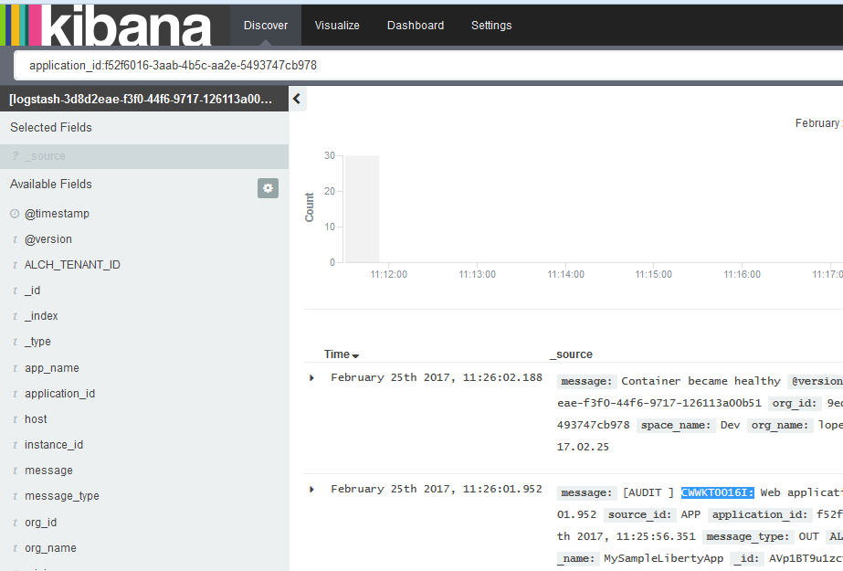

---

copyright:
  years: 2015, 2017

lastupdated: "2017-03-13"

---


{:shortdesc: .shortdesc}
{:new_window: target="_blank"}
{:codeblock: .codeblock}
{:screen: .screen}

# Filtering your logs for a specific text in a field value
{:#k4_filter_logs_spec_text}

View and search for entries that include a specific text in the value of a field. 
{:shortdesc}

**Notice:** You can only do a free text search of string fields that are analyzed by the Elasticsearch analyzer. 
    
When Elasticsearch analyzes the value of a string field, it splits the text on word boundaries, as defined by the Unicode Consortium, removes punctuation and lowercases all words.
    
Complete the following steps to search for entries that include specific text in a field value:

1. Look at the Kibana Discover page to see what subset of your data it displays. For more information, see [Identifying the data that is displayed in your Kibana Discover page]((logging_kibana_analize_logs_interactively.html#k4_identify_data).

2. Identify the fields that are analyzed in ElasticSearch by default.

    To display the complete list of analyzed fields that are available for searching and filtering log data, [reload the list of fields](logging_kibana_analize_logs_interactively.html#kibana_discover_view_reload_fields). Then, in the *Fields list* that is available in the Discover page, complete the following steps:
    
    1. Click the configure icon . The section **Selected fields**, where you can filter fields, is displayed.

        
    
    2. To identify the fields that are analyzed, select **Yes** for the search field **Analyzed**.

        
    
        The list of analyzed fields is shown.
    
        
        
         
    3. Check if the field in which you want to look for free text is a field that is analyzed by ElasticSearch by default.
    
3. If the field is analyzed, modify the query to search for entries in the logs that include that free text as part of the value of a field.

    
**Example**

If you launch Kibana for a Cloud Foundry (CF) application from the {{site.data.keyword.Bluemix}} UI, and you want to look for a specific message that includes the message ID *CWWKT0016I:*, modify the search to include the free text.
    
1. Check the search query that is loaded and the data that is displayed in the Discover page.
       
    
        
2. To search for the message ID *CWWKT0016I*, modify the search query and press **Enter**:
    
    ```application_id:f52f6016-3aab-4b5c-aa2e-5493747cb978 AND message:"CWWKT0016I:" ```
        
    
      
    
The table shows entries for your CF app where the text *CWWKT0016I* is part of the value in the *message* field.
    
     	
        
 
 
