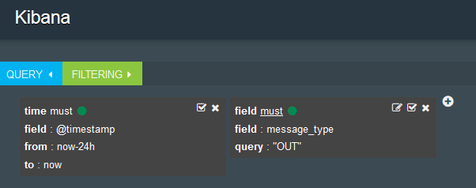

---

copyright:
  years: 2016, 2017
lastupdated: "2017-02-06"

---

{:new_window: target="_blank"}
{:shortdesc: .shortdesc}
{:screen:.screen}
{:codeblock:.codeblock}

# Filtering your Cloud Foundry App logs by message type in Kibana
<!-- for example, Uploading your data -->
{: #logging_kibana_message_type_filter}
<!-- Provide an appropriate ID above -->

View and filter {{site.data.keyword.Bluemix_notm}} application logs by message type on the Kibana dashboard. You can access the Kibana dashboard from the **Logs** tab for your Cloud Foundry app. 
{:shortdesc}

<!-- Include a sentence to briefly introduce the steps/subtopics. Example: -->
Complete the following tasks to view and filter your Cloud Foundry app logs by message type on the Kibana dashboard:

1. Access the **Logs** tab of your Cloud Foundry app. 

    1. Click the app name on the {{site.data.keyword.Bluemix_notm}} **Apps** dashboard.
    2. Click the **Logs** tab. 
    
    The logs for your app are displayed.

2. Access the Kibana dashboard for your app. Click **Advanced View** . The Kibana dashboard is displayed.

3. In the **ALL EVENTS** window, click the right arrow icon to show all fields. 

    

4. In the **Fields** pane, select **message_type** to display the component that generated each log entry in the **ALL EVENTS** window.

    

5. In the **ALL EVENTS** window, click a log event row to display the details for that event. Choose an event that displays the **message_type** that you want to filter.

    

6. Add a filter to include or exclude information about a message type. 

    * To add a filter that includes information about a message type, click the **Magnifying Glass**  icon in the message_type row of the table. 
    
           
    
    * To add a filter that excludes information about a message type, click the **Exclusion**  icon in the message_type row of the table. 
    
    A new filter condition is added to the Kibana dashboard.

7. Optionally, repeat the previous step to add a filter for other message types. To see the full list of message types, see [Log format](logging_log_ov.md#log_format).

9. Save the dashboard.    
        
    When you are finished creating your filters, click the **Save** icon  and enter a name for your dashboard. 
      
    **Note:** If you try to save a dashboard with a name containing blank spaces, it will not save. Enter a name without spaces and click the **Save** icon.
    
    .

You have created a dashboard that filters your log entries by message type. You can load your saved dashboard at any time by clicking the **Folder** icon  and by selecting your dashboard by name.
