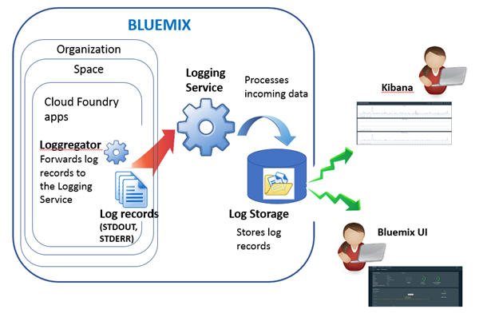

---

copyright:
  years: 2015, 2017

lastupdated: "2017-02-06"

---

{:shortdesc: .shortdesc}
{:new_window: target="_blank"}
{:codeblock: .codeblock}
{:screen: .screen}

# Protokollierung für Cloud Foundry-Apps in Bluemix
{: #logging_bluemix_cf_apps}

In {{site.data.keyword.Bluemix}} können Sie Protokolle über das {{site.data.keyword.Bluemix}}-Dashboard, das Kibana-Dashboard und die Befehlszeilenschnittstelle (CLI) anzeigen, filtern und analysieren. Darüber hinaus können Sie Protokolleinträge durch Streaming an ein externes Protokoll-Management-Tool übertragen.
{:shortdesc}

Wenn Sie Ihre Apps in einer als Service bereitgestellten Cloudplattform (Platform-as-a-service, PaaS) wie Cloud Foundry in {{site.data.keyword.Bluemix_notm}} ausführen, können Sie nicht über SSH oder FTP auf die Protokolle in der Infrastruktur zugreifen, in der Ihre Apps ausgeführt werden. Die Plattform wird durch den Cloud-Provider gesteuert. Cloud Foundry-Apps, die in {{site.data.keyword.Bluemix_notm}} ausgeführt werden, verwenden die Komponente "Loggrerator", um Protokolleinträge aus der Cloud Foundry-Infrastruktur heraus weiterzuleiten. Loggregator erfasst automatisch STDOUT- und STDERR-Daten. Sie können diese Protokolle über das {{site.data.keyword.Bluemix}}-Dashboard, über Kibana und über die Befehlszeilenschnittstelle visualisieren und analysieren.

Die folgende Abbildung zeigt eine Übersicht über die Protokollierung von Cloud Foundry-Apps in {{site.data.keyword.Bluemix_notm}}:

 
Die Protokollierung von Cloud Foundry-Apps ist automatisch aktiviert, wenn Sie die Cloud Foundry-Infrastruktur zur Ausführung Ihrer Apps in {{site.data.keyword.Bluemix_notm}} verwenden. Wenn Sie Cloud Foundry-Laufzeitprotokolle anzeigen möchten, müssen Sie Ihre Protokolle in die Standardausgabe (STDOUT) und Standard-Fehlerausgabe (STDERR) schreiben. Weitere Informationen finden Sie unter [Laufzeitanwendungsprotokollierung durch CF-Apps](cfapps/logging_writing_to_log_from_cf_app.html#logging_writing_to_log_from_cf_app).

Die folgenden Methoden stehen für die Analyse der Protokolle Ihrer Cloud Foundry-Anwendung zur Auswahl:

* Analyse des Protokolls in {{site.data.keyword.Bluemix_notm}}, um die letzte Aktivität der Anwendung anzuzeigen
    
    In {{site.data.keyword.Bluemix}} können Sie Protokolle über die Registerkarte **Protokolle** anzeigen, filtern und analysieren, die für jede Cloud Foundry-Anwendung verfügbar ist. Weitere Informationen finden Sie unter [CF-App-Protokolle über das Bluemix-Dashboard analysieren](logging_view_dashboard.html#analyzing_logs_bmx_ui).
    
* Analyse von Protokollen in Kibana zur Durchführung erweiterter Analysetasks
    
    In {{site.data.keyword.Bluemix}} können Sie Kibana, eine quelloffene Analyse- und Visualisierungsplattform, dazu verwenden, Ihre Daten in einer Reihe von Darstellungsarten, wie zum Beispiel Diagrammen und Tabellen, zu überwachen, zu durchsuchen, zu analysieren und zu visualisieren. Weitere Informationen finden Sie unter [Protokolle in Kibana analysieren](logging_view_kibana3.html#analyzing_logs_Kibana).

* Analyse von Protokollen über die Befehlszeilenschnittstelle mit Befehlen zur programmgesteuerten Protokollverwaltung
    
    In {{site.data.keyword.Bluemix}} können Sie Protokolle über die Befehlszeilenschnittstelle (CLI) mithilfe des Befehls **cf logs** anzeigen, filtern und analysieren. Weitere Informationen finden Sie unter [Cloud Foundry-App-Protokolle über die Befehlszeile analysieren](logging_view_cli.html#analyzing_logs_cli).

{{site.data.keyword.Bluemix_notm}} bewahrt eine begrenzte Menge an Protokolldaten auf. Bei der Protokollierung von Daten werden die alten Informationen durch die neueren Daten ersetzt. Wenn Sie organisationsbedingte oder branchenspezifische Richtlinien einhalten müssen, die eine Aufbewahrung eines Teils oder aller Protokolldaten zu Prüfzwecken oder aus anderen Gründen vorsehen, können Sie Ihre Protokolle auf einen externen Protokollhost, wie zum Beispiel einen Protokoll-Management-Service eines anderen Anbieters, oder auf einen anderen Host durch Streaming übertragen. Weitere Informationen finden Sie unter [Externe Protokollhosts konfigurieren](logging_view_external.html#viewing_logs_external).

