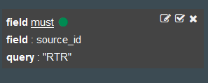

---

copyright:
  years: 2016, 2017
lastupdated: "2017-02-06"

---

<!-- Common attributes used in the template are defined as follows: -->
{:new_window: target="_blank"}
{:shortdesc: .shortdesc}
{:screen:.screen}
{:codeblock:.codeblock}

# Filtrage de vos journaux d'application Cloud Foundry par type de journal dans Kibana
<!-- for example, Uploading your data -->
{: #logging_kibana_component_filter}
<!-- Provide an appropriate ID above -->

Affichez et filtrez des journaux d'application {{site.data.keyword.Bluemix_notm}} par composant (type de journal) sur le tableau de bord Kibana. Vous pouvez accéder au tableau de bord Kibana à partir de l'onglet **Journaux** de votre application Cloud Foundry.
{:shortdesc}

<!-- Include a sentence to briefly introduce the steps/subtopics. Example: -->
Procédez comme suit pour afficher et filtrer vos journaux d'application Cloud Foundry par type de journal sur le tableau de bord Kibana :

1. Accédez à l'onglet **Journaux** de votre application Cloud Foundry.  

    1. Cliquez sur le nom d'application dans le tableau de bord **Applications** de {{site.data.keyword.Bluemix_notm}}. 
    2. Cliquez sur l'onglet **Journaux**. 
    
    Les journaux de votre application s'affichent. 

2. Accédez au tableau de bord Kibana de votre application. Cliquez sur **Vue avancée** . Le tableau de bord Kibana s'affiche. 

3. Dans la fenêtre **Tous les événements**, cliquez sur l'icône en forme de flèche vers la droite pour afficher toutes les zones.  

    

4. Dans la sous-fenêtre **Zones**, sélectionnez **source_id** pour afficher le composant ayant généré chaque entrée de journal dans la fenêtre **Tous les événements**. 

    

5. Dans la fenêtre **Tous les événements**, cliquez sur une ligne d'événement de journal pour afficher les détails relatifs à l'événement. Choisissez un événement qui affiche la valeur source_id que vous souhaitez filtrer. 

    

6. Ajoutez un filtre pour inclure ou exclure des informations concernant un composant (type de journal).  

    * Pour ajouter un filtre incluant une valeur de composant, cliquez sur l'icône en forme de **loupe**  dans la ligne source_id du tableau.  

         

    * Pour ajouter un filtre excluant une valeur de composant, cliquez sur l'icône d'**exclusion**  dans la ligne source_id du tableau.  
    
          
     
     Une nouvelle condition de filtre est ajoutée au tableau de bord Kibana. 

7. Vous pouvez éventuellement répéter l'étape précédente et ajouter des filtres pour chaque composant. Pour afficher la liste complète de tous les composants, voir [Format de journal](../logging_view_kibana3.html#kibana_log_format_cf).

    L'image suivante illustre le tableau de bord avec plusieurs filtres pour différents composants :
    
    

8. Sauvegardez le tableau de bord. 

    Lorsque vous avez terminé d'ajouter des filtres et de personnaliser le tableau de bord, cliquez sur l'icône de **sauvegarde**  et entrez un nom pour votre tableau de bord.  
      
    **Remarque :** Si vous tentez de sauvegarder un tableau de bord avec un nom contenant des espaces vides, l'opération échoue. Entrez un nom ne contenant pas d'espaces et cliquez sur l'icône de **sauvegarde**. 
    
    

Vous avez créé un tableau de bord qui filtre vos entrées de journal par composant (type de journal). Vous pouvez charger votre tableau de bord sauvegardé à tout moment en cliquant sur l'icône **Dossier**  et en sélectionnant votre tableau de bord par nom. 

