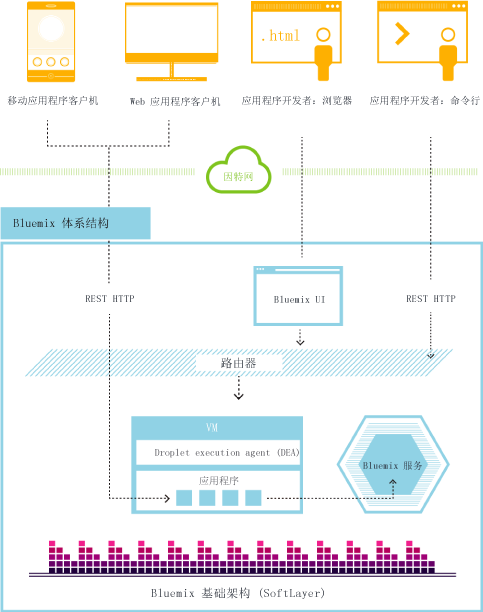
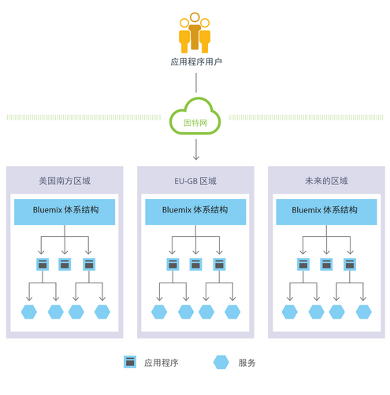
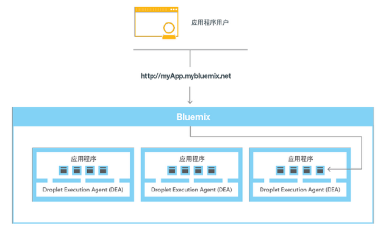

---


copyright:
  years: 2016, 2017
lastupdated: "2017-01-11"
---

{:shortdesc: .shortdesc}
{:new_window: target="_blank"}

# 什么是 {{site.data.keyword.Bluemix_notm}}？
{: #bluemixoverview}

{{site.data.keyword.Bluemix}} 是 {{site.data.keyword.IBM_notm}} 的创新云计算平台，集平台即服务 (PaaS) 与基础架构即服务 (IaaS) 于一体。此外，{{site.data.keyword.Bluemix_notm}} 具有包含丰富云服务的目录，这些服务可以轻松与 PaaS 和 IaaS 相集成，用于迅速构建业务应用程序。
{:shortdesc}

{{site.data.keyword.Bluemix_notm}} 具有多种云部署，无论您是计划扩大规模的小企业，还是需要额外隔离机制的大企业，都能满足您的需求。您可以在云中进行无边界开发，在这里您可以将专用服务连接到 {{site.data.keyword.IBM_notm}} 提供的公共 {{site.data.keyword.Bluemix_notm}} 服务。您和您的团队可以访问 {{site.data.keyword.Bluemix_notm}} 中的应用程序、服务和基础架构，并使用现有数据、系统、过程、PaaS 工具和 IaaS 工具。由可用服务和运行时框架构成的生态系统在飞速成长，开发者可以利用此生态系统通过混合语言编程方法来构建应用程序。
 
借助 {{site.data.keyword.Bluemix_notm}}，您不必再对硬件进行大笔投资来测试或运行新应用程序。我们可以代您管理一切，并只按您使用的内容收取费用。{{site.data.keyword.Bluemix_notm}} 提供了公共、[专用](/docs/dedicated/index.html)和[本地](/docs/local/index.html)集成部署模型。 

您可以将一开始的构想变成开发沙箱，再变成具有计算和存储基础架构的全球分布式生产环境、开放式源代码平台服务和容器，以及来自 {{site.data.keyword.IBM_notm}}、Watson 等的软件服务和工具。除了平台自身的能力外，{{site.data.keyword.Bluemix}} 还可提供灵活的部署。您可在内部部署、专用私有云环境或公共云中供应 {{site.data.keyword.Bluemix}} 资源，并在单个仪表板中管理所有这三种类型环境中的资源。
 
在公共和专用环境中部署的所有 {{site.data.keyword.IBM_notm}} 云资源都在您选择的全球 {{site.data.keyword.CloudDataCent}} 位置进行托管。{{site.data.keyword.CloudDataCents_notm}} 提供了区域冗余性，用于连接所有数据中心和接入点的全球网络主干，以及严格的安全控制和报告功能。通过 {{site.data.keyword.CloudDataCents_notm}}，{{site.data.keyword.IBM_notm}} 可以满足您最高要求的扩展、安全性、合规性和数据存储位置需求。 

{{site.data.keyword.IBM_notm}} 支持您执行以下操作：

* 在全球安全的 {{site.data.keyword.CloudDataCents_notm}} 中部署高性能计算和存储基础架构。
* 通过 {{site.data.keyword.IBM_notm}}、开放式源代码社区和第三方开发者，测试和采用丰富的云服务和功能。
* 在可扩展的单个云平台中，通过专用网络和 API 功能连接到所有遗留系统和应用程序。
* 随着业务需要或工作负载需求变化，实时增加和减少资源。

### 应用程序
{: #bluemixoverviewapplications}

通过“应用程序”仪表板，可执行使应用程序启动并运行以及在运行期间对这些应用程序进行管理所需的全部功能。{{site.data.keyword.Bluemix_notm}} 提供了各种样板和运行时：

* 样板是一种模板，其中包含一个应用程序及其关联的运行时环境，以及为特定域预定义的服务。 
* 运行时是用于运行应用程序的一组资源，作为用于不同类型应用程序的容器提供。

{{site.data.keyword.Bluemix_notm}} 为您提供了各种运行应用程序的方法，例如 Cloud Foundry 和 {{site.data.keyword.containerlong}}。使用 {{site.data.keyword.containerlong}} 在 {{site.data.keyword.Bluemix_notm}} 上的托管云环境中运行 Docker 容器。 

可以使用 {{site.data.keyword.openwhisk}} 进行分布式事件驱动型计算。{{site.data.keyword.openwhisk_short}} 从 Web 或移动应用程序通过 HTTP 运行应用程序逻辑来响应事件或直接调用。
 
可以使用 {{site.data.keyword.Bluemix_notm}} Mobile 服务将预构建、受管和可扩展云服务合并到移动应用程序中。 

### 服务
{: #bluemixoverviewservices}

通过“服务”仪表板，可访问 {{site.data.keyword.IBM}} 和第三方提供者提供的 {{site.data.keyword.Bluemix_notm}} 服务，包括 Watson、Internet of Things、Analytics、Mobile 和 DevOps 服务：

* 使用 {{site.data.keyword.IBM_notm}} DevOps 服务和 {{site.data.keyword.Bluemix_notm}} Garage Method，以更快速度、更低价格交付新的具备适当功能的创新型应用程序。如果您采用了 DevOps 做法并打造了具有创新性和灵活性的文化，那么在应对市场变化时，您既可以采用反复迭代的做法，也可以改变方向。
* 区块链是一种点对点分布式账本技术，用于实现新一代的交易应用程序，这些应用程序可建立信任、责任和透明度，同时简化业务流程。  
* Watson 将为应用程序提供认知计算能力，以及一套完整的语音、视觉和数据 API。通过使用 Watson 服务部署认知平台，可解决最复杂的业务问题。
* {{site.data.keyword.IBM_notm}} 支持您通过丰富的集成云数据库以及数据和分析服务来执行更多操作。 
* {{site.data.keyword.IBM_notm}} Internet of Things 服务允许应用程序与连接的设备、传感器和网关进行通信，以及使用这些设备、传感器和网关收集的数据。通过我们的诀窍，能轻松将设备连接到我们的 Internet of Things 云。随后，您的应用程序可以使用实时 API 和 REST API 来与设备进行通信，并使用您将这些设备设置为要收集的数据。 
* {{site.data.keyword.IBM_notm}} 提供了移动后端基础架构，在其中可以构建多平台、本机或混合应用程序，同时还能对这些应用程序进行监视和测试。您还可以通过分析、安全性、用户洞察和持续交付功能来增强应用程序的功能。 
 
{{site.data.keyword.Bluemix_notm}} 还提供了可供您试用的试验性服务。要了解有关服务类型和可用性的信息，请参阅 [{{site.data.keyword.Bluemix_notm}} 服务](/docs/services/index.html)。


### 基础架构
{: #bluemixoverviewinfrastructure}

“基础架构”仪表板提供了各种服务来满足云基础架构的需要。

{{site.data.keyword.Bluemix_notm}} 基础架构提供了能达到最高性能的云基础架构。{{site.data.keyword.Bluemix_notm}} 基础架构是一种平台，可利用全球各地具有最丰富云计算选项的数据中心，然后集成并自动执行所有功能。{{site.data.keyword.CloudDataCents_notm}} 中处处是一流的计算、存储和联网设备。因为每个位置都以相同的方式进行构建、配备和运行，所以无论在任何位置使用我们的产品，都能实现完全相同的功能性和可用性。各个位置通过业内最先进的网中网结构进行连接，可集成不同的公共、专用和内部管理网络，使联网总成本更低、访问性更好、速度更快。此外，数据中心和网络还共享单个专有管理系统。您可通过一个管理工具来控制一切 - 每个裸机服务器、虚拟服务器和存储设备，这些设备全部可通过 API、门户网站和移动应用程序进行访问。

{{site.data.keyword.Bluemix_notm}} 基础架构在单个无缝平台中提供了功能强大的裸机服务器和灵活的虚拟服务器。所有这些服务器都将按需提供，并按月或按小时计费。裸机服务器为处理器密集型和磁盘 I/O 密集型工作负载提供了原动力，可以严格按照您的规范进行配置。虚拟服务器支持高速部署、灵活扩展以及按使用量计费。对于高性能计算，通过图形处理单元 (GPU) 服务器极大提高了云的能力，这些服务器可按小时或按月使用。 

{{site.data.keyword.Bluemix_notm}} 基础架构产品连接到一个三层网络，对公共、专用和管理流量进行分段处理。客户的 {{site.data.keyword.Bluemix_notm}} 帐户上的基础架构可在专用网络上的此类基础架构之间免费传输数据。基础架构产品（例如，裸机服务器、虚拟服务器和云存储器）在公用网络上连接到 {{site.data.keyword.Bluemix_notm}}“目录”中的其他应用程序和服务，如 Watson 服务、容器或运行时。这两种类型的产品之间的数据传输按标准公用网络带宽费率计量并收费。

## 使用 {{site.data.keyword.Bluemix_notm}} 控制台
{: #bluemixoverviewui}

访问 {{site.data.keyword.Bluemix_notm}} 控制台时，菜单栏会显示多个链接或按钮，可用于注册、登录、访问文档和访问目录。登录后，根据您的帐户类型，菜单栏会包含“汉堡包”菜单  和其他链接：

* 如果您是新 {{site.data.keyword.Bluemix_notm}} 用户，那么可以使用“汉堡包”菜单  来切换“应用程序”、“服务”或“基础架构”仪表板。将显示支持和帐户选项的链接，并且您可以使用**目录**链接来访问 {{site.data.keyword.Bluemix_notm}}、计算和基础架构服务。 
* 如果您是现有用户并且已链接 {{site.data.keyword.Bluemix_notm}} 和 {{site.data.keyword.BluSoftlayer}} 帐户，那么可以使用“汉堡包”菜单  来切换“应用程序”、“服务”或“基础架构”仪表板。将显示支持和帐户选项的链接，并且您可以使用**目录**链接来访问 {{site.data.keyword.Bluemix_notm}}、计算和基础架构服务。 
* 如果您是具有 {{site.data.keyword.Bluemix_notm}} 帐户的现有用户，那么可以使用“汉堡包”菜单  来切换“应用程序”和“服务”仪表板。将显示支持和帐户选项的链接，并且您可以使用**目录**链接来访问 {{site.data.keyword.Bluemix_notm}} 和计算服务。 
* 如果您是具有 {{site.data.keyword.BluSoftlayer}} 帐户的现有用户，并且未将帐户链接到 {{site.data.keyword.Bluemix_notm}}，那么菜单栏会显示 {{site.data.keyword.BluSoftlayer}} 中先前可用的链接，如用于访问 KnowledgeLayer 帮助、联系人选项、通知、开具凭单和登录的链接。此外，还将显示“基础架构”仪表板的链接以及支持和帐户选项的链接。 

## {{site.data.keyword.Bluemix_notm}} Cloud Foundry 体系结构
{: #architecture}

一般而言，在 {{site.data.keyword.Bluemix_notm}} Cloud Foundry 中运行应用程序时，您不必担心操作系统和基础架构层。诸如根文件系统和中间件组件这样的层已进行抽象化，以便您可以重点关注自己的应用程序代码。但是，如果需要有关应用程序运行位置的具体信息，可以了解有关这些层的更多信息。 

有关详细信息，请参阅[查看 {{site.data.keyword.Bluemix_notm}} 基础架构层](/docs/manageapps/infra.html#viewinfra)。

作为开发者，您可以使用基于浏览器的用户界面与 {{site.data.keyword.Bluemix_notm}} 基础架构进行交互。还可以使用名为 cf 的 Cloud Foundry 命令行界面来部署 Web 应用程序。

不管是客户机（移动应用程序、外部运行的应用程序、基于 {{site.data.keyword.Bluemix_notm}} 构建的应用程序等）还是使用浏览器的开发者，都可以与 {{site.data.keyword.Bluemix_notm}} 托管的应用程序进行交互。客户机使用 REST 或 HTTP API 通过 {{site.data.keyword.Bluemix_notm}} 将请求路由到某个应用程序实例或组合服务。

下图显示了高层次的 {{site.data.keyword.Bluemix_notm}} Cloud Foundry 体系结构。



图 1. {{site.data.keyword.Bluemix_notm}} Cloud Foundry 体系结构

出于等待时间或安全考虑，可以将应用程序部署到不同的 {{site.data.keyword.Bluemix_notm}} 区域。您可以选择部署到一个区域或跨多个区域部署。有关更多信息，请参阅[区域](whatisbluemix.html#ov_intro_reg)。




图 2. 多区域应用程序部署

## {{site.data.keyword.Bluemix_notm}} Cloud Foundry 的工作方式
{: #howwork}

将某个应用程序部署到 {{site.data.keyword.Bluemix_notm}} Cloud Foundry 时，必须使用足够的信息来配置 {{site.data.keyword.Bluemix_notm}} 才能支持该应用程序。

* 对于移动应用程序，{{site.data.keyword.Bluemix_notm}} 包含表示移动应用程序后端的工件，例如移动应用程序用于与服务器进行通信的服务。
* 对于 Web 应用程序，必须确保将运行时和框架相关信息传递给 {{site.data.keyword.Bluemix_notm}}，以便 {{site.data.keyword.Bluemix_notm}} 能够设置正确的执行环境来运行应用程序。

每个执行环境（包括移动应用程序和 Web 应用程序）都与其他应用程序的执行环境相隔离。即使这些应用程序位于同一物理机器上，其执行环境也相互隔离。下图显示了 {{site.data.keyword.Bluemix_notm}} Cloud Foundry 如何管理应用程序部署的基本流程：


图 3. 部署应用程序

创建应用程序并将其部署到 {{site.data.keyword.Bluemix_notm}} Cloud Foundry 时，{{site.data.keyword.Bluemix_notm}} 环境会确定将应用程序或应用程序所表示的工件发送到哪个相应的虚拟服务器。对于移动应用程序，将在 {{site.data.keyword.Bluemix_notm}} 上创建移动后端投影。在云中运行的移动应用程序的任何代码最终都会在 {{site.data.keyword.Bluemix_notm}} 环境中运行。对于 Web 应用程序，在云中运行的代码是开发者部署到 {{site.data.keyword.Bluemix_notm}} 的应用程序本身。确定虚拟服务器时会考虑若干因素，包括：

* 机器上的已有负载
* 该虚拟服务器支持的运行时或框架。

选择虚拟服务器后，每个虚拟服务器上的应用程序管理器都会为应用程序安装正确的框架和运行时。然后，可以将应用程序部署到该框架。部署完成后，将启动应用程序工件。

下图显示部署了多个应用程序的虚拟服务器（也称为 Droplet Execution Agent (DEA)）的结构：


图 4. 虚拟服务器的设计

在每个虚拟服务器中，应用程序管理器都会与 {{site.data.keyword.Bluemix_notm}} 基础架构的其余部分进行通信，并会对部署到此虚拟服务器的应用程序进行管理。每个虚拟服务器都具有容器，用于隔离和保护应用程序。在每个容器中，{{site.data.keyword.Bluemix_notm}} 会安装每个应用程序所需的相应框架和运行时。

部署应用程序后，如果该应用程序具有 Web 接口（例如 Java Web 应用程序）或其他基于 REST 的服务（例如向移动应用程序公开的移动服务），那么该应用程序的用户可以使用正常的 HTTP 请求与其进行通信。



图 5. 调用 {{site.data.keyword.Bluemix_notm}} 应用程序

每个应用程序都可以有一个或多个关联的 URL，但所有这些 URL 都必须指向 {{site.data.keyword.Bluemix_notm}} 端点。当请求到达时，{{site.data.keyword.Bluemix_notm}} 会检查该请求，确定该请求针对的是哪个应用程序，然后选择某个应用程序实例来接收该请求。


### 区域
{: #ov_intro_reg}

{{site.data.keyword.Bluemix_notm}} 区域是可将您应用程序部署到的已定义地理地域。您可以在不同的区域中创建应用程序和服务实例，但前提是这些区域使用相同的 {{site.data.keyword.Bluemix_notm}} 基础架构来进行应用程序管理，并使用相同的使用情况详细信息视图来进行记帐。您可以选择离客户最近的区域，并将应用程序部署到此区域以缩短应用程序等待时间。还可选择希望在其中保留应用程序数据以解决安全问题的区域。在多个区域中构建应用程序后，如果一个区域变为不可用，其他区域中的应用程序会继续运行。您的资源限额对于您使用的每个区域都是相同的。

如果您使用的是 {{site.data.keyword.Bluemix_notm}} 用户界面，那么可以切换到其他区域来使用该区域中的空间。单击用户帐户首选项链接，展开**区域**选择器，然后从列表中选择所需的区域。

如果您使用的是 cf 命令行界面，那么要连接到希望使用的 {{site.data.keyword.Bluemix_notm}} 区域，请使用 cf api 命令并指定该区域的 API 端点。例如，输入以下命令来连接到 {{site.data.keyword.Bluemix_notm}} 欧洲英国区域：

```
cf api https://api.eu-gb.{{site.data.keyword.Bluemix_notm}}.net
```

每个区域都分配有唯一前缀。{{site.data.keyword.Bluemix_notm}} 提供了以下区域和区域前缀。

<!-- PRODUCTION ONLY: Ensure that URLs are production URLs, not stage1-->

| **区域名称** | **地理位置** | **区域前缀** | **cf API 端点** | **UI 控制台** |       
|-----------------|-------------------------|-------------------|---------------------|----------------|
| 美国南部区域 | 美国达拉斯 | ng | api.ng.bluemix.net | console.ng.bluemix.net |
| 英国区域 | 英国伦敦 | eu-gb | api.eu-gb.bluemix.net | console.eu-gb.bluemix.net |
| 悉尼区域 | 澳大利亚悉尼 | au-syd | api.au-syd.bluemix.net | console.au-syd.bluemix.net |
{: caption="Table 1. {{site.data.keyword.Bluemix_notm}} region list" caption-side="top"}


### {{site.data.keyword.Bluemix_notm}} 弹性
{: #resiliency}

{{site.data.keyword.Bluemix_notm}} 旨在托管可扩展的弹性应用程序和应用程序工件，它们可根据您的需求进行扩展，始终保持高度可用且可从问题中快速恢复。{{site.data.keyword.Bluemix_notm}} 将跟踪交互状态（有状态）的组件与不跟踪交互状态（无状态）的组件分隔开来。通过这种分隔，{{site.data.keyword.Bluemix_notm}} 可以根据需要灵活地移动应用程序，从而实现可扩展性和弹性。

您的应用程序可以有一个或多个实例正在运行。对于单个应用程序的多个实例，仅会将该应用程序上传一次。不过，{{site.data.keyword.Bluemix_notm}} 会部署所请求数目的应用程序实例，并将它们分布到尽可能多的虚拟服务器上。

您必须在应用程序外部的有状态数据存储中（例如，在 {{site.data.keyword.Bluemix_notm}} 提供的某个数据存储服务上）保存所有持久数据。因为内存中或磁盘上高速缓存的任何内容即使在重新启动后也可能不可用，所以您可以将单个 {{site.data.keyword.Bluemix_notm}} 实例的内存空间或文件系统用作短暂的单事务高速缓存。设置单个实例时，对应用程序的请求可能会由于 {{site.data.keyword.Bluemix_notm}} 的无状态性质而中断。最佳做法是每个应用程序至少使用三个实例，以确保其可用性。

所有 {{site.data.keyword.Bluemix_notm}} 基础架构、Cloud Foundry 组件和特定于 {{site.data.keyword.IBM_notm}} 的管理组件都具有高可用性。通过使用多个基础架构实例来平衡负载。

### 与记录系统集成
{: #sor}

在云环境中，{{site.data.keyword.Bluemix_notm}} 可以通过连接以下两大类别的系统来为开发者提供帮助： 

* *记录系统*包含用于存储业务记录和自动执行标准化过程的应用程序和数据库。 
* *全接触系统*是用于扩展记录系统用途并使其更吸引用户的功能。

通过将记录系统与在 {{site.data.keyword.Bluemix_notm}} 中创建的应用程序集成，可以执行以下操作：

 * 通过下载并安装内部部署的安全连接器，启用应用程序与后端数据库之间的安全通信。
 * 以安全方式调用数据库。
 * 根据包含数据库和后端系统（例如客户关系管理系统）的集成流创建 API。
 * 仅公开要向应用程序公开的模式和表。
 * 以 {{site.data.keyword.Bluemix_notm}} 组织管理员身份，将 API 发布为仅供您的组织成员查看的私有服务。
 
要将记录系统与在 {{site.data.keyword.Bluemix_notm}} 中创建的应用程序集成，请使用 Cloud Integration 服务。通过使用 Cloud Integration 服务，您可以创建 Cloud Integration API，并将 API 发布为您组织的私有服务。

<dl>
<dt>Cloud Integration API</dt>
    <dd>通过 Cloud Integration API，可以经由 Web API 安全访问位于防火墙后的记录系统。创建 Cloud Integration API 时，请选择要通过 Web API 访问的资源，指定允许的操作，并包括用于访问 API 的 SDK 和样本。有关如何创建 Cloud Integration API 的更多信息，请参阅 [Cloud Integration 入门](/docs/services/CloudIntegration/CldInt_GetStart.html)。</dd>
<dt>私有服务</dt>
    <dd>私有服务由 Cloud Integration API、SDK 和权利政策构成。私有服务还可能包含来自服务提供者的文档或其他项。只有组织管理员可以将 Cloud Integration API 发布为私有服务。要查看可供您使用的私有服务，请选中 {{site.data.keyword.Bluemix_notm}}“目录”中的“私有”复选框。您可以选择私有服务，并将其绑定到应用程序，而无需连接 Cloud Integration 服务。您可以使用与其他 {{site.data.keyword.Bluemix_notm}} 服务相同的方式，将私有服务绑定到应用程序。有关如何将 API 发布为私有服务的信息，请参阅“将 API 发布为私有服务”。</dd>
</dl>

#### 场景：创建富移动应用程序以与记录系统相连接
{: #scenario}

{{site.data.keyword.Bluemix_notm}} 提供了一个平台，在该平台中可以集成移动应用程序、云服务和企业记录系统，从而提供可与内部部署数据进行交互的应用程序。

例如，可以构建移动应用程序来与客户关系管理系统进行交互，该系统位于防火墙后的内部部署中。您可以通过安全方式调用记录系统，并利用 {{site.data.keyword.Bluemix_notm}} 中的移动服务来构建富移动应用程序。

首先，集成开发者会在 {{site.data.keyword.Bluemix_notm}} 中创建移动后端应用程序。开发者会使用“移动云”样板，该样板使用的是其最熟悉的 Node.js 运行时。

接着，开发者会在 {{site.data.keyword.Bluemix_notm}} 用户界面中使用 Cloud Integration 服务，通过安全连接器公开 API。集成开发者会下载安全连接器，并将其安装在内部部署中，以实现其 API 与数据库之间的安全通信。创建数据库端点后，开发者可以查看所有模式，并抽取要作为 API 向应用程序公开的表。

集成开发者会添加 Push 服务，用于向相关使用者发送移动通知。他们还会添加业务合作伙伴服务，用于在使用 Twitter API 创建新的客户记录后发布推特。

接着，作为应用程序开发者，您可以登录到 {{site.data.keyword.Bluemix_notm}}，下载 Android 开发工具箱，然后开发用于调用集成开发者所创建 API 的代码。您可以开发一个移动应用程序，使用户能够在其移动设备上输入信息。然后，该移动应用程序会在客户管理系统中创建客户记录。创建记录后，该应用程序会向移动设备推送通知，然后发布有关新记录的推特。

## {{site.data.keyword.Bluemix_notm}} 先决条件
{: #prereqs}

使用 {{site.data.keyword.Bluemix_notm}} 平台的先决条件很有限，但确实有一些先决条件必须满足。
{:shortdesc}

### 浏览器
{: #browsers}

以下列表指定了 {{site.data.keyword.Bluemix_notm}} 的最低必需浏览器软件：

 * Chrome：适用于操作系统的最新版本
 * Firefox：适用于操作系统的最新版本和 ESR 45
 * Internet Explorer：V11
 * Safari：适用于 Mac 的最新版本

### Cloud Foundry
{: #cf}

Cloud Foundry 命令行界面 V6.5.1 或更高版本 

# rellinks
{: #rellinks}
## general
{: #general}
* [{{site.data.keyword.Bluemix_notm}} 是什么？](http://www.ibm.com/cloud-computing/bluemix/what-is-bluemix/){:new_window}
* [入门 ](http://www.ibm.com/cloud-computing/bluemix/getting-started/){:new_window}
* [{{site.data.keyword.Bluemix_notm}} 中的新增功能](/docs/whatsnew/index.html)
* [了解有关混合模型的信息 ](http://www.ibm.com/cloud-computing/bluemix/hybrid/){:new_window}
* [管理您的帐户](/docs/admin/adminpublic.html#mngacct)
* [{{site.data.keyword.Bluemix_notm}} 词汇表](/docs/overview/glossary/index.html)
