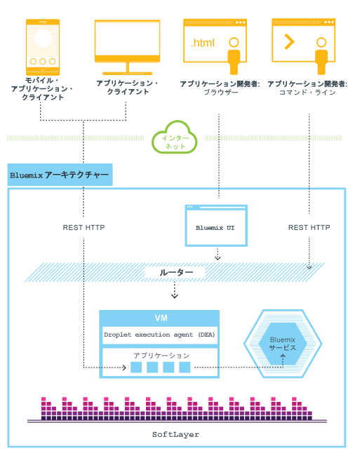

---

 

copyright:

  years: 2016

 

---

{:shortdesc: .shortdesc}
{:new_window: target="_blank"}

# {{site.data.keyword.Bluemix_notm}} Public
{: #public}
最終更新日: 2016 年 8 月 8 日
{: .last-updated}


{{site.data.keyword.Bluemix_notm}} は、クラウド・ベースのアプリのホスティングや管理に関連する複雑さの大部分を抽象化し、見えなくします。アプリケーション開発者は、アプリをホストするのに必要なインフラストラクチャーを管理せずに済み、アプリの開発に集中することができます。
{:shortdesc}

{{site.data.keyword.Bluemix_notm}} は、ユーザーのニーズに合ったクラウド・デプロイメントを提供します。ユーザーがこれから規模を拡大する予定の中小企業であっても、さらに分離を必要とする大企業であっても、境界線のないクラウド内で開発を行うことが可能です。ユーザーはこのクラウドで、{{site.data.keyword.IBM_notm}} またはサード・パーティー・プロバイダーが提供する Public {{site.data.keyword.Bluemix_notm}} サービスに独自の専用サービスを接続することができます。すべてのサービス・インスタンスは、{{site.data.keyword.IBM_notm}} によって管理されます。ユーザーが受け取るのは、ユーザーが使用すると選択したサービスのみに対する 1 通の請求書になります。

根本的に、{{site.data.keyword.Bluemix_notm}} は、ユーザーがアプリを開発し、すぐに使用できる機能を提供するサービスを使用するための環境です。また、{{site.data.keyword.Bluemix_notm}} は、Liberty などのアプリケーション・サーバー上で実行されるアプリケーション成果物をホストする環境も提供します。{{site.data.keyword.Bluemix_notm}} は SoftLayer を使用して、デプロイされた各アプリをホストする仮想コンテナーをデプロイします。この環境では、アプリは事前構築済みのサービス (サード・パーティーのサービスを含む) を使用して、アプリのアセンブリーを容易にすることができます。

モバイル・アプリと Web アプリの両方で、{{site.data.keyword.Bluemix_notm}} で提供されている事前構築済みサービスを使用することができます。Web アプリを {{site.data.keyword.Bluemix_notm}} にアップロードし、実行するインスタンスの数を指定することができます。アプリのデプロイ後は、アプリの使用量や負荷が変わったときに、簡単にそのアプリをスケールアップまたはスケールダウンすることができます。

{{site.data.keyword.Bluemix_notm}} に用意された一連の広範なサービスおよびランタイムにより、開発者は柔軟に制御できるようになり、また、予測分析からビッグデータまでさまざまなデータ・オプションを利用できるようになります。

{{site.data.keyword.Bluemix_notm}} には以下の機能が用意されています。


- Web アプリやモバイル・アプリの迅速なビルドおよび拡張を可能にする広範囲なサービス。
- アプリケーションの変更を継続的に配信するための処理能力。
- 目的に合ったプログラミング・モデルおよびサービス。
- サービスおよびアプリの管理の容易性。
- 最適化された柔軟なワークロード。
- 継続的な可用性。

{{site.data.keyword.Bluemix_notm}} を使用すると、最もよく使用されているプログラミング言語でアプリを素早く開発することができます。モバイル・アプリは、iOS、Android、および JavaScript を使用した HTML での開発が可能です。Web アプリの場合、Ruby、PHP、Java&trade;、Go、および Python などの言語を使用できます。また、既存のアプリを {{site.data.keyword.Bluemix_notm}} にマイグレーションし、{{site.data.keyword.Bluemix_notm}} が提供しているランタイムを使用してアプリを実行することもできます。

また、{{site.data.keyword.Bluemix_notm}} は、アプリが使用するミドルウェア・サービスも提供します。{{site.data.keyword.Bluemix_notm}} は、新規サービス・インスタンスをプロビジョンする際にアプリの代わりに機能し、それらのサービスをアプリにバインドします。サービスの管理をインフラストラクチャーにまかせ、ユーザーのアプリはそのアプリ本来の仕事を実行できます。

## {{site.data.keyword.Bluemix_notm}} Public のアーキテクチャー
{: #publicarch}


一般に、{{site.data.keyword.Bluemix_notm}} でアプリを実行する際にオペレーティング・システムやインフラストラクチャー層について気にする必要はありません。ルート・ファイル・システムやミドルウェア・コンポーネントなどの層は抽象化されているため、ユーザーはアプリケーション・コードに集中できます。ただし、アプリケーションがどこで実行されているか詳細を知る必要がある場合は、これらの層について詳しく学ぶことができます。
詳しくは、『[{{site.data.keyword.Bluemix_notm}} のインフラストラクチャー層の表示 (Viewing [ infrastructure layers)](../cli/vcapsvc.html#viewinfra)(../cli/vcapsvc.html#viewinfra)]』を参照してください。

開発者は、ブラウザー・ベースのユーザー・インターフェースを使用して {{site.data.keyword.Bluemix_notm}} のインフラストラクチャーと対話することができます。また、cf という、Cloud Foundry コマンド・ライン・インターフェースを使用して、Web アプリをデプロイすることもできます。

クライアント (モバイル・アプリ、外部で稼動するアプリ、{{site.data.keyword.Bluemix_notm}} でビルドされるアプリ、あるいはブラウザーを使用している開発者) は {{site.data.keyword.Bluemix_notm}} でホストされているアプリと対話します。クライアントは、REST API または HTTP API を使用し、{{site.data.keyword.Bluemix_notm}} を経由して要求をアプリ・インスタンスまたはコンポジット・サービスのいずれかに経路指定します。

次の図は、{{site.data.keyword.Bluemix_notm}} アーキテクチャーの概要を示したものです。



*図 1. {{site.data.keyword.Bluemix_notm}} アーキテクチャー*

待ち時間またはセキュリティーを考慮して、アプリはさまざまな {{site.data.keyword.Bluemix_notm}} の地域にデプロイすることができます。1 つの地域にデプロイすることも、複数地域にまたがってデプロイすることも選択できます。
詳しくは、『[地域](index.html#ov_intro_reg)』を参照してください。


*図 2. 複数地域のアプリケーション・デプロイメント*

### {{site.data.keyword.Bluemix_notm}} の動作
{: #howwork}

アプリを {{site.data.keyword.Bluemix_notm}} にデプロイする場合は、そのアプリをサポートするのに十分な情報を使用して {{site.data.keyword.Bluemix_notm}} を構成する必要があります。

* モバイル・アプリの場合、{{site.data.keyword.Bluemix_notm}} には、モバイル・アプリがサーバーとの通信に使用するサービスなどの、モバイル・アプリケーションのバックエンドを表す成果物が含まれています。
* Web アプリの場合、適切なランタイムおよびフレームワークに関する情報が {{site.data.keyword.Bluemix_notm}} に伝達されるようにする必要があります。それにより、そのアプリを実行するのに適した実行環境をセットアップすることができます。

モバイルおよび Web の両方を含め、各実行環境は他のアプリの実行環境から分離されています。実行環境は、これらのアプリが同じ物理マシン上にあったとしても互いに分離されます。以下の図は、{{site.data.keyword.Bluemix_notm}} でのアプリのデプロイメント管理方法の基本的なフローを示しています。


*図 5. アプリのデプロイ*

アプリを作成し、{{site.data.keyword.Bluemix_notm}} にデプロイすると、{{site.data.keyword.Bluemix_notm}} 環境は、そのアプリ、またはそのアプリが表す成果物の送信先となる適切な仮想サーバーを決定します。モバイル・アプリの場合、モバイル・バックエンド・プロジェクションが {{site.data.keyword.Bluemix_notm}} 上に作成されます。クラウドで実行されるモバイル・アプリのコードはすべて、結局は {{site.data.keyword.Bluemix_notm}} 環境で実行されます。
Web アプリの場合、クラウドで実行されるコードは、開発者が {{site.data.keyword.Bluemix_notm}} にデプロイするアプリ自体です。仮想サーバーの決定は、以下を含むいくつかの要因に基づいて行われます。

* マシン上に既に存在する負荷
* その仮想サーバーがサポートするランタイムまたはフレームワーク

仮想サーバーが選択された後、各仮想サーバー上のアプリケーション・マネージャーは、そのアプリに適切なフレームワークとランタイムをインストールします。その後、アプリをそのフレームワークにデプロイすることができます。デプロイメントが完了すると、アプリケーション成果物が開始されます。

以下の図は、複数のアプリがデプロイされている仮想サーバー (Droplet Execution Agent (DEA) とも呼ばれる) の構造を示しています。


*図 6. 仮想サーバーの設計*

各仮想サーバーで、アプリケーション・マネージャーは {{site.data.keyword.Bluemix_notm}} インフラストラクチャーの残りの部分と通信し、この仮想サーバーにデプロイされたアプリを管理します。各仮想サーバーには、アプリを分離し保護するためのコンテナーがあります。それぞれのコンテナーに、{{site.data.keyword.Bluemix_notm}} は各アプリに必要な、適切なフレームワークとランタイムをインストールします。

アプリがデプロイされた時、そのアプリに Web インターフェース (Java Web アプリ用など)、またはその他の REST ベースのサービス (モバイル・アプリに公開されているモバイル・サービスなど) が含まれている場合、そのアプリのユーザーは、通常の HTTP 要求を使用してそのインターフェースまたはサービスと通信することができます。


*図 7. {{site.data.keyword.Bluemix_notm}} アプリの呼び出し*

各アプリは、そのアプリに関連付けられた 1 つ以上の URL を持つことができますが、それらはすべて {{site.data.keyword.Bluemix_notm}} エンドポイントを指していなければなりません。要求が着信すると、{{site.data.keyword.Bluemix_notm}} はその要求を調べ、対象のアプリを判別し、要求を受け取るためのアプリのインスタンスのいずれか 1 つを選択します。


## 地域
{: #ov_intro_reg}

{{site.data.keyword.Bluemix_notm}} の地域は、アプリをデプロイ可能な定義済みの地理上の区域です。異なる地域で、
アプリケーション管理に同じ {{site.data.keyword.Bluemix_notm}} インフラストラクチャー、
課金に同じ使用量詳細ビューを使用して、アプリおよびサービス・インスタンスを作成できます。顧客に最も近い地域を選択して、この地域にアプリをデプロイすることで、アプリケーションの待ち時間を短くすることができます。
また、セキュリティー問題に対応するために、アプリケーション・データを保存しておく地域を選択することも可能です。
複数地域でアプリを構築すると、1 つの地域がダウンしても、別の地域にあるアプリが稼働し続けます。使用する各地域で、リソースの割当量は同じです。

{{site.data.keyword.Bluemix_notm}} ユーザー・インターフェースを使用すると、
別の地域に切り替えて、その地域のスペースで作業することができます。
**「{{site.data.keyword.avatar}}」**アイコン  をクリックし、**「地域」**セレクターを展開します。その後、リストから別の地域を選択することが可能です。

cf コマンド・ライン・インターフェースを使用する場合は、cf api コマンドを使用して地域の API エンドポイントを指定し、作業する {{site.data.keyword.Bluemix_notm}} 地域に接続する必要があります。
例えば、
{{site.data.keyword.Bluemix_notm}} ヨーロッパ・英国地域に接続するには、次のコマンドを入力します。


```
cf api https://api.eu-gb.{{site.data.keyword.Bluemix_notm}}.net
```

Eclipse ツールを使用する場合は、{{site.data.keyword.Bluemix_notm}} サーバーを作成して地域の API エンドポイントを指定し、作業する {{site.data.keyword.Bluemix_notm}} 地域に接続する必要があります。
Eclipse ツールの使用について詳しくは、「[Deploying apps with IBM {{site.data.keyword.IBM_notm}} Eclipse Tools for {{site.data.keyword.Bluemix_notm}}](../manageapps/eclipsetools/eclipsetools.html#toolsinstall)」を参照してください。

各地域に固有の接頭部が割り当てられています。
{{site.data.keyword.Bluemix_notm}} には、次の地域と、地域接頭部が用意されています。


<!-- PRODUCTION ONLY: Ensure that URLs are production URLs, not stage1-->

| **地域名** | **地理的位置** | **地域接頭部** | **cf API エンドポイント** | **UI コンソール** |       
|-----------------|-------------------------|-------------------|---------------------|----------------|
| 米国南部地域 | ダラス、米国 | ng | api.ng.bluemix.net | console.ng.bluemix.net |
| 英国地域 | ロンドン、イングランド | eu-gb | api.eu-gb.bluemix.net | console.eu-gb.bluemix.net |
| シドニー地域 | シドニー、オーストラリア | au-syd | api.au-syd.bluemix.net | console.au-syd.bluemix.net |

*表 1. {{site.data.keyword.Bluemix_notm}} の地域リスト*


## {{site.data.keyword.Bluemix_notm}} の回復力
{: #resiliency}

{{site.data.keyword.Bluemix_notm}} は、ユーザーのニーズに応じて拡張が容易であり、問題からの復旧する場合にも依然として可用性が高く、復旧速度も速い、スケーラブルで回復力のあるアプリおよびアプリケーション成果物をホストするよう設計されています。{{site.data.keyword.Bluemix_notm}} は、相互作用の状態をトラッキングするコンポーネント (ステートフル) とトラッキングしないコンポーネント (ステートレス) を分離します。この分離により、{{site.data.keyword.Bluemix_notm}} は必要に応じてアプリを柔軟に移動し、スケーラビリティーと回復力を確保できます。

アプリの 1 つ以上のインスタンスを実行させることができます。1 つのアプリに対して複数のインスタンスがある場合、そのアプリがアップロードされるのは 1 回のみです。ただし、{{site.data.keyword.Bluemix_notm}} は、要求された数のアプリ・インスタンスをデプロイし、それらをできる限り多くの仮想サーバーに分散します。

アプリの外のステートフル・データ・ストア (例えば {{site.data.keyword.Bluemix_notm}} で提供されているいずれかのデータ・ストア・サービス上のステートフル・データ・ストア) にすべての永続データを保存する必要があります。メモリー内またはディスク上にキャッシュされたデータはすべて再始動後も使用できない可能性があるので、単一の {{site.data.keyword.Bluemix_notm}} インスタンスのメモリー・スペースまたはファイル・システムを、短い単一トランザクション・キャッシュとして使用できます。単一インスタンスのセットアップの場合、{{site.data.keyword.Bluemix_notm}} のステートレスな性質により、アプリへの要求が中断される可能性があります。ベスト・プラクティスは、アプリの可用性を確保するために、各アプリケーションに少なくとも 3 個のインスタンスを使用することです。

すべての {{site.data.keyword.Bluemix_notm}} インフラストラクチャー、Cloud Foundry コンポーネント、および {{site.data.keyword.IBM_notm}} 固有の管理コンポーネントが高い可用性を持っています。インフラストラクチャーの複数インスタンスを使用して、負荷のバランスが保たれます。

## SoR との統合
{: #sor}

{{site.data.keyword.Bluemix_notm}} は、クラウド環境内にある、SoR と SoE という 2 つの広範なカテゴリーのシステムを接続することで、開発者を支援します。

*SoR* にはビジネス・レコードを保管するアプリとデータベースが含まれており、標準化されたプロセスを自動化します。*SoE* は SoR の有用性を拡張する機能で、これによりユーザーが SoR をより有効に活用できるようになります。{{site.data.keyword.Bluemix_notm}} で作成するアプリと SoR を統合することで、ユーザーは次のアクションを実行できます。

 * セキュア・コネクターをオンプレミスにダウンロードしてインストールすることで、アプリとバックエンド・データベースとの間のセキュア通信を可能にする。
 * セキュアな方法でデータベースを呼び出す。
 * データベースとカスタマー・リレーションシップ・マネジメント・システムなどのバックエンド・システムとの統合フローから API を作成する。
 * アプリに対して公開したいスキーマおよびテーブルのみを公開する。
 * {{site.data.keyword.Bluemix_notm}} 組織管理者として、
自分の組織メンバーのみに表示されるプライベート・サービスとして API を公開する。

SoRを {{site.data.keyword.Bluemix_notm}} で作成するアプリと統合するには、Cloud Integration サービスを使用します。Cloud Integration サービスを使用すれば、Cloud Integration API を作成し、その API を組織のプライベート・サービスとして公開できます。

<dl>
<dt>Cloud Integration API</dt>
    <dd>Cloud Integration API により、Web API を通してファイアウォールの後ろにある SoR への保護されたアクセスが提供されます。Cloud Integration API を作成する際には、Web API を通してアクセスしたいリソースを選択し、許可されたオペレーションを指定し、API にアクセスするための SDK とサンプルを組み込みます。Cloud Integration API の作成方法について詳しくは、『[Cloud Integration API の作成 (Creating Cloud Integration APIs)](../services/CloudIntegration/index.html#cloudint_add_service)』を参照してください。</dd>
<dt>プライベート・サービス</dt>
    <dd>プライベート・サービスは、 Cloud Integration API、SDK、およびライセンス・ポリシーから構成されます。さらに、サービス・プロバイダーからのドキュメンテーションや他の項目がプライベート・サービスに含まれる場合もあります。
Cloud Integration API をプライベート・サービスとして公開できるのは、組織管理者のみです。自分が利用できるプライベート・サービスを表示するには、{{site.data.keyword.Bluemix_notm}} カタログで「プライベート (Private)」チェック・ボックスを選択します。
Cloud Integration サービスに接続せずに、プライベート・サービスを選択してアプリにバインドすることができます。プライベート・サービスのアプリへのバインドは、他の {{site.data.keyword.Bluemix_notm}} サービスの場合と同じ方法で行います。プライベート・サービスとして API を公開する方法については、プライベート・サービスとしての API の公開を参照してください。</dd>
</dl>

### シナリオ: SoR と接続するための機能豊富なモバイル・アプリを作成する
{: #scenario}

{{site.data.keyword.Bluemix_notm}} は、オンプレミス・データをやりとりするアプリを提供するために、モバイル・アプリ、クラウド・サービス、およびエンタープライズ SoR を統合できるプラットフォームを提供します。

例えば、ファイアウォールの背後のオンプレミスに存在するカスタマー・リレーションシップ・マネジメント・システムと対話するモバイル・アプリを作成することができます。ユーザーは、機能豊富なモバイル・アプリを作成できるように、SoR をセキュアな方法で呼び出して、{{site.data.keyword.Bluemix_notm}} のモバイル・サービスを活用することができます。

まず、統合開発者が、モバイル・バックエンド・アプリを {{site.data.keyword.Bluemix_notm}} で作成します。統合開発者は、自分が一番熟知している Node.js ランタイムを使用するモバイル・クラウド・ボイラープレートを使用します。

次に、{{site.data.keyword.Bluemix_notm}} ユーザー・インターフェース内で  サービスを使用し、セキュア・コネクターを介して Cloud Integration API を公開します。統合開発者はセキュア・コネクターをダウンロードし、オンプレミスにインストールして、API とデータベースとの間のセキュアな通信を可能にします。データベース・エンドポイントの作成後、すべてのスキーマを調べて、API としてアプリで使用できるようにしたいテーブルを抽出することができます。

統合開発者は、関心のある利用者にモバイル通知を送信するために  プッシュ・サービスを追加します。また、Twitter API で新規顧客のレコードが作成された際にツイートするために、ビジネス・パートナー・サービスも追加します。

次に、アプリケーション開発者が {{site.data.keyword.Bluemix_notm}} にログインし、Android 開発ツールキットをダウンロードして、統合開発者が作成した API を呼び出すコードを作成します。ユーザーが自分のモバイル・デバイスに情報を入力できるようにするモバイル・アプリを開発できます。その後、そのモバイル・アプリは顧客管理システムで顧客のレコードを作成します。レコードの作成時に、アプリはモバイル・デバイスに対して通知をプッシュし、その新規レコードに関するツイートを開始します。

# 関連リンク
## 一般
* [{{site.data.keyword.Bluemix_notm}} の新機能](../whatsnew/index.html)
* [{{site.data.keyword.Bluemix_notm}} の前提条件](https://developer.ibm.com/bluemix/support/#prereqs)
* [{{site.data.keyword.Bluemix_notm}} の既知の問題](https://developer.ibm.com/bluemix/support/#issues)
* [アカウントの管理](../admin/adminpublic.html#mngacct)
* [{{site.data.keyword.Bluemix_notm}} 用語集](../overview/glossary/index.html)
