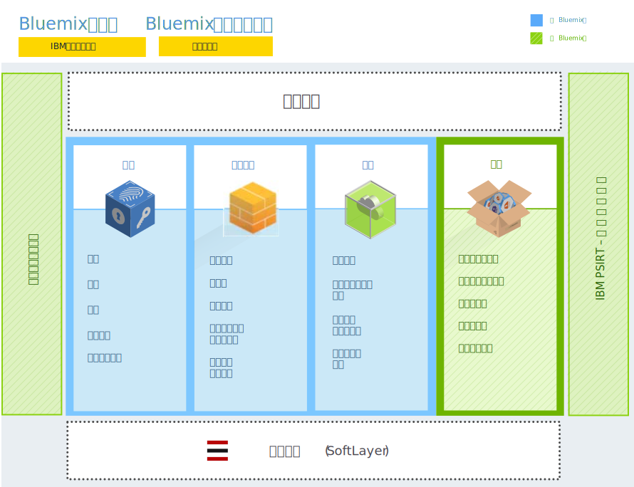
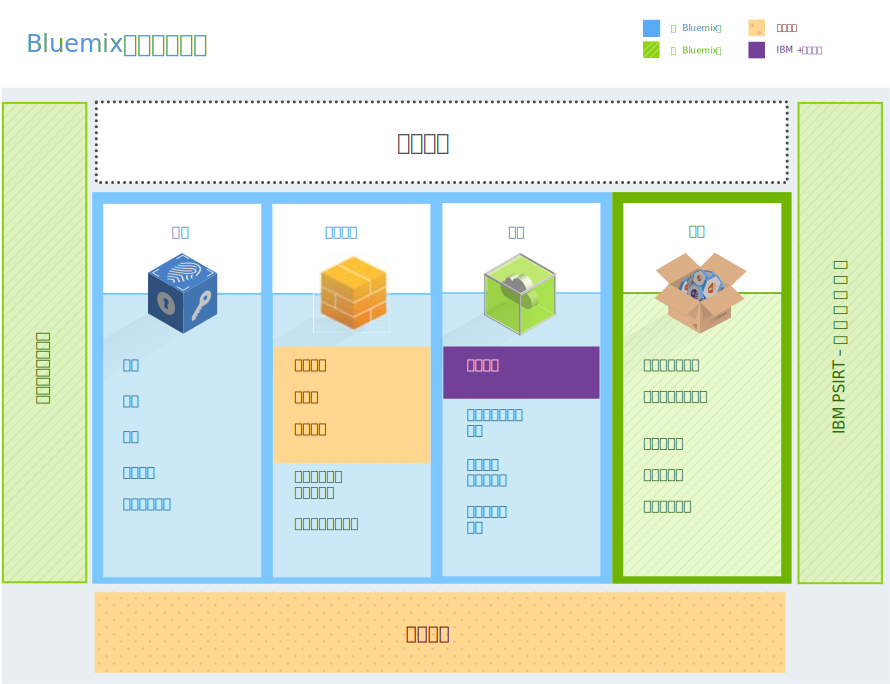

---

 

copyright:

  years: 2014, 2017
  
lastupdated: "2017-01-11"

 

---

{:new_window: target="_blank"}
{:shortdesc: .shortdesc}

# {{site.data.keyword.Bluemix_notm}} 安全
{: #security}

{{site.data.keyword.Bluemix}} 平台以安全工程作法進行設計，具有跨網路及基礎架構的分層安全控制。{{site.data.keyword.Bluemix_notm}} 提供一組安全服務，可讓應用程式開發人員用來保護其行動及 Web 應用程式。這些元素結合在一起，讓 {{site.data.keyword.Bluemix_notm}} 成為具有清楚的安全應用程式開發選擇的平台。
{:shortdesc}

{{site.data.keyword.Bluemix_notm}} 堅守由 IBM 在系統、網路及安全工程方面的最佳作法所驅動的安全原則，進而確保安全無虞。這些原則包括原始碼掃描、動態掃描、威脅建模以及滲透測試等作法。{{site.data.keyword.Bluemix_notm}} 遵循 IBM Product Security Incident Response Team (PSIRT) 處理程序，來進行資安突發事件管理。如需詳細資料，請參閱 [IBM Security Vulnerability Management (PSIRT) ](http://www-03.ibm.com/security/secure-engineering/process.html){: new_window} 網站。

「{{site.data.keyword.Bluemix_notm}} 公用」及「Bluemix 專用」使用「{{site.data.keyword.BluSoftlayer}} 基礎架構即服務 (IaaS)」雲端服務，並充分運用其安全架構。{{site.data.keyword.BluSoftlayer}} IaaS 為您的應用程式及資料提供層層重疊的多個保護層級。若為「{{site.data.keyword.Bluemix_notm}} 本端」，您藉由在公司防火牆後、自己的資料中心內管理「{{site.data.keyword.Bluemix_notm}} 本端」，而掌控實體安全並提供基礎架構。此外，{{site.data.keyword.Bluemix_notm}} 也在「平台即服務」層新增不同種類（平台、資料及應用程式）的安全功能。

## {{site.data.keyword.Bluemix_notm}} 平台的安全
{: #platform-security}

{{site.data.keyword.Bluemix_notm}} 為核心平台提供了功能安全、基礎架構安全、作業安全及實體安全（透過 {{site.data.keyword.BluSoftlayer}}）。 不過，「{{site.data.keyword.Bluemix_notm}} 本端」獨特之處在於，客戶會提供基礎架構及資料中心，並掌控實體安全。

{{site.data.keyword.BluSoftlayer}} 的 {{site.data.keyword.Bluemix_notm}} 環境符合最嚴格的 IBM 資訊技術 (IT) 安全標準，這些標準已達到或超越業界標準。這些標準包括下列項目：網路、資料加密及存取控制
 * 應用程式 ACL、許可權及滲透測試
 * 識別、鑑別及授權
 * 資訊及資料保護
 * 服務完整性和可用性
 * 漏洞及修正程式管理
 * 拒絕服務及系統攻擊偵測
 * 資安突發事件回應

圖 1. {{site.data.keyword.Bluemix_notm}} 平台安全概觀

運用「{{site.data.keyword.Bluemix_notm}} 本端」，您可以管理受公司防火牆保護以及在資料中心內的 {{site.data.keyword.Bluemix_notm}}。因此，您要負責特定的安全層面。下圖詳述客戶掌控哪些部分的安全，而哪些部分的安全則由 IBM 所管理及維護。

圖 2.「{{site.data.keyword.Bluemix_notm}} 本端」平台安全概觀

IBM 透過「轉遞」來安裝、遠端監視及管理資料中心中的「{{site.data.keyword.Bluemix_notm}} 本端」，而「轉遞」是「{{site.data.keyword.Bluemix_notm}} 本端」內含的一種交付功能。「轉遞」會使用每一個「{{site.data.keyword.Bluemix_notm}} 本端」實例特有的憑證安全地進行連接。如需「{{site.data.keyword.Bluemix_notm}} 本端」及「轉遞」的相關資訊，請參閱 [Bluemix 本端](/docs/local/index.html)。

### 功能安全

{{site.data.keyword.Bluemix_notm}} 提供各種功能安全方面的功能，包括使用者鑑別、存取授權、重要作業審核，以及資料保護。

<dl>
<dt>鑑別</dt>
<dd>應用程式開發人員利用 IBM Web 身分向 {{site.data.keyword.Bluemix_notm}} 進行鑑別。若為「{{site.data.keyword.Bluemix_notm}} 專用」及「Bluemix 本端」，預設支援透過 LDAP 進行鑑別。在要求時，可以改為針對 {{site.data.keyword.Bluemix_notm}} 設定透過 IBM Web 身分進行鑑別。
</dd>

<dt>授權</dt>
<dd>{{site.data.keyword.Bluemix_notm}} 使用 Cloud Foundry 機制來確保每一個應用程式開發人員都只能存取其所建立的應用程式及服務實例。對 {{site.data.keyword.Bluemix_notm}} 服務的授權是根據 OAuth。外部使用者在存取所有「{{site.data.keyword.Bluemix_notm}} 平台」內部端點時會受到限制。</dd>

<dt>審核</dt>
<dd>對應用程式開發人員的所有鑑別嘗試，不論成功或失敗，都會建立審核日誌。對於管理 {{site.data.keyword.Bluemix_notm}} 應用程式執行所在容器的 Linux 系統，其特許存取也會建立審核日誌。</dd>

<dt>資料保護</dt>
<dd> 所有 {{site.data.keyword.Bluemix_notm}} 資料流量都會通過 IBM WebSphere® DataPower® SOA Appliance，它們提供反向 Proxy、SSL 終止及負載平衡功能。以下是允許使用的 HTTP 方法：
<ul>
<li>DELETE</li>
<li>GET</li>
<li>HEAD</li>
<li>OPTIONS</li>
<li>POST</li>
<li>PUT</li>
<li>TRACE</li>
</ul>
HTTP 閒置逾時為 2 分鐘。</dd>
<dd>下列標頭由 DataPower 移入：<dl>
<dt>$wsis</dt>
<dd>如果用戶端連線為安全的連線 (HTTPS)，請設為 true；否則請設為 false。</dd>
<dt>$wssc</dt>
<dd>設為下列其中一個用戶端連線方法：https、http、ws 或 wss。</dd>
<dt>$wssn</dt>
<dd>設為用戶端傳送的主機名稱。</dd>
<dt>$wssp</dt>
<dd>設為用戶端連接的伺服器埠。</dd>
<dt>x-client-ip</dt>
<dd>設為用戶端 IP 位址。</dd>
<dt>x-forwarded-proto</dt>
<dd>設為下列其中一個用戶端連線方法：https、http、ws 或 wss。</dd>
</dl>
</dd>

<dt>安全開發作法</dt>
<dd> 若為「{{site.data.keyword.Bluemix_notm}} 公用」及「Bluemix 專用」，會利用 IBM Security AppScan® Dynamic Analyzer，在各種 {{site.data.keyword.Bluemix_notm}} 元件上定期執行安全漏洞掃描。會執行威脅建模及滲透測試，以偵測並解決所有類型之 {{site.data.keyword.Bluemix_notm}} 部署的任何潛在漏洞。此外，應用程式開發人員可以使用 AppScan Dynamic Analyzer 服務來保護在 {{site.data.keyword.Bluemix_notm}} 上部署的 Web 應用程式。</dd>
</dl>

### 基礎架構安全

{{site.data.keyword.Bluemix_notm}} 以 Cloud Foundry 為建置基礎，為執行應用程式提供了強固的基礎。在架構內，提供了多個元件用於安全保護及隔離。此外，也實作了變更管理與備份及回復程序，以確保完整性及可用性。

<dl>
<dt>環境隔離</dt>
<dd> 對於「{{site.data.keyword.Bluemix_notm}} 公用」，開發及正式作業環境會彼此隔離，以提高應用程式的穩定性及安全。</dd>

<dt>防火牆</dt>
<dd> 實施了防火牆，以限制對 {{site.data.keyword.Bluemix_notm}} 網路的存取。對於「{{site.data.keyword.Bluemix_notm}} 本端」，貴公司的防火牆會隔離您的 {{site.data.keyword.Bluemix_notm}} 實例與您網路的其餘部分。</dd>

<dt>侵入防禦</dt>
<dd>「{{site.data.keyword.Bluemix_notm}} 公用」及「Bluemix 專用」能促成侵入防禦，以便發現威脅，進而解決這些威脅。防火牆上已啟用侵入防禦原則。</dd>

<dt>安全應用程式容器管理</dt>
<dd>每一個 {{site.data.keyword.Bluemix_notm}} 應用程式都會在自己的容器中隔離和執行，而容器對於處理器、記憶體及磁碟具有特定的資源限制。</dd>

<dt>強化作業系統安全</dt>
<dd>IBM 管理者會利用 IBM Endpoint Manager 等工具，定期執行網路及作業系統的強化作業。</dd>
</dl>

### 作業安全

{{site.data.keyword.Bluemix_notm}} 提供了強固的作業安全環境，以及下列控制措施。

<dl>
<dt>漏洞掃描</dt>
<dd>{{site.data.keyword.Bluemix_notm}} 會使用 Tenable Network Security 漏洞掃描工具 Nessus，來偵測網路及主機配置中發生的任何問題，以便能解決這些問題。</dd>

<dt>自動化修正程式管理</dt>
<dd>{{site.data.keyword.Bluemix_notm}} 管理者確保依適當的頻率套用作業系統的修正程式。利用 IBM Endpoint Manager 即可啟用自動化修正程式。</dd>

<dt>審核日誌合併及分析</dt>
<dd>{{site.data.keyword.Bluemix_notm}} 使用 IBMSecurity QRadar® 工具來合併 Linux 日誌，以監視 Linux 系統上的特許存取。{{site.data.keyword.Bluemix_notm}} 也會使用 IBM QRadar 安全資訊及事件管理 (SIEM)，來監視應用程式開發人員的成功和不成功的登入嘗試。</dd>

<dt>使用者存取管理</dt>
<dd>在 {{site.data.keyword.Bluemix_notm}} 內，會遵循「權責區分」準則，指派精細的存取權給使用者，並確保根據最低專用權原則，使用者僅具備執行其工作所需的存取權。在「{{site.data.keyword.Bluemix_notm}} 專用」及「Bluemix 本端」環境內，已指派的管理者可以利用「管理主控台」來管理 {{site.data.keyword.Bluemix_notm}} 使用者在其組織中的角色及許可權。如需詳細資料，請參閱[管理 {{site.data.keyword.Bluemix_notm}}](/docs/admin/adminpublic.html#mng)。
</dd>
</dl>

### 實體安全

「{{site.data.keyword.Bluemix_notm}} 公用」及「Bluemix 專用」依賴 {{site.data.keyword.BluSoftlayer}} 的「網中網」(network-within-a-network) 拓蹼來確保實體網路安全。這個網中網架構可確保系統只能由獲得授權的人員進行完全存取。若為「{{site.data.keyword.Bluemix_notm}} 本端」，您掌控了本端實例的實體安全。您的資料中心受到貴公司防火牆的安全保護。

在 {{site.data.keyword.BluSoftlayer}} 網中網內，公用網路層會處理受管理網站或線上資源的公用資料流量。私密網路層容許透過不同的獨立式第三方營運商，經由 SSL、PPTP 或 IPSec VPN 閘道進行真正的頻外管理。資料中心到資料中心的網路層，在位於不同 {{site.data.keyword.BluSoftlayer}} 設施的伺服器之間，提供了免費的安全連線功能。

每個 {{site.data.keyword.BluSoftlayer}} 資料中心都受到符合 SSAE 16 及業界公認要求的控制措施的全面保護，無一例外。

## 資料安全
{: #data-security}

使用 {{site.data.keyword.Bluemix_notm}}，{{site.data.keyword.Bluemix_notm}} 會與您共同努力來保護您的資料不受未獲授權的存取。

與執行中應用程式相關聯的資料，可能處於下列三種狀態之一：data-in-transit、data-at-rest 及 data-in-use。

<dl>
<dt>Data-in-transit</dt>
<dd>在網路上的節點之間傳送的資料。</dd>

<dt>Data-at-rest</dt>
<dd>儲存的資料。</dd>

<dt>Data-in-use</dt>
<dd>目前未儲存，且在某一端點上接受操作的資料。</dd>
</dl>

當您在規劃資料安全時，需要考量每一種類型的資料。

{{site.data.keyword.Bluemix_notm}} 平台會透過網路，利用 SSL 來保護一般使用者的應用程式存取安全，藉以保護 data-in-transit 的安全，直到資料在 {{site.data.keyword.Bluemix_notm}} 內部網路的界限達到 IBM DataPower Gateway 為止。IBM DataPower Gateway 作為反向 Proxy，並提供 SSL 終止。從這裡到應用程式，IPSEC 是用來保護從 IBM DataPower Gateway 前進到應用程式的資料安全。

當您在開發應用程式時，必須負責保護 data-in-use 與 data-at-rest 的安全。您可以充分運用 {{site.data.keyword.Bluemix_notm}}「型錄」中可用的數個資料相關服務，來協助這些重要事項。

## {{site.data.keyword.Bluemix_notm}} 應用程式的安全
{: #application-security}

身為應用程式開發人員，您必須為 {{site.data.keyword.Bluemix_notm}} 上執行的應用程式啟用安全配置，包括應用程式資料保護。

您可以使用數個 {{site.data.keyword.Bluemix_notm}} 服務所提供的安全功能來保護應用程式。IBM 生產的所有 {{site.data.keyword.Bluemix_notm}} 服務都遵循 IBM 安全工程開發作法。

**附註：**這裡所述的一些服務可能不適用於「{{site.data.keyword.Bluemix_notm}} 專用」或「Bluemix 本端」實例。

### SSO 服務

IBM Single Sign On for {{site.data.keyword.Bluemix_notm}} 是以原則為基礎的鑑別服務，為 Node.js 或 Liberty for Java™ 應用程式提供了易於內嵌的單一登入功能。若要讓應用程式開發人員將單一登入功能內嵌至應用程式，管理者需建立服務實例並新增身分來源。

Single Sign On 服務支援數個儲存使用者認證的身分來源：

<dl>
<dt>SAML 企業</dt>
<dd>透過交換 SAML 記號而完成鑑別的使用者登錄。</dd>

<dt>雲端目錄</dt>
<dd>「IBM 雲端」中所管理的使用者登錄。</dd>

<dt>社交身分來源</dt>
<dd> 由 Google、Facebook 及 LinkedIn 所維護的使用者登錄。</dd>
</dl>

如需相關資訊，請參閱[開始使用 Single Sign On](/docs/services/SingleSignOn/index.html)。

### Application Security on Cloud

此服務提供行動及 Web 應用程式的安全分析，並可讓您掃描原始碼是否有安全漏洞。如需相關資訊，請參閱[開始使用 Application Security on Cloud](/docs/services/ApplicationSecurityonCloud/index.html)。

### 用於應用程式安全測試的 IBM UrbanCode 外掛程式

IBM Application Security Testing for {{site.data.keyword.Bluemix_notm}} 外掛程式可讓您針對 {{site.data.keyword.Bluemix_notm}} 上管理的 Web 或 Android 應用程式執行安全掃描。此外掛程式由 IBM UrbanCode™ Deploy Community 在 IBM Bluemix DevOps Services 平台上開發及支援。

如需相關資訊，請造訪 [IBM Application Security Testing for Bluemix ](https://developer.ibm.com/urbancode/plugindoc/ibmucd/ibm-application-security-testing-bluemix/1-0/){: new_window}。

### dashDB

dashDB 服務使用內嵌式 LDAP 伺服器進行使用者鑑別。應用程式與資料庫之間的連線受到 SSL 憑證保護。此服務使用 DB2® 原生加密功能自動加密您的已部署資料庫及資料庫備份。每隔 90 天會自動執行一次主要金鑰輪替。

如需相關資訊，請參閱[開始使用 dashDB](/docs/services/dashDB/index.html)。

### Secure Gateway

Secure Gateway 服務可讓您將 {{site.data.keyword.Bluemix_notm}} 應用程式安全地連接至遠端位置（內部部署或雲端）。它提供安全連線功能，並在您的 {{site.data.keyword.Bluemix_notm}} 組織與您要連接的遠端位置之間建立通道。您可以利用 {{site.data.keyword.Bluemix_notm}} 使用者介面或 API 套件，來配置及建立安全閘道。

如需相關資訊，請參閱[開始使用 Secure Gateway](/docs/services/SecureGateway/secure_gateway.html)。

### 安全資訊及事件管理

您可以使用安全資訊及事件管理 (SIEM) 工具來分析應用程式日誌中的安全警示。其中一種這類工具是 IBM Security QRadar&reg; SIEM，其提供雲端環境中的安全智慧。如需相關資訊，請參閱 [IBM QRadar Security Intelligence Platform ](http://www-01.ibm.com/support/knowledgecenter/SS42VS/welcome?lang=en){: new_window}。

## {{site.data.keyword.Bluemix_notm}} 安全部署
{: #security-deployment}

{{site.data.keyword.Bluemix_notm}} 安全部署架構包含適用於應用程式使用者及開發人員的不同資訊流程，以確保安全存取。

圖 3. Bluemix 安全部署架構

針對 {{site.data.keyword.Bluemix_notm}} *應用程式使用者*，**應用程式使用者流程**如下所示：
 1. 透過防火牆，並實施侵入防禦及網路安全。
 2. 透過 IBM DataPower Gateway，並具有反向 Proxy 及 SSL 終止 Proxy。
 3. 透過網路路由器。
 4. 在 Droplet Execution Agent (DEA) 中呼叫應用程式運行環境。

{{site.data.keyword.Bluemix_notm}} *開發人員* 遵循兩個主要流程：一個適用於登入，一個適用於開發及部署。
 * **開發人員登入流程**包括下列項目：
    * 若為登入「{{site.data.keyword.Bluemix_notm}} 公用」的開發人員，流程如下所示：
      1. 透過 IBM Single Sign On 服務。
      2. 透過 IBM Web 身分。
    * 若為登入「{{site.data.keyword.Bluemix_notm}} 專用」或「Bluemix 本端」的開發人員，流程會透過企業 LDAP。
 * **開發及部署流程**如下所示：
    1. 透過防火牆，並實施侵入防禦及網路安全。這僅適用於「{{site.data.keyword.Bluemix_notm}} 專用」。
    2. 透過 IBM DataPower Gateway，並具有反向 Proxy 及 SSL 終止 Proxy。
    3. 透過網路路由器。
    4. 透過利用 Cloud Foundry 雲端控制器所進行的授權，以確保僅能存取開發人員所建立的應用程式及服務實例。

針對「{{site.data.keyword.Bluemix_notm}} 專用」及「{{site.data.keyword.Bluemix_notm}} 本端」*管理者*，**管理者流程**如下所示：
 1. 透過防火牆，並實施侵入防禦及網路安全。
 2. 透過 IBM DataPower Gateway，並具有反向 Proxy 及 SSL 終止 Proxy。
 3. 透過網路路由器。
 4. 到達 {{site.data.keyword.Bluemix_notm}} 使用者介面中的「管理」頁面。

除了這些路徑中所述的使用者之外，經過授權的 IBM 安全作業團隊也會執行各種作業安全作業，例如下列作業：
 * 漏洞掃描。若為「{{site.data.keyword.Bluemix_notm}} 本端」，您掌控了防火牆內的實體安全以及任何掃描。
 * 使用者存取管理。
 * 利用 IBM Endpoint Manager 定期套用修正程式，來強化作業系統。
 * 風險管理與侵入防禦。
 * 使用 QRadar 進行安全監視。
 * 可在「管理」頁面上取得安全報告。

## 安全規範
{: #compliance}

{{site.data.keyword.Bluemix}} 提供了一個您可以信任的安全雲端平台。{{site.data.keyword.Bluemix_notm}} 規範來自於根據業界最佳安全標準（包括 ISO 27001 和 ISO 27002）建置的平台和服務。
{:shortdesc}

 **歐盟 (EU) 示範條款**是一種協議，用於保護從歐盟 (EU) 或歐洲經濟區 (EEA) 傳輸到第三方國家或地區的個人資料。「歐盟 (EU) 示範條款」是由位於 EU 或 EEA 的用戶（資料匯出方）與位於第三方國家或地區的 IBM 資料處理方（資料匯入方）之間所簽訂。[IBM SaaS 歐盟示範條款 ](http://www-01.ibm.com/common/ssi/cgi-bin/ssialias?subtype=ST&infotype=SA&htmlfid=KUJ12408USEN&attachment=KUJ12408USEN.PDF){: new_window} 包含資料匯出方和資料匯入方的權利和責任，以及資料主體的權利。「IBM SaaS 歐盟示範條款」可確保個人資料在第三方國家或地區處理時仍能受到像在 EU 或 EEA 中一樣的保護。

針對要將源自歐洲經濟區的資料傳送到 EEA 以外國家或地區的客戶，{{site.data.keyword.Bluemix}} 以歐洲委員會及歐盟資料保護權限所核准的表單提供「歐洲示範條款」。「歐洲示範條款」向歐洲客戶保證，{{site.data.keyword.Bluemix_notm}} 支援全球每個位置的必要資料隱私保護。

 對於日本的銀行和相關金融機構，電腦系統必須具有適當的安全程序，這些程序應根據「金融行業資訊系統中心 (FISC)」安全準則。FISC 安全準則由「日本金融廳 (FSA)」、「日本央行 (BOJ)」和 FISC 貫徹實施。
 

 {{site.data.keyword.Bluemix_notm}} 已通過**國際標準化組織 (ISO) 27001 和 27002 標準**的認證，這兩個標準定義了資訊安全管理程序的最佳做法。ISO 27001 是一種廣泛採用的廣域安全標準，概述資訊安全管理系統的需求。它提供系統化的方式，根據定期風險評量來管理公司及客戶資訊。**國際標準化組織 (ISO) 及國際電子技術委員會 (IEC)** 的聯合 ISO 及 IEC 子委員會已在 2013 年 9 月 25 日發佈最新標準 (ISO/IEC 27001:2013)。ISO 27001 標準根據不同組織的需求規定了應如何建立、實施和記錄「資訊安全管理系統 (ISMS)」，以及應如何實施安全性控制。ISO 27002 標準對 ISO 27001 中的每種安全控制進行了詳細的說明。ISO 27000 系列標準中包含了一個確定風險規模和評估資產價值的處理程序，旨在保護書面、口頭和電子資訊的機密性、完整性和可用性。

若要達到 ISO 27001:2013 憑證，公司必須顯示它具有系統化且進行中的方式，以管理影響公司及客戶資訊機密性、完整性及可用性的資訊安全風險。此標準強調組織之「資訊安全管理系統 (ISMS)」執行效能的測量及評估，同時包括根據系統需求及其他需求的資訊安全相關控制。

{{site.data.keyword.Bluemix_notm}} 經第三方安全公司審核，符合 ISO 27001 的所有需求：[Bluemix ISO 27001:2013 Certificate of Registration ](ftp://public.dhe.ibm.com/cloud/bluemix/compliance/Bluemix_ISO27K1_WWCert_2016.pdf){: new_window}。

 **支付卡產業 (PCI) 資料安全標準 (DSS)** 是為了保護信用卡資料而設計的資訊安全標準。PCI DSS 適用於所有涉及支付卡處理的實體，包括特約商家、處理方、發卡機構及服務提供者。它也適用於儲存、處理或傳輸持卡人資料或機密鑑別資料的所有其他實體。

如果您儲存或處理信用卡資料，「支付卡產業 (PCI)」相符性及網路安全就是您公司的主要考量。為了確保特約商家具有一致的標準，「支付卡產業安全標準協會」已建立 PCI 資料安全標準。這些標準納入了保護持卡人資料的最佳作法，而且經常要求第三方合格「服務評量機構 (QSA)」加以驗證。IBM 透過提供獨立 QSA 的「相符性認證」，協助客戶符合其 PCI 相符性需求。「相符性認證」可以與 SOC 2 報告及 ISO 27001 憑證一起使用，以示範基礎架構如何符合 PCI 控制項。

{{site.data.keyword.Bluemix}} 使用核准的「安全評量機構 (QSA)」來完成年度 PCI DSS 評量。{{site.data.keyword.Bluemix_notm}} 已檢閱為符合 [Bluemix PCI DSS AOC ](ftp://public.dhe.ibm.com/cloud/bluemix/compliance/IBM_Bluemix_PCI.pdf){: new_window} 所概述的 PCI DSS 3.1 版「服務提供者層次 1」的標準。如需符合 {{site.data.keyword.Bluemix_notm}} 環境之 PCI DSS 的相關資訊及協助，請利用[與我們聯絡 ](https://console.ng.bluemix.net/?direct=classic/#/contactUs/cloudOEPaneId=contactUs){: new_window} 來聯絡業務代表。

 **服務組織控制 (SOC)** 報告定義了如何對服務組織評估與安全性、可用性、處理完整性、機密性和隱私性相關的主要內部控制做法。這些報告是使用「美國註冊會計師協會 (AICPA) 手冊」產生的，包含下列各項目： 
  * 組織監督
  * 供應商管理方案
  * 內部組織治理和風險管理程序
  * 法規監督
 
{{site.data.keyword.Bluemix_notm}} 提供 SOC 1、SOC 2 及 SOC 3 報告。如需相關資訊，請聯絡 [{{site.data.keyword.Bluemix_notm}} 銷售 ](mailto:bmxcert1@us.ibm.com){:new_window} 團隊。 

「醫療保險轉移和責任法 (HIPAA)」是美國國會在 1996 年所頒布，保護員工失業後的醫療保險範圍。HIPAA 是由美國民權辦公室及美國衛生及公共服務部所制定並施行。HIPAA 包含 1996 法案的條例，以及 2009 年健康資訊技術促進經濟和臨床健康法 (HITECH) 的隱私需求。{{site.data.keyword.Bluemix_notm}} 的資料中心或服務提供者端符合所有 HIPAA 需求。

如需達到、認證及維護 Bluemix 環境之 HIPAA 相符性的相關資訊或協助，請聯絡 {{site.data.keyword.Bluemix_notm}} [銷售 ](mailto:cloudplatform_compliance@us.ibm.com){:new_window} 團隊。

 ISO/IEC 27017:2015 提供適用於佈建及使用雲端服務的資訊安全控制準則。此外，它也提供雲端服務供應商及雲端服務客戶的實作指引。ISO 27017 提供 ISO/IEC 27002 中所指定之相關控制的實作指引，以及雲端服務特有的其他控制及指引。

符合 ISO 27017:2015 的 {{site.data.keyword.Bluemix_notm}} 示範 IBM 已經具有更準確的雲端特定控制系統。此外，它也承諾致力成為國內及全球各地的最佳 IaaS。

 ISO 27018:2014 建立一般接受的控制目標、控制及準則，以實作保護「個人識別資訊 (PII)」的方式。這些方式符合 ISO 29100 的公用雲端運算環境隱私原則。

更具體來說，ISO 27018:2014 指定以 ISO 27002 為基礎的準則。這些準則會考慮 PII 保護的法規需求，其可能適用於公用雲端服務提供者的資訊安全風險環境的環境定義。

 「雲端安全聯盟」是非盈利組織，其任務是促進提供雲端運算內安全保證的最佳作法。「雲端安全聯盟」用來進行其任務的其中一個機制是「安全、信任及保證註冊表 (STAR)」。STAR 是免費提供的公用註冊表，記載各種雲端運算供應項目所提供的安全控制。

 「刑事司法資訊系統 (CJIS) 部門」是美國司法部聯邦調查局的一個部門。CJIS 部門已建立並發佈「安全政策」(CJISD-ITS-DOC-08140-5.4)。此「安全政策」包含最低資訊安全需求、準則及合約，以反映執法單位及刑事司法機構保護「刑事司法資訊 (CJI)」之來源、傳輸、儲存及產生的意志。

### 平台及服務規範
下表顯示 {{site.data.keyword.Bluemix_notm}} 中的各項服務符合的每一個標準。

|{{site.data.keyword.Bluemix_notm}} 元件		|FISC		|ISO 27001	|PCI |SOC 2 類型 1		|
|:----------------------|:---------:|:---------:|:---------:|:---------:|
|{{site.data.keyword.Bluemix_notm}} 平台		|Y			|Y	|Y	|Y	|
|{{site.data.keyword.APIM}}			|Y	|Y |Y	|			|
|{{site.data.keyword.autoscaling}}			|Y	|Y |Y	|			|
|{{site.data.keyword.bigicloudst}}			|Y |Y |	|Y |
|{{site.data.keyword.cloudant}}				|Y |Y |	|Y	|
|{{site.data.keyword.dashdbshort}}			|Y	|Y	|	|Y	|
|{{site.data.keyword.datacshort}}			|Y	|Y	|Y	|			|
|{{site.data.keyword.jazzhub_short}}					|Y	|Y	|	|			|
|{{site.data.keyword.containerlong}}			|Y		|Y	|	|			|
|{{site.data.keyword.mql}}				|Y	|Y	|Y	|	 		|
|{{site.data.keyword.SecureGateway}}			|Y	|Y |	|	 		|
|{{site.data.keyword.sescashort}}     |Y |Y |Y	|  |
{: caption="Table 1. Platform and service compliance" caption-side="top"}

# 相關鏈結
{: #rellinks}

## 相關鏈結
{: #general}

* [IBM SaaS Security ](http://www.ibm.com/cloud-computing/built-on-cloud/saas-security){: new_window}
* [開始使用 Single Sign On](/docs/services/SingleSignOn/index.html)
