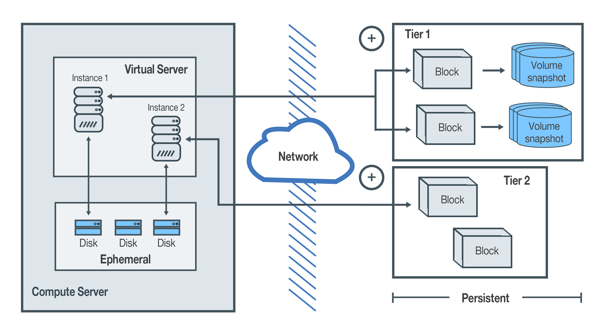

{:new_window: target="_blank"}

# About {{site.data.keyword.blockstorageshort}}
{: #about-block-storage}

Last updated: 07 September 2016
{: .last-updated}

The IBM {{site.data.keyword.blockstorageshort}} service allows you to attach persistent storage to a virtual server.  To use the storage, you attach the block volumes to your virtual servers, as depicted in the following image. The data in block storage volumes persists beyond the lifecycle of your virtual server. This means that you can detach the volumes from a server instance and reattach to another server instance, without any changes to your data. {{site.data.keyword.blockstorageshort}} uses OpenStack Cinder to manage the volume lifecycle. 

The storage is accessed on a block device that you can partition, format, and mount to, such as /dev/vdb. The data persists until you delete it. The ephemeral storage used by virtual servers persists across restarts, but is not retained after you delete the virtual server.

*Figure 1. {{site.data.keyword.blockstorageshort}} Diagram*

## Volumes 
{: #using-volumes-concept}

{{site.data.keyword.blockstorageshort}} volumes are created through a {{site.data.keyword.blockstorageshort}} service instance. You can attach the volumes to a virtual server in the following ways:
  

* Specify a particular device that you provide. 
* Specify that the system automatically selects an available device name. 

The virtual server performs its I/O operations directly with the specified device and its associated backend.  No volume read/write data passes through the {{site.data.keyword.blockstorageshort}} service.

## Snapshots 
{: #using-snapshots-concept}

You can also create block-level snapshots of volumes. A snapshot captures data on the block storage volume at a specific point in time. You can use snapshots to perform incremental backups of your data. That said, the snapshots exist on the same storage as the original volume. Therefore, snapshots are not a sufficient disaster recovery strategy.

**Note**: You cannot create snapshots while a volume is attached to a server instance. 

When you create a volume from a snapshot, a new volume is created that exists in the same state the original volume was in at the time you took the snapshot. 

Creating a volume from a snapshot has the following impact:

* The existing volume that is used for the snapshot is not removed.
* Data that is created, modified, or deleted after the relevant snapshot is taken is not included in the new volume.

What's next?

Create a volume. For more information, see [Creating volumes](../BlockStorage/blockstorage_creatingvolume.html).
