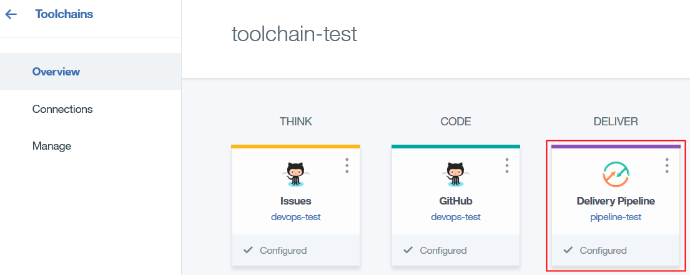
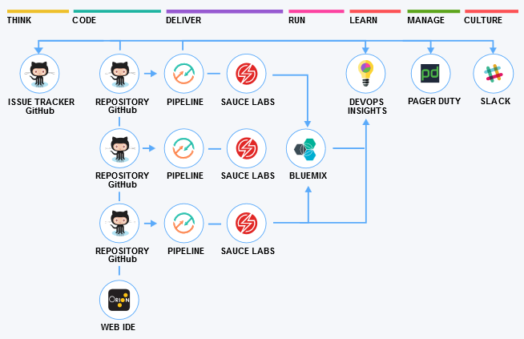

---

copyright:
  years: 2016

---
 
{:shortdesc: .shortdesc}
{:new_window: target="_blank"}

# Getting started with {{site.data.keyword.contdelivery_short}}
{: #cd_getting_started}

Last updated: 17 November 2016
{: .last-updated}  

Adopt a DevOps approach by using {{site.data.keyword.contdelivery_full}}, which includes toolchains that automate the building and deployment of applications. You can get started by creating a simple deployment toolchain that supports development, deployment, and operations tasks. 
{: shortdesc}

After you create an instance of {{site.data.keyword.contdelivery_short}} by selecting its service tile from the {{site.data.keyword.Bluemix_notm}} catalog, you can choose how you want to get started with the service.
 

 * To get started quickly and deploy your application by using an automated pipeline, in the "Starting with a pipeline" section, click **[Start here](#starting_with_a_pipeline)**. You can add more tools later. 
 * To create and configure a continuous delivery toolchain from a template, in the "Starting from a toolchain template" section, click **[Start here](#starting_from_a_toolchain_template)**. The toolchain integrates tools for planning, developing, deploying pipelines, and managing your applications. You can always add or remove tools from your toolchains.
 * If you already have toolchains, in the "Starting from a toolchain template" section, click **View your toolchains**. For more information about working with toolchains, see [Using toolchains on Bluemix Public](/docs/services/ContinuousDelivery/toolchains_using.html){: new_window}.

##Starting with a pipeline
{: #starting_with_a_pipeline}

Pipelines automate builds, deployments, and more. To get started with an automated pipeline, select a template and provide the location of your GitHub repository (repo).

To [create a pipeline (Link opens in a new window)](https://console.ng.bluemix.net/devops/pipelines/dashboard/create){: new_window} that is configured to deploy a Cloud Foundry application, follow these steps:

1. Click **Cloud Foundry**.
1. If you want to use a different name for the pipeline, change its default name. The pipeline's name identifies it in {{site.data.keyword.Bluemix_notm}}. 
1. If you want to use a different name for the application, change its default name. The application's name identifies it in {{site.data.keyword.Bluemix_notm}}. This name is the application that the pipeline deploys to. 
1. If you don't have a toolchain, a toolchain with a default name is created for you. If you want to use a different name for the toolchain, change its name. Pipelines are managed by toolchains. With the toolchain, you can extend the capabilities of your pipeline by integrating with other tools and services. 

 **Tip**: Pipelines and toolchains belong to organizations (orgs). If you belong to an org that has toolchains, you can use those toolchains even if you didn't create them.
 
1. Either select the toolchain that you want to use or type a name for the new toolchain that you want to create.
1. Provide the location of your GitHub repo.

 **Tip**: If you have not authorized {{site.data.keyword.Bluemix_notm}} to access GitHub, you are prompted to click **Authorize** to go to the GitHub website. If you don't have an active GitHub session, you are prompted to log in. Click **Authorize Application** to allow {{site.data.keyword.Bluemix_notm}} to access your GitHub account. If you have an active GitHub session but you haven't entered your password recently, you might be prompted to enter your GitHub password to confirm.

   * If you have a GitHub repo and want to use it, for the repository type, select **Existing**. Search for the location of the repo or select the repo from the list of available repos.
   
   * If you want to create an empty GitHub repo, for the repository type, select **New**. Type a name for the repo.
   
   * If you want to create a clone of a GitHub repo, for the repository type, select **Clone**. Search for the location of the repo or select the repo from the list of available repos.
   
   * If you want to fork a GitHub repo so that you can contribute changes through pull requests, select **Fork**. Search for the location of the repo or select the repo from the list of available repos.
 
1. Click **Create**. The pipeline is created, configured, and displayed on the toolchain's Overview page. 
 
 
To create an [empty pipeline (Link opens in a new window)](https://console.ng.bluemix.net/devops/pipelines/dashboard/create){: new_window} without any preconfigured stages:

1. Click **Custom**.
1. If you want to use a different name for the pipeline, change its default name. The pipeline's name identifies it in {{site.data.keyword.Bluemix_notm}}. 
1. If you don't have a toolchain, a toolchain with a default name is created for you. If you want to use a different name for the toolchain, change its name. Pipelines are managed by toolchains. With the toolchain, you can extend the capabilities of your pipeline by integrating with other tools and services.
1. Either select the toolchain that you want to use or type a name for the new toolchain that you want to create.
1. Click **Create**. An empty pipeline is created and represented as a tile on the toolchain's Overview page.

##Starting from a toolchain template
{: #starting_from_a_toolchain_template}

To create and configure a continuous delivery toolchain from a [template (Link opens in a new window)](https://console.ng.bluemix.net/devops/create){: new_window}:

1. On the **Create a Toolchain** page, click a toolchain template.  
1. Review the diagram of the toolchain that you are about to create. The diagram shows each tool integration in its lifecycle phase in the toolchain. The diagram in the following image is an example. When you create a toolchain, the diagram shows each tool integration that is part of the toolchain.
 
1. Review the default information for the toolchain settings. The toolchain's name identifies it in {{site.data.keyword.Bluemix_notm}}. If you want to use a different name, change the toolchain's name.
1. In the Configurable Integrations section, select each tool integration that you want to configure for your toolchain. A few of the tool integrations do not require configuration. For information about configuring the tool integrations, see [Configuring tool integrations](/docs/services/ContinuousDelivery/toolchains_integrations.html){: new_window}.
1. Click **Create**. Several steps run automatically to set up your toolchain:

 * The toolchain is created.
 * If you configured the Delivery Pipeline tool integration, the pipelines are created and triggered.
 * If you configured the Sauce Labs tool integration, Sauce Labs is set up to add jobs to the pipelines and run tests.
 * If you configured the PagerDuty tool integration, PagerDuty is set up to send alert notifications to the service that you specified. 
 * If you configured the Slack tool integration, Slack is set up to send notifications about deployment status to the channel that you specified. 
 * If you configured the GitHub tool integration, the sample GitHub repo is cloned into your GitHub account. 

# Related Links
{: #rellinks}

## Tutorials and Samples
{: #samples}

* [Create and use your first toolchain (Link opens in a new window)](https://www.ibm.com/devops/method/tutorials/tutorial_toolchain_flow){:new_window}
* [Create a custom toolchain (Link opens in a new window)](https://www.ibm.com/devops/method/tutorials/tutorial_toolchain_custom){:new_window}
* [Create an application with three microservices (Link opens in a new window)](https://www.ibm.com/devops/method/tutorials/tutorial_toolchain_microservices){:new_window}

## Related Links
{: #general}

* [Microservices toolchain (Link opens in a new window)](https://www.ibm.com/devops/method/toolchains/microservices_toolchain){:new_window}
* [Simple toolchain (Link opens in a new window)](https://www.ibm.com/devops/method/toolchains/simple_toolchain){:new_window}
* [IBM Bluemix Garage Method (Link opens in a new window)](https://www.ibm.com/devops/method){:new_window}
