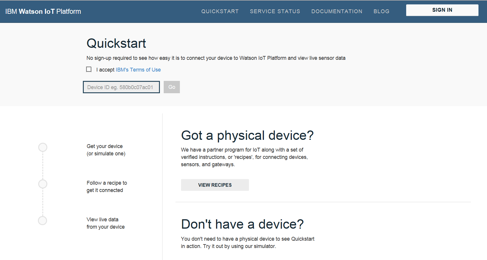

---

copyright:
  years: 2015, 2016
lastupdated: "2016-09-19"

---

{:new_window: target="_blank"}
{:shortdesc: .shortdesc}
{:screen: .screen}
{:codeblock: .codeblock}
{:pre: .pre}

# Quickstart

[Quickstart](https://quickstart.internetofthings.ibmcloud.com/#/) ist eine offene Sandbox, die Sie verwenden können, um für Ihre Geräte schnell eine Verbindung zu {{site.data.keyword.iot_full}} herzustellen. Wenn Ihre Geräte das MQTT-Nachrichtenprotokoll unterstützen, können sie ohne großen Aufwand mit Quickstart verbunden werden.

Beispiele, Anleitungen und Lernprogramme, in denen erklärt wird, wie unterschiedliche Geräte mit dem Quickstart-Service verbunden werden, finden Sie unter [DeveloperWorks Recipes](https://developer.ibm.com/recipes/), zum Beispiel:

- [OpenBlocks IoT BX1G](https://developer.ibm.com/recipes/tutorials/openblocks-iot-bx1g-for-iot-foundation-quickstart/)
- [Reactive Blocks](https://developer.ibm.com/recipes/tutorials/reactive-blocks-and-java-to-iot-foundation-part-1-quickstart/)


**Wichtig:** Wenn der Quickstart-Service von Ihrer {{site.data.keyword.iot_short_notm}}-Instanz verwendet wird, werden keine skalierbaren Anwendungen unterstützt.

## Simulierte Geräte

Zusätzlich zu den Quickstart-Anleitungen und -Lernprogrammen, steht Ihnen ein browserbasiertes Gerät für mobile Geräte zur Verfügung, mit dem Sie für beliebige Geräte mit einem Web-Browser eine Verbindung zum Quickstart-Service herstellen können. Öffnen Sie folgende URL, um ein browserbasiertes simuliertes Gerät zu starten, das über ein Mobiltelefon oder ein Tablet eine Verbindung zu {{site.data.keyword.iot_short}} herstellt:

```
http://quickstart.internetofthings.ibmcloud.com/iotsensor
```

Wenn Sie eine mit einem mobilen Gerät eine Verbindung zu der URL des simulierten Geräts herstellen, wird ein browserbasiertes simuliertes Gerät gestartet, das mit {{site.data.keyword.iot_short}} verbunden ist. Verwenden Sie in der Benutzerschnittstelle folgende Steuerelemente, um die Sensoren zu verwalten:

- Temperatur
- Feuchtigkeit
- Objekttemperatur


## Datenvisualisierung

Zum Anzeigen der Daten, die von Ihrem mobilen Gerät generiert werden, müssen Sie zunächst sicherstellen, dass das simulierte Gerät auf Ihrem mobilen Gerät ausgeführt wird; starten Sie anschließend die Quickstart-Anwendung. Geben Sie die aus 12 Zeichen bestehende Geräte-ID des Geräts ein, die in der rechten oberen Ecke der Benutzerschnittstelle angezeigt wird.



Während Sie die Sensorwerte in Ihrem simulierten Gerät anpassen, können Sie die Daten von Ihrem Gerät in visualisierter Form in Echtzeit in der Quickstart-Anwendung anzeigen, wie im folgenden Screenshot dargestellt:


## Mosquitto-Demonstration

[Mosquitto](http://mosquitto.org/) ist ein plattformübergreifender Open-Source-MQTT-Client, den Sie verwenden können, um mit dem {{site.data.keyword.iot_short}} zu experimentieren. Wählen Sie nach der Installation des Mosquitto-Clients eine eindeutige Angaben für die Anwendungs-ID und die Geräte-ID aus. Wenn die Anwendungs- und die Geräte-ID nicht eindeutig sind, führt das Herstellen der Testverbindung möglicherweise zu einem Konflikt mit einem anderen Benutzer, der dasselbe Quickstart-Testverfahren ausführt.

Die Werte für *Anwendungs-ID*, *Typ-ID*, *Geräte-Typ* und *Geräte-ID* dürfen maximal 36 Zeichen umfassen und können nur folgende Zeichen enthalten:
- Alphanumerische Zeichen (a-z, A-Z, 0-9)
- Gedankenstriche (-)
- Unterstreichungszeichen (_)
- Punkte (.)

Nach dem Definieren der Anwendungs-ID und der Geräte-ID erstellen Sie mithilfe von `mosquitto_sub` eine Verbindung, die Ihre Anwendung darstellt. Verwenden Sie für `<Anwendungs-ID>` und `<Geräte-ID>` die Beispiele 'myApplicationId' bzw. 'myDeviceId':
```
    [user@host ~]$ mosquitto_sub -h quickstart.messaging.internetofthings.ibmcloud.com -p 1883 -i "a:quickstart:myApplicationId" -t iot-2/type/mosquitto/id/myDeviceId/evt/helloworld/fmt/json

```

Während der oben stehende Prozess ausgeführt wird, können Sie Ihr Gerät erstellen. Stellen Sie in diesem Beispiel eine Verbindung für ein Gerät mit dem Typ `mosquitto` her und senden Sie anschließend wie im folgenden Code dargestellt mithilfe von `mosquitto_pub` zwei Ereignisse an den Service:

```
    [user@host ~]$ mosquitto_pub -h quickstart.messaging.internetofthings.ibmcloud.com -p 1883 -i "d:quickstart:mosquitto:myDeviceId" -t iot-2/evt/helloworld/fmt/json -m "{\"helloworld\": 1}"
    [user@host ~]$ mosquitto_pub -h quickstart.messaging.internetofthings.ibmcloud.com -p 1883 -i "d:quickstart:mosquitto:myDeviceId" -t iot-2/evt/helloworld/fmt/json -m "{\"helloworld\": 2}"
```
Im Terminal Ihrer Anwendung werden die zwei Ereignisse, die Sie gerade publiziert haben, wie in der folgenden Beispielausgabe dargestellt angezeigt:

```
   [user@host ~]$ mosquitto_sub -h quickstart.messaging.internetofthings.ibmcloud.com -p 1883 -i "a:quickstart:myApplicationId" -t iot-2/type/mosquitto/id/myDeviceId/evt/helloworld/fmt/json
    {"helloworld": 1}
    {"helloworld": 2}
```

Weitere Schritte sind nicht erforderlich. Durch Ausführen des Quickstart-Beispielverfahrens haben Sie Folgendes vorgenommen:
- Erfolgreiches Herstellen einer Verbindung von einem Gerät und einer Anwendung zu {{site.data.keyword.iot_short}} über MQTT
- Senden eines Ereignisses vom Gerät an den Service
- Empfangen des Ereignisse in Ihrer Anwendung


## Zugehörige Links

- [Quickstart](https://quickstart.internetofthings.ibmcloud.com)
- [DeveloperWorks Recipes](https://developer.ibm.com/recipes)
- [OpenBlocks IoT BX1G](https://developer.ibm.com/recipes/tutorials/openblocks-iot-bx1g-for-iot-foundation-quickstart/)
- [Reactive Blocks](https://developer.ibm.com/recipes/tutorials/reactive-blocks-and-java-to-iot-foundation-part-1-quickstart/)
- [Quickstart-Anwendung](http://quickstart.internetofthings.ibmcloud.com)
- [Mosquitto](http://mosquitto.org/)
