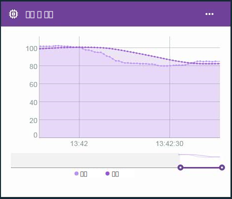

---

copyright:
  years: 2016, 2017
lastupdated: "2016-12-12"

---

{:new_window: target="blank"}
{:shortdesc: .shortdesc}
{:screen:.screen}
{:codeblock:.codeblock}
{:pre: .pre}

# 에지 가상 특성의 고급 계산
{: #im_vir_calculations}

사전 작성된 에지 분석 공식으로 기본 가상 특성 계산을 확장합니다.
{:shortdesc}

**중요:** 고급 계산은 선택된 특성에 대한 데이터를 Edge Analytics Agent가 설치된 게이트웨이에 연결된 디바이스에서 가져오는 경우에만 특성 데이터 점을 리턴합니다. 에지 규칙은 이 가상 특성을 직접 사용할 수 있습니다. 클라우드 규칙의 특성을 사용하려면 에지 규칙이	클라우드에 전달 조치를 사용하여 클라우드에 데이터 점을 전송해야 합니다. 자세한 정보는 [Edge Analytics Agent 설치](gateways/dashboard.html#edge)를 참조하십시오.

예: 선 그래프 카드에서 고급 가상 데이터 점을 사용하여 데이터의 급변동이 제거된 데이터 상태동향을 시각화합니다.   
 

## 고급 공식
{: #advanced}

고급 계산 옵션에는 다음 공식이 포함됩니다. 

**팁:** 일부 공식의 경우에는 포함할 데이터 점의 수 또는 기간 길이를 선택하는 옵션이 있습니다. 일정한 빈도로 데이터가 이동됨을 아는 경우에는 시간 창이 바람직한 선택사항일 수 있습니다. 데이터가 산발적이거나 균등하지 않게 수집되는 경우에는 시간 창의 예측이 어려우므로 다수의 데이터 점을 사용하는 것이 최선책일 수 있습니다. 

<table>
<thead>
<tr>
<th>공식</th>
<th>설명 </th>
<th>사용량</th>
</tr>
</thead>
<tbody>
<tr>
<td>평균</td>
<td>다수의 최근 데이터 점에서 또는 최근 기간 동안에 특성에 대한 평균 값을 리턴합니다.   
입력:
<ul>
<li>특성
<li>0보다 큰 정수 양식의 데이터 점의 수 또는 기간 길이. </ul></td>
 <td>AVG 공식은 지속적으로 이동 중인 시간 창에서 데이터 점의 평균 값을 제공합니다.    규칙의 평균 공식을 사용하면 격리된 급변동이 포함된 노이즈가 있는 데이터를 기반으로 한 거짓 경보의 트리거를 피할 수 있습니다.   선 그래프 카드를 사용하면 데이터의 급변동이 제거된 데이터 상태동향을 시각화할 수 있습니다.   
</td>
</tr>
<tr>
<td>이동 Z-스코어</td>
<td>다수의 최근 데이터 점에서 또는 최근 기간 동안에 데이터 점과 평균 데이터 점 값 사이의 차이를 표준 편차 단위로 리턴합니다.   
입력:
<ul>
<li>특성
<li>0보다 큰 정수 양식의 데이터 점의 수 또는 기간 길이. </ul></td>
<td>데이터 점의 이동 Z-스코어는 최근 평균에 상대적으로 데이터 점 값에 대한 이상 범위를 표시합니다. 절대 Z-스코어 값이 더 높으면 현재 데이터 점의 값이 이전 평균 데이터 점 값과 더 차이가 있음을 의미합니다.
  데이터 점이 특정 값을 초과할 때가 아니라 데이터 점 값이 최근 평균과 차이가 날 때 급격한 변동에서 경보를 트리거하는 규칙에서 이동 Z-스코어 공식을 사용하십시오.
  선 그래프 카드를 사용하면 표준 편차의 규모와 빈도를 플로팅하여 데이터의 변동을 시각화할 수 있습니다.
</td>
</tr>
<tr>
<td>지수 평활</td>
<td>수집된 사용 가능한 데이터 점에서 특성의 평균 값을 리턴하며, 여기서 이전 특성 값은 새 값보다 지수적으로 가중치가 낮습니다. 가중치는 평활 인수로 제어되며, 여기서 큰 값은 최근 값에 가중치를 더 부여하고 이전 값에는 덜 부여합니다.   
선택적으로 경사 인수를 사용하여 데이터의 상태동향에 맞게 조정할 수도 있습니다. 지수 평활된 값은 이동 평균보다 데이터의 변경에 보다 빠르게 반응합니다.   
입력:
<ul>
<li>특성
<li>0보다 크고 1보다 작은 숫자로서의 평활 인수.   
<li>선택사항: 0보다 크고 1보다 작은 숫자로서의 경사.  
 **팁:** 수집된 데이터에 상태동향이 있는지 여부가 불확실하면 .5의 경사를 사용하여 시작하십시오. 결과에 따라 인수를 조정하고자 할 수 있습니다.
 </ul></td>  
 <td>데이터 점에 지수 평활을 적용하면 기간 길이 정의가 아닌 평균 계산 시에 이전 값에 가중치가 덜 부여되는 평균 값이 산출됩니다. 대신에 사용자는 더 높은 평활 인수를 설정하여 먼 값의 가중치를 제한합니다.
  규칙에서 지수 평활 공식을 사용하면 서브세트 대신 사용 가능한 모든 데이터를 사용하여 격리된 급변동이 포함된 노이즈가 있는 데이터를 기반으로 한 거짓 경보의 트리거를 피할 수 있습니다.
  선 그래프 카드를 사용하면 데이터의 급변동이 제거된 데이터 상태동향을 시각화할 수 있습니다. </td>
</tr>
<tr>
<td>박스 평활</td>
<td>현재 데이터 점 주변에 집중된 데이터 점의 범위를 기반으로 특성에 대한 평균 값을 리턴합니다.   
박스 평활은 현재 처리된 데이터 점 전후에 나타나는 데이터 점 값의 구성된 수를 사용하여 평활된 값을 판별합니다. 이 계산에서 박스 평활은 모든 데이터 점 값에 동일한 가중치를 부여합니다.   
입력:
<ul>
<li>특성
<li>0보다 큰 정수 양식의 전후 데이터 점의 수(반폭).
</ul></td>
<td>데이터 점에 박스 평활을 적용하면 지속적으로 이동 중이며 관심 있는 데이터 점에 집중된 시간 창에서 데이터 점의 평균 값을 리턴합니다.   **중요:** 데이터 빈도와 반폭 값에 따라, 리턴된 데이터 점은 다소간 지연됩니다. 예를 들어, 반폭이 `5`로 설정되고 데이터 빈도가 초당 하나의 메시지인 경우에 리턴된 가상 데이터 점은 5초간 지연됩니다.   규칙에서 박스 평활 공식을 사용하면 격리된 급변동이 포함된 노이즈가 있는 데이터를 기반으로 한 거짓 경보의 트리거를 피할 수 있습니다. **중요:** 규칙을 작성할 때는 데이터 점 지연에 유념하십시오.   선 그래프 카드를 사용하면 데이터의 급변동이 제거된 데이터 상태동향을 시각화할 수 있습니다.
</td>
</tr>
<tr>
<td>가우스 평활</td>
<td>현재 데이터 점 주변에 집중된 데이터 점의 범위를 기반으로 특성에 대한 평균 값을 리턴하며, 여기서 현재 데이터 점으로부터 보다 멀리 있는 특성 값은 보다 인접한 값보다 지수적으로 가중치가 덜 부여됩니다.   
입력:
<ul>
<li>특성
<li>0보다 큰 정수 양식의 전후 데이터 점의 수(반폭).
</ul></td>
<td>데이터 점에 가우스 평활을 적용하면 지속적으로 이동 중이며 관심 있는 데이터 점에 집중된 시간 창에서 데이터 점의 가중치 부여된 평균 값을 리턴합니다. 관심 있는 데이터 점으로부터 보다 멀리 있는 데이터 점은 평균을 계산할 때 가중치가 덜 부여됩니다.   **중요:** 데이터 빈도와 반폭 값에 따라, 리턴된 데이터 점은 다소간 지연됩니다. 예를 들어, 반폭이 `5`로 설정된 경우, 데이터 빈도는 매초마다 하나의 메시지이며 리턴된 가상 데이터 점은 5초간 지연됩니다.   규칙에서 가우스 평활 공식을 사용하면 격리된 급변동이 포함된 노이즈가 있는 데이터를 기반으로 한 거짓 경보의 트리거를 피할 수 있습니다. **중요:** 규칙을 작성할 때는 데이터 점 지연에 유념하십시오.   선 그래프 카드를 사용하면 데이터의 급변동이 제거된 데이터 상태동향을 시각화할 수 있습니다.
</td>
</tr>
</tbody>
</table>  
