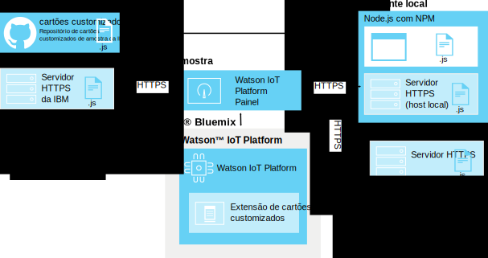
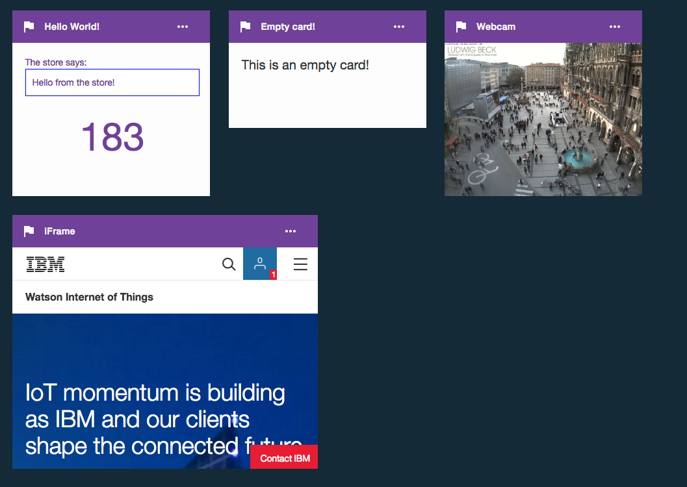

---

copyright:
  years: 2016
lastupdated: "2016-10-13"

---

{:new_window: target="\_blank"}
{:shortdesc: .shortdesc}
{:screen: .screen}
{:codeblock: .codeblock}
{:pre: .pre}

# Cartões customizados
{: #custom_cards}

Use os cartões customizados para visualizar os dados de Internet das Coisas além dos cartões genéricos que são fornecidos com o {{site.data.keyword.iot_full}}.
{:shortdesc}

## Arquitetura
{: #architecture}  

Os cartões customizados são desenvolvidos por você e implementados usando seu próprio repositório do servidor HTTP de cartões customizados.  Esse servidor é acessado pelo navegador de um usuário enquanto exibe e processa painéis do {{site.data.keyword.iot_short_notm}}. O {{site.data.keyword.iot_short_notm}} gerencia a conexão do navegador através da extensão de cartões customizados, mas não se conecta ao servidor de cartões customizados.

O navegador que está executando os painéis do {{site.data.keyword.iot_short_notm}} recupera todos os recursos necessários diretamente do servidor de cartões customizados. Os cartões customizados são oferecidos no diálogo “Incluir cartão” e exibidos nas placas criadas por usuário que os seus usuários configuraram.

Para ativar o controle de versão centralizado usando o servidor de cartões, o código do cartão customizado não é armazenado em cache no lado do cliente. Se um cartão customizado não estiver mais disponível ou se o servidor de cartões não puder ser acessado, um item temporário será usado para manter um layout de painel consistente.

**Dica:** para testar o recurso de cartões customizados sem configurar seu próprio ambiente de desenvolvimento, é possível se conectar ao servidor de cartões customizados de amostra fornecido pela IBM em: `https://customcards.mybluemix.net`

Para construir seus cartões, deve-se configurar um ambiente de desenvolvimento local baseado em node.js e importar cartões de amostra do repositório GitHub de cartões customizados fornecido pela IBM. Depois de criar seus cartões, você implementa o pacote de cartões para um servidor da web seguro (HTTPS) para o qual você vincula, então, a extensão de cartões customizados {{site.data.keyword.iot_short_notm}}.   

**Dica:** é possível usar o servidor da web node.js integrado para teste inicial e resolução de problemas de seus cartões, mas será necessário usar um servidor da web seguro e bem administrado para qualquer implementação de produção dos seus cartões.

 

## Segurança
{: #security}

Não há restrições colocadas no código JavaScript para escolher implementar em seus cartões no servidor de cartões customizados. O código Javascript em cartões customizados tem acesso a todas as informações mantidas no navegador, assim como quaisquer outros cartões em execução no painel.  Certifique-se de que o servidor de cartões customizados correto está fornecendo o código para o navegador exibir e processar os cartões customizados.

Os cartões executam seu código na sessão do navegador do {{site.data.keyword.iot_short_notm}} exatamente como escrito. Além disso, a conexão do servidor de cartões customizados é criada sem credenciais fornecidas ao servidor de cartões customizados. O navegador de um usuário pode conectar-se a qualquer servidor de cartões customizados configurado.

É importante configurar somente servidores de cartões customizados conhecidos e assegurados para fornecer cartões customizados aos painéis de seus usuários.   

Para obter mais informações sobre como proteger seu servidor de cartões customizados, veja [Segurança de cartões customizados](../reference/security/custom_cards_server.html).

As etapas a seguir o orientam no processo de conexão com um servidor de cartão de teste, na implementação de cartões de amostra em
seu próprio servidor de cartões e, finalmente, na criação de seus próprios cartões e na implementação dos mesmos em seu servidor.

## Etapa 1: conecte o {{site.data.keyword.iot_short_notm}} ao servidor de cartões de amostra.
{: #connect-to-sample}  

Para testar o recurso de cartões customizados com seu {{site.data.keyword.iot_short_notm}}, é possível se conectar ao servidor de cartões customizados de amostra. O servidor de amostra contém um conjunto de cartões genéricos que também estão disponíveis como modelos para a criação de seus próprios cartões.

Para se conectar ao servidor de cartões customizados de amostra:
1. Efetue login no painel do {{site.data.keyword.iot_short_notm}} como um usuário administrativo.
2. Ative os recursos experimentais.
Os cartões customizados são oferecidos atualmente como um recurso experimental.
**Importante:** a extensão experimental de cartões customizados deve ser ativada por sessão do navegador. As conexões de cartões customizados e os pacotes de cartões não são compartilhados globalmente em sua organização {{site.data.keyword.iot_short_notm}}.
 1. Acesse **Configurações**.
 2. Na seção Recursos experimentais, verifique se **Ativar recursos experimentais** está ativado.
2. Conecte-se ao servidor de amostra.
 2. Acesse **Extensões**.
 3. Clique em **Incluir extensão** e selecione a extensão **Cartões customizados**.
 4. No quadrado **Cartão customizado**, clique em **Configurar**.
 5. Na seção Configurar cartões customizados, clique em **Incluir** e insira a URL segura (HTTPS) para o servidor de cartões de amostra no campo de servidor.
Se você estiver se conectando ao seu próprio servidor, insira a URL desse servidor.
**Dica:** a URL do servidor de cartões de amostra da IBM é: `https://customcards.mybluemix.net`  
 6. Clique em **Recuperar certificado** para se conectar ao servidor de cartões customizados e recuperar as informações de certificado de segurança para o servidor.
**Importante:** use as informações de certificado para verificar se você está se conectando ao servidor de cartões customizados conhecido e assegurado desejado.
 4. Clique em **Pronto** para incluir a conexão do servidor.
5. Crie um novo cartão que é baseado nos cartões de amostra.
 1. No painel {{site.data.keyword.iot_short_notm}}, acesse **Placas**.
 2. Clique em **Criar nova placa**.
 Conclua a caixa de diálogo Criar nova placa. Para obter informações, consulte [Criando placas e cartões](../data_visualization.html#visualizing_data).
 3. Abra a nova placa.
 4. Clique em **Incluir novo cartão**.  
 5. Role para baixo até **Cartões customizados** e selecione um dos cartões de amostra.
 Conclua o processo de criação de cartão. Para obter informações, consulte [Criando placas e cartões](../data_visualization.html#visualizing_data).  

 Seu novo cartão customizado está agora em sua nova placa.  
 

Parabéns, você se conectou a um servidor de cartões customizados e incluiu um cartão customizado em uma de suas placas.
A próxima etapa é configurar seu próprio servidor de cartões e criar seu primeiro cartão usando o cartão de amostra HelloWorld.

## Etapa 2: configure um servidor de cartões e implemente o cartão de amostra HelloWorld.
{: #create-hello-world}

Para preparar para o desenvolvimento de cartões customizados, é possível configurar seu ambiente de desenvolvimento de cartão customizados local e implementar o cartão de amostra HelloWorld.

Para criar um servidor de cartões customizados e implementar os cartões de amostra da IBM, siga as instruções detalhadas no arquivo leia-me [repositório de cartões customizados](https://github.com/ibm-watson-iot/custom-cards/blob/master/README.md).

As seguintes etapas de alto nível estão envolvidas no processo:
1. Certifique-se de que o seu ambiente de desenvolvimento local tenha Node.js com o gerenciador de pacote de nó npm.
Para obter informações sobre como instalar o Node.js, incluindo os links de download, acesse aqui: https://nodejs.org
2. Configure um servidor HTTP para hospedar seu pacote de cartões customizados.    
  - O diretório que serve o conteúdo do cartão customizado no servidor não deve requerer credenciais para acessar.
  - O servidor deve usar o protocolo HTTPS.
  - O servidor deve suportar conexões de compartilhamento de recurso de origem cruzada (CORS).
**Dica:** para teste e prova de conceito, é possível usar o servidor node.js de amostra integrada, que é configurado para atender a esses requisitos.
3. Crie seu próprio repositório.
Bifurque e clone o exemplo de repositório de cartão customizado em: https://github.com/ibm-watson-iot/custom-cards
4. Crie seu próprio módulo e estrutura de cartão.
Cartões customizados são organizados em módulos. Configure um novo módulo de cartão HelloWorld.
5. Referencie o novo cartão.
Seu pacote de cartões customizados pode conter vários módulos. Deve-se referenciar o novo módulo no arquivo do pacote principal.
6. Registre seu módulo.
Para disponibilizar seu cartão nas placas de sua organização {{site.data.keyword.iot_short_notm}}, deve-se incluir os detalhes de configuração de cartão no arquivo `DashboardConfig.json`.
7. Construa seu pacote de cartões.
Use Gulp para configurar um mecanismo de construção automatizado.
8. Implemente seu pacote de cartões para seu servidor de cartões.
Antes de poder usar seus cartões em {{site.data.keyword.iot_short_notm}}, deve-se implementar o pacote de cartões em seu servidor HTTP de cartões customizados.
**Dica:** é possível incluir novos cartões ou remover cartões obsoletos continuamente reimplementando o pacote de cartões no servidor de cartões.
9. Vincule seu servidor de cartões ao {{site.data.keyword.iot_short_notm}}.
Vincule o seu servidor de cartões customizados recém-implementado ao {{site.data.keyword.iot_short_notm}}.  **Dica:** como seu servidor de cartões customizados pode ser uma réplica completa do servidor de cartões de amostra, você pode ver as cartas duplicadas em seu ambiente. Remova a conexão do servidor de cartões de amostra para ver somente os cartões do seu servidor de cartões customizados.
 1. Acesse **Extensões**.
 2. No quadrado **Cartão customizado**, clique no ícone de engrenagem para atualizar a configuração.
 4. Na seção Configurar cartões customizados, clique em **Incluir** e insira a URL segura (HTTPS) no servidor de cartões customizados no campo de servidor.
**Importante:** verifique se você está conectando ao servidor de cartões customizados conhecido e assegurado desejado.
4. Clique em **Pronto** para incluir a conexão do servidor.
10. O cartão customizado HelloWorld agora está disponível para usar com suas placas.

Tudo certo! Você configurou um servidor de cartões com sucesso e implementou seu primeiro cartão de amostra. Parabéns! No entanto, a ideia de cartões customizada é permitir que você configure cartões e placas exatamente como quiser. É hora de começar a modificar amostras para criar seus próprios cartões.

## Etapa 3: crie e implemente seus próprios cartões customizados.
{: #create-your-own-cards}
Após configurar e verificar o cartão HelloWorld, será possível expandir os cartões customizados e criar os seus próprios.

O repositório de cartão customizado de exemplo inclui os cartões de amostra a seguir:
- HelloWorld
Um cartão simples que fornece um exemplo básico do Hello World.
- Empty
Um cartão vazio que contém a infraestrutura para um cartão.
Use esse cartão como um modelo ao construir um cartão a partir do zero.
- Webcam
Um cartão simples de câmera web. Configure o cartão com uma URL de webcam e configure a taxa de atualização.
- iFrame
Um cartão iFrame básico que pode ser usado para integrar qualquer página da web segura (HTTPS) em sua placa.

As seguintes etapas de alto nível criam um novo cartão:

**Dica:** para obter as etapas detalhadas, consulte [Leia-me Criando placas customizadas](https://github.com/ibm-watson-iot/custom-cards/blob/master/README.md) no repositório de cartões customizados de exemplo.
1. Crie seu próprio módulo de cartão.
 1. Use um dos módulos de cartão de amostra como um modelo para seu módulo.
 2. Atualize todas as instâncias do nome do módulo em seu novo módulo de nomes de arquivos e conteúdo de arquivos.
 Por exemplo, substitua `HelloWorld` pelo nome do seu módulo em todas as instâncias de nomes de arquivos e de conteúdo de arquivo.
2. Referencie o novo módulo no arquivo Modules.jsx.
3. Registre o novo módulo no arquivo DashboardConfig.json.
4. Atualize o código do cartão customizado para atender às necessidades do seu cartão.
4. Construa o pacote de cartões.
Dependendo de sua configuração, o processo de construção pode ser automático usando gulp ou você pode ter que acionar manualmente uma construção.
3. Implemente o novo cartão.
Se você estiver usando um servidor de cartões customizados externo, deverá agora implementar o pacote para o servidor.  

Você criou seu primeiro cartão customizado e implementou o servidor de cartões customizados. O cartão está agora disponível para uso em sua organização {{site.data.keyword.iot_short_notm}}.
