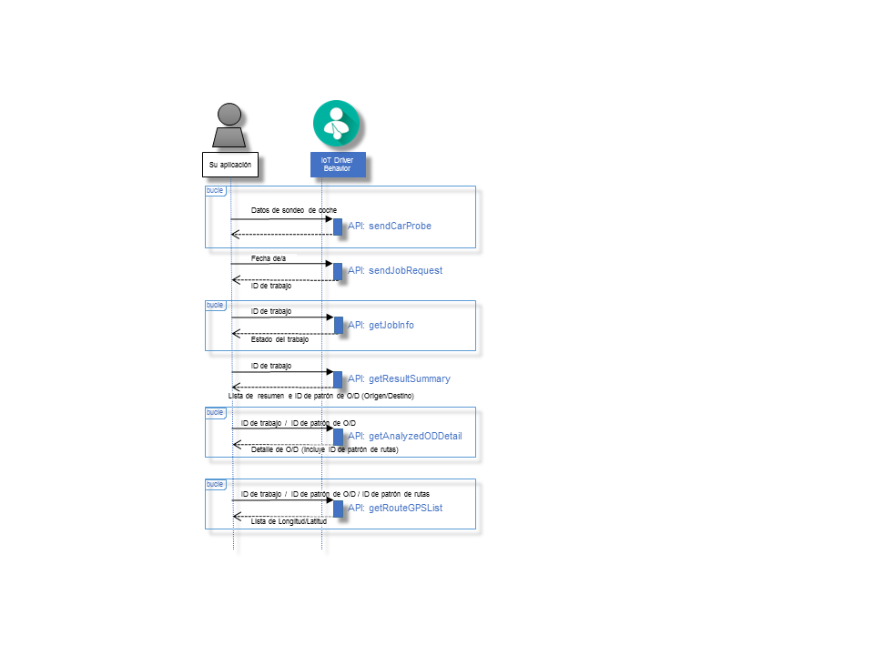

---

copyright:
  año: 2016

---

{:new_window: target="_blank"}
{:shortdesc: .shortdesc}
{:screen: .screen}
{:codeblock: .codeblock}
{:pre: .pre}

# Iniciación a rajectory Pattern Analysis
{: #tp_index}
Última actualización: 16 de junio de 2016
{: .last-updated}

La API de Trajectory Pattern Analysis es un servicio dentro del servicio {{site.data.keyword.iotdriverinsights_full}} de {{site.data.keyword.Bluemix_notm}}   que puede utilizar para analizar el Origen/Destino (O/D) y los patrones de ruta de trayectos de conducción a partir de datos de sondeo de coche. 

{:shortdesc}

En el siguiente diagrama se muestra un esquema de una secuencia típica de llamadas de API en Trajectory Pattern Analysis: 

Después de crear y desplegar {{site.data.keyword.iotdriverinsights_short}} como una instancia de servicio desenlazado, lleve a cabo las siguientes tareas para integrar las aplicaciones con la API de Trajectory Pattern Analysis. 

## Antes de empezar
{: #tp_byb}
- Revise el tema [Acerca de Trajectory Pattern Analysis](tp_iotdriverinsights_overview.html) para familiarizarse con los contextos y comportamientos analizables. 
- Obtenga los valores *ID de arrendatario*, *Nombre de usuario* y *Contraseña*, que son necesarios para acceder a la API de {{site.data.keyword.iotdriverinsights_short}}:

  1. En el panel de control de {{site.data.keyword.Bluemix_notm}}, pulse el mosaico del  servicio {{site.data.keyword.iotdriverinsights_short}}.
  2. Seleccione la vista **Gestionar** de la instancia de servicio.
  3. Anote los valores de ID de arrendatario, nombre de usuario y contraseña.

## Tarea 1: Carga de datos del vehículo
{: #tp_task1}
Cargue varios conjuntos de datos de trayectos de conducción en el arrendatario de {{site.data.keyword.iotdriverinsights_short}} para que los datos del conductor estén disponibles para Trajectory Pattern Analysis.

1. Envíe datos de sondeo de coche al almacén para analizarlos con la API `sendCarProbeData`.
Cargue los datos de sondeo de coche en {{site.data.keyword.iotdriverinsights_short}}.
   - Solicitud: Datos de sondeo de coche

## Tarea 2: Proceso de datos de vehículo
{: #tp_task2}

Procese los datos de vehículo para analizar patrón de O/D (Origen/Destino) y patrón de rutas

1. Envíe una solicitud para analizar datos de sondeo de coche en un determinado periodo de tiempo con la API de Trajectory Pattern Analysis `sendJobRequest`.
   - Solicitud: Fecha de y a
   - Respuesta: ID de trabajo
2. Compruebe el estado del trabajo con la API de Trajectory Pattern Analysis `getJobInfo`. El proceso de datos se ha completado cuando el estado de trabajo ha devuelto estados 'SUCCEEDED'. Ahora puede solicitar datos de resultados de análisis de patrones de trayectorias. 
   - Solicitud: ID de trabajo
   - Respuesta: Estado de trabajo

## Tarea 3: Analizar trayectos
{: #tp_task3}
Analice trayectos de un rango de fechas específico para comprender cómo ajustarse a los parámetros de umbral de análisis. 

1. Para obtener la lista de resumen de patrones analizados (Origen/Destino), utilice la API de Trajectory Pattern Analysis `getResultSummary`. Esta lista de resumen de patrones de O/D incluye información de resumen de trayectos analizados según los parámetros de entrada.
   - Solicitud: ID de trabajo
   - Respuesta: Lista de resumen e ID de patrón de O/D (Origen/Destino)
2. Para obtener la información detallada de patrones de O/D y de patrones de rutas analizados, utilice el mandato de API de Trajectory Pattern Analysis `getAnalyzedDetail`.
Obtenga la información de patrón de trayectorias para los trayectos analizados.
   - Solicitud: ID de trabajo /  ID de patrón de O/D
   - Respuesta: Detalles de O/D (incluye el ID de patrón de rutas)
3. Para recuperar una lista de puntos GPS de cada patrón de ruta, utilice la API de Trajectory Pattern Analysis `getRouteGPSList`.
Por último, obtenga la lista de puntos GPS de un patrón de rutas específico.
   - Solicitud: ID de trabajo /  ID de patrón de O/D / ID de patrón de rutas
   - Respuesta: Lista de Longitud/Latitud de un patrón de rutas

## Siguientes pasos
{: #tp_post}
Cuando haya completado los pasos, se genera un conjunto de datos de patrón de trayectorias analizados en la organización. Utilice las aplicaciones o el software de análisis preferido para procesar la información más detalladamente en más datos empresariales significativos. 

# Enlaces relacionados
{: #rellinks}

## Referencia de API
{: #api}

* [Documentos de API](http://ibm.biz/IoTDriverBehavior_APIdoc){:new_window}

## Otros recursos
{: #general}

* [Iniciación a {{site.data.keyword.iotmapinsights_short}}](../IotMapInsights/index.html){:new_window}
* [Iniciación a {{site.data.keyword.iot_full}}](https://www.ng.bluemix.net/docs/services/IoT/index.html){:new_window}
* [Respuestas dW en IBM developerWorks](https://developer.ibm.com/answers/topics/iot-driver-behavior){:new_window}
* [Desbordamiento de pila](http://stackoverflow.com/questions/tagged/iot-driver-behavior){:new_window}
* [Novedades de los servicios Bluemix](http://www.ng.bluemix.net/docs/whatsnew/index.html#services_category){:new_window}
