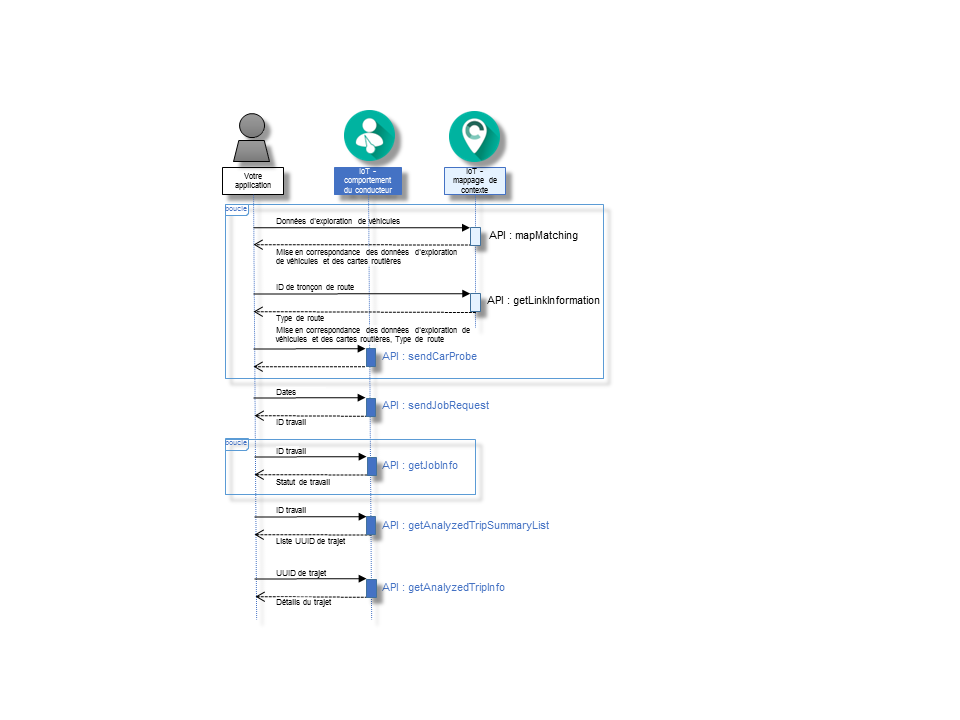

---

copyright:
  years: 2016

---

{:new_window: target="_blank"}
{:shortdesc: .shortdesc}
{:screen: .screen}
{:codeblock: .codeblock}
{:pre: .pre}

# Initiation à l'analyse du type de conduite
{: #drb_index}
Dernière mise à jour : 16 juin 2016
{: .last-updated}

L'analyse du type de conduite est un service inclus dans le service {{site.data.keyword.Bluemix_notm}}  {{site.data.keyword.iotdriverinsights_full}} que vous pouvez utiliser pour collecter et analyser le comportement des conducteurs à partir de données contextuelles et de données d'exploration de véhicules. De plus, vous pouvez utiliser l'API {{site.data.keyword.iotdriverinsights_short}} pour intégrer les données d'analyse de comportement des conducteurs dans vos autres applications {{site.data.keyword.Bluemix_notm}}.

{:shortdesc}

Le diagramme suivant présente une séquence type d'appels d'API dans le service d'analyse du type de conduite.

Une fois que vous avez créé et déployé {{site.data.keyword.iotdriverinsights_short}} en tant que service non lié, procédez comme suit pour intégrer vos applications à l'API {{site.data.keyword.iotdriverinsights_short}}.

Vous pouvez aussi utiliser le tutoriel [{{site.data.keyword.iotmapinsights_short}} et {{site.data.keyword.iotdriverinsights_short}} ](https://github.com/IBM-Bluemix/car-data-management){:new_window} pour vous aider à créer une application exemple avec des données exemple d'exploration de véhicules.

## Avant de commencer
{: #drb_byb}

- Prenez connaissance de la rubrique [A propos de l'analyse du type de conduite](drb_iotdriverinsights_overview.html) pour vous familiariser avec les contextes et types analysables.
- Obtenez les valeurs automatiquement générées suivantes, qui sont requises pour accéder à l'API {{site.data.keyword.iotdriverinsights_short}} : *ID titulaire*, *Nom d'utilisateur* et *Mot de passe*.

1. Depuis le tableau de bord {{site.data.keyword.Bluemix_notm}}, cliquez sur la vignette du service {{site.data.keyword.iotdriverinsights_short}}.
2. Sélectionnez la vue **Gérer** de votre instance de service.
3. Prenez note des valeurs *ID titulaire*, *Nom d'utilisateur* et *Mot de passe* qui s'affichent.

- Facultatif : si vous voulez utiliser les fonctions géospatiales avec vos données de conducteur, déployez le service {{site.data.keyword.Bluemix_notm}} {{site.data.keyword.iotmapinsights_short}} dans votre organisation.

## Tâche 1 : téléchargement des données de contexte et de véhicule
{: #drb_task1}
Téléchargez un ou plusieurs ensembles de données de trajets en voiture vers votre titulaire {{site.data.keyword.iotdriverinsights_short}} pour rendre les données de conducteur disponibles pour l'analyse.

1. Facultatif : si vous avez déployé le service {{site.data.keyword.iotmapinsights_short}}, mappez vos données de conducteur aux données géospatiales. Avant que votre application n'envoie les données d'exploration de véhicules vers l'API [{{site.data.keyword.iotdriverinsights_short}}](http://ibm.biz/IoTDriverBehavior_APIdoc){:new_window}, vous pouvez les mapper aux données géospatiales en utilisant l'API [{{site.data.keyword.iotmapinsights_short}}](http://ibm.biz/IoTContextMapping_APIdoc){:new_window}. Les données géospatiales améliorent la qualité des résultats d'analyse du comportement des conducteurs.

     1. Obtenez des données d'exploration de véhicules mises en correspondance avec des cartes routières en vous servant de l'API `mapMatching`.  Cette mise en correspondance met en relation les données de conduite détectées sur les véhicules avec les données routières géospatiales.
        - Demande : données d'exploration de véhicules
        - Réponse : mise en correspondance des données d'exploration de véhicules et des cartes routières
     2. Obtenez des données de type de route avec l'API `getLinkInformation`.  
        - Demande : ID de tronçon de route
        - Réponse: type de route
2. Envoyez les données d'exploration de véhicules au magasin pour qu'elles soient analysées avec l'API `sendCarProbeData`.
Téléchargez vos données d'exploration de véhicules brutes et les données géospatiales mises en correspondance vers {{site.data.keyword.iotdriverinsights_short}}.
   - Demande : mise en correspondance des données d'exploration de véhicules, des cartes routières et des types de route

## Tâche 2 : traitement des données de véhicules et de contexte  
{: #drb_task2}
Traitez les données de véhicules et de contexte par rapport aux paramètres d'analyse configurables. Pour plus d'informations sur la façon de configurer  les paramètres d'analyse, voir la rubrique [Configuration des paramètres pour le service](drb_iotdriverinsights_admin.html#configureparameters).

1. Envoyez une demande de travail pour analyser les données d'exploration de véhicules sur une certaine période de temps avec l'API `sendJobRequest`.
   - Demande : date Du et Au
   - Réponse : ID travail
2. Vérifiez le statut de travail avec l'API `getJobInfo`.
Le traitement des données de comportement des conducteurs est terminé quand le statut de travail retourné est "REUSSI". Vous pouvez alors demander les données de comportement des conducteurs.
   - Demande : ID travail
   - Réponse : statut de travail

## Tâche 3 : analyse des trajets
{: #drb_task3}
Analysez les trajets depuis une plage de dates spécifique pour comprendre comment ils se conforment aux paramètres de seuil d'analyse.

1. Obtenez la liste récapitulative des trajets analysés avec l'API `getAnalyzedTripSummaryList`.
La liste récapitulative des trajets inclut les informations récapitulatives des trajets analysés selon les paramètres d'entrée.
   - Demande : ID travail
   - Réponse : liste récapitulative des trajets analysés
2. Obtenez les informations détaillées des trajets analysés avec l'API `getAnalyzedTripInfo`.
Enfin, obtenez les informations détaillées relatives au comportement des conducteurs pour un trajet analysé spécifique.
   - Demande : UUID de trajet
   - Réponse : détail du trajet analysé

## Etapes suivantes :
{: #drb_post}
Quand vous avez terminé la procédure, un ensemble de données de comportement des conducteurs est généré dans votre organisation. Utilisez vos applications  ou votre logiciel d'analyse préféré pour traiter les informations plus en profondeur afin d'obtenir des données professionnelles plus significatives.

# Liens connexes
{: #rellinks}

## Tutoriels et exemples
{: #samples}

* [{{site.data.keyword.iotmapinsights_short}} / {{site.data.keyword.iotdriverinsights_short}} - Tutoriel Partie 1](https://github.com/IBM-Bluemix/car-data-management){:new_window}
* [{{site.data.keyword.iotmapinsights_short}} / {{site.data.keyword.iotdriverinsights_short}} - Tutoriel Partie 2](https://github.com/IBM-Bluemix/map-driver-insights){:new_window}
* [IoT for Automotive Starter Experience](https://iot-automotive-starter.mybluemix.net){:new_window}

## Référence d'API
{: #api}

* [Docs API](http://ibm.biz/IoTDriverBehavior_APIdoc){:new_window}

## Autres ressources 
{: #general}

* [Initiation à {{site.data.keyword.iotmapinsights_short}}](../IotMapInsights/index.html){:new_window}
* [Initiation à {{site.data.keyword.iot_full}}](https://www.ng.bluemix.net/docs/services/IoT/index.html){:new_window}
* [dW Answers sur IBM developerWorks](https://developer.ibm.com/answers/topics/iot-driver-behavior){:new_window}
* [Stack Overflow](http://stackoverflow.com/questions/tagged/iot-driver-behavior){:new_window}
* [Nouveautés dans les services Bluemix](http://www.ng.bluemix.net/docs/whatsnew/index.html#services_category){:new_window}
