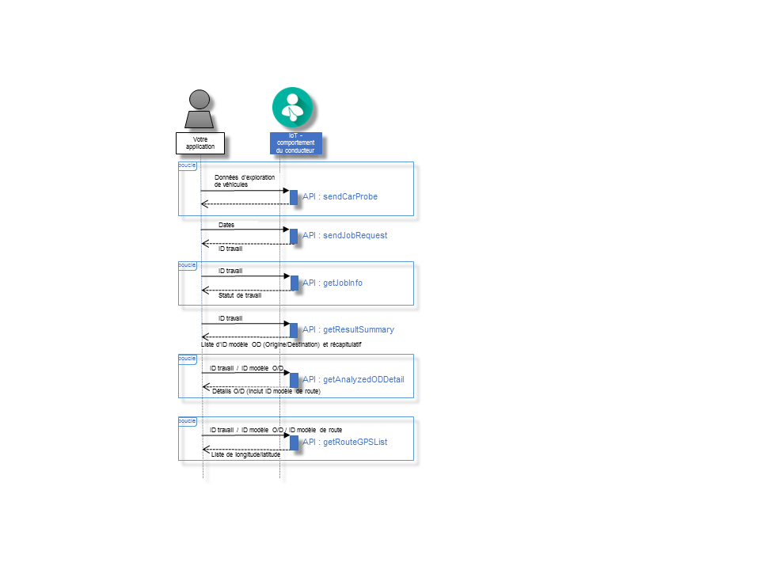

---

copyright:
  years: 2016

---

{:new_window: target="_blank"}
{:shortdesc: .shortdesc}
{:screen: .screen}
{:codeblock: .codeblock}
{:pre: .pre}

# Initiation à l'analyse des modèles de trajectoire
{: #tp_index}
Dernière mise à jour : 16 juin 2016
{: .last-updated}

L'API d'analyse des modèles de trajectoire est un service inclus dans le service {{site.data.keyword.Bluemix_notm}}  {{site.data.keyword.iotdriverinsights_full}} que vous pouvez utiliser pour analyser les modèles O/D (Origine/Destination) et les modèles de route des trajets en voiture depuis des données d'exploration de véhicules.

{:shortdesc}

Le diagramme suivant présente une séquence type d'appels d'API dans le service d'analyse des modèles de trajectoire.

Une fois que vous avez créé et déployé {{site.data.keyword.iotdriverinsights_short}} en tant que service non lié, procédez comme suit pour intégrer vos applications à l'API d'analyse des modèles de trajectoire.

## Avant de commencer
{: #tp_byb}
- Prenez connaissance de la rubrique [A propos de l'analyse des modèles de trajectoire](tp_iotdriverinsights_overview.html) pour vous familiariser avec les contextes et types analysables.
- Obtenez les valeurs automatiquement générées suivantes, qui sont requises pour accéder à l'API {{site.data.keyword.iotdriverinsights_short}} ; *ID titulaire*, *Nom d'utilisateur* et *Mot de passe* :

  1. Depuis le tableau de bord {{site.data.keyword.Bluemix_notm}}, cliquez sur la vignette du service {{site.data.keyword.iotdriverinsights_short}}.
  2. Sélectionnez la vue **Gérer** de votre instance de service.
  3. Prenez note des valeurs d'ID titulaire, de nom d'utilisateur et de mot de passe.

## Tâche 1 : téléchargement des données de véhicule
{: #tp_task1}
Téléchargez plusieurs ensembles de données de trajets en voiture vers votre titulaire {{site.data.keyword.iotdriverinsights_short}} pour rendre les données de conducteur disponibles pour l'analyse des modèles de trajectoire.

1. Envoyez les données d'exploration de véhicules au magasin pour qu'elles soient analysées avec l'API `sendCarProbeData`.  
Téléchargez vos données d'exploration de véhicules vers {{site.data.keyword.iotdriverinsights_short}}.
   - Demande : données d'exploration de véhicules

## Tâche 2 : traitement des données de véhicules
{: #tp_task2}

Traitez les données de véhicules pour analyser le modèle O/D (Origine/Destination) et le modèle de route

1. Envoyez une demande de travail pour analyser les données d'exploration de véhicules sur une certaine période de temps avec la commande `sendJobRequest` de l'API d'analyse des modèles de trajectoire.
   - Demande : date Du et Au
   - Réponse : ID travail
2. Vérifiez le statut de travail avec la commande `getJobInfo` de l'API d'analyse des modèles de trajectoire.
Le traitement des données est terminé quand le statut de travail retourné est "REUSSI". Vous pouvez alors demander les résultats de l'analyse des modèles de trajectoire.
   - Demande : ID travail
   - Réponse : statut de travail

## Tâche 3 : analyse des trajets
{: #tp_task3}
Analysez les trajets depuis une plage de dates spécifique pour comprendre comment ils se conforment aux paramètres de seuil d'analyse.

1. Pour obtenir la liste récapitulative des modèles O/D analysés, utilisez la commande `getResultSummary` de l'API d'analyse des modèles de trajectoire.
La liste récapitulative des modèles O/D inclut les informations récapitulatives des trajets analysés selon les paramètres d'entrée :
   - Demande : ID travail
   - Réponse : liste récapitulative et OD (Origine/Destination), ID modèle
2. Pour obtenir le modèle O/D analysé et détaillé et les informations de modèle de route, utilisez la commande `getAnalyzedDetail` de l'API d'analyse des modèles de trajectoire.
Obtenez les informations de modèles de trajectoire détaillées pour les trajets analysés.
   - Demande : ID travail /  ID modèle O/D
   - Réponse : détails O/D (inclut l'ID modèle de route)
3. Pour extraire une liste des points GPS de chaque modèle de route, utilisez la commande `getRouteGPSList` de l'API d'analyse des modèles de trajectoire.
Enfin, obtenez la liste des points GPS d'un modèle de route spécifique.
   - Demande : ID travail /  ID modèle O/D / ID modèle de route
   - Réponse : liste de longitude/latitude d'un modèle de route

## Etapes suivantes :
{: #tp_post}
Quand vous avez terminé la procédure, un ensemble de données de modèle de trajectoire analysée est généré dans votre organisation. Utilisez vos applications  ou votre logiciel d'analyse préféré pour traiter les informations plus en profondeur afin d'obtenir des données professionnelles plus significatives.

# Liens connexes
{: #rellinks}

## Référence d'API
{: #api}

* [Docs API](http://ibm.biz/IoTDriverBehavior_APIdoc){:new_window}

## Autres ressources
{: #general}

* [Initiation à {{site.data.keyword.iotmapinsights_short}}](../IotMapInsights/index.html){:new_window}
* [Initiation à {{site.data.keyword.iot_full}}](https://www.ng.bluemix.net/docs/services/IoT/index.html){:new_window}
* [dW Answers sur IBM developerWorks](https://developer.ibm.com/answers/topics/iot-driver-behavior){:new_window}
* [Stack Overflow](http://stackoverflow.com/questions/tagged/iot-driver-behavior){:new_window}
* [Nouveautés dans les services Bluemix](http://www.ng.bluemix.net/docs/whatsnew/index.html#services_category){:new_window}
