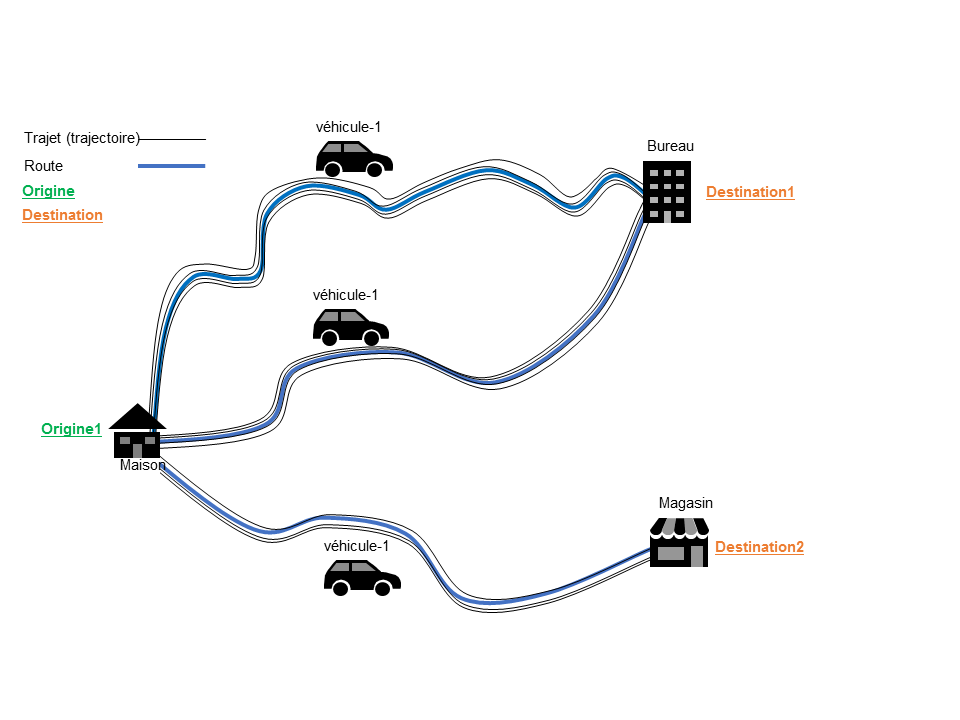

---

copyright:
  years: 2016

---

{:new_window: target="_blank"}
{:shortdesc: .shortdesc}
{:codeblock: .codeblock}
{:screen: .screen}
{:pre: .pre}

# A propos de l'analyse des modèles de trajectoire
{: #tp_iotdriverinsights_overview}
Dernière mise à jour : 16 juin 2016
{: .last-updated}

L'API d'analyse des modèles de trajectoire est un service fourni par {{site.data.keyword.iotdriverinsights_full}} que vous pouvez utiliser pour analyser les modèles O/D (Origine/Destination) et les modèles de route des trajets en voiture depuis des données d'exploration de véhicules.

{:shortdesc}

## Analyse des modèles de trajectoire de route
{: #tpa}

Vous pouvez identifier et analyser des modèles O/D et des modèles de route depuis plusieurs trajets en voiture différents.
Le diagramme suivant montre un exemple simple des modèles O/D et des modèles de route d'un véhicule (véhicule-1) tirés de différents trajets. Dans cet exemple, l'analyse des modèles de trajectoire identifie deux modèles O/D :
- Un modèle O/D depuis la maison (Origine1) vers le bureau (Destination1), avec deux modèles de route
- Un modèle O/D depuis la maison (Origine1) vers le magasin (Destination2), avec un modèle de route.

L'analyse des modèles de trajectoire calcule aussi certaines mesures de conduite pour chaque véhicule, comme répertorié dans le tableau suivant. Vous pouvez utiliser ces mesures pour évaluer les caractéristiques de conduite d'un conducteur.

|Nom de la mesure|Description|
|:---|:---|
|Ratio de fréquence - O/D|Rapport entre le nombre de trajets non couverts par des modèles O/D et le nombre total des trajets en entrée.|
|Ratio de fréquence - kilométrage|Rapport entre le kilométrage non couvert par des modèles de route et le kilométrage total des trajets en entrée.|
|Ratio de fréquence - trajets|Rapport entre le nombre de trajets non couverts par des modèles de route et le nombre total des trajets en entrée.|

## API REST
{: #rest_api}

L'API REST d'analyse des modèles de trajectoire fournit des demandes que vous pouvez utiliser pour personnaliser et générer vos applications {{site.data.keyword.Bluemix_notm}} :

 1. Commandes de données de véhicule :
   - `sendCarProbeData` envoie les données de détection de véhicules à analyser.
   - `getCarProbeDataListAsDate` retourne la liste des données d'exploration de véhicules par date.
   - `deleteCarProbeDataListByDate` supprime les données d'exploration de véhicules
 2. Commandes de travail d'analyse :
   - `sendJobRequest` envoie la demande de travail d'analyse des modèles de trajectoire
   - `getJobInfo` retourne les informations du travail spécifié
   - `getJobInfoList` retourne la liste des informations de travail
 3. Commandes de résultat d'analyse :
   - `getResultSummary` renvoie les informations récapitulatives de l'analyse des modèles de trajectoire
   - `getAnalyzedODDetail` renvoie les informations détaillées du modèle OD analysé spécifié
   - `getRouteGPSList` renvoie la liste des informations GPS du modèle de route analysé spécifié
   - `getODList` renvoie la liste des informations de modèle O/D des arguments spécifiés
   - `deleteJobResult` supprime tous les résultats analysés qui sont liés à un travail

Pour plus d'informations, voir la documentation de l'API [{{site.data.keyword.iotdriverinsights_short}}](http://ibm.biz/IoTDriverBehavior_APIdoc){:new_window}.
