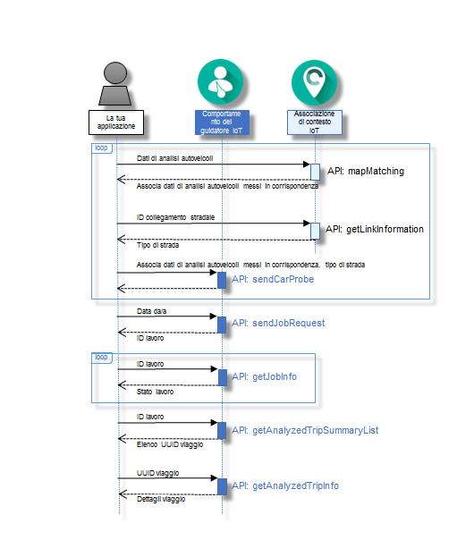

---

copyright:
  years: 2016

---

{:new_window: target="_blank"}
{:shortdesc: .shortdesc}
{:screen: .screen}
{:codeblock: .codeblock}
{:pre: .pre}

# Introduzione a Driving Behavior Analysis
{: #drb_index}
Ultimo aggiornamento: 16 giugno 2016
{: .last-updated}

Driving Behavior Analysis è un servizio nel servizio {{site.data.keyword.Bluemix_notm}}  {{site.data.keyword.iotdriverinsights_full}} che puoi usare per raccogliere e analizzare il comportamento dei guidatori da dati contestuali e di analisi degli autoveicoli. Puoi inoltre utilizzare la API {{site.data.keyword.iotdriverinsights_short}} per integrare i dati sul comportamento dei guidatori analizzati nelle altre applicazioni {{site.data.keyword.Bluemix_notm}} che utilizzi.

{:shortdesc}

Il seguente diagramma delinea una tipica sequenza di chiamate API nel servizio Driving Behavior Analysis:

Dopo che hai creato e distribuito {{site.data.keyword.iotdriverinsights_short}} come un'istanza del servizio in entrata, completa le seguenti attività per integrare le tue applicazioni con la API {{site.data.keyword.iotdriverinsights_short}}.

Puoi anche usare [{{site.data.keyword.iotmapinsights_short}} e {{site.data.keyword.iotdriverinsights_short}} tutorial](https://github.com/IBM-Bluemix/car-data-management){:new_window} come ausilio nella creazione di un'applicazione di esempio con i dati di analisi degli autoveicoli di esempio.

## Prima di cominciare
{: #drb_byb}

- Consulta l'argomento [Informazioni su Driving Behavior Analysis](drb_iotdriverinsights_overview.html) per acquisire dimestichezza con i comportamenti e i contesti analizzabili.
- Ottieni i valori di *ID tenant*, *numero utente* e *password* generati automaticamente, che sono necessari per accedere alla API {{site.data.keyword.iotdriverinsights_short}}.

1. Dal dashboard {{site.data.keyword.Bluemix_notm}}, fai clic sul tile del servizio {{site.data.keyword.iotdriverinsights_short}}.
2. Seleziona la vista **Gestisci** della tua istanza del servizio.
3. Annota i valori di *ID tenant*, *nome utente* e *password* visualizzati.

- Facoltativo: se vuoi usare le funzioni geospaziali con i tuoi dati relativi ai guidatori, distribuisci il servizio {{site.data.keyword.iotmapinsights_short}} {{site.data.keyword.Bluemix_notm}} nella tua organizzazione.

## Attività 1: caricamento dei dati relativi ai veicoli e di contesto
{: #drb_task1}
Carica una o più serie di dati relativi ai viaggi dei guidatori nel tuo tenant {{site.data.keyword.iotdriverinsights_short}} per rendere i dati relativi ai guidatori disponibili per l'analisi.

1. Facoltativo: se hai distribuito il servizio {{site.data.keyword.iotmapinsights_short}}, associare i tuoi dati relativi ai guidatori ai dati geospaziali.
Prima che la tua applicazione invii dati di analisi relativi agli autoveicoli alla API [{{site.data.keyword.iotdriverinsights_short}} ](http://ibm.biz/IoTDriverBehavior_APIdoc){:new_window}, puoi associarli ai dati geospaziali utilizzando la API [{{site.data.keyword.iotmapinsights_short}}](http://ibm.biz/IoTContextMapping_APIdoc){:new_window}. I dati geospaziali migliorano la qualità dei risultati relativi al comportamento dei guidatori analizzati.

     1. Ottieni dei dati di analisi degli autoveicoli messi in corrispondenza mediante associazione utilizzando la API `mapMatching`.
     Le messa in corrispondenza mediante associazione associa i dati di guida dai dati di analisi degli autoveicoli a quelli stradali geospaziali.
        - Richiesta: dati di analisi degli autoveicoli
        - Risposta: dati di analisi degli autoveicoli messi in corrispondenza mediante associazione
     2. Ottieni i dati di tipo stradale con la API `getLinkInformation`.  
        - Richiesta: ID collegamento stradale
        - Risposta: tipo di strada
2. Invia i dati di analisi degli autoveicoli nell'archivio da analizzare con la API `sendCarProbeData`.
Carica i tuoi dati di analisi degli autoveicoli non elaborati e i dati geospaziali messi in corrispondenza facoltativi a {{site.data.keyword.iotdriverinsights_short}}.
   - Richiesta: associa dati di analisi degli autoveicoli messi in corrispondenza e il tipo di strada

## Attività 2: elaborazione dei dati relativi ai veicoli e di contesto  
{: #drb_task2}
Elabora i dati relativi ai veicoli e di contesto rispetto ai parametri di analisi configurabili. Per informazioni su come configurare i parametri di analisi, consulta l'argomento [Configurazione dei parametri per il servizio](drb_iotdriverinsights_admin.html#configureparameters).

1. Invia una richiesta di lavoro per analizzare i dati di analisi degli autoveicoli in uno specifico periodo di tempo con la API `sendJobRequest`.
   - Richiesta: data di inizio e fine
   - Risposta: ID lavoro
2. Controlla lo stato del lavoro con la API `getJobInfo`.
L'elaborazione dei dati relativi al comportamento dei guidatori è completa quando lo stato del lavoro restituito indica 'SUCCEEDED'. Puoi ora richiedere i dati relativi al comportamento dei guidatori.
   - Richiesta: ID lavoro
   - Risposta: stato lavoro

## Attività 3: analisi dei viaggi
{: #drb_task3}
Analizza i viaggi da uno specifico intervallo di date per comprendere in che modo si accordano ai parametri di soglia di analisi.

1. Ottieni l'elenco di riepilogo dei viaggi analizzati con l'API `getAnalyzedTripSummaryList`.
L'elenco di riepilogo dei viaggi include le informazioni di riepilogo dei viaggi analizzati in base ai parametri di input.
   - Richiesta: ID lavoro
   - Risposta: elenco di riepilogo del viaggio analizzato
2. Ottieni le informazioni sui viaggi analizzati dettagliate con la API `getAnalyzedTripInfo`.
Ottieni infine le informazioni sul comportamento dei guidatori dettagliate per uno specifico viaggio analizzato.
   - Richiesta: uuid viaggio
   - Risposta: dettagli del viaggio analizzato

## Passi successivi
{: #drb_post}
Quando completi i passi, nella tua organizzazione viene generata una serie di dati relativi al comportamento dei guidatori. Utilizza le tue applicazioni oppure il tuo software di analisi preferito per elaborare ulteriormente le informazioni in dati aziendali più significativi.

# Link correlati
{: #rellinks}

## Esercitazioni ed esempi
{: #samples}

* [{{site.data.keyword.iotmapinsights_short}} / {{site.data.keyword.iotdriverinsights_short}} - Esercitazione parte 1](https://github.com/IBM-Bluemix/car-data-management){:new_window}
* [{{site.data.keyword.iotmapinsights_short}} / {{site.data.keyword.iotdriverinsights_short}} - Esercitazione parte 2](https://github.com/IBM-Bluemix/map-driver-insights){:new_window}
* [Applicazione IoT for Automotive Starter](https://iot-automotive-starter.mybluemix.net){:new_window}

## Guida di riferimento per la API
{: #api}

* [Documenti API](http://ibm.biz/IoTDriverBehavior_APIdoc){:new_window}

## Altre risorse
{: #general}

* [Introduzione a {{site.data.keyword.iotmapinsights_short}}](../IotMapInsights/index.html){:new_window}
* [Introduzione a {{site.data.keyword.iot_full}}](https://www.ng.bluemix.net/docs/services/IoT/index.html){:new_window}
* [dW Answers su IBM developerWorks](https://developer.ibm.com/answers/topics/iot-driver-behavior){:new_window}
* [Stack Overflow](http://stackoverflow.com/questions/tagged/iot-driver-behavior){:new_window}
* [What's new in Bluemix Services](http://www.ng.bluemix.net/docs/whatsnew/index.html#services_category){:new_window}
