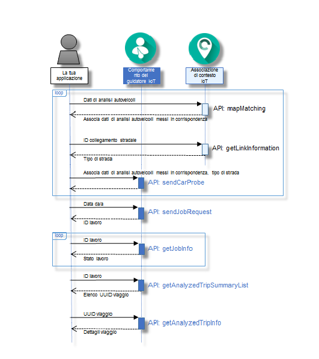

---

copyright:
  years: 2016

---

{:new_window: target="_blank"}
{:shortdesc: .shortdesc}
{:screen: .screen}
{:codeblock: .codeblock}
{:pre: .pre}

# Introduzione a Trajectory Pattern Analysis
{: #tp_index}
Ultimo aggiornamento: 16 giugno 2016
{: .last-updated}

La API Trajectory Pattern Analysis è un servizio nel servizio {{site.data.keyword.Bluemix_notm}} {{site.data.keyword.iotdriverinsights_full}} che puoi utilizzare per analizzare gli schemi O/D (Origine/Destinazione) e di rotta dei viaggi in auto dai dati di analisi degli autoveicoli.

{:shortdesc}

Il seguente diagramma delinea una tipica sequenza di chiamate API in Trajectory Pattern Analysis:

Dopo che hai creato e distribuito {{site.data.keyword.iotdriverinsights_short}} come un'istanza del servizio in entrata, completa le seguenti attività per integrare le tue applicazioni con la API Trajectory Pattern Analysis.

## Prima di cominciare
{: #tp_byb}
- Consulta l'argomento [Informazioni su Trajectory Pattern Analysis](tp_iotdriverinsights_overview.html) per acquisire dimestichezza con i comportamenti e i contesti analizzabili.
- Ottieni i valori di *ID tenant*, *numero utente* e *password* generati automaticamente, che sono necessari per accedere alla API {{site.data.keyword.iotdriverinsights_short}}:

  1. Dal dashboard {{site.data.keyword.Bluemix_notm}}, fai clic sul tile del servizio {{site.data.keyword.iotdriverinsights_short}}.
  2. Seleziona la vista **Gestisci** della tua istanza del servizio.
  3. Annota i valori di ID tenant, nome utente e password.

## Attività 1: caricamento dei dati relativi ai veicoli
{: #tp_task1}
Carica più serie di dati relativi ai viaggi in auto nel tuo tenant {{site.data.keyword.iotdriverinsights_short}} per rendere i dati relativi ai guidatori disponibili per Trajectory Pattern Analysis.

1. Invia i dati di analisi degli autoveicoli nell'archivio da analizzare con la API `sendCarProbeData`.
Carica i tuoi dati di analisi degli autoveicoli in {{site.data.keyword.iotdriverinsights_short}}.
   - Richiesta: dati di analisi degli autoveicoli

## Attività 2: elaborazione dei dati relativi ai veicoli
{: #tp_task2}

Elabora i dati relativi ai veicoli per analizzare lo schema O/D (Origine/Destinazione) e lo schema di rotta

1. Invia una richiesta di lavoro per analizzare i dati di analisi degli autoveicoli in uno specifico periodo di tempo con `sendJobRequest` della API Trajectory Pattern Analysis.
   - Richiesta: data di inizio e fine
   - Risposta: ID lavoro
2. Controlla lo stato del lavoro con `getJobInfo` della API Trajectory Pattern Analysis.
L'elaborazione dei dati è completa quando lo stato del lavoro restituito indica 'SUCCEEDED'. Puoi ora richiedere i dati dei risultati dell'analisi degli schemi di traiettoria.
   - Richiesta: ID lavoro
   - Risposta: stato lavoro

## Attività 3: analisi dei viaggi
{: #tp_task3}
Analizza i viaggi da uno specifico intervallo di date per comprendere in che modo si accordano ai parametri di soglia di analisi.

1. Per ottenere l'elenco di riepilogo degli schemi O/D (Origine/Destinazione) analizzati, utilizza `getResultSummary` della API Trajectory Pattern Analysis.
L?elenco di riepilogo degli schemi O/D include le informazioni di riepilogo dei viaggi analizzati in base ai parametri di input:
   - Richiesta: ID lavoro
   - Risposta: elenco di riepilogo e ID schema O/D (Origine/Destinazione), ID schema
2. Per ottenere informazioni dettagliate sugli schemi di rotta e sugli schemi O/D analizzati, utilizza il comando `getAnalyzedDetail` della API Trajectory Pattern Analysis.
Ottieni le informazioni dettagliate sugli schemi di traiettoria per i viaggi analizzati.
   - Richiesta: ID lavoro / ID schema O/D
   - Risposta: dettagli di O/D (include l'ID schema di rotta)
3. Per richiamare un elenco di punti GPS di ciascuno schema di rotta, utilizza `getRouteGPSList` della API Trajectory Pattern Analysis.
Infine, ottieni l'elenco di punti GPS di uno specifico schema di rotta.
   - Richiesta: ID lavoro / ID schema O/D / ID schema di rotta
   - Risposta: elenco di longitudine/latitudine di uno schema di rotta

## Passi successivi
{: #tp_post}
Quando completi i passi, nella tua organizzazione viene generata una serie di dati relativi agli schemi di traiettoria analizzati.Utilizza le tue applicazioni oppure il tuo software di analisi preferito per elaborare ulteriormente le informazioni in dati aziendali più significativi.

# Link correlati
{: #rellinks}

## Guida di riferimento per la API
{: #api}

* [Documenti API](http://ibm.biz/IoTDriverBehavior_APIdoc){:new_window}

## Altre risorse
{: #general}

* [Introduzione a {{site.data.keyword.iotmapinsights_short}}](../IotMapInsights/index.html){:new_window}
* [Introduzione a {{site.data.keyword.iot_full}}](https://www.ng.bluemix.net/docs/services/IoT/index.html){:new_window}
* [dW Answers su IBM developerWorks](https://developer.ibm.com/answers/topics/iot-driver-behavior){:new_window}
* [Stack Overflow](http://stackoverflow.com/questions/tagged/iot-driver-behavior){:new_window}
* [What's new in Bluemix Services](http://www.ng.bluemix.net/docs/whatsnew/index.html#services_category){:new_window}
