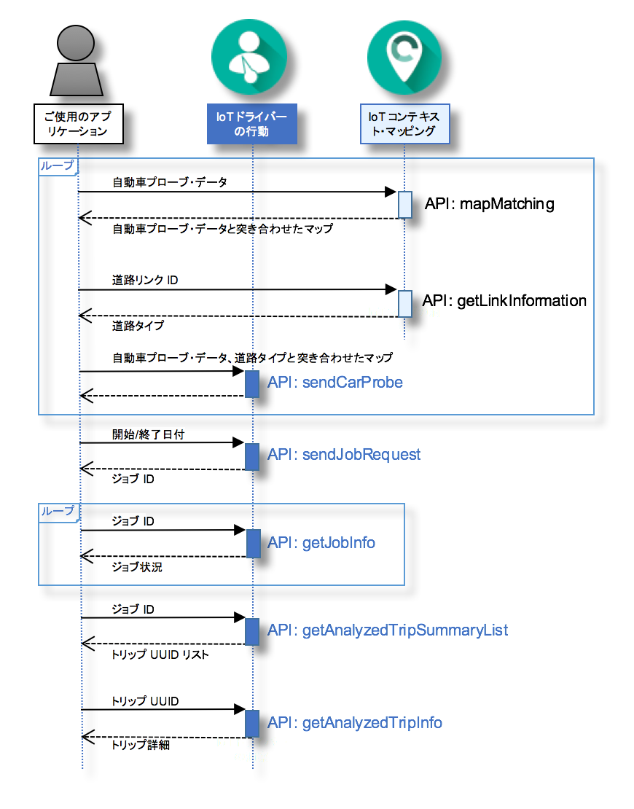

---

copyright:
  years: 2016

---

{:new_window: target="_blank"}
{:shortdesc: .shortdesc}
{:screen: .screen}
{:codeblock: .codeblock}
{:pre: .pre}

# Driving Behavior Analysis 概説
{: #drb_index}
最終更新: 2016 年 6 月 16 日
{: .last-updated}

Driving Behavior Analysis は、{{site.data.keyword.Bluemix_notm}} {{site.data.keyword.iotdriverinsights_full}} サービスに含まれるサービスの 1 つで、カー・プローブ・データやコンテキスト・データからドライバーの動作を収集および分析するために使用することができます。
さらに、{{site.data.keyword.iotdriverinsights_short}} API を使用することにより、分析後のドライバーの動作データを {{site.data.keyword.Bluemix_notm}} の他のアプリケーションに組み込むことができます。

{:shortdesc}

Driving Behavior Analysis サービスでの典型的な API 呼び出しシーケンスの概略を以下の図に示します。

{{site.data.keyword.iotdriverinsights_short}} をアンバウンド・サービス・インスタンスとして作成およびデプロイした後、以下の作業を実行して、アプリケーションに {{site.data.keyword.iotdriverinsights_short}} API を組み込みます。

また、[{{site.data.keyword.iotmapinsights_short}} および {{site.data.keyword.iotdriverinsights_short}} チュートリアル](https://github.com/IBM-Bluemix/car-data-management){:new_window}を使用するなら、サンプルのカー・プローブ・データを使用してサンプル・アプリケーションを作成することができます。

## 始めに
{: #drb_byb}

- [Driving Behavior Analysis について](drb_iotdriverinsights_overview.html)のトピックを参照して、分析可能な動作とコンテキストについて確認してください。

- 自動生成される*テナント ID*、*ユーザー名*、および*パスワード*の値を入手します。
{{site.data.keyword.iotdriverinsights_short}} API にアクセスするためには、それらが必要です。

1. {{site.data.keyword.Bluemix_notm}} ダッシュボードから、{{site.data.keyword.iotdriverinsights_short}} サービス・タイルをクリックします。

2. サービス・インスタンスの**「管理」**ビューを選択します。

3. 表示される*テナント ID*、*ユーザー名*、および*パスワード*の値をメモします。

- オプション: ドライバー・データと共に地理情報関数を使用する場合は、組織内に {{site.data.keyword.iotmapinsights_short}} {{site.data.keyword.Bluemix_notm}} サービスをデプロイします。

## タスク 1: 自動車データとコンテキスト・データのアップロード
{: #drb_task1}
1 つ以上のドライバー・トリップ・データを自分の {{site.data.keyword.iotdriverinsights_short}} テナントにアップロードして、ドライバー・データを分析に使用できるようにします。

1. オプション: {{site.data.keyword.iotmapinsights_short}} サービスをデプロイした場合、ドライバー・データを地理情報データにマップします。
アプリケーションからカー・プローブ・データを [{{site.data.keyword.iotdriverinsights_short}} API](http://ibm.biz/IoTDriverBehavior_APIdoc){:new_window} に送信する前に、[{{site.data.keyword.iotmapinsights_short}} API](http://ibm.biz/IoTContextMapping_APIdoc){:new_window} を使用することによってそれを地理情報データにマップすることができます。
地理情報データにより、ドライバー動作の分析結果の品質が向上します。

     1. `mapMatching` API を使用することにより、マップ・マッチングしたカー・プローブ・データを入手します。
マップ・マッチングは、カー・プローブからのドライブ・データを地理情報道路データにマップします。

        - 要求: カー・プローブ・データ
        - 応答: マップ・マッチングしたカー・プローブ・データ
     2. `getLinkInformation` API により、道路タイプ・データを入手します。  
        - 要求: 道路リンク ID
        - 応答: 道路タイプ
2. `sendCarProbeData` API で分析するため、カー・プローブ・データをストアに送信します。
生のカー・プローブ・データとオプションのマッチングした地理情報データを、{{site.data.keyword.iotdriverinsights_short}} にアップロードします。

   - 要求: マップ・マッチングしたカー・プローブ・データおよび道路タイプ

## タスク 2: 自動車データとコンテキスト・データの処理  
{: #drb_task2}
構成可能分析パラメーターに対する自動車およびコンテキストのデータを処理します。
分析パラメーターを構成する方法については、[サービス・パラメーターの構成](drb_iotdriverinsights_admin.html#configureparameters)のトピックを参照してください。

1. `sendJobRequest` API により特定の期間についてカー・プローブ・データを分析するためのジョブ要求を送信します。

   - 要求: 開始/終了日付
   - 応答: ジョブ ID
2. `getJobInfo` API によりジョブ状況を確認します。
ドライバー動作のデータ処理は、返されるジョブ状況が 'SUCCEEDED' となっていれば完了しています。
そうなった時点で、ドライバー動作データを要求できるようになります。

   - 要求: ジョブ ID
   - 応答: ジョブ状況

## タスク 3: トリップの分析
{: #drb_task3}
特定の日付範囲のトリップを分析して、分析しきい値パラメーターへの適合の程度を調べます。

1. `getAnalyzedTripSummaryList` API により、分析後のトリップ要約リストを入手します。
トリップ要約リストには、入力パラメーターに応じて分析されたトリップ要約情報が含まれます。

   - 要求: ジョブ ID
   - 応答: 分析後のトリップ要約リスト
2. `getAnalyzedTripInfo` API により、分析後の詳細なトリップ情報を入手します。
最後に、特定の分析対象トリップについての詳細なドライバー動作情報を入手します。

   - 要求: トリップ UUID
   - 応答: 分析後のトリップの詳細

## 次のステップ
{: #drb_post}
これらのステップの実行が終了したら、一連のドライバー動作データが組織内で生成されます。
アプリケーションまたはお気に入りの分析ソフトウェアを使用することにより、情報をさらに処理して、さらに意味のあるビジネス・データにします。

# 関連リンク
{: #rellinks}

## チュートリアルとサンプル
{: #samples}

* [{{site.data.keyword.iotmapinsights_short}} / {{site.data.keyword.iotdriverinsights_short}} チュートリアル パート 1](https://github.com/IBM-Bluemix/car-data-management){:new_window}
* [{{site.data.keyword.iotmapinsights_short}} / {{site.data.keyword.iotdriverinsights_short}} チュートリアル パート 2](https://github.com/IBM-Bluemix/map-driver-insights){:new_window}
* [IoT for Automotive Starter アプリケーション](https://iot-automotive-starter.mybluemix.net){:new_window}

## API リファレンス
{: #api}

* [API ドキュメント](http://ibm.biz/IoTDriverBehavior_APIdoc){:new_window}

## その他の資料
{: #general}

* [{{site.data.keyword.iotmapinsights_short}} の使用を開始する](../IotMapInsights/index.html){:new_window}
* [{{site.data.keyword.iot_full}} の使用を開始する](https://www.ng.bluemix.net/docs/services/IoT/index.html){:new_window}
* [IBM developerWorks の dW Answers](https://developer.ibm.com/answers/topics/iot-driver-behavior){:new_window}
* [スタック・オーバーフロー](http://stackoverflow.com/questions/tagged/iot-driver-behavior){:new_window}
* [Bluemix サービスの新機能](http://www.ng.bluemix.net/docs/whatsnew/index.html#services_category){:new_window}
