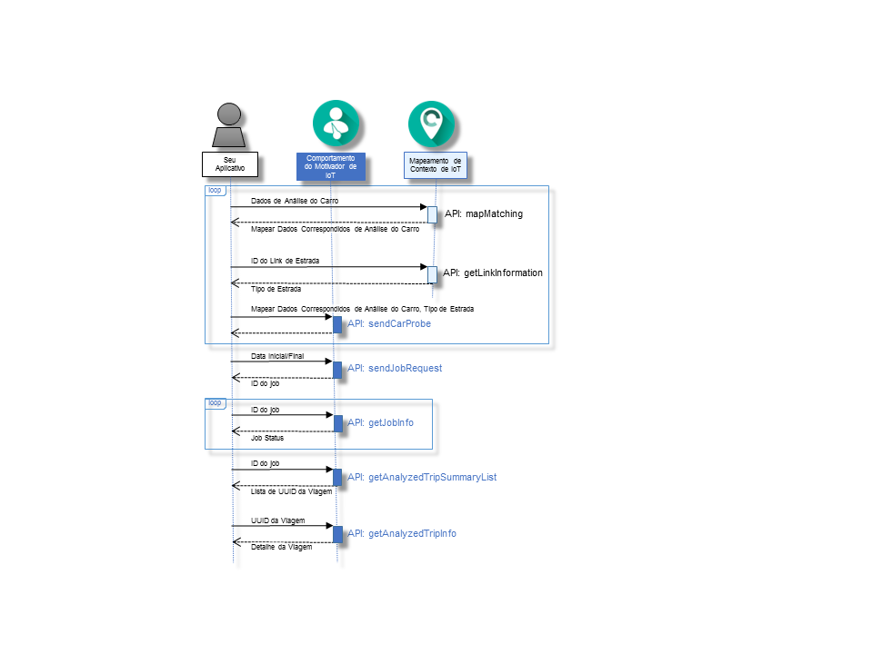

---

copyright:
  years: 2016

---

{:new_window: target="_blank"}
{:shortdesc: .shortdesc}
{:screen: .screen}
{:codeblock: .codeblock}
{:pre: .pre}

# Introdução ao Driving Behavior Analysis
{: #drb_index}
Última atualização: 16 de junho de 2016
{: .last-updated}

O Driving Behavior Analysis é um serviço dentro do serviço {{site.data.keyword.iotdriverinsights_full}} do {{site.data.keyword.Bluemix_notm}} que pode ser usado para coletar e analisar o comportamento do motorista nos dados de análise e contextuais do carro. Além disso, é possível usar a API do {{site.data.keyword.iotdriverinsights_short}} para integrar os dados analisados do comportamento do motorista a outros aplicativos {{site.data.keyword.Bluemix_notm}}.

{:shortdesc}

O diagrama a seguir descreve uma sequência típica de chamadas API no serviço Driving Behavior Analysis:

Depois de criar e implementar o {{site.data.keyword.iotdriverinsights_short}} como uma instância de serviço desvinculada, conclua as tarefas a seguir para integrar seus aplicativos à API do {{site.data.keyword.iotdriverinsights_short}}.

Também é possível usar o tutorial de [{{site.data.keyword.iotmapinsights_short}} e {{site.data.keyword.iotdriverinsights_short}}](https://github.com/IBM-Bluemix/car-data-management){:new_window} para ajudá-lo a criar um aplicativo de amostra com dados de análise de amostra do carro.

## Antes
de Começar
{: #drb_byb}

- Revise o tópico [Sobre o Driving Behavior Analysis](drb_iotdriverinsights_overview.html) para familiarizar-se com os comportamentos e contextos analisáveis.
- Obtenha os valores *Tenant ID*, *Username* e *Password* gerados automaticamente, necessários para acessar a API do {{site.data.keyword.iotdriverinsights_short}}.

1. No painel do {{site.data.keyword.Bluemix_notm}}, clique no quadro do serviço {{site.data.keyword.iotdriverinsights_short}}.
2. Selecione a visualização **Gerenciar** de sua instância de serviço.

3. Anote os valores de *Tenant ID*, *Username* e *Password* exibidos.

- Opcional: se você quiser usar funções geoespaciais com os dados do motorista, implemente o serviço {{site.data.keyword.iotmapinsights_short}} {{site.data.keyword.Bluemix_notm}} em sua organização.

## Tarefa 1: fazendo upload de dados do veículo e de contexto
{: #drb_task1}
Faça upload de um ou mais conjuntos de dados de viagem do motorista para o locatário do {{site.data.keyword.iotdriverinsights_short}} para disponibilizar os dados do motorista para análise.

1. Opcional: se você implementou o serviço {{site.data.keyword.iotmapinsights_short}}, mapeie os dados do motorista para os dados geoespaciais.
Antes que o aplicativo envie dados de análise do carro para a [API do {{site.data.keyword.iotdriverinsights_short}}](http://ibm.biz/IoTDriverBehavior_APIdoc){:new_window}, é possível mapeá-los para os dados geoespaciais usando a [API do {{site.data.keyword.iotmapinsights_short}}](http://ibm.biz/IoTContextMapping_APIdoc){:new_window}. Os dados geoespaciais aprimoram a qualidade dos resultados analisados do comportamento do motorista.

     1. Obtenha os dados de análise do carro correspondidos com o mapa usando a API `mapMatching`.
     O mapa correspondente mapeia os dados de condução da análise do carro com os dados da estrada geoespaciais.
        - Solicitação: dados de análise do carro
        - Resposta: dados de análise do carro correspondidos com o mapa
     2. Obtenha dados do tipo de estrada com a API `getLinkInformation`.  
        - Solicitação: ID do link de estrada
        - Resposta: tipo de estrada
2. Envie dados de análise do carro para o armazenamento para serem analisados com a API `sendCarProbeData`.
Faça upload dos dados brutos de análise do carro e dos dados geoespaciais opcionais correspondidos para o {{site.data.keyword.iotdriverinsights_short}}.
   - Solicitação: dados de análise do carro correspondidos com o mapa e tipo de estrada

## Tarefa 2: processando dados do veículo e de contexto  
{: #drb_task2}
Processe os dados do veículo e de contexto com relação aos parâmetros de análise configuráveis. Para obter informações sobre como configurar os parâmetros de análise, consulte o tópico [Configurando parâmetros para o serviço](drb_iotdriverinsights_admin.html#configureparameters).

1. Envie uma solicitação de tarefa para analisar dados de análise do carro em um determinado período com a API `sendJobRequest`.
   - Solicitação: data inicial e final
   - Resposta: ID da tarefa
2. Verifique o status da tarefa com a API `getJobInfo`.
O processamento de dados do comportamento do motorista estará completo quando o status da tarefa retornar o estado 'BEM-SUCEDIDO'. Agora será possível solicitar dados do comportamento do motorista.
   - Solicitação: ID da tarefa
   - Resposta: status da tarefa

## Tarefa 3: analisar viagens
{: #drb_task3}
Analise viagens a partir de um intervalo de data específico para entender sua conformidade com os parâmetros de limite de análise.

1. Obtenha a lista de resumo de viagens analisadas com a API `getAnalyzedTripSummaryList`.
A lista de resumo de viagens inclui informações de resumo de viagem analisadas de acordo com os parâmetros de entrada.
   - Solicitação: ID da tarefa
   - Resposta: lista de resumo de viagens analisadas
2. Obtenha as informações detalhadas de viagens analisadas com a API `getAnalyzedTripInfo`.
Finalmente, obtenha as informações detalhadas do comportamento do motorista para uma viagem analisada específica.
   - Solicitação: UUID da viagem
   - Resposta: detalhes da viagem analisada

## Etapas seguintes
{: #drb_post}
Ao concluir as etapas, um conjunto de dados do comportamento do motorista será gerado em sua organização. Use seus aplicativos ou seu software de análise de dados preferencial
para
processar as informações ainda mais em dados de negócios mais significativos.

# Links Relacionados
{: #rellinks}

## Tutoriais e Amostras
{: #samples}

* Tutorial [{{site.data.keyword.iotmapinsights_short}} / {{site.data.keyword.iotdriverinsights_short}} Parte 1](https://github.com/IBM-Bluemix/car-data-management){:new_window}
* Tutorial [{{site.data.keyword.iotmapinsights_short}} / {{site.data.keyword.iotdriverinsights_short}} Parte 2](https://github.com/IBM-Bluemix/map-driver-insights){:new_window}
* [Aplicativo IoT for Automotive Starter](https://iot-automotive-starter.mybluemix.net){:new_window}

## Referência da API
{: #api}

* [Docs API](http://ibm.biz/IoTDriverBehavior_APIdoc){:new_window}

## Outro Recursos
{: #general}

* [Introdução
ao {{site.data.keyword.iotmapinsights_short}}](../IotMapInsights/index.html){:new_window}
* [Introdução
ao {{site.data.keyword.iot_full}}](https://www.ng.bluemix.net/docs/services/IoT/index.html){:new_window}
* [dW Answers no IBM developerWorks](https://developer.ibm.com/answers/topics/iot-driver-behavior){:new_window}
* [Estouro da capacidade](http://stackoverflow.com/questions/tagged/iot-driver-behavior){:new_window}
* [O que há de novo em Serviços do Bluemix](http://www.ng.bluemix.net/docs/whatsnew/index.html#services_category){:new_window}
