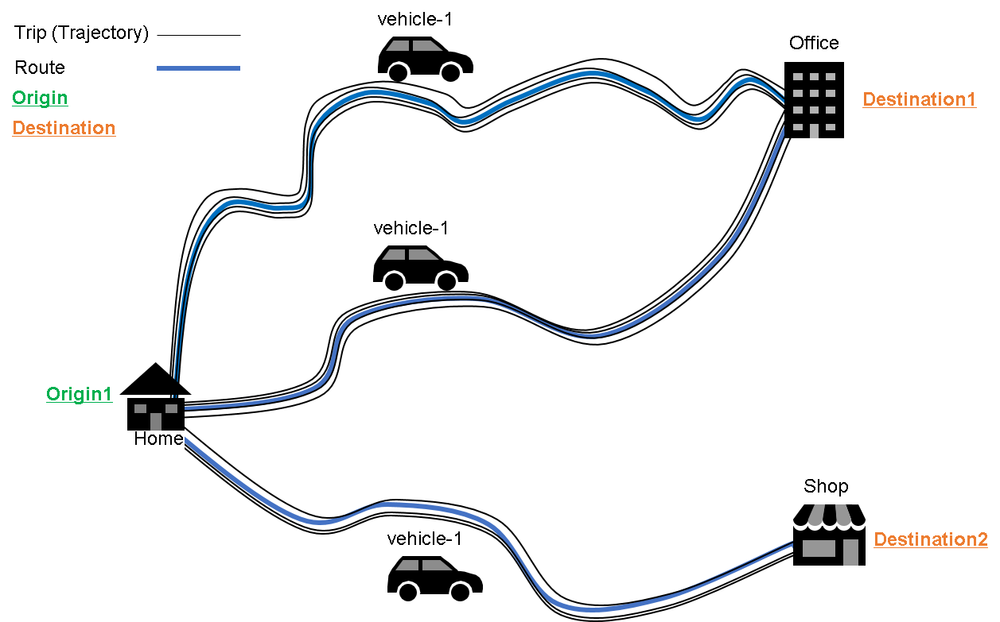

---

copyright:
  years: 2016

---

{:new_window: target="_blank"}
{:shortdesc: .shortdesc}
{:codeblock: .codeblock}
{:screen: .screen}
{:pre: .pre}

# Sobre o Trajectory Pattern Analysis
{: #tp_iotdriverinsights_overview}
Última atualização: 16 de junho de 2016
{: .last-updated}

O Trajectory Pattern Analysis API é um serviço fornecido pelo {{site.data.keyword.iotdriverinsights_full}} que pode ser usado para analisar os padrões de Origem/Destino (O/D) e de rota de viagens de carro nos dados de análise do carro.

{:shortdesc}

## Análise do padrão de trajetória da rota
{: #tpa}

É possível identificar e analisar os padrões de O/D e de rota em múltiplas viagens de carro.
O diagrama a seguir mostra um exemplo simples dos padrões de O/D e de rota de um veículo (veículo-1) obtidas em múltiplas viagens. Neste exemplo, o Trajectory Pattern Analysis identifica dois padrões de O/D:
- Um padrão de O/D da Casa (Origem 1) para o Escritório (Destino 1) que possui dois padrões de rota
- Um padrão de O/D da Casa (Origem 1) para a Loja (Destino 2) que possui um padrão de rota.

O Trajectory Pattern Analysis também calcula algumas métricas de diversidade de condução de cada veículo, conforme listado na tabela a seguir. É possível usar essas métricas para julgar as características de condução de um motorista.

|Nome da Métrica|Description|
|:---|:---|
|Razão de O/D rara|A razão entre o número de viagens não cobertas pelos padrões de O/D e o número total de viagens de entrada.|
|Razão de milhagem rara|A razão entre a milhagem não coberta pelos padrões de rota e o total de milhagem das viagens de entrada.|
|Razão de viagem rara|A razão entre o número de viagens não cobertas pelos padrões de rota e o número total de viagens de entrada.|

## API REST
{: #rest_api}

A API REST do Trajectory Pattern Analysis fornece solicitações que podem ser usadas para customizar e construir seus aplicativos {{site.data.keyword.Bluemix_notm}}:

 1. Comandos de dados do carro:
   - `sendCarProbeData` envia os dados de análise do carro para serem analisados
   - `getCarProbeDataListAsDate` retorna a lista de dados de análise do carro por data
   - `deleteCarProbeDataListByDate` exclui os dados de análise do carro
 2. Comandos da tarefa de análise:
   - `sendJobRequest` envia a solicitação da tarefa de análise de padrão da trajetória
   - `getJobInfo` retorna as informações da tarefa especificada
   - `getJobInfoList` retorna a lista de informações sobre a tarefa
 3. Comandos de resultado da análise:
   - `getResultSummary` retorna as informações de resumo analisadas da análise do padrão de trajetória
   - `getAnalyzedODDetail` retorna as informações detalhadas do padrão de O/D analisado especificado
   - `getRouteGPSList` retorna a lista de informações de GPS do padrão de rota analisado especificado
   - `getODList` retorna a lista de informações de padrão de O/D dos argumentos especificados
   - `deleteJobResult` exclui todos os resultados analisados relacionados a uma tarefa

Para obter mais informações, consulte a documentação da [API do {{site.data.keyword.iotdriverinsights_short}}](http://ibm.biz/IoTDriverBehavior_APIdoc){:new_window}.
