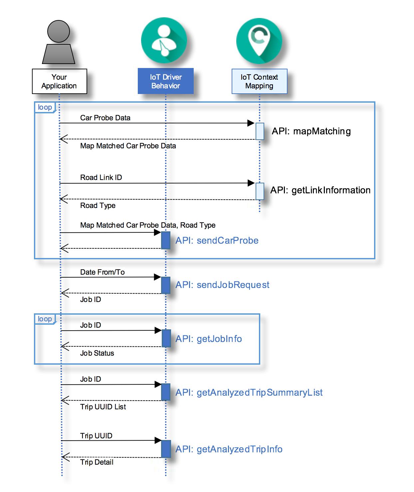

---

copyright:
  years: 2016

---

{:new_window: target="_blank"}
{:shortdesc: .shortdesc}
{:screen: .screen}
{:codeblock: .codeblock}
{:pre: .pre}

# 驾驶行为分析入门
{: #drb_index}
上次更新时间：2016 年 6 月 16 日
{: .last-updated}

“驾驶行为分析”是 {{site.data.keyword.Bluemix_notm}}  {{site.data.keyword.iotdriverinsights_full}} 服务中的一项服务，可用来通过汽车探测数据和上下文数据，来收集和分析驾驶员行为。而且，您还可以使用 {{site.data.keyword.iotdriverinsights_short}} API，将分析的驾驶员行为数据集成到其他 {{site.data.keyword.Bluemix_notm}} 应用程序。

{:shortdesc}

下图概述“驾驶行为分析”服务中的典型 API 调用序列：

创建和部署 {{site.data.keyword.iotdriverinsights_short}} 作为未绑定服务实例之后，请完成以下任务，以将应用程序与 {{site.data.keyword.iotdriverinsights_short}} API 集成。

您还可以使用 [{{site.data.keyword.iotmapinsights_short}} 和 {{site.data.keyword.iotdriverinsights_short}} 教程](https://github.com/IBM-Bluemix/car-data-management){:new_window}，来帮助您使用样本汽车探测数据，创建样本应用程序。

## 开始之前
{: #drb_byb}

- 复查[关于驾驶行为分析](drb_iotdriverinsights_overview.html)主题，以熟悉可分析的行为和上下文。
- 获取自动生成的*租户标识*、*用户名*和*密码*值，在访问 {{site.data.keyword.iotdriverinsights_short}} API 时需要这些内容。

1. 从 {{site.data.keyword.Bluemix_notm}} 仪表板，单击 {{site.data.keyword.iotdriverinsights_short}} 服务磁贴。
2. 选择服务实例的**管理**视图。
3. 记下显示的*租户标识*、*用户名*和*密码*值。

- 可选：如果您想要对驾驶员数据使用地理空间功能，可在组织中部署 {{site.data.keyword.iotmapinsights_short}} {{site.data.keyword.Bluemix_notm}} 服务。

## 任务 1：上传车辆和上下文数据
{: #drb_task1}
将一组或多组驾驶员行程数据上传至 {{site.data.keyword.iotdriverinsights_short}} 租户，以使驾驶员数据可用于分析。

1. 可选：如果您已部署 {{site.data.keyword.iotmapinsights_short}} 服务，请将驾驶员数据映射到地理空间数据。
在应用程序将汽车探测数据发送至 [{{site.data.keyword.iotdriverinsights_short}} API](http://ibm.biz/IoTDriverBehavior_APIdoc){:new_window} 之前，您可以使用 [{{site.data.keyword.iotmapinsights_short}} API](http://ibm.biz/IoTContextMapping_APIdoc){:new_window}，将其映射到地理空间数据。地理空间数据可增强分析的驾驶员行为结果的质量。

     1. 使用 `mapMatching` API 获取地图匹配的汽车探测数据。地图匹配可将驾驶数据从汽车探测数据映射到地理空间道路数据。
        - 请求：汽车探测数据
        - 响应：地图匹配的汽车探测数据
     2. 使用 `getLinkInformation` API 获取道路类型数据。  
        - 请求：道路连接标识
        - 响应：道路类型
2. 使用 `sendCarProbeData` API 将汽车探测数据发送到存储库，以进行分析。将原始汽车探测数据和可选匹配的地理空间数据上传至 {{site.data.keyword.iotdriverinsights_short}}。
   - 请求：地图匹配的汽车探测数据和道路类型

## 任务 2：处理车辆和上下文数据  
{: #drb_task2}
根据可配置的分析参数，处理车辆和上下文数据。有关如何配置分析参数的信息，请参阅[配置服务的参数](drb_iotdriverinsights_admin.html#configureparameters)主题。

1. 使用 `sendJobRequest` API 发送作业请求，以分析特定时间段的汽车探测数据。
   - 请求：日期范围
   - 响应：作业标识
2. 使用 `getJobInfo` API 检查作业状态。当返回的作业状态为“成功”时，即表示已完成驾驶员行为数据处理。您现在可以请求驾驶员行为数据。
   - 请求：作业标识
   - 响应：作业状态

## 任务 3：分析行程
{: #drb_task3}
分析特定日期范围的行程，以了解行程如何符合分析阈值参数。

1. 使用 `getAnalyzedTripSummaryList` API 获取分析的行程摘要列表。行程摘要列表包含根据输入参数分析的行程摘要信息。
   - 请求：作业标识
   - 响应：分析的行程摘要列表
2. 使用 `getAnalyzedTripInfo` API 获取详细的分析行程信息。
最后，获取特定分析行程的详细驾驶员行为信息。
   - 请求：行程 UUID
   - 响应：分析的行程详细信息

## 后续步骤
{: #drb_post}
完成上述步骤时，会在组织中生成一组驾驶员行为数据。使用应用程序或首选分析软件，对信息进行进一步处理，以获取更有意义的商业数据。

# 相关链接
{: #rellinks}

## 教程和样本
{: #samples}

* [{{site.data.keyword.iotmapinsights_short}} / {{site.data.keyword.iotdriverinsights_short}} 教程第 1 部分](https://github.com/IBM-Bluemix/car-data-management){:new_window}
* [{{site.data.keyword.iotmapinsights_short}} / {{site.data.keyword.iotdriverinsights_short}} 教程第 2 部分](https://github.com/IBM-Bluemix/map-driver-insights){:new_window}
* [IoT for Automotive Starter 应用程序](https://iot-automotive-starter.mybluemix.net){:new_window}

## API 参考
{: #api}

* [API 文档](http://ibm.biz/IoTDriverBehavior_APIdoc){:new_window}

## 其他资源
{: #general}

* [{{site.data.keyword.iotmapinsights_short}} 入门](../IotMapInsights/index.html){:new_window}
* [{{site.data.keyword.iot_full}} 入门](https://www.ng.bluemix.net/docs/services/IoT/index.html){:new_window}
* [IBM developerWorks 上的 dW Answers](https://developer.ibm.com/answers/topics/iot-driver-behavior){:new_window}
* [Stack Overflow](http://stackoverflow.com/questions/tagged/iot-driver-behavior){:new_window}
* [Bluemix 服务中的新增功能](http://www.ng.bluemix.net/docs/whatsnew/index.html#services_category){:new_window}
