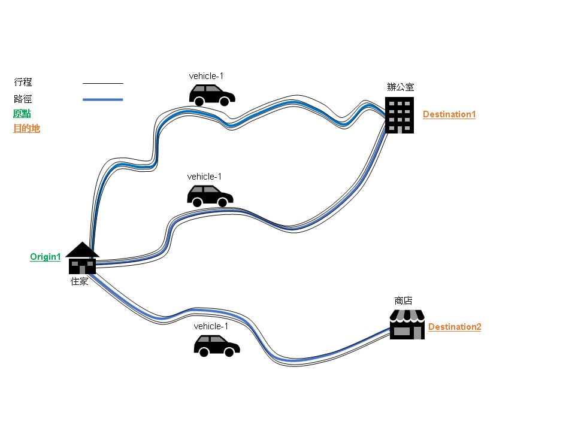

---

copyright:
  years: 2016

---

{:new_window: target="_blank"}
{:shortdesc: .shortdesc}
{:codeblock: .codeblock}
{:screen: .screen}
{:pre: .pre}

# 關於 Trajectory Pattern Analysis
{: #tp_iotdriverinsights_overview}
前次更新：2016 年 6 月 16 日
{: .last-updated}

Trajectory Pattern Analysis API 是 {{site.data.keyword.iotdriverinsights_full}} 所提供的服務，可用來從汽車探測資料中分析駕駛行程的「原點/目的地 (O/D)」型樣和路徑型樣。

{:shortdesc}

## 路徑行程型樣分析
{: #tpa}

您可以從多個駕駛行程中識別和分析 O/D 型樣及路徑型樣。下圖顯示包含下列項目的簡單範例：取自多個行程之車輛 (vehicle-1) 的 O/D 型樣和路徑型樣。在此範例中，Trajectory Pattern Analysis 可識別兩個 O/D 型樣：
- 從住家 (Origin1) 到辦公室 (Destination1) 且具有兩個路徑型樣的 O/D 型樣
- 從住家 (Origin1) 到商店 (Destination2) 且具有一個路徑型樣的 O/D 型樣。

Trajectory Pattern Analysis 也會計算下表所列之每部車輛的一些駕駛多樣性度量。您可以使用這些度量來判斷駕駛人的駕駛性質。

|度量名稱|說明|
|:---|:---|
|罕見 O/D 比例|O/D 型樣未涵蓋之行程數目與輸入行程總數的比例。|
|罕見里程比例|路徑型樣未涵蓋之里程與輸入行程里程總數的比例。|
|罕見行程比例|路徑型樣未涵蓋之行程數目與輸入行程總數的比例。|

## REST API
{: #rest_api}

Trajectory Pattern Analysis REST API 會提供可用來自訂和建置 {{site.data.keyword.Bluemix_notm}} 應用程式的要求：

 1. 汽車資料指令：
   - `sendCarProbeData` 可傳送要分析的汽車探測資料
   - `getCarProbeDataListAsDate` 可傳回依日期排列的汽車探測資料清單
   - `deleteCarProbeDataListByDate` 可刪除汽車探測資料
 2. 分析工作指令：
   - `sendJobRequest` 可傳送行程型樣分析工作要求
   - `getJobInfo` 可傳回所指定工作的資訊
   - `getJobInfoList` 可傳回工作資訊的清單
 3. 分析結果指令：
   - `getResultSummary` 可傳回行程型樣分析的已分析摘要資訊
   - `getAnalyzedODDetail` 可傳回所指定之已分析 O/D 型樣的詳細資訊
   - `getRouteGPSList` 可傳回所指定之已分析路徑型樣的 GPS 資訊清單
   - `getODList` 可傳回所指定引數的 O/D 型樣資訊清單
   - `deleteJobResult` 可刪除與某個工作相關的所有已分析結果

如需相關資訊，請參閱 [{{site.data.keyword.iotdriverinsights_short}} API](http://ibm.biz/IoTDriverBehavior_APIdoc){:new_window} 文件。
