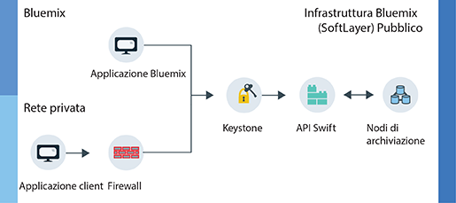

---

copyright:
  years: 2014, 2016
lastupdated: "2016-11-14"

---
{:new_window: target="_blank"}
{:shortdesc: .shortdesc}

# Informazioni su {{site.data.keyword.objectstorageshort}}  {: #about-object-storage}

{{site.data.keyword.objectstorageshort}} utilizza i metadati per identificare gli oggetti posizionati nell'archivio in modo da essere facilmente ricercabili e velocemente accessibili anche per grandi quantità di dati.
{: shortdesc}

## Come {{site.data.keyword.Bluemix_notm}} Pubblico {{site.data.keyword.objectstorageshort}} funziona {: #public}

{{site.data.keyword.objectstorageshort}} Pubblico dispone di due rotte separate che un utente può seguire durante il provisioning di un account. Puoi iniziare dall'interno della tua propria rete privata o puoi accedere {{site.data.keyword.objectstorageshort}} tramite un'applicazione {{site.data.keyword.Bluemix_notm}}. Sia gli amministratori che gli sviluppatori possono archiviare e accedere agli oggetti come mostrato nel seguente diagramma.

<dl>
  <dt><dfn> {{site.data.keyword.Bluemix_notm}} applicazione </dfn></dt>
    <dd> Puoi eseguire il bind del servizio {{site.data.keyword.objectstorageshort}} a un'applicazione {{site.data.keyword.Bluemix_notm}}.  </dd>
  <dt><dfn> Applicazione client  </dfn></dt>
    <dd> Puoi accedere a {{site.data.keyword.objectstorageshort}} direttamente dalla tua applicazione tramite un firewall su una rete privata. </dd>
  <dt><dfn> Keystone </dfn></dt>
    <dd> Utilizza le credenziali fornite dal servizio {{site.data.keyword.objectstorageshort}} per ottenere un token di autorizzazione da Keystone. </dd>
  <dt><dfn> API OpenStack Swift </dfn></dt>
    <dd> Dopo aver autenticato la tua istanza, puoi leggere e scrivere nei tuoi oggetti archiviati utilizzando l'API Swift. </dd>
  <dt><dfn> Nodi di archiviazione </dfn></dt>
    <dd> Il servizio gestisce tre copie dei tuoi dati che <a href="http://docs.openstack.org/developer/swift/overview_replication.html">replica in più nodi di archiviazione</a>. </dd>
</dl>

Figura 1. Come {{site.data.keyword.Bluemix_notm}} Pubblico {{site.data.keyword.objectstorageshort}} funziona 

**Attenzione**: la crittografia lato provider non è fornita. È responsabilità dell'applicazione client crittografare i dati prima del loro caricamento. La crittografia a livello del disco non è al momento disponibile per {{site.data.keyword.Bluemix_notm}} Pubblico {{site.data.keyword.objectstorageshort}}.
