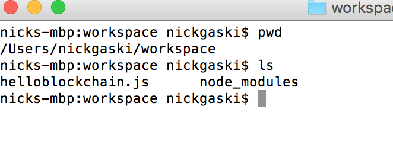
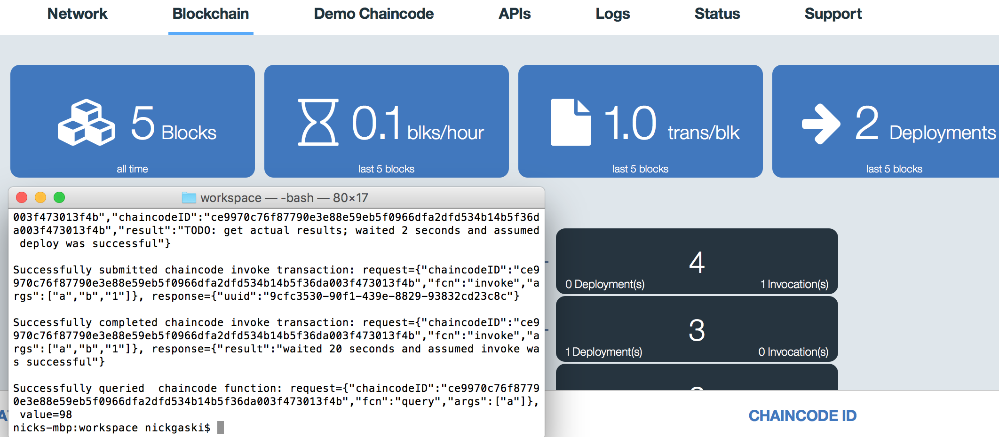

---
 
copyright:
years: 2016
 
---
 
{:new_window: target="_blank"}
{:shortdesc: .shortdesc}
{:codeblock: .codeblock}
{:screen: .screen}
{:pre: .pre}
 
 
# Hyperledger Fabric Client SDK for Node.js
{: #etn_sdk}
Last updated: 13 September 2016
{: .last-updated}

The Hyperledger Fabric Client (HFC) SDK allows application developers to build Node.js applications that can interact with an existing blockchain.  Node.js applications that leverage the HFC SDK can be used to perform the following tasks:
{:shortdesc}

* Securely register and enroll users. A web application administrator with `registrar` authority can dynamically register and enroll other users who have already authenticated to the web application. 
* Issue transactions to the blockchain - deploy, invoke, and query.  These transactions are anonymous and unlinkable. 
* Store sensitive private keys and certificates in any location of your choice, such as a database.  This requires implementing a simple key-value store interface. 
 
The HFC SDK provides APIs through which an application can interact with a Hyperledger blockchain, and those APIs are designed to support two pluggable components.

1. Pluggable key value store that is used to retrieve and store keys associated with a member. For example, call the `chain.setKeyValStore()` method to override the default file-based key value store implementation.  This key value store is used to warehouse sensitive private keys, therefore care must be taken to properly protect access.
2. Pluggable member service that is used to register and enroll members. For example, call the `chain.setMemberServices()` method to override the default implementation in `MemberServices`.  Member services enables Hyperledger fabric to be a permissioned blockchain, providing security features such as anonymity, unlinkability of transactions, and confidentiality.


You can include the HFC SDK in your Node.js app in one of the following ways:
*  offline: You need to copy the files from the Hyperledger fabric source tree: https://github.com/hyperledger/fabric/tree/master/sdk/node/lib into the `/lib` directory of the Node.js app.  Subsequently include it in your application with the following code snippet:

```js
var hfc = require("./lib/hfc");
```

* npm:  From a command line, install the SDK from npm with the first snippet.  Include it in your node program with the second code snippet:

```
npm install hfc -g
```

```js
var hfc = require('hfc');
```


## HFC Objects
{: #objects}

The following list is a high-level description of the HFC objects (classes and interfaces) to help guide you through the object hierarchy:

* The main top-level class is `Chain`. It is the client's representation of a chain. HFC allows you to interact with multiple chains and to share a single `KeyValStore` and `MemberServices` object with multiple `Chain` objects as needed. For each chain, you add one or more `Peer` objects which represents the endpoint(s) to which HFC connects in order to transact on the chain.
* The `KeyValStore` is a simple interface which HFC uses to store and retrieve all persistent data. This data includes private keys, so it is very important to keep this storage secure. The default implementation is a simple file-based version found in the `FileKeyValStore` class.
* The `MemberServices` interface is implemented by the `MemberServicesImpl` class and provides security and identity-related features such as privacy, unlinkability, and confidentiality. This implementation issues *ECerts* (enrollment certificates) and *TCerts* (transaction certificates). ECerts are for enrollment identity and TCerts are for transactions.
* The `Member` class most often represents an end user who transacts on the chain, but it may also represent other types of members such as peers. From the `Member` class, you can *register* and *enroll* members or users. This class interacts with the `MemberServices` object. You can also deploy, query, and invoke chaincode directly, which interacts with the `Peer`. The implementation for deploy, query and invoke simply creates a temporary `TransactionContext` object and delegates the work to it.
* The `TransactionContext` class implements the bulk of the deploy, invoke, and query logic. It interacts with `MemberServices` to get a TCert to perform these operations. Note that there is a one-to-one relationship between TCert and `TransactionContext`; in other words, a single `TransactionContext` will always use the same TCert. If you want to issue multiple transactions with the same TCert, then you can get a `TransactionContext` object from a Member object directly and issue multiple deploy, invoke, or query operations on it. Note, however, that if you choose to use a single TCert for multiple transactions, then these transactions are linkable, which means someone could tell that they came from the same, although anonymized, user. For this reason, you will typically just call deploy, invoke, and query on the `User` or `Member` object.


## Node.js sample program
{: #nodesample}

The following sample demonstrates a basic application leveraging the SDK APIs in order to interact with a Bluemix blockchain network.  The program is designed to function with both networks (starter and HSBN), as well as any client-side operating system.   

The objective is to use a javascript application--[helloblockchain.js](https://github.com/IBM-Blockchain/SDK-Demo/blob/master/helloblockchain.js)--to successfully deploy a piece of chaincode--[chaincode_example02](https://github.com/IBM-Blockchain/SDK-Demo/blob/master/chaincode_example02.go)--to your bluemix network, followed by an invocation and query.  

1. This program requires both Node.js and npm.  Installing the latest version of [Node.js](https://nodejs.org/en/) will automatically include npm.  

1. Open a terminal and create a directory (workspace) folder where you will place the helloblockchain.js source code and node modules. For example:

    ```	
    mkdir -p $HOME/workspace
    ```

1. Go to your newly created workspace folder and install hfc v0.5.0 with the following command:

     ```
     cd $HOME/workspace
     npm install hfc@0.5.0
     ```

1. Copy the [helloblockchain.js](https://github.com/IBM-Blockchain/SDK-Demo/blob/master/helloblockchain.js) program and save it to your workspace folder.  
   Your `/workspace` directory should look similar to the screenshot below:

   
   
1. If you have not yet done so, access the [Blockchain](https://console.ng.bluemix.net/catalog/services/blockchain/) tile in Bluemix and create an instance of the service.  Once in the service select either a **Starter Developer plan** or **High Security Business Network plan** ( if authorized).  Click the **CREATE** button and get the **Service Credentials** for the service.   Cut and paste this JSON file and save it as ServiceCredentials.json in your local workspace directory.  Please ensure that you copy the entire JSON payload. It should be 202 lines in a standard editor. 

     
     
1. Your `/workspace` directory should now look similar to the screenshot below:

     
     
1. Now make a `/tmp` directory and ensure that the program can access by placing the directory at the top level of your **C:** drive.  Open the source code for helloblockchain.js and search for: setKeyValStore.  The helloblockchain.js program sets this to /tmp/KeyValStore.  The HFC SDK will create the `/keyValStore` directory and store cryptography data for each user that registers.  You need only create the `/tmp` directory.  On Windows this will default to **C:\tmp\keyValStore**
	- **Note**: The contents in the `/keyValStore` directory should be deleted whenever connecting to a different fabric (i.e. a new network).  This folder contains the private keys and sensitive information for the enrolled users.  

1. Create a chaincode folder under your $GOPATH.  If you have not yet set a $GOPATH on your machine, follow the instructions [here](https://github.com/golang/go/wiki/GOPGATH).
	
	```
	cd $GOPATH/src/github.com/
	```
	
	```
	mkdir chaincode_example02
	```
	- Copy [chaincode_example02.go](https://github.com/IBM-Blockchain/SDK-Demo/blob/master/chaincode_example02.go) to this newly created folder.

1. Retrieve [vendor.zip](https://github.com/IBM-Blockchain/SDK-Demo/blob/master/vendor.zip) and similarly place it in the `/chaincode_example02` folder and **unzip**.  The vendor.zip contains libraries and dependencies from the Hyperledger fabric codebase.
	- Delete `vendor.zip`
	- Take care to not insert a dummy `\vendor` directory when you unzip. The automated prompt will generate a hierarchy similar to - **C:\GOPATH\src\github.com\chaincode_example02\vendor**.  Delete the final `\vendor` from this path before you extract the contents from `vendor.zip`.  The correct path should look similar to - **C:\GOPATH\src\github.com\chaincode_example02\vendor\github.com\hyperledger\fabric**.  If you mistakenly leave a second `\vendor` directory, the chaincode deployment will fail.  
	
1. You should now have a directory within your $GOPATH that looks similar to the following:

    
    
1. Now from your workspace folder, run the node program:

	```
	node helloblockchain.js -c $GOPATH/src/github.com/chaincode_example02
	```
	**To enable debug logs:**
	```
	DEBUG=hfc node helloblockchain.js -c $GOPATH/src/github.com/chaincode_example02
	```

	**To enable grpc traces:**
	```
	GRPC_TRACE=all DEBUG=hfc node helloblockchain.js -c $GOPATH/src/github.com/chaincode_example02
	```
	
Once `Deploy`, `Invoke`, and `Query` are successful, you should see the following messages in your terminal:

```
Successfully deployed chaincode: request={"fcn":"init","args":["a","100","b","200"],"certificatePath":"/certs/blockchain-cert.pem","chaincodePath":"github.com/chaincode_example02/"}, response={"uuid":"2d6ad8d6-1390-4c60-a01b-f4c301175eb7","chaincodeID":"9be0a0ed3f1788e8728c8911c747d2f6d0e205fa63422dc598d498fe709b9b8d","result":"TODO: get actual results; waited 120 seconds and assumed deploy was successful"}

Successfully submitted chaincode invoke transaction: request={"chaincodeID":"9be0a0ed3f1788e8728c8911c747d2f6d0e205fa63422dc598d498fe709b9b8d","fcn":"invoke","args":["a","b","1"]}, response={"uuid":"f9a902d2-44d8-4b68-b43d-419470ba73ae"}

Successfully completed chaincode invoke transaction: request={"chaincodeID":"9be0a0ed3f1788e8728c8911c747d2f6d0e205fa63422dc598d498fe709b9b8d","fcn":"invoke","args":["a","b","1"]}, response={"result":"waited 20 seconds and assumed invoke was successful"}

Successfully queried  chaincode function: request={"chaincodeID":"9be0a0ed3f1788e8728c8911c747d2f6d0e205fa63422dc598d498fe709b9b8d","fcn":"query","args":["a"]}, value=99
```

Try navigating to the **Blockchain** tab from your **Network Console**.  This view will allow you to visualize blocks being appended to the chain as your helloblockchain.js program issues deployments and invocations.  The screenshot below depicts a network in which the helloblockchain.js program has been run twice, with the default arguments for "a" and "b":

   


## Troubleshooting
Make sure you have `hfc@0.5.0` by running either of the following commands from your workspace directory:
  * npm list | grep hfc
  * npm list -g | grep hfc  (If installed using the global `-g` flag)

If you get a query failure error as seen below:

  ```
Failed to query chaincode, function: request={"chaincodeID":"9be0a0ed3f1788e8728c8911c747d2f6d0e205fa63422dc598d498fe709b9b8d","fcn":"query","args":["a"]}, error={"error":{"status":"FAILURE","msg":{"type":"Buffer","data":[69,114,114,111,114,58,70,97,105,108,101,100,32,116,111,32,108,97,117,110,99,104,32,99,104,97,105,110,99,111,100,101,32,115,112,101,99,40,112,114,101,109,97,116,117,114,101,32,101,120,101,99,117,116,105,111,110,32,45,32,99,104,97,105,110,99,111,100,101,32,40,57,98,101,48,97,48,101,100,51,102,49,55,56,56,101,56,55,50,56,99,56,57,49,49,99,55,52,55,100,50,102,54,100,48,101,50,48,53,102,97,54,51,52,50,50,100,99,53,57,56,100,52,57,56,102,101,55,48,57,98,57,98,56,100,41,32,105,115,32,98,101,105,110,103,32,108,97,117,110,99,104,101,100,41]}},"msg":"Error:Failed to launch chaincode spec(premature execution - chaincode (9be0a0ed3f1788e8728c8911c747d2f6d0e205fa63422dc598d498fe709b9b8d) is being launched)"}
  ```
  
Increase the deploy wait time in the node program.  The default is set to 60 seconds; however it may take more time for the code to properly deploy, compile and start running in the docker container.  Try increasing the time to 120 seconds.  For example:

  ```js
chain.setDeployWaitTime(120);
  ```
  
Once your chaincode is successfully deployed on the network, you can reduce this time to a nominal amount - a few seconds is fine.

If you receive a handshake error, try a different `grpc` version.
  * You can access your grpc version details by issuing either of the following commands:
    - `npm list | grep grpc`
    - `npm list -g | grep grpc`


## Public and Private Keys
{: #keys}

The Hyperledger fabric makes use of Certificate Authorities, and the underlying concepts of public and private keys, as mechanisms to address security requirements for businesses operating on a shared blockchain.  These include: identity management, role management, and transactional privacy; and these can be fully controlled through the client SDK.

User and transactional privacy concerns are managed through the implementation of a PKI (Public Key Infrastructure) framework.  The PKI consists of various certificate authorities, and manages the generation, distribution and revocation of keys and digital certificates.  The basic tenets of the Hyperledger fabric's PKI are explained below.  For the complete technical specifications on PKI and Membership Services, see the security section in the Hyperledger fabric [protocol specification](https://github.com/hyperledger/fabric/blob/master/docs/protocol-spec.md).  

1. A user is registered through a Registration Authority (RA), which validates the identity of a user requesting to participate in the blockchain.  This can be done dynamically by a user with `registrar` authority, or manually by editing the membersrvc.yaml file.  Upon registration, the RA provides a set of enrollment credentials - `<enrollID>` and `<enrollPWD>`.  The registration process occurs out-of-band and is executed through the `RegisterUser` function.
2. The user then sends an enrollment request to the Enrollment Certificate Authority through the `CreateCertificatePair` function.  This payload contains the user's one-time `<enrollPWD>`, previously returned by the RA, along with the user's Public Signature Verification Key and Public Encryption Key.  Additionally, this payload is signed with the user's Private Signature Verification Key.  Upon receipt of the initial enrollment request, the ECA issues an encrypted challenge to the user that can only be decrypted with the user's Private Encryption Key.  After decrypting the challenge, the user resends the certificate request.  The ECA, contingent upon an accurately decrypted response, returns an authenticated certificate pair signed with its digital signature.  The digital signature is produced by cryptographically hashing the certificate request (message) using the SHA-2 algorithm to produce a "digest." This "message digest" is then encrypted with the ECA's private signature key.  Thereafter, network members can verify/authenticate the validity of this digital signature by decrypting it with the ECA's public signature key.  The returned certificate pair contains a certificate for data signing (private) and a certificate for data encryption (public); they are referred to as ECerts.  They are static and long-term and can be either visible or invisible to transactions. 
3. In order to transact on the network, the user also needs transaction certificates (TCerts).  The user submits a certificate request with his `<enrollID>` to the Transaction Certificate Authority for a batch of TCerts.  The TCA communicates with the ECA and validates that the supplied `<enrollID>` has been issued a valid ECert.  In this sense, you can think of a TCert as the child of an ECert.  After validation, the user is supplied with a batch of tCerts and a KeyDF_Key (Key Derivation Function Key).  The KDF_Key allows for the user to derive his private keys.  While the single KeyDF_Key is used for each TCert in the batch, the ensuing private key that is generated is unique to each TCert.  A client must have a supply of TCerts in order to transact, and furthermore, must be able to sign the transaction payload with the decrypted private key.  Only then is a transaction forwarded to validators for consensus.  A TCert is short-term and specific to each transaction.  A client is also able to control features of the TCerts, such as batch size and attributes, through an API.  


