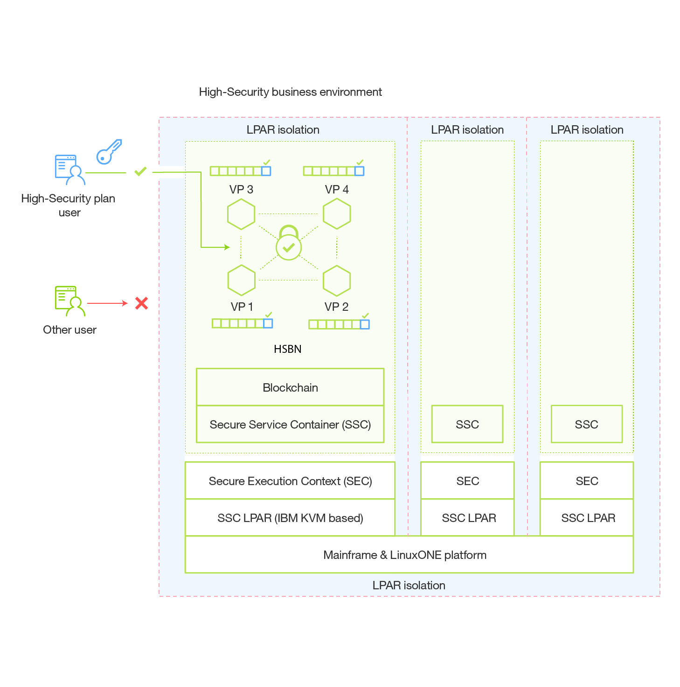

---

copyright:
years: 2016

---

{:new_window: target="_blank"}
{:shortdesc: .shortdesc}
{:codeblock: .codeblock}
{:screen: .screen}
{:pre: .pre}


# Understanding the IBM Secure Service Container
{: #etn_ssc}

*Last updated: 19 July 2016*
{: .last-updated}

The High Security Business Network is deployed as an appliance into an IBM Secure Service Container, which provides the base infrastructure for hosting blockchain services. The appliance combines operating systems, Docker, middleware, and software components that work autonomously, and provides core services and infrastructure with optimized security.
{:shortdesc}

The following architecture diagram illustrates how the IBM Secure Service Container and blockchain appliances are organized:



*Figure 1. Overview of IBM Secure Service Container and blockchain appliances*

IBM Secure Service Container provides a secure environment for you to use the High Security Business Network. It brings the advanced cryptography, security, and reliability of the z Systems LinuxONE platform to blockchain services for handling sensitive and regulated data. Blockchain is protected through a series of features from the IBM Secure Service Container: encapsulated operating system, encrypted appliance disks, tamper protection, protected memory, and strong LPAR isolation that can be configured to match EAL5+ certification.

## Key security features
The IBM Secure Service Container provides the following optimized security functions for blockchain services:  

### Protection from system administrators
>Appliance code cannot be accessed even by platform or system administrators.  Data access is controlled by the appliance, therefore unauthorized access is disabled.  This is supported through a combination of signing and encrypting all data in flight and in rest. All the access to memory is also removed. Firmware supports this with a secure boot architecture.

>System administrators have the following limitations when blockchain is secured by the IBM Secure Service Container:
>* Cannot access the blockchain node
>* Cannot view the blockchain

### Tamper protection  
>The IBM Secure Service Container disables all external interfaces that provide LPAR memory access. An image boot loader is signed to ensure that it cannot be tampered or exchanged with a different one.

### Encrypted appliance disks
>All code and data stored on disk is encrypted at all times by using the Linux encryption layer:  
- Encapsulated operating system
- Protected IP
- Embedded monitoring and self-healing

## Managing appliances via REST APIs
Software appliances are preconfigured for you to use on the reliable, secure, and scalable z Systems platform. You can manage these appliances via REST APIs without any configuration.

To manage blockchain assets via REST APIs, you can use the Swagger UI on Blockchain dashboard on Bluemix or REST commands tools, such as `curl` or `Postman`.

For example, to get information on all the peers in the network, issue the following command by using `curl`:
```
curl -u <username>:<password> https://<peer_ip>:<port>/network/peers
```
See the following sample curl command and returned results:
* Command:
```
curl -u dashboarduser_type0_2ef27***:89317***https://ad3130e8-4a1a-4ce6-a084-689a345a3308_vp1-api.blockchain.ibm.com:443/network/peers
```
* Returned information on all the peers in the network:
```
{
	"peers": [{
		"ID": {
			"name": "ad3130e8-4a1a-4ce6-a084-689a345a3308_vp2"
		},
		"address": "ad3130e8-4a1a-4ce6-a084-689a345a3308_vp2-discovery.blockchain.ibm.com:30303",
		"type": 1,
		"pkiID": "rC0uvv0cbSbiT8RUGKPQM3q/o09oyWlcBmRxogi2Cls="
	},
	{
		"ID": {
			"name": "ad3130e8-4a1a-4ce6-a084-689a345a3308_vp1"
		},
		"address": "ad3130e8-4a1a-4ce6-a084-689a345a3308_vp1-discovery.blockchain.ibm.com:30303",
		"type": 1,
		"pkiID": "oeoI+Xa/lW8Xvrvv71A+Nvzit+JDa+oIkthpZHwfaTE="
	}]
}
```
To learn more about how to interact with blockchain via REST APIs, see [Network Console](https://new-console.ng.bluemix.net/docs/services/blockchain/ibmblockchainmonitor.html) and [Samples and tutorials](https://new-console.ng.bluemix.net/docs/services/blockchain/ibmblockchain_tutorials.html).
