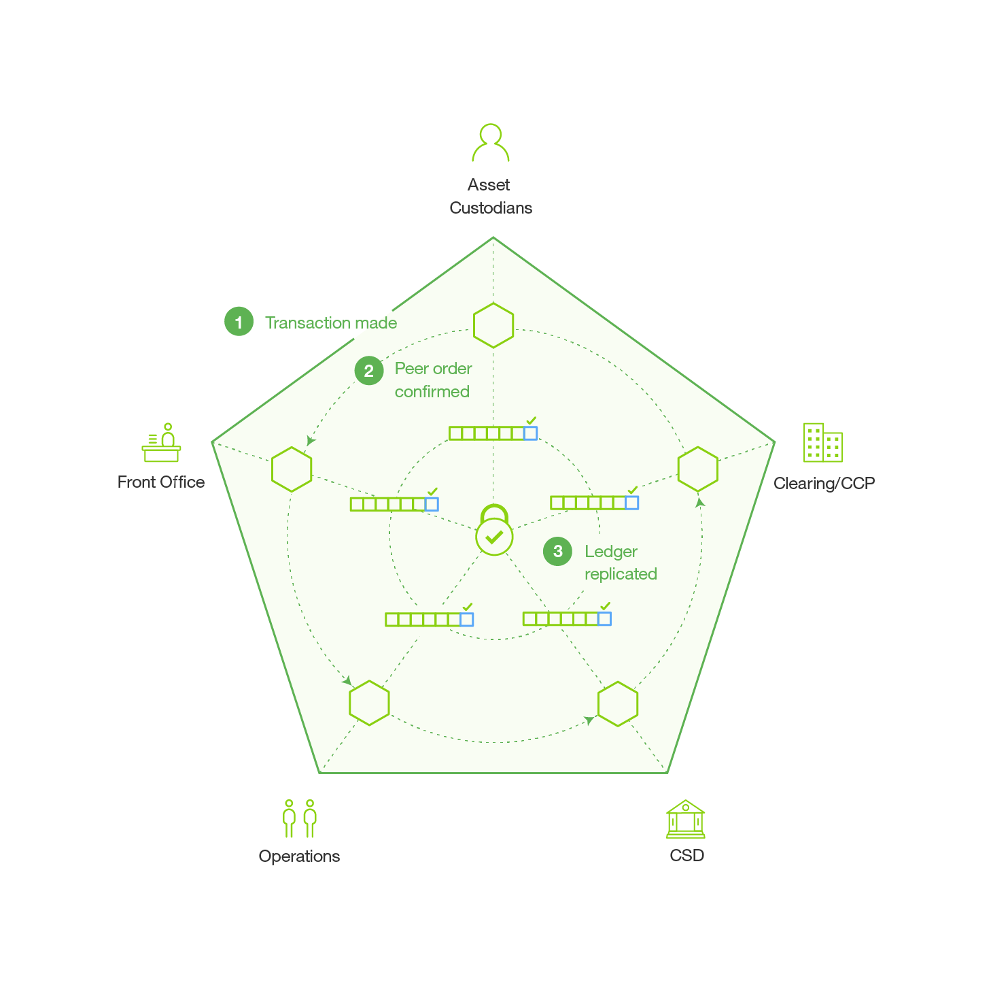
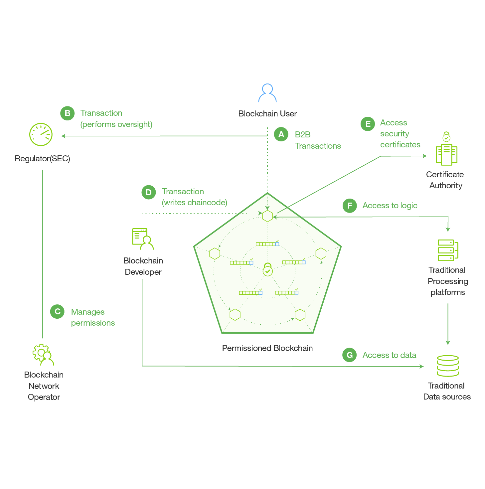

---

copyright:
  years: 2016

---

{:new_window: target="_blank"}
{:shortdesc: .shortdesc}
{:codeblock: .codeblock}
{:screen: .screen}
{:pre: .pre}

# About blockchain
{: #ibmblockchain_overview}
*Last updated: 14 July 2016*
{: .last-updated}

You can use blockchain to digitally represent assets, which can then be traded quickly and securely over permissioned networks.
{:shortdesc}

## What is blockchain?
{: #what}

Blockchain is a technology for a new generation of transactional applications that establishes trust, accountability and transparency, while streamlining business processes. It is a design pattern made famous by bitcoin, but its practical uses extend far beyond cryptocurrency exchanges. With blockchain, we can reimagine the most fundamental business exchanges, and open the door to a new world of digital interactions.

Blockchain has the potential to vastly reduce the cost and complexity of cross-enterprise business processes. Its distributed ledger makes it easier to create cost-efficient business networks, where virtually anything of value can be tracked and traded, without requiring a central point of control. The application of this emerging technology is showing great promise across a broad range of business applications. For example, blockchain networks allow securities trades to be settled in minutes, instead of days. Blockchain can also help companies streamline the flow of goods and payments, and enable manufacturers to reduce product recalls by easily sharing production logs with OEMs and regulators.

## Key terms
{: #keyterms}
The following terms are instrumental in gaining a holistic understanding of blockchain concepts:

**Transactor**: A network participant connected to the blockchain through a node, that issues transactions from the client side by leveraging an SDK or API.

**Transaction**: A request by a transactor to the blockchain to execute a function on the ledger.  Chaincode implements the functions set forth in the fabric's API contract.  

**Ledger**: A sequence of cryptographically-linked blocks, containing transactions and the current world state.  In addition to data from previous transactions, the ledger (blockchain) also contains the data for currently-running chaincode applications.

**World state**: A key-value database that chaincodes may use to store state when executed by a transaction.

**Chaincode**: A piece of code containing embedded logic that is stored on the ledger as part of a transaction. Chaincode runs transactions that can modify the world state. A developer would generate a chaincode application and then deploy it to the network.  A user could then `invoke` or call this piece of chaincode through a client-side application that interfaces with a peer.

**Validating peer**: A network node that is responsible for running consensus, validating transactions and maintaining the ledger. When transactions are validated, they are appended to the ledger, in blocks. When a transaction fails validation, it  is purged from the block (not written to the ledger). A validating peer (VP) has the ability to deploy, invoke and query chaincode.

**Non-validating peer**: A network node that functions as a proxy, connecting transactors to validating peers. A non-validating peer (NVP) forwards invocation requests to its connected validating peer (VP). It also hosts the event stream server and the REST service. **Note:** The terms peer and node are often used interchangably when discussing blockchain technology.

**Consensus**: Consensus is a method of ordering network requests, or transactions (deploy and invoke), on a distributed network. The correct ordering of transactions is critical, because many transactions have a dependency on one or more prior transactions. On a blockchain network, there is no single authority that determines this order; instead, each blockchain node (or peer) contributes equally by implementing the agreed-upon consensus protocol. Consensus ensures that a quorum of nodes agree on the order in which transactions are appended to the shared ledger. By resolving any discrepancies in the transaction order, consensus guarantees that all network nodes are operating on an identical blockchain.  See the [consensus](etn_pbft.html) topic for more information and test cases.  

**Permissioned ledger**: A blockchain network where each node is required to be a member of the network, and each node has access to only the transactions that its permissions allow.

## Key concepts
{: #keyconcepts}

Blockchain consists of a network, over which members track and exchange assets, and a record of all exchanges (ledger), which is replicated to all participating members.  Applications deployed to a blockchain consist of a self-executing contract and a client-side application that intefaces with the network through an SDK or API.   Two or more parties, being part of a common blockchain network, would agree on the terms of the logic within the contract (e.g. when I get asset "a", I pay you amount "b").  Once deployed to the blockchain, functions in the contract can be invoked (i.e. a transaction can be triggered), with the ensuing result (world state) sent on for validation by the network participants.  After validation, transactions are recorded on the shared ledger by all participants. Once recorded on the ledger, transactions can never be altered or deleted.

**Network**: A blockchain network is characterized as follows:

- A decentralized peer-to-peer architecture, with nodes that represent network participants, such as banks and securities firms.
- A group of peers that validate and commit transactions in order to reach consensus.

**Shared ledger**: The shared ledger can be thought of as the single source of truth for transactions on a blockchain network. And companies might have multiple shared ledgers: one for each of the business networks in which they participate. The shared ledger can be used for recording and totaling financial transactions. A shared ledger has the following attributes:
- It records all transactions across the business network.
- It is shared amongst all participants.
- It is replicated, so that each participant has their own copy.
- It is permissioned, so that participants can see only certain transactions.

Figure 1 depicts a shared ledger and its participants:

*Figure 1. Overview of an equities market network and shared ledger*

Figure 1 shows the typical network participants in an equities market - Asset custodian (bank), front office, operations, securities depository and a clearing party:
1. The custodian invokes multiple pieces of chaincode to buy and sell blocks of securities.  
2. Transactions can be triggered from any network node, but are ultimately submitted to the primary node on the network, which orders the transaction batch.  The primary node then rebroadcasts the ordered transactions to its network peers, all of whom possess a shared copy of the ledger, for agreement on the proposed order (consensus). 
3. Once the order of the transactions is agreed upon (consensus), the transactions are executed and appended to the ledger.

## Network and application architecture
{: #architecture}

Figure 2 depicts an example blockchain network built upon a decentralized peer-to-peer architecture, with a Certificate Authority managing user roles and permissions for the network.

*Figure 2. Overview of a blockchain network, with data flow and network access governed by member roles*

Note that these steps are not meant to serve as a sequential representation, but rather as an explanation of the network architecture and application flow:

* A. - A blockchain user issues a transaction to the network.  The transaction can be a deploy, invoke or query, and is issued through a client side application leveraging an SDK or directly through a REST API.  
* B. - Certain business networks may require a regulator or auditor.  In the case of a equities market network, an SEC regulator would perform financial oversight.  
* C. - A network operator manages member permissions on the network.  For instance, the operator might enroll the regulator (B) as an "auditor" and the blockchain user (A) as a "client."  The auditor would be restricted to querying the blockchain, whereas the client might be able to deploy, invoke and query certain types of chaincode.
* D. - A blockchain developer writes chaincode (smart contracts) and client-side applications to drive the smart contracts. It's possible for the blockchain developer to directly deploy chaincode to the network, perhaps through a REST interface.  However, it's more likely that a blockchain user (A) would deploy chaincode through an application layer.  The blockchain developer will likely need to code data/credentials from a business' existing System of Record (SOR) into the chaincode.  In order to do so he accesses the business' traditional data storage (G) out-of-band from the blockchain network.
* E. - A blockchain user connects to the network through a peer node (A).  The node fetches and stores the user's enrollment and transaction certificates from the Certificate Authority.  A user is required to possess these digital certificates in order to participate and transact on a permissioned network.
* F. - A user attempting to drive chaincode may need to verify his credentials with a business' existing SOR.  For instance, it may be the case that only a manager is able to query chaincode on the blockchain network.  In order to confirm the user's identity as a manager, the chaincode needs to go out-of-band and access the business' SOR.  It would likely access the data source through an existing processing platform (e.g. Websphere portal, IMS, etc.).

Figure 3 represents the architecture of the core components in the blockchain fabric. Membership Services, Blockchain Services and Chaincode Services are logical structures, not a physical partitioning of components into separate processes, address spaces or virtual machines.

*Figure 3. Hyperledger fabric reference architecture*

**Membership Services**: Membership Services manage identity on the network. In a non-permissioned blockchain, participation does not require authorization, and all nodes can equally submit transactions and attempt to accumulate them into acceptable blocks; that is, there is no distinction of roles. Membership services combine elements of Public Key Infrastructure (PKI) and decentralization (consensus) to transform a non-permissioned blockchain into a permissioned blockchain.

A permissioned blockchain requires entities to register for long-term identity credentials (enrollment certificates), and can be distinguished according to entity type. For users, credentials enable the Transaction Certificate Authority (TCA) to issue pseudonymous credentials; these transaction certificates are then used to authorize submitted transactions. Transaction certificates persist on the blockchain, and enable authorized auditors to cluster otherwise unlinkable transactions.  Membership services functions are conducted through the Certificate Authority peer on your blockchain network.  

**Blockchain Services**: Blockchain Services manage the distributed ledger through a peer-to-peer protocol, built on HTTP/2. The data structures are highly optimized to provide the most efficient hash algorithm for maintaining the world state replication.  PBFT is implemented as the consensus protocol on each network.    

**Chaincode Services**: Chaincode Services provide a secured and lightweight method to sandbox chaincode execution on the validating nodes. The environment is a “locked down” and secured container, along with a set of signed base images containing secure OS and chaincode language, runtime and SDK layers for Go, Java and Node.js. Additional languages can be enabled, if required.

Refer to the [protocol specification](https://github.com/hyperledger/fabric/blob/master/docs/protocol-spec.md#fabric) for the Hyperledger Project to learn more about blockchain and its various components.
