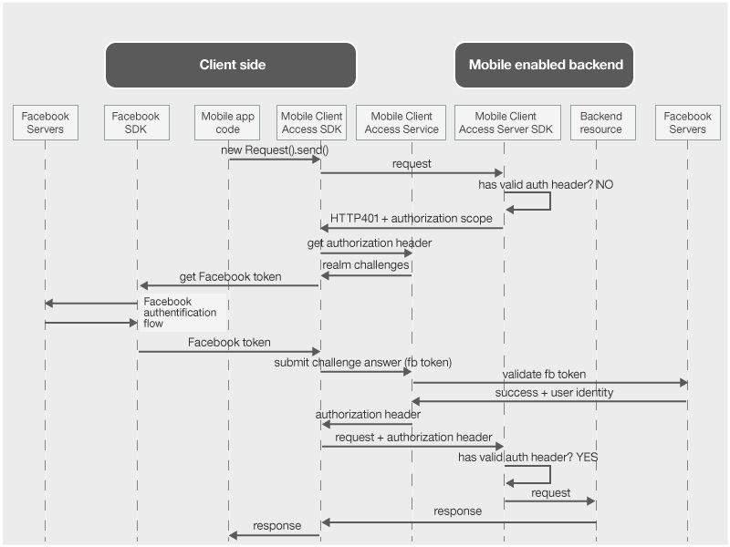

---

copyright:
  years: 2015, 2016

---
{:new_window: target="_blank"}
{:shortdesc: .shortdesc}
{:screen: .screen}
{:codeblock: .codeblock}

# Authenticating users with Facebook credentials
{: #facebook-auth-overview}

*Last updated: 15 June 2016*
{: .last-updated}

You can configure the {{site.data.keyword.amashort}} service to protect resources by using Facebook as an identity provider. Your mobile or web application users can use their Facebook credentials for authentication.
{:shortdesc}

**Important**: You do not need to separately install the SDK provided by Facebook. The Facebook SDK is installed automatically by dependency managers when you configure the {{site.data.keyword.amashort}} client SDK.

## {{site.data.keyword.amashort}} request flow
{: #mca-facebook-sequence}

See the following simplified diagram to understand how {{site.data.keyword.amashort}} integrates with Facebook for authentication.

1. Use the {{site.data.keyword.amashort}} client SDK to make a request to your back-end resources that are protected with the {{site.data.keyword.amashort}} server SDK.
* The {{site.data.keyword.amashort}} server SDK detects an unauthorized request and returns HTTP 401 code and authorization scope.
* The {{site.data.keyword.amashort}} client SDK automatically detects the HTTP 401 code and starts the authentication process.
* The {{site.data.keyword.amashort}} client SDK  contacts the {{site.data.keyword.amashort}} service and requests an authorization header.
* The {{site.data.keyword.amashort}} service asks the client to authenticate with Facebook first by supplying an authentication challenge.
* The {{site.data.keyword.amashort}} client SDK uses the Facebook SDK to start the authentication process. After successful authentication, the Facebook SDK returns a Facebook access token.
* The Facebook access token is considered an authentication challenge answer. The token is sent to the {{site.data.keyword.amashort}} service.
* The service validates the authentication challenge answer with Facebook servers.
* If validation is successful, the {{site.data.keyword.amashort}} service generates an authorization header and returns it to the {{site.data.keyword.amashort}} client SDK. Authorization header contains two tokens: an access token that contains access permissions information, and ID token that contains information about current user, device, and application.
* From this point on, all requests that are made through the {{site.data.keyword.amashort}} client SDK  have a newly obtained authorization header.
* The {{site.data.keyword.amashort}} client SDK  automatically resends the original request that triggered the authorization flow.
* The {{site.data.keyword.amashort}} server SDK extracts authorization header from request, validates it with {{site.data.keyword.amashort}} service, and grants access to a back-end resource.

## Obtaining a Facebook Application ID from the Facebook Developer Portal
{: #facebook-appID}

To start using Facebook as identity provider, you must create an application in the Facebook Developer Portal. During this process, you get a Facebook Application ID, which is a unique identifier to let Facebook know which application is attempting to connect.

1. Open [Facebook Developer Portal](https://developers.facebook.com).

1. Click **My Apps** in the top menu and select **Create a new app**.
Select either iOS or Android application, and click **Skip and Create App ID** on the next screen.

1. Set application display name of your choice and pick a category. Click **Create App ID** to continue.

1. Copy the **App ID** that is displayed. This value is your Facebook Application ID.  You need this value to configure Facebook authentication with your mobile or web app.

## Next steps
{: #next-steps}

* [Enabling Facebook authentication for Android apps](facebook-auth-android.html)
* [Enabling Facebook authentication for iOS apps (Swift SDK)](facebook-auth-ios-swift-sdk.html)
* [Enabling Facebook authentication for iOS apps (Objective-C SDK - Deprecated)](facebook-auth-ios.html)
* [Enabling Facebook authentication for Cordova apps](facebook-auth-cordova.html)
