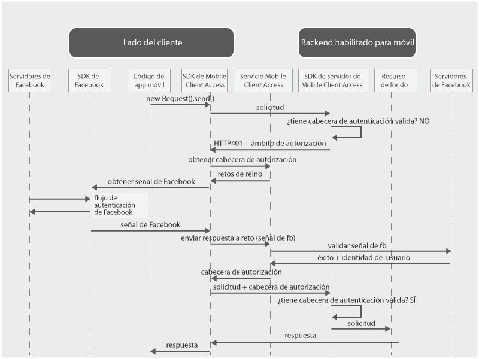

---

copyright:
  years: 2015, 2016

---
{:new_window: target="_blank"}
{:shortdesc: .shortdesc}
{:screen: .screen}
{:codeblock: .codeblock}

# Autenticación de usuarios con las credenciales de Facebook
{: #facebook-auth-overview}

Última actualización: 22 de julio de 2016
{: .last-updated}

Puede configurar el servicio de {{site.data.keyword.amashort}} para proteger los recursos utilizando Facebook como proveedor de identidad. Los usuarios de la aplicación móvil o web podrán autenticarse con las credenciales de Facebook.
{:shortdesc}

**Importante**: no es necesario instalar por separado el SDK del cliente proporcionado por Facebook. El SDK de Facebook se instala automáticamente por los gestores de dependencias cuando configura el SDK del cliente de Facebook de {{site.data.keyword.amashort}}.

## Flujo de solicitudes de {{site.data.keyword.amashort}}
{: #mca-facebook-sequence}

### Flujo de solicitudes de cliente móvil

Consulte el siguiente diagrama en el que se explica cómo {{site.data.keyword.amashort}} se integra con Facebook para la autenticación, desde una aplicación de cliente móvil. 

* Utilice el SDK del cliente de {{site.data.keyword.amashort}} para realizar una solicitud a los recursos de fondo protegidos por el SDK del servidor de {{site.data.keyword.amashort}}.
* El SDK del servidor de {{site.data.keyword.amashort}} detecta una solicitud no autorizada y devuelve el código HTTP 401 y un ámbito de autorización.
* El SDK del cliente de {{site.data.keyword.amashort}} detecta automáticamente el código error HTTP 401 e inicia el proceso de autenticación.
* El SDK del cliente de {{site.data.keyword.amashort}} contacta con el servicio de {{site.data.keyword.amashort}} y solicita una cabecera de autorización.
* El servicio de {{site.data.keyword.amashort}} solicita al cliente que realice la autenticación con Facebook primero proporcionando el cambio de autenticación.
* El SDK del cliente de {{site.data.keyword.amashort}} utiliza el SDK de Facebook para iniciar el proceso de autenticación. Después de una autenticación correcta, el SDK de Facebook devuelve una señal de acceso de Facebook.
* La señal de acceso de Facebook se considera la respuesta al cambio de autenticación. La señal se envía al servicio de {{site.data.keyword.amashort}}.
* El servicio valida la respuesta con los servidores de Facebook.
* Si la validación es correcta, el servicio de {{site.data.keyword.amashort}} genera una cabecera de autorización y la devuelve al SDK del cliente de {{site.data.keyword.amashort}}. La cabecera de autorización contiene dos señales: una señal de acceso con información sobre permisos de acceso y una señal de ID que incluye información sobre la aplicación, el dispositivo y el usuario actuales.
* A partir de este momento, todas las solicitudes que se realicen con el SDK del cliente de {{site.data.keyword.amashort}} tendrán una cabecera de autorización nueva.
* El SDK del cliente de {{site.data.keyword.amashort}} vuelve a enviar automáticamente la solicitud original que activó el flujo de autorización.
* El SDK del servidor de {{site.data.keyword.amashort}} extrae la cabecera de autorización de la solicitud, la valida con el servicio de {{site.data.keyword.amashort}} y otorga acceso a un recurso de fondo.

### Flujo de solicitud de aplicación web de {{site.data.keyword.amashort}}
{: #mca-facebook-web-sequence}

El flujo de solicitud de aplicación web de {{site.data.keyword.amashort}} es similar al flujo del cliente móvil. Sin embargo, {{site.data.keyword.amashort}} protege la aplicación web, en lugar de un recurso de fondo de {{site.data.keyword.Bluemix_notm}}.

  * La solicitud inicial la envía la aplicación web (desde un formulario de inicio de sesión, por ejemplo).
  * El redireccionamiento final es en el área protegida de la propia aplicación web, en lugar de en el recurso protegido de fondo.  

## Cómo obtener un ID de aplicación de Facebook desde el portal de desarrolladores de Facebook
{: #facebook-appID}

Para empezar a utilizar Facebook como proveedor de identidad, debe crear una aplicación en el portal de desarrolladores de Facebook. Durante este proceso, obtendrá un ID de aplicación de Facebook, que es un identificador exclusivo con el que Facebook sabrá que aplicación está intentando conectar.

1. Abra el [portal de desarrolladores de Facebook](https://developers.facebook.com).

1. Pulse **My Apps** en el menú y seleccione **Create a new app**.
Seleccione una aplicación de iOS o Android, y pulse **Skip and Create App ID** en la siguiente pantalla.

1. Defina el nombre de visualización y escoja una categoría. Pulse **Create App ID** para continuar.

1. Copie el **ID de app** que se muestra. Este valor es su ID de aplicación de Facebook.  Necesita este valor para configurar la autenticación de Facebook con la app móvil o web.

## Próximos pasos
{: #next-steps}

* [Habilitación de la autenticación de Facebook para apps de Android](facebook-auth-android.html)
* [Habilitación de la autenticación de Facebook para apps de iOS (SDK de Swift)](facebook-auth-ios-swift-sdk.html)
* [Habilitación de la autenticación de Facebook para apps de iOS (SDK de Objective-C en desuso)](facebook-auth-ios.html)
* [Habilitación de la autenticación de Facebook para apps de Cordova](facebook-auth-cordova.html)
