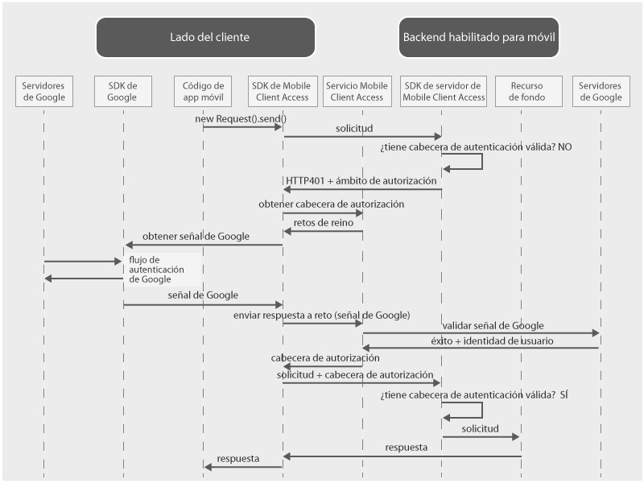

---

copyright:
  years: 2015, 2016

---
{:screen:  .screen}
{:shortdesc: .shortdesc}
{:codeblock: .codeblock}

# Autenticación de usuarios con las credenciales de Google
{: #google-auth}

Última actualización: 22 de julio de 2016

Puede configurar el servicio de {{site.data.keyword.amashort}} para proteger los recursos utilizando Google como proveedor de identidad. Los usuarios de la aplicación móvil o de aplicación web podrán autenticarse con las credenciales de Google.
{:shortdesc}

**Importante:** no es necesario instalar por separado el SDK del cliente proporcionado por Google. El SDK de Google se instala automáticamente por los gestores de dependencias cuando configura el SDK del cliente {{site.data.keyword.amashort}}.

## Flujo de solicitudes de {{site.data.keyword.amashort}}
{: #google-auth-overview}

### Flujo de solicitudes de cliente

En el siguiente diagrama se explica cómo {{site.data.keyword.amashort}} se integra con Google para la autenticación. 

* Utilice el SDK de {{site.data.keyword.amashort}} para realizar una solicitud a los recursos de fondo que están protegidos por el SDK del servidor de {{site.data.keyword.amashort}}.
* El SDK del servidor de {{site.data.keyword.amashort}} detecta la solicitud no autorizada y devuelve un código HTTP 401 y un ámbito de autorización.
* El SDK del cliente de {{site.data.keyword.amashort}} detecta automáticamente el código error HTTP 401 e inicia el proceso de autenticación.
* El SDK del cliente de {{site.data.keyword.amashort}} contacta con el servicio de {{site.data.keyword.amashort}} y solicita una cabecera de autorización.
* El servicio de {{site.data.keyword.amashort}} solicita al cliente que realice la autenticación con Google primero proporcionando el cambio de autenticación.
* El SDK del cliente de {{site.data.keyword.amashort}} utiliza el SDK de Google para iniciar el proceso de autenticación. Después de una autenticación correcta, el SDK de Google devuelve una señal de acceso de Google.
* La señal de acceso de Google se considera la respuesta al cambio de autenticación. La señal se envía al servicio de {{site.data.keyword.amashort}}.
* El servicio valida la respuesta con los servidores de Google.
* Si la validación es correcta, el servicio de {{site.data.keyword.amashort}} genera una cabecera de autorización y la devuelve al SDK del cliente de {{site.data.keyword.amashort}}. La cabecera de autorización contiene dos señales: una señal de acceso con información sobre permisos de acceso y una señal de ID que incluye información sobre la aplicación, el dispositivo y el usuario actuales.
* A partir de este momento, todas las solicitudes que se realicen con el SDK del cliente de {{site.data.keyword.amashort}} tendrán una cabecera de autorización nueva.
* El SDK del cliente de {{site.data.keyword.amashort}} vuelve a enviar automáticamente la solicitud original que activó el flujo de autorización.
* El SDK del servidor de {{site.data.keyword.amashort}} extrae la cabecera de autorización de la solicitud, la valida con el servicio de {{site.data.keyword.amashort}} y otorga acceso a un recurso de fondo.

### Flujo de solicitud de aplicación web de {{site.data.keyword.amashort}}
{: #mca-google-web-sequence}
El flujo de solicitud de aplicación web de {{site.data.keyword.amashort}} es similar al flujo del cliente móvil. Sin embargo, {{site.data.keyword.amashort}} protege la aplicación web, en lugar de un recurso de fondo de {{site.data.keyword.Bluemix_notm}}.

  * La solicitud inicial la envía la aplicación web (desde un formulario de inicio de sesión, por ejemplo).
  * El redireccionamiento final es en el área protegida de la propia aplicación web, en lugar de en el recurso protegido de fondo.  

## Próximos pasos
{: #google-auth-nextsteps}

* [Habilitación de la autenticación de Google para apps de Android](google-auth-android.html)
* [Habilitación de la autenticación de Google para aplicaciones iOS (SDK de Swift)](google-auth-ios-swift-sdk.html)
* [Habilitación de la autenticación de Google para aplicaciones iOS (SDK de Objective-C)](google-auth-ios.html)
* [Habilitación de la autenticación de Google para apps de Cordova](google-auth-cordova.html)

