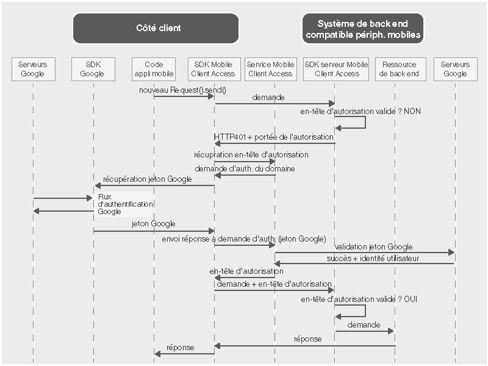

---

copyright:
  years: 2015, 2016

---
{:screen:  .screen}
{:shortdesc: .shortdesc}
{:codeblock: .codeblock}

# Authentification des utilisateurs avec des données d'identification Google
{: #google-auth}

Dernière mise à jour : 22 juillet 2016

Vous pouvez configurer la protection des ressources dans le service {{site.data.keyword.amashort}}, en utilisant Google en tant que fournisseur d'identité. Les utilisateurs de votre application mobile ou Web peuvent alors s'authentifier avec leurs données d'identification Google.
{:shortdesc}

**Important :** il n'est pas nécessaire d'installer séparément le SDK client fourni par Google. Le SDK Google est installé automatiquement par les gestionnaires de dépendances lors de la configuration du SDK client de {{site.data.keyword.amashort}}.

## Flux des demandes {{site.data.keyword.amashort}}
{: #google-auth-overview}

### Flux de demande client

Le diagramme suivant représente l'intégration entre {{site.data.keyword.amashort}} et Google pour l'authentification.

* Utilisez le SDK de {{site.data.keyword.amashort}} pour envoyer une demande à vos ressources de back end qui sont protégées par le SDK serveur de {{site.data.keyword.amashort}}.
* Le SDK serveur de {{site.data.keyword.amashort}} détecte une demande non autorisée et renvoie une erreur HTTP 401 et la portée d'autorisation.
* Le SDK client de {{site.data.keyword.amashort}} détecte automatiquement l'erreur HTTP 401 et lance le processus d'authentification.
* Le SDK client {{site.data.keyword.amashort}} contacte le service {{site.data.keyword.amashort}} et réclame un en-tête d'autorisation.
* Le service {{site.data.keyword.amashort}} demande au client de s'authentifier auprès de Google en fournissant une demande d'authentification.
* Le SDK client de {{site.data.keyword.amashort}} utilise le SDK Google pour lancer le processus d'authentification. Lorsque l'authentification aboutit, le SDK Google renvoie un jeton d'accès Google.
* Le jeton d'accès Google est considéré comme une réponse à la demande d'authentification. Il est envoyé au service {{site.data.keyword.amashort}}.
* Le service valide la réponse à la demande d'authentification auprès des serveurs Google.
* Si la validation aboutit, le service {{site.data.keyword.amashort}} génère un en-tête d'autorisation et le renvoie au SDK client de {{site.data.keyword.amashort}}. L'en-tête d'autorisation contient deux jetons : un jeton qui contient des informations sur les droits d'accès, et un autre jeton qui contient des informations sur l'utilisateur, le périphérique et l'application.
* A partir de ce moment, toutes les demandes faites avec le SDK client de {{site.data.keyword.amashort}} contiennent un nouvel en-tête d'autorisation.
* Le SDK client de {{site.data.keyword.amashort}} renvoie automatiquement la demande d'origine qui avait déclenché le flux d'autorisation.
* Le SDK serveur de {{site.data.keyword.amashort}} extrait l'en-tête d'autorisation de la demande, la valide auprès du service {{site.data.keyword.amashort}}, et donne l'accès à la ressource de back end.

### Flux de requête d'une application Web {{site.data.keyword.amashort}}
{: #mca-google-web-sequence}
Le flux de requête d'une application Web {{site.data.keyword.amashort}} est similaire à celui d'un client d'une application mobile. Toutefois,
{{site.data.keyword.amashort}} protège l'application et non pas une ressource de back end {{site.data.keyword.Bluemix_notm}}.

  * La requête initiale est envoyée par l'application Web (depuis un formulaire de connexion, par exemple).
  * La redirection finale vise la zone protégée de l'application Web elle-même et non pas une ressource de back end protégée. 

## Etapes suivantes
{: #google-auth-nextsteps}

* [Activation de l'authentification Google pour les applications Android](google-auth-android.html)
* [Activation de l'authentification Google pour les applications iOS (SDK Swift)](google-auth-ios-swift-sdk.html)
* [Activation de l'authentification Google pour les applications iOS (SDK Objective-C)](google-auth-ios.html)
* [Activation de l'authentification Google pour les applications Cordova](google-auth-cordova.html)

