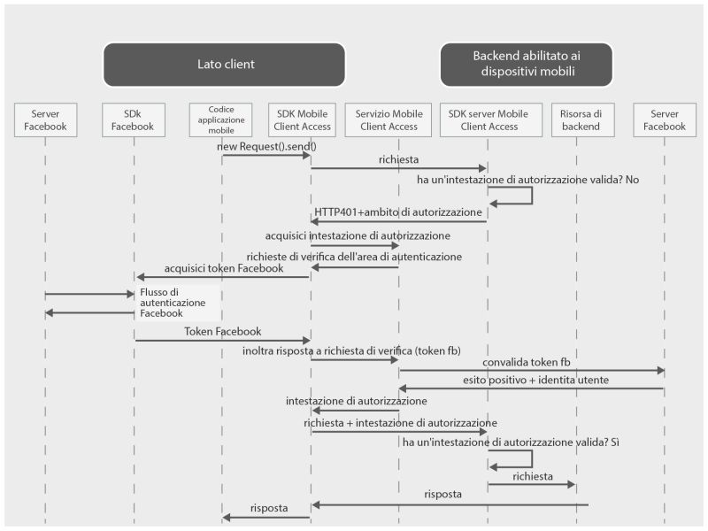

---

copyright:
  years: 2015, 2016

---
{:new_window: target="_blank"}
{:shortdesc: .shortdesc}
{:screen: .screen}
{:codeblock: .codeblock}

# Autenticazione degli utenti con le credenziali Facebook
{: #facebook-auth-overview}

Ultimo aggiornamento: 22 luglio 2016
{: .last-updated}

Puoi configurare il servizio {{site.data.keyword.amashort}} per proteggere le risorse utilizzando Facebook come provider di identità. I tuoi utenti dell'applicazione mobile o web possono utilizzare le loro credenziali Facebook per l'autenticazione.
{:shortdesc}

**Importante**: non devi necessariamente installare separatamente l'SDK client fornito da Facebook. L'SDK Facebook viene installato automaticamente dai gestori dipendenze quando configuri l'SDK client Facebook {{site.data.keyword.amashort}}. 

## Flusso della richiesta {{site.data.keyword.amashort}}
{: #mca-facebook-sequence}

### Flusso della richiesta client mobile 

Consulta il seguente diagramma per comprendere in che modo {{site.data.keyword.amashort}} si integra con Facebook per l'autenticazione, da un'applicazione client mobile. 

* Usa l'SDK client {{site.data.keyword.amashort}} per effettuare una richiesta alle tue risorse di back-end protette con l'SDK server {{site.data.keyword.amashort}}.
* L'SDK server {{site.data.keyword.amashort}} rileva una richiesta non autorizzata e restituisce il codice HTTP 401 e l'ambito di autorizzazione.
* L'SDK client {{site.data.keyword.amashort}} rileva automaticamente il codice HTTP 401 e avvia il processo di autenticazione.
* L'SDK client {{site.data.keyword.amashort}} contatta il servizio {{site.data.keyword.amashort}} e richiede un'intestazione di autorizzazione.
* Il servizio {{site.data.keyword.amashort}} chiede al client di eseguire prima l'autenticazione con Facebook fornendo una richiesta di verifica dell'autenticazione.
* L'SDK client {{site.data.keyword.amashort}} utilizza l'SDK Facebook per avviare il processo di autenticazione. Dopo un'autenticazione con esito positivo, l'SDK Facebook restituisce un token di accesso Facebook.
* Il token di accesso Facebook è considerato una risposta alla richiesta di verifica dell'autenticazione. Il token viene inviato al servizio {{site.data.keyword.amashort}}.
* Il servizio convalida la risposta alla richiesta di verifica dell'autenticazione presso i server Facebook.
* Se la convalida ha esito positivo, il servizio {{site.data.keyword.amashort}} genera un'intestazione di autorizzazione e la restituisce all'SDK client {{site.data.keyword.amashort}}. L'intestazione di autorizzazione contiene due token: un token di accesso che contiene le informazioni sulle autorizzazioni di accesso e il token ID che contiene le informazioni su utente, dispositivo e applicazione correnti.
* Da questo punto in avanti, tutte le richieste effettuate mediante l'SDK client {{site.data.keyword.amashort}} hanno un'intestazione di autorizzazione di nuova acquisizione.
* L'SDK client {{site.data.keyword.amashort}} reinvia automaticamente la richiesta originale che ha attivato il flusso di autorizzazione.
* L'SDK server {{site.data.keyword.amashort}} estrae l'intestazione di autorizzazione dalla richiesta, la convalida presso il servizio {{site.data.keyword.amashort}} e concede l'accesso a una risorsa di back-end.

### Flusso della richiesta dell'applicazione web {{site.data.keyword.amashort}}
{: #mca-facebook-web-sequence}

Il flusso della richiesta dell'applicazione web {{site.data.keyword.amashort}} è simile al flusso del client mobile. Tuttavia, {{site.data.keyword.amashort}} protegge l'applicazione web, invece della risorsa di back-end {{site.data.keyword.Bluemix_notm}}.

  * La richiesta iniziale viene inviata dall'applicazione web (da un modulo di accesso, ad esempio). 
  * Il reindirizzamento finale è all'area protetta dell'applicazione stessa, invece che alla risorsa protetta di backend.  

## Ottenimento di un ID applicazione Facebook dal portale sviluppatori Facebook
{: #facebook-appID}

Per iniziare a utilizzare Facebook come provider di identità, devi creare un'applicazione nel portale sviluppatori Facebook. Durante questo processo, ottieni un ID applicazione Facebook, che è un identificativo univoco per consentire a Facebook di riconoscere l'applicazione che sta provando a connettersi.

1. Apri il [portale sviluppatori Facebook](https://developers.facebook.com).

1. Fai clic su **My Apps** nel menu e seleziona **Create a new app**.
Seleziona l'applicazione iOS o Android e fai clic su **Skip and Create App ID** nella successiva schermata.

1. Imposta il nome di visualizzazione dell'applicazione di tua scelta e seleziona una categoria. Fai clic su **Create App ID** per continuare.

1. Copia l'ID applicazione (**App ID**) visualizzato. Questo valore è il tuo ID applicazione Facebook.  Questo valore ti serve per configurare l'autenticazione Facebook con la tua applicazione mobile o web.

## Fasi successive
{: #next-steps}

* [Abilitazione dell'autenticazione Facebook per le applicazioni Android](facebook-auth-android.html)
* [Abilitazione dell'autenticazione Facebook per le applicazioni iOS (SDK Swift)](facebook-auth-ios-swift-sdk.html)
* [Abilitazione dell'autenticazione Facebook per le applicazioni iOS (SDK Objective-C - Obsoleto)](facebook-auth-ios.html)
* [Abilitazione dell'autenticazione Facebook per le applicazioni Cordova](facebook-auth-cordova.html)
