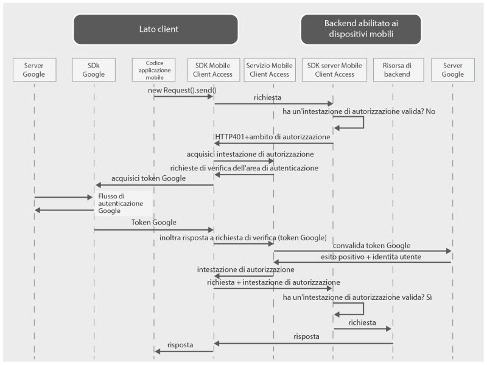

---

copyright:
  years: 2015, 2016
lastupdated: "2016-11-03"

---
{:screen:  .screen}
{:shortdesc: .shortdesc}
{:codeblock: .codeblock}

# Autenticazione degli utenti con le credenziali Google
{: #google-auth}

Puoi configurare il servizio {{site.data.keyword.amafull}} per proteggere le risorse utilizzando Google come provider di identità. I tuoi utenti dell'applicazione mobile o Web possono quindi utilizzare le loro credenziali Google per l'autenticazione.
{:shortdesc}

**Importante:** non devi necessariamente installare separatamente l'SDK client fornito da Google. L'SDK Google viene installato automaticamente dai gestori dipendenze quando configuri l'SDK client {{site.data.keyword.amashort}}.

## Flusso della richiesta {{site.data.keyword.amashort}}
{: #google-auth-overview}

### Flusso della richiesta client

Consulta il seguente diagramma per comprendere in che modo {{site.data.keyword.amashort}} si integra con Google per l'autenticazione.

* Usa l'SDK {{site.data.keyword.amashort}} per effettuare una richiesta alle tue risorse di back-end protette con l'SDK server {{site.data.keyword.amashort}}.
* L'SDK server {{site.data.keyword.amashort}} rileva la richiesta non autorizzata e restituisce un codice HTTP 401 e l'ambito di autorizzazione.
* L'SDK client {{site.data.keyword.amashort}} rileva automaticamente il codice HTTP 401 e avvia il processo di autenticazione.
* L'SDK client {{site.data.keyword.amashort}} contatta il servizio {{site.data.keyword.amashort}} e richiede un'intestazione di autorizzazione.
* Il servizio {{site.data.keyword.amashort}} chiede al client di eseguire prima l'autenticazione con Google fornendo una richiesta di verifica dell'autenticazione.
* L'SDK client {{site.data.keyword.amashort}} utilizza l'SDK Google per avviare il processo di autenticazione. Dopo un'autenticazione con esito positivo, l'SDK Google restituisce un token di accesso Google.
* Il token di accesso Google è considerato una risposta alla richiesta di verifica dell'autenticazione. Il token viene inviato al servizio {{site.data.keyword.amashort}}.
* Il servizio convalida la risposta alla richiesta di verifica dell'autenticazione presso i server Google.
* Se la convalida ha esito positivo, il servizio {{site.data.keyword.amashort}} genera un'intestazione di autorizzazione e la restituisce all'SDK client {{site.data.keyword.amashort}}. L'intestazione di autorizzazione contiene due token: un token di accesso che contiene le informazioni sulle autorizzazioni di accesso e il token ID che contiene le informazioni su utente, dispositivo e applicazione correnti.
* Da questo punto in avanti, tutte le richieste effettuate mediante l'SDK client {{site.data.keyword.amashort}} hanno un'intestazione di autorizzazione di nuova acquisizione.
* L'SDK client {{site.data.keyword.amashort}} reinvia automaticamente la richiesta originale che ha attivato il flusso di autorizzazione.
* L'SDK server {{site.data.keyword.amashort}} estrae l'intestazione di autorizzazione dalla richiesta, la convalida presso il servizio {{site.data.keyword.amashort}} e concede l'accesso a una risorsa di back-end.

### Flusso della richiesta dell'applicazione web {{site.data.keyword.amashort}}
{: #mca-google-web-sequence}
Il flusso della richiesta dell'applicazione web {{site.data.keyword.amashort}} è simile al flusso del client mobile. Tuttavia, {{site.data.keyword.amashort}} protegge l'applicazione web, invece della risorsa di back-end {{site.data.keyword.Bluemix_notm}}.

  * La richiesta iniziale viene inviata dall'applicazione web (da un modulo di accesso, ad esempio).
  * Il reindirizzamento finale è all'area protetta dell'applicazione stessa, invece che alla risorsa protetta di backend.

## Fasi successive
{: #google-auth-nextsteps}

* [Abilitazione dell'autenticazione Google per le applicazioni Android](google-auth-android.html)
* [Abilitazione dell'autenticazione Google per le applicazioni iOS (SDK Swift)](google-auth-ios-swift-sdk.html)
* [Abilitazione dell'autenticazione Google per le applicazioni iOS (SDK Objective-C)](google-auth-ios.html)
* [Abilitazione dell'autenticazione Google per le applicazioni Cordova](google-auth-cordova.html)
