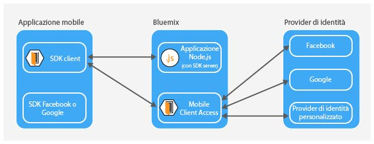
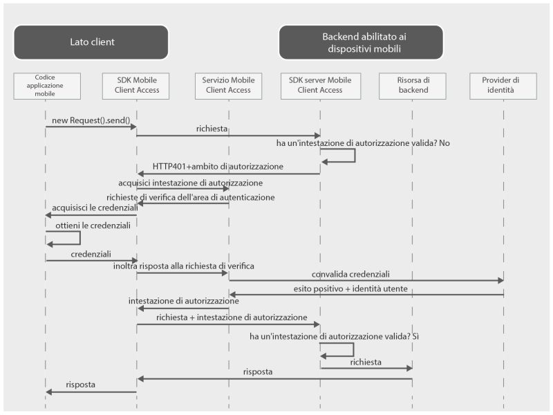

---

copyright:
  years: 2015, 2016
lastupdated: "2016-10-02"
---

# Informazioni su {{site.data.keyword.amashort}}
{: #mca-overview}

Il servizio {{site.data.keyword.amafull}} fornisce servizi di autenticazione e monitoraggio per le applicazioni web e mobili che accedono a risorse cloud ospitate su {{site.data.keyword.Bluemix_notm}}.

Puoi utilizzare il servizio {{site.data.keyword.amashort}} per proteggere le applicazioni Node.js e Liberty for Java&trade; ospitate su {{site.data.keyword.Bluemix_notm}} con diversi tipi di autenticazione. Strumentando le tue applicazioni mobili con l'SDK {{site.data.keyword.amashort}}, puoi utilizzare le
funzionalità di autenticazione fornite dal servizio {{site.data.keyword.amashort}}. I log lato client vengono raccolti automaticamente e inviati al servizio {{site.data.keyword.amashort}} su richiesta. Utilizza il dashboard {{site.data.keyword.amashort}} per configurare i diversi tipi di autenticazione e visualizzare i dati raccolti e inviati dall'SDK lato client

**Nota**: il servizio {{site.data.keyword.amashort}} era precedentemente noto come Advanced Mobile Access.

## Componenti
{: #components}

* Dashboard **{{site.data.keyword.amashort}}**: configura diversi tipi di autenticazione ed esegui il monitoraggio delle prestazioni delle applicazioni mobili, delle analisi, delle statistiche di utilizzo e dei log dispositivo.
* SDK client **{{site.data.keyword.amashort}}**: strumenta le applicazioni mobili per utilizzare la funzionalità {{site.data.keyword.amashort}}. Le piattaforme supportate sono: iOS 8+, Android 4+ e Cordova.
* SDK server **{{site.data.keyword.amashort}}**: proteggi le risorse ospitate su {{site.data.keyword.Bluemix_notm}}. I runtime attualmente supportati sono Node.js e Liberty for Java&trade;.

## Tipi di autenticazione
{: #authtypes}
Nella tua applicazione mobile puoi usare i seguenti tipi di autenticazione:
* **Facebook**: usa Facebook come un provider di identità. I tuoi utenti accedono all'applicazione mobile con le loro credenziali Facebook.
* **Google**: usa Google come un provider di identità. I tuoi utenti accedono all'applicazione mobile con le loro credenziali Google+.
* **Personalizzata**: crea un tuo provider di identità. Controlli pienamente quali tipi di informazioni vengono raccolti e convalidati.

## Panoramica sull'architettura
{: #architecture}

* Proteggi le tue risorse cloud (applicazioni Node.js) con l'SDK server {{site.data.keyword.amashort}}.
* Utilizza la classe `Request` fornita dall'SDK client {{site.data.keyword.amashort}}  per comunicare con le tue risorse cloud protette.
* L'SDK server {{site.data.keyword.amashort}} rileva una richiesta non autorizzata e restituisce la richiesta di verifica dell'autorizzazione HTTP 401.
* L'SDK client {{site.data.keyword.amashort}} rileva la richiesta di verifica dell'autorizzazione HTTP 401 e avvia automaticamente il processo di autenticazione con il servizio {{site.data.keyword.amashort}}.
* Viene tentata l'autenticazione Facebook, Google o Personalizzata.
* Dopo un'autenticazione con esito positivo, {{site.data.keyword.amashort}} restituisce un token di autorizzazione.
* L'SDK client {{site.data.keyword.amashort}} aggiunge automaticamente il token di autorizzazione alla richiesta originale e reinvia la richiesta alla risorsa cloud.
* L'SDK server {{site.data.keyword.amashort}} estrae il token di accesso dalla richiesta e lo convalida presso il servizio {{site.data.keyword.amashort}}.
* L'accesso viene concesso.  La risposta viene restituita all'applicazione mobile.

## Flusso della richiesta
{: #flow}
Il seguente diagramma descrive in che modo una richiesta fluisce dall'SDK client ai tuoi provider di identità e all'applicazione di back-end mobile.

* Usa SDK {{site.data.keyword.amashort}} per effettuare una richiesta alle tue risorse di back-end protette con l'SDK server {{site.data.keyword.amashort}}.
* L'SDK server {{site.data.keyword.amashort}} rileva una richiesta non autorizzata e restituisce HTTP 401 insieme all'ambito di autorizzazione.
* L'SDK client {{site.data.keyword.amashort}} rileva automaticamente l'HTTP 401 e avvia il processo di autenticazione.
* l'SDK client {{site.data.keyword.amashort}} contatta il servizio {{site.data.keyword.amashort}} e chiede di emettere un'intestazione di autorizzazione.
* Il servizio {{site.data.keyword.amashort}} chiede all'applicazione client di eseguire prima l'autenticazione fornendo una richiesta di verifica dell'autenticazione in base al tipo di autenticazione attualmente configurato.
* In base al tipo di autenticazione, l'SDK client {{site.data.keyword.amashort}}:
   * Autenticazione Facebook o Google: elabora automaticamente la richiesta di verifica dell'autenticazione
   * Autenticazione Personalizzata: ottiene le credenziali in base alla logica fornita dallo sviluppatore.
* Se è configurata l'autenticazione Facebook o Google, l'SDK client {{site.data.keyword.amashort}} utilizza l'SDK associato per ottenere i token di accesso Facebook o Google. Questi token fungono da risposta alla richiesta di verifica dell'autenticazione.
* Se è configurata l'autenticazione Personalizzata, lo sviluppatore deve ottenere la risposta alla richiesta di verifica dell'autenticazione e fornirla all'SDK client {{site.data.keyword.amashort}}.
* Dopo essere stata ottenuta, la risposta alla richiesta di verifica dell'autenticazione viene inviata al servizio {{site.data.keyword.amashort}}.
* Il servizio convalida la risposta alla richiesta di verifica dell'autenticazione con un provider di identità pertinente (Facebook/Google/Personalizzata).
* Se la convalida ha esito positivo, il servizio {{site.data.keyword.amashort}} genera un'intestazione di autorizzazione e restituisce l'intestazione all'SDK client {{site.data.keyword.amashort}}. L'intestazione di autorizzazione contiene due token: un token di accesso che contiene le informazioni sulle autorizzazioni di accesso e un token ID che contiene le informazioni su utente, dispositivo o applicazione correnti.
* Da questo punto in avanti, tutte le richieste effettuate con l'SDK client {{site.data.keyword.amashort}} hanno un'intestazione di autorizzazione di nuova acquisizione.
* L'SDK client {{site.data.keyword.amashort}} reinvia automaticamente la richiesta originale che ha attivato il flusso di autorizzazione.
* L'SDK server {{site.data.keyword.amashort}} estrae l'intestazione di autorizzazione dalla richiesta, convalida l'intestazione con il servizio {{site.data.keyword.amashort}} e concede l'accesso a una risorsa di back-end.

## Come ottenere aiuto e supporto per {{site.data.keyword.amashort}}
{: #gettinghelp}

Se hai dei problemi o delle domande quando utilizzi {{site.data.keyword.amashort}}, puoi ottenere aiuto ricercando le informazioni o facendo delle domande in un forum. Inoltre puoi aprire un ticket di supporto. 

Quando utilizzi i forum per fare una domanda, contrassegnala con una tag in modo che sia visualizzabile dai team di sviluppo {{site.data.keyword.Bluemix_notm}}.

* Se hai domande tecniche sullo sviluppo o la distribuzione di un'applicazione con {{site.data.keyword.amashort}}, inserisci la tua domanda in [Stack Overflow](http://stackoverflow.com/search?q={{site.data.keyword.amashort}}+ibm-bluemix){:new_window} e contrassegna la tua domanda con le tag "ibm-bluemix" e "{{site.data.keyword.amashort}}".
* Per domande sul servizio e sulle istruzioni per l'utilizzo iniziale, utilizza il forum [IBM developerWorks dW Answers](https://developer.ibm.com/answers/search.html?f=&type=question&redirect=search%2Fsearch&sort=relevance&q=mobile+client+access%20%2B[bluemix]){:new_window}. 

Consulta [Come ottenere supporto](https://www.{DomainName}/docs/support/index.html#getting-help) per ulteriori dettagli sull'utilizzo dei forum.

Per informazioni su come aprire un ticket di supporto IBM o sui livelli di supporto e sulla gravità dei ticket, consulta [Come contattare il supporto](https://www.{DomainName}/docs/support/index.html#contacting-support).

