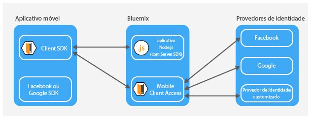
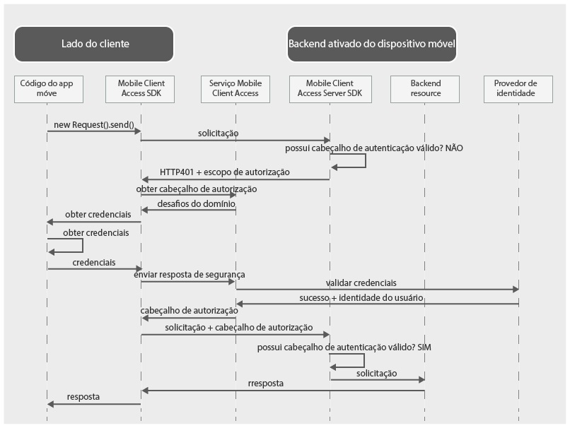

---

copyright:
  years: 2015, 2016
lastupdated: "2016-11-06"

---

# Sobre {{site.data.keyword.amashort}}
{: #mca-overview}

O serviço {{site.data.keyword.amafull}} fornece
autenticação para aplicativos móveis e da Web que acessam
recursos em nuvem hospedados no
{{site.data.keyword.Bluemix_notm}}.

É possível usar o serviço {{site.data.keyword.amashort}} para proteger os aplicativos Node.js e Liberty for Java&trade; que são hospedados no {{site.data.keyword.Bluemix_notm}} com vários tipos de autenticação. Ao instrumentar seus aplicativos móveis com o {{site.data.keyword.amashort}} SDK, é possível usar os recursos de autenticação fornecidos pelo serviço {{site.data.keyword.amashort}}. Use o painel {{site.data.keyword.amashort}} para configurar os vários tipos de autenticação e ver dados reunidos e enviados pelo SDK do lado do cliente.

**Nota**: o serviço {{site.data.keyword.amashort}} era conhecido anteriormente como Advanced Mobile Access.

## Componentes
{: #components}

* **{{site.data.keyword.amashort}}
dashboard**: configure vários tipos de autenticação
* **{{site.data.keyword.amashort}} client SDK**: instrumente aplicativos móveis para usar a funcionalidade do {{site.data.keyword.amashort}}. As plataformas suportadas são: iOS 8 +, Android 4 +, Cordova e
aplicativos da Web.
* **{{site.data.keyword.amashort}} server SDK**: proteja os recursos hospedados no {{site.data.keyword.Bluemix_notm}}. Atualmente,
os tempos de execução suportados são Node.js e Liberty for Java&trade;.

## Tipos de autenticação
{: #authtypes}
É possível usar os tipos de autenticação a seguir em seu app móvel:
* **Facebook**: use o Facebook como um provedor de identidade. Os usuários efetuarão login no app móvel ou da web com suas credenciais do Facebook.
* **Google**: use o Google como um provedor de identidade. Seus usuários efetuam login ao app móvel ou da web
com as credenciais que usam para o Google+.
* **Customizado**: crie seu próprio provedor de identidade. Você controlará totalmente que tipo de informações serão reunidas e validadas.

## Visão geral da arquitetura
{: #architecture}

* Proteja seus recursos em nuvem (aplicativos Node.js) com o SDK do servidor {{site.data.keyword.amashort}}.
* Use a classe de `Request` fornecida pelo
{{site.data.keyword.amashort}} client SDK para se comunicar com seus recursos em nuvem protegidos.
* O {{site.data.keyword.amashort}} server SDK detecta uma solicitação não autorizada e retorna o desafio de autorização HTTP 401.
* O SDK do cliente {{site.data.keyword.amashort}} detecta o Desafio de autorização HTTP 401 e inicia automaticamente o processo de autenticação com o serviço {{site.data.keyword.amashort}}.
* São feitas tentativas de autenticação de Facebook, Google ou customizada.
* Após a autenticação bem-sucedida, o {{site.data.keyword.amashort}} retorna um token de autorização.
* O SDK do cliente {{site.data.keyword.amashort}} inclui automaticamente o token de autorização para a solicitação original e reenvia
a solicitação para o recurso em nuvem.
* O SDK do servidor {{site.data.keyword.amashort}} extrai o token de acesso da solicitação e a valida com o serviço {{site.data.keyword.amashort}}.
* O acesso é concedido.  A resposta é retornada para o aplicativo móvel.

## Fluxo de Pedido
{: #flow}
O diagrama a seguir descreve como uma solicitação flui do SDK do cliente para seu aplicativo backend móvel e provedores de identidade.

* Use o {{site.data.keyword.amashort}} SDK para fazer uma solicitação para seus recursos de backend que são protegidos com o {{site.data.keyword.amashort}} server SDK.
* O {{site.data.keyword.amashort}} server SDK detecta uma solicitação não autorizada e retorna HTTP 401 + escopo de autorização.
* O {{site.data.keyword.amashort}} client SDK detecta automaticamente o HTTP 401 e inicia o processo de autenticação.
* O {{site.data.keyword.amashort}} client SDK entra em contato com o serviço {{site.data.keyword.amashort}} e pede para emitir um cabeçalho de autorização.
* O serviço {{site.data.keyword.amashort}} solicita ao app cliente para se autenticar primeiro fornecendo um desafio de autenticação de acordo com o tipo de autenticação configurado atualmente.
* De acordo com o tipo de autenticação, o SDK do cliente {{site.data.keyword.amashort}}:
   * Autenticação do Facebook ou Google: processa automaticamente o desafio de autenticação
   * Autenticação customizada: obtém credenciais com base na lógica fornecida pelo desenvolvedor.
* Se a autenticação do Facebook ou do Google estiver configurada, o {{site.data.keyword.amashort}} client SDK usará o SDK associado para obter os tokens de acesso do Facebook ou do Google. Esses tokens servem como a resposta do desafio de autenticação.
* Se a Autenticação customizada estiver configurada, o desenvolvedor deverá obter a resposta de segurança de autenticação e fornecê-la ao SDK do cliente {{site.data.keyword.amashort}}.
* Depois que a resposta do desafio de autenticação é obtida, ela é enviada para o serviço {{site.data.keyword.amashort}}.
* O serviço valida a resposta de segurança de autenticação com o provedor de identidade relevante (Facebook/Google/Customizada).
* Se a validação for bem-sucedida, o serviço {{site.data.keyword.amashort}} gerará um cabeçalho de autorização e retornará o cabeçalho para o SDK do cliente {{site.data.keyword.amashort}}. O cabeçalho de autorização contém dois tokens: um token de acesso contendo informações de permissões de acesso e um token de ID contendo informações sobre o usuário atual, o dispositivo ou o aplicativo.
* Desse ponto em diante, todas as solicitações feitas com o {{site.data.keyword.amashort}} client SDK terão um cabeçalho de autorização recém-obtido.
* O {{site.data.keyword.amashort}} client SDK reenvia automaticamente a solicitação original que acionou o fluxo de autorização.
* O {{site.data.keyword.amashort}} server SDK extrai o cabeçalho de autorização da solicitação, valida o cabeçalho com o serviço {{site.data.keyword.amashort}} e concede acesso a um recurso de backend.

## Obtendo ajuda e suporte para o {{site.data.keyword.amashort}}
{: #gettinghelp}

Se você tiver problemas ou perguntas ao usar o
{{site.data.keyword.amashort}},
poderá obter ajuda procurando por informações ou fazendo perguntas
através de um fórum. Também é possível abrir um chamado de suporte. 

Ao usar os fóruns para fazer uma pergunta, marque a sua pergunta
para que ela possa ser vista pelas equipes de desenvolvimento do {{site.data.keyword.Bluemix_notm}}.

* Se você tiver questões técnicas sobre como desenvolver ou implementar um app com o {{site.data.keyword.amashort}}, poste sua pergunta no [Stack Overflow](http://stackoverflow.com/search?q={{site.data.keyword.amashort}}+ibm-bluemix){:new_window} e identifique-a com "ibm-bluemix" e "{{site.data.keyword.amashort}}".
* Para perguntas sobre o serviço e instruções de introdução, use o fórum do [IBM developerWorks dW Answers](https://developer.ibm.com/answers/search.html?f=&type=question&redirect=search%2Fsearch&sort=relevance&q=mobile+client+access%20%2B[bluemix]){:new_window}. 

Veja [Obtendo
ajuda](https://www.{DomainName}/docs/support/index.html#getting-help) para obter mais detalhes sobre o uso dos fóruns.

Para obter informações sobre como abrir um chamado de suporte IBM ou sobre níveis de suporte e severidades de chamado, consulte [Entrando em contato com o suporte](https://www.{DomainName}/docs/support/index.html#contacting-support).

