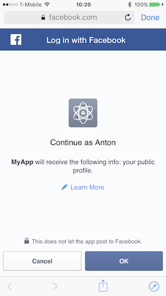

---

copyright:
  years: 2016
lastupdated: "2016-12-05"

---
{:new_window: target="_blank"}
{:shortdesc: .shortdesc}
{:screen: .screen}
{:codeblock: .codeblock}
{:pre: .pre}

# 启用 iOS 应用程序 (Swift SDK) 的 Facebook 认证
{: #facebook-auth-ios}

要在 {{site.data.keyword.amafull}} iOS 应用程序中将 Facebook 用作身份提供者，请为 Facebook 应用程序添加并配置 iOS 平台。
{: shortdesc}

## 开始之前
{: #before-you-begin}

您必须具有
* {{site.data.keyword.amafull}} 服务和 {{site.data.keyword.Bluemix_notm}} 应用程序的实例。有关如何创建 {{site.data.keyword.Bluemix_notm}} 后端应用程序的更多信息，请参阅[入门](index.html)。
* 后端应用程序的 URL（**应用程序路径**）。您将需要此值来向后端应用程序的受保护端点发送请求。
* **TenantID** 值。在 {{site.data.keyword.amashort}}“仪表板”中打开服务。单击**移动选项**按钮。`tenantId`（也称为 `appGUID`）值会显示在**应用程序 GUID/TenantId** 字段中。您将需要此值来初始化授权管理器。
* {{site.data.keyword.Bluemix_notm}} **区域**。您可以在**头像**图标  旁边的头中找到当前 {{site.data.keyword.Bluemix_notm}} 区域。显示的区域值应为以下某个值：`US South`、`United Kingdom` 或 `Sydney`，并对应于 Swift SDK 需要的 SDK 值：`BMSClient.Region.usSouth`、`BMSClient.Region.unitedKingdom` 或 `BMSClient.Region.sydney`。您将需要此值来初始化 {{site.data.keyword.amashort}} 客户端。
* 设置为使用 CocoaPods 的 iOS 项目。有关更多信息，请参阅[设置 iOS Swift SDK](https://console.{DomainName}/docs/services/mobileaccess/getting-started-ios-swift-sdk.html) 中的**安装 CocoaPods**。
  **注：**继续之前，您无需安装核心 {{site.data.keyword.amashort}} 客户端 SDK。
* [Facebook for Developers](https://developers.facebook.com) Web 站点上的 Facebook 应用程序。

**重要信息**：您无需单独安装 Facebook SDK (`com.facebook.FacebookSdk`)。
{{site.data.keyword.amashort}} `BMSFacebookAuthentication` Pod 会自动安装 Facebook SDK。
在 Facebook for Developers Web 站点上添加或配置应用程序时，可以跳过**添加
Facebook SDK
到 Xcode 项目**步骤。

**注：**虽然 Objective-C SDK 仍受到完全支持，且仍视为 {{site.data.keyword.Bluemix_notm}} Mobile Services 的主 SDK，但是有计划要在今年晚些时候停止使用 Objective-C SDK，以支持此新的 Swift SDK。

## 针对 iOS 平台配置 Facebook 应用程序
{: #facebook-auth-ios-config}

在 Facebook for Developers 站点上：

1. 在 [Facebook for Developers](https://developers.facebook.com) 上登录到您的帐户。 

1. 确保 iOS 平台已添加到应用程序。添加或配置 iOS 平台时，需要提供 iOS 应用程序的 **bundleId**。要找到 iOS 应用程序的 **bundleId**，请在 `info.plist` 文件或 Xcode 项目的**常规**选项卡中查找**捆绑软件标识**。

  **提示**：如果计划使用 URL 方案后缀或单点登录，请考虑启用这些功能。

1. 单击**保存设置**。

## 配置 {{site.data.keyword.amashort}} 进行 Facebook 认证
{: #facebook-auth-ios-configmca}

配置 Facebook 应用程序标识并将 Facebook 应用程序配置为向 iOS 客户端提供服务后，可以在 {{site.data.keyword.amashort}} 服务中启用 Facebook 认证。

1. 在 {{site.data.keyword.amashort}}“仪表板”中打开服务。
1. 在**管理**选项卡中，将**授权**切换为“开启”。
1. 展开 **Facebook** 部分。
1. 添加 **Facebook 应用程序标识**，然后单击**保存**。

## 针对 iOS 配置 {{site.data.keyword.amashort}} 客户端 SDK
{: #facebook-auth-ios-sdk}

### 安装 CocoaPods
{: #install-cocoapods}

1. 打开终端并运行 **pod --version** 命令。如果已经安装了 CocoaPods，那么将显示版本号。可以跳至下一部分来安装 SDK。

1. 如果未安装 CocoaPods，请运行：

   ```
sudo gem install cocoapods
```
   {: codeblock}

有关更多信息，请参阅 [CocoaPods Web 站点](https://cocoapods.org/)。


### 使用 CocoaPods 安装 {{site.data.keyword.amashort}} 客户端 Swift SDK
{: #facebook-auth-install-swift-cocoapods}

1. 如果 iOS 项目中没有 `Podfile`，请运行 `pod init`，以创建该文件。

1. 编辑 `Podfile` 并添加以下行：

   ```
use_frameworks!
pod 'BMSFacebookAuthentication'
 ```
   {: codeblock}

   **注：**如果 Pod 文件有 `pod 'BMSSecurity'` 这一行，那么您必须除去该行。`BMSFacebookAuthentication` Pod 会安装所有必要的框架。

   **提示：**您可以将 `use_frameworks!` 添加到 Xcode 目标中，而不是置于 Podfile 中。

1. 保存 `Podfile`，然后在命令行中运行 `pod install` 命令。CocoaPods 会安装依赖关系。这将显示进度和添加的组件。

   **重要信息**：您现在必须使用 CocoaPods 生成的 `xcworkspace` 文件来打开项目。通常该文件的名称为 `{your-project-name}.xcworkspace`。  

1. 在命令行中运行 `open {your-project-name}.xcworkspace` 以打开 iOS 项目工作空间。

### 启用 iOS 的密钥链共享
{: #enable_keychain}

启用`密钥链共享`。转至`功能`选项卡，然后在 Xcode 项目中将`密钥链共享`切换为`开启`。

### 配置 iOS 项目进行 Facebook 认证
{: #facebook-auth-ios-configproject}

1. 找到 `info.plist` 文件，该文件通常位于 Xcode 项目的 `Supporting files` 文件夹下。

1. 通过将以下属性添加到 `info.plist` 文件来配置 Facebook 集成：

   

   使用 Facebook 应用程序标识更新 URL 方案和 FacebookAppID 属性。


   您还可以通过右键单击 `info.plist` 文件，选择**打开方式 > 源代码**，并添加以下 XML 来更新该文件：

   ```XML
   <key>CFBundleURLTypes</key>
   <array>
      <dict>
         <key>CFBundleURLSchemes</key>
         <array>
            <string>fb{your-facebook-application-id}</string>
         </array>
      </dict>
   </array>
   <key>FacebookAppID</key>
   <string>{your-facebook-application-id}</string>
   <key>FacebookDisplayName</key>
   <string>{your-faceebook-application-name}</string>
   <key>LSApplicationQueriesSchemes</key>
   <array>
      <string>fbauth</string>
      <string>fbauth2</string>
   </array>
   <key>NSAppTransportSecurity</key>
   <dict>
      <key>NSExceptionDomains</key>
      <dict>
         <key>facebook.com</key>
         <dict>
            <key>NSIncludesSubdomains</key>
            <true/>                
            <key>NSThirdPartyExceptionRequiresForwardSecrecy</key>
            <false/>
         </dict>
         <key>fbcdn.net</key>
         <dict>
            <key>NSIncludesSubdomains</key>
            <true/>
            <key>NSThirdPartyExceptionRequiresForwardSecrecy</key>
            <false/>
         </dict>
         <key>akamaihd.net</key>
         <dict>
            <key>NSIncludesSubdomains</key>
            <true/>
            <key>NSThirdPartyExceptionRequiresForwardSecrecy</key>
            <false/>
         </dict>
      </dict>
   </dict>
   ```
   {: codeblock}

   使用 Facebook 应用程序标识更新 `CFBundleURLSchemes` 和 `FacebookappID` 属性。使用 Facebook 应用程序名称更新 `FacebookDisplayName`。

   **重要信息**：确保您未覆盖 `info.plist` 文件中的任何现有属性。如果您有重叠属性，必须手动进行合并。有关更多信息，请参阅 [Configure Xcode Project](https://developers.facebook.com/docs/ios/getting-started/) 和 [Preparing Your Apps for iOS9](https://developers.facebook.com/docs/ios/ios9)。

## 初始化 {{site.data.keyword.amashort}} 客户端 Swift SDK
{: #facebook-auth-ios-initalize-swift}

通过传递 `tenantId` 来初始化客户端 SDK。

通常会将初始化代码放置在应用程序代表的 `application:didFinishLaunchingWithOptions` 方法中，但这不是强制性的。

1. 通过添加以下头，将所需框架导入要使用 {{site.data.keyword.amashort}} 客户端 SDK 的类中：

   ```swift
 import UIKit
 import BMSCore
 import BMSSecurity
 ```
   {: codeblock}

1. 初始化客户端 SDK。

   ```Swift
	let tenantId = "<serviceTenantID>"
	let regionName = <applicationBluemixRegion>

	func application(_ application: UIApplication, 
	    didFinishLaunchingWithOptions launchOptions: [UIApplicationLaunchOptionsKey: Any]?) -> Bool {

 let mcaAuthManager = MCAAuthorizationManager.sharedInstance
      mcaAuthManager.initialize(tenantId: tenantId, bluemixRegion: regionName)
      //the regionName should be one of the following: BMSClient.Region.usSouth, BMSClient.Region.unitedKingdom, or BMSClient.Region.sydney
      BMSClient.sharedInstance.authorizationManager = mcaAuthManager
      FacebookAuthenticationManager.sharedInstance.register()
   }
   ```
   {: codeblock}

   在代码中：

   * 将 `<applicationBluemixRegion>` 替换为托管 {{site.data.keyword.Bluemix_notm}} 应用程序的区域。
   * 将 `tenantId` 替换为 **TenantId/应用程序 GUID** 值。
 
   有关这些值的更多信息，请参阅[开始之前](#before-you-begin)。

1. 通过将以下代码添加到应用程序代表中的 `application:didFinishLaunchingWithOptions` 方法，通知 Facebook SDK 有关应用程序激活的信息，并注册 Facebook 认证处理程序。
初始化 BMSClient 实例并将 Facebook 注册为认证管理器后，请添加以下代码。

   ```Swift
  return FacebookAuthenticationManager.sharedInstance.onFinishLaunching(application, withOptions: launchOptions)
 ```
   {: codeblock}

1. 将 `FacebookAuthenticationManager.swift` 文件从 `BMSFacebookAuthentication` pod 源文件复制到项目目录中。

1. 将以下代码添加到应用程序代表中。

   ```Swift
   func application(_ app: UIApplication,
      open url: URL,
      options: [UIApplicationOpenURLOptionsKey : Any] = [:]) -> Bool{
         return FacebookAuthenticationManager.sharedInstance.onOpenURL(app, open: url, options: options)
      }
   ```
   {: codeblock}

## 测试认证
{: #facebook-auth-ios-testing}

初始化客户端 SDK 并注册 Facebook 认证管理器后，可以开始对移动后端应用程序发起请求。

### 开始之前
{: #facebook-auth-ios-testing-before}

您必须使用的是 {{site.data.keyword.mobilefirstbp}} 样板，并且已经在 `/protected` 端点具有受 {{site.data.keyword.amashort}} 保护的资源。如果需要设置 `/protected` 端点，请参阅[保护资源](https://console.{DomainName}/docs/services/mobileaccess/protecting-resources.html)。

1. 尝试在浏览器中对新创建的移动后端应用程序的受保护端点发送请求。打开以下 URL：`{applicationRoute}/protected`，将 `{applicationRoute}` 替换为从**移动选项**中检索到的值（请参阅[配置 Mobile Client Access 进行 Facebook 认证](#facebook-auth-ios-configmca)）。例如：`http://my-mobile-backend.mybluemix.net/protected`
<br/>使用 MobileFirst Services Starter 样板创建的移动后端应用程序的 `/protected` 端点通过 {{site.data.keyword.amashort}} 进行保护。浏览器中将返回 `Unauthorized` 消息。由于此端点只能由安装了 {{site.data.keyword.amashort}} 客户端 SDK 的移动应用程序进行访问，因此会返回此消息。

1. 使用 iOS 应用程序对同一端点发起请求。

   ```Swift
	let protectedResourceURL = "<your protected resource absolute path>"
	let request = Request(url: protectedResourceURL, method: HttpMethod.GET)

	let callBack:BMSCompletionHandler = {(response: Response?, error: Error?) in
  if error == nil {
      print ("response:\(response?.responseText), no error")
  } else {
     print ("error: \(error)")
  }
  }
	request.send(completionHandler: callBack)
 ```
   {: codeblock}

1. 运行应用程序。这将弹出 Facebook 登录屏幕。

   

   如果您当前未登录到 Facebook，那么此屏幕的外观可能略有不同。

1. 单击**确定**以授权 {{site.data.keyword.amashort}} 使用您的 Facebook 用户身份进行认证。

1. 	请求成功后，将在 Xcode 控制台中显示以下输出：

   ```
response:Optional("Hello, this is a protected resouce of the mobile backend application!"), no error
 ```
   {: screen}

1. 通过添加以下代码，您还可以添加注销功能：

   ```
FacebookAuthenticationManager.sharedInstance.logout(callBack)
```
   {: codeblock}

   如果您在用户登录 Facebook 之后调用此代码，并且用户尝试重新登录，那么系统将提示他们授权 {{site.data.keyword.amashort}} 使用 Facebook 进行认证。

   要切换用户，您必须调用此代码，并且用户必须在浏览器中注销 Facebook。

   您可以选择是否将 `callBack` 传递给注销功能。您还可以传递 `nil`。
