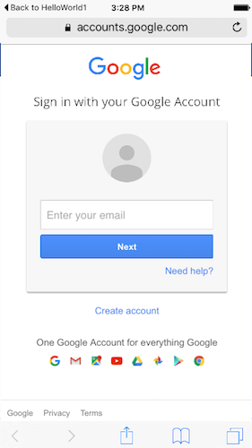

---

copyright:
  years: 2015, 2016
lastupdated: "2016-10-02"
---
{:screen: .screen}
{:shortdesc: .shortdesc}

# 启用 Cordova 应用程序的 Google 认证
{: #google-auth-cordova}


要配置 {{site.data.keyword.amafull}} Cordova 应用程序进行 Google 认证集成，必须在 Cordova 应用程序的本机代码（即 Java、Objective-C 或 Swift）中进行更改。每个平台必须分别进行配置。在本机开发环境中使用本机代码进行更改，例如在 Android Studio 或 Xcode 中更改。

## 开始之前
{: #before-you-begin}
您必须具有：
* 已安装 {{site.data.keyword.amashort}} 客户端 SDK 的 Cordova 项目。有关更多信息，请参阅[设置 Cordova 插件](https://console.{DomainName}/docs/services/mobileaccess/getting-started-cordova.html)。  
* 受 {{site.data.keyword.amashort}} 服务保护的 {{site.data.keyword.Bluemix_notm}} 应用程序实例。有关如何创建 {{site.data.keyword.Bluemix_notm}} 后端应用程序的更多信息，请参阅[入门](index.html)。
* （可选）请熟悉以下部分：
   * [启用 Android 应用程序的 Google 认证](https://console.{DomainName}/docs/services/mobileaccess/google-auth-android.html)
   * [在 iOS 应用程序中启用 Google 认证](https://console.{DomainName}/docs/services/mobileaccess/google-auth-ios.html)


## 配置 Android 平台
{: #google-auth-cordova-android}

配置 Cordova 应用程序的 Android 平台进行 Google 认证集成所需的步骤，与本机应用程序所需的步骤非常类似。请参阅[在 Android 应用程序中启用 Google 认证](https://console.{DomainName}/docs/services/mobileaccess/google-auth-android.html)并设置以下各项：

* 针对 Android 平台配置 Google 项目
* 配置 {{site.data.keyword.amashort}} 进行 Google 认证

### 针对 Android Cordova 配置 {{site.data.keyword.amashort}} 客户端 SDK


2. 在 Android 项目文件夹，打开应用程序模块的 `build.gradle` 文件（**非**项目的 `build.gradle` 文件）。找到 dependencies 部分，并为客户端 SDK 添加新的编译依赖关系：

	```Gradle
	dependencies {
		compile group: 'com.ibm.mobilefirstplatform.clientsdk.android',    
        name:'googleauthentication',
        version: '1.+',
        ext: 'aar',
        transitive: true
    	// other dependencies  
	}
	```

2. 通过单击**工具 > Android > 使用 Gradle 文件同步项目**来使用 Gradle 同步项目。

3. 对于 Cordova 应用程序，请在 JavaScript 代码中（而不是 Java 代码）初始化 {{site.data.keyword.amashort}} 客户端 SDK。`GoogleAuthenticationManager` API 仍必须使用本机代码进行注册。将此代码添加到主活动 `onCreate` 方法： 

	```Java
	GoogleAuthenticationManager.getInstance().registerDefaultAuthenticationListener(this);
	```

1. 将以下代码添加到您的 Activity：
 
 	```Java
	@Override
	protected void onActivityResult(int requestCode, int resultCode, Intent data) {
		super.onActivityResult(requestCode, resultCode, data);
		GoogleAuthenticationManager.getInstance()
			.onActivityResultCalled(requestCode, resultCode, data);
	}
```

## 配置 iOS 平台
{: #google-auth-cordova-ios}

配置 Cordova 应用程序的 iOS 平台进行 Google 认证集成所需的步骤，与本机应用程序所需的步骤类似。主要差别在于目前 Cordova CLI 不支持 CocoaPods 依赖关系管理器。必须手动添加与 Google 认证集成所需的文件。有关更多信息，请参阅[在 iOS 应用程序中启用 Google 认证](https://console.{DomainName}/docs/services/mobileaccess/google-auth-ios.html)。请完成以下步骤：

* 针对 iOS 平台配置 Google 项目
* 配置 {{site.data.keyword.amashort}} 进行 Google 认证

### 手动安装用于 Google 认证的 {{site.data.keyword.amashort}} SDK 以及 Google SDK
{: #google-auth-cordova-ios-sdk}
1. 下载包含 [{{site.data.keyword.Bluemix}} Mobile Services SDK for iOS](https://hub.jazz.net/git/bluemixmobilesdk/imf-ios-sdk/archive?revstr=master) 的归档。

1. 转至 `Sources/Authenticators/IMFGoogleAuthentication` 目录，并将所有文件复制（拖放）到 Xcode 中的 iOS 项目。需要复制的文件为：

	* IMFDefaultGoogleAuthenticationDelegate.h
	* IMFDefaultGoogleAuthenticationDelegate.m
	* IMFGoogleAuthenticationDelegate.h
	* IMFGoogleAuthenticationHandler.h
	* IMFGoogleAuthenticationHandler.m

	选中**复制文件...** 复选框。

1. 下载并安装 [Google+ iOS SDK](http://goo.gl/9cTqyZ)。

1. 执行 [Start integrating Google+ into your iOS app](https://developers.google.com/+/mobile/ios/getting-started) 教程中的步骤 2，以将 Google+ iOS SDK 集成到 Xcode 项目中。

继续执行[配置 iOS 平台进行 Google 认证](https://console.{DomainName}/docs/services/mobileaccess/google-auth-ios.html)的**配置 iOS 项目进行 Google 认证**部分。使用本机代码注册 `IMFGoogleAuthenticationHandler`，如“`初始化 {{site.data.keyword.amashort}} 客户端 SDK`”部分中所述。请不要在本机代码中初始化 `IMFClient`（客户端在以下部分的 JavaScript 中初始化）。

将以下行添加到应用程序代表的 `application:openURL:sourceApplication:annotation` 方法。这将确保向所有 Cordova 插件通知相应事件。

```
[[ NSNotificationCenter defaultCenter] postNotification:
		[NSNotification notificationWithName:CDVPluginHandleOpenURLNotification object:url]];
```
{: codeblock}

## 初始化 {{site.data.keyword.amashort}} 客户端 SDK
{: #google-auth-cordova-initialize}

在 Cordova 应用程序中使用以下 JavaScript 代码来初始化 {{site.data.keyword.amashort}} 客户端 SDK。

```JavaScript
BMSClient.initialize("applicationRoute", "applicationGUID");
```
{: codeblock}

将 `applicationRoute` 和 `applicationGUID` 值替换为应用程序**路径**和**应用程序 GUID** 值。
可以通过在仪表板的应用程序页面单击**移动选项**按钮找到这些值。
	


##初始化 {{site.data.keyword.amashort}} AuthorizationManager
在 Cordova 应用程序中使用以下 JavaScript 代码来初始化 {{site.data.keyword.amashort}} AuthorizationManager。

```JavaScript
  MFPAuthorizationManager.initialize("tenantId");
  ```
{: codeblock}

将 `tenantId` 值替换为 {{site.data.keyword.amashort}} 服务 `tenantId`。您可以通过单击 {{site.data.keyword.amashort}} 服务磁贴上的**显示凭证**按钮来找到此值。


## 测试认证
{: #google-auth-cordova-test}
初始化客户端 SDK 后，可以开始对移动后端应用程序发起请求。

### 开始之前
{: #google-auth-cordova-testing-before}
必须在 `/protected` 端点具有受 {{site.data.keyword.amashort}} 保护的后端应用程序。如果需要设置 `/protected` 端点，请参阅[保护资源](https://console.{DomainName}/docs/services/mobileaccess/protecting-resources.html)。


1. 尝试通过在桌面浏览器中打开 `{applicationRoute}/protected`（例如，`http://my-mobile-backend.mybluemix.net/protected`），向移动后端应用程序的受保护端点发送请求。

1. 使用 MobileFirst Services 样板创建的移动后端应用程序的 `/protected` 端点受 {{site.data.keyword.amashort}} 的保护，所以它只能由安装了 {{site.data.keyword.amashort}} 客户端 SDK 的移动应用程序进行访问。因此，您会在桌面浏览器中看到 `Unauthorized`。

1. 使用 Cordova 应用程序对同一端点发起请求。初始化 `BMSClient` 后，添加以下代码。

	```JavaScript
	var success = function(data){
    	console.log("success", data);
    }
	var failure = function(error)
    	{console.log("failure", error);
    }
	var request = new MFPRequest("/protected", MFPRequest.GET);
	request.send(success, failure);
	```
{: codeblock}

1. 运行应用程序。此时将显示 Google 登录屏幕。

	 &nbsp;&nbsp;&nbsp;&nbsp;&nbsp;&nbsp;&nbsp;&nbsp;&nbsp;	
	
	如果设备上未安装 Facebook 应用程序，或者如果您当前未登录到 Facebook，那么此屏幕的外观可能略有不同。
1. 通过单击**确定**，您将授权 {{site.data.keyword.amashort}} 使用您的 Google 用户身份进行认证。

1. 您的请求应该会成功。根据使用的平台，应该会在 LogCat/Xcode 控制台中看到以下输出：

	

	
