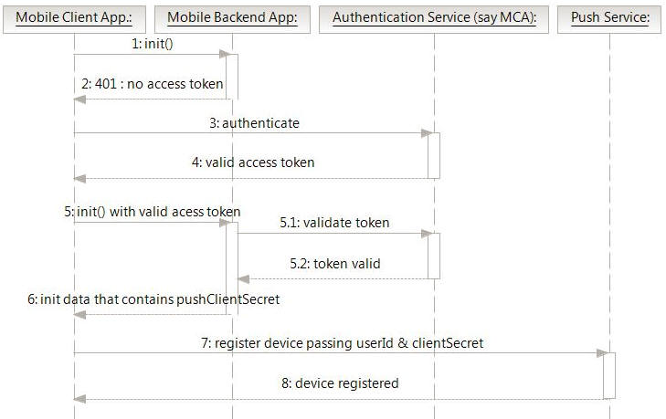

---

Title: Enabling user-based Push Notifications

Keywords: User-based Push Notifications, userId
copyright:
 years: 2015, 2016

---

# Enabling user-based notifications
{: #user_based_notifications}
Last updated: 29 August 2016
{: .last-updated}

User ID-based {{site.data.keyword.mobilepushshort}} are targeted at mobile app users with customized messages. With user-based notifications, you can choose to notify specific individuals based on their preferences.

## Register device with User ID
To enable push notifications targeted by User ID, ensure that you register the device with a User ID and also pass the 'clientSecret' that is allocated when the {{site.data.keyword.mobilepushshort}} services is provisioned. The device registration will fail without a valid 'clientSecret'.  

The User ID can be any string that the application provides to the device registration API. Typically, a mobile application will first run an authentication cycle where the mobile app user is authenticated against an authentication service such as [{{site.data.keyword.amafull}}](https://console.ng.bluemix.net/docs/services/mobileaccess/index.html). On successful authentication, the authenticated user ID is then passed into the Push Device Registration API, along with a 'clientSecret'.  The presence of a 'clientSecret' enforces only authorized association of User IDs with mobile device registrations.

Keep the 'clientSecret' confidential and never hard-coded into the mobile app. There are various application initialization patterns that can be used to pull in the 'clientSecret' dynamically during the application's runtime. The sequence diagram outlines this pattern.

 

You can also register a device to be associated with an 'anonymous' user. This requires that you use a variant of the device registration API that does not require the user ID and 'clientSecret' arguments.   

## Synchronizing user login and logout 

You can choose to send notifications only if the user is logged in. 

For example, if a device is shared by a family or shared by a team at work, and you need to address specific users in the family or team. In such a use case, there would be a user log-in and log out sequence. This authentication mechanism allows the application to track the identity of the present user of the application. This ensures that notifications targeted to a specific user are always received by that user only. After a successful log-in, invoke the device registration API passing the User ID of the logged-in user. Likewise, before logging out, invoke the device unregistration API. Sequencing these Push APIs with log-in and log out will ensure that push notifications that are meant for a specific user are sent to that user only.