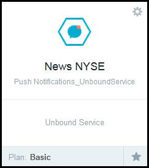

---

copyright:
 years: 2015, 2016

---

{:new_window: target="_blank"}
{:shortdesc: .shortdesc}
{:screen:.screen}
{:codeblock:.codeblock}

# Configuration des données d'identification pour le service FCM
{: #create-push-enable-gcm}
Dernière mise à jour : 6 décembre 2016
{: .last-updated}

La passerelle FCM (Firebase Cloud Messaging) est la passerelle utilisée pour distribuer des notifications push aux appareils Android ainsi qu'aux navigateurs Web Google Chrome and Mozilla Firefox. FCM a remplacé GCM (Google Cloud Messaging). Vous devez obtenir vos données d'identification FCM puis vous configurez le service {{site.data.keyword.mobilepushshort}} sur le tableau de bord. Prenez soin d'utiliser les configurations FCM pour les nouvelles applications. Les appli existantes continueraient à fonctionner avec les configurations GCM.

##Obtention de votre ID d'émetteur et de la clé d'API
{: #android-senderid-apikey}

La clé d'API est stockée de façon sécurisée et utilisée par le service {{site.data.keyword.mobilepushshort}} pour la connexion au serveur FCM. L'ID d'émetteur (numéro de projet) est utilisé par le logiciel SDK Android et le logiciel SDK JS pour Google Chrome et Mozilla Firefox côté client. 

Pour configurer FCM, générez la clé d'API et l'ID d'émetteur en procédant comme suit :

1. Visitez la [console Firebase](https://console.firebase.google.com/?pli=1).
2. Sélectionnez **Créer un projet**. 
3. Dans la fenêtre Créer un projet, fournissez un nom de projet, choisissez un pays/région puis cliquez sur **Créer un projet**.
3. Dans le panneau de navigation, cliquez sur l'icône des paramètres et sélectionnez **Paramètres du projet**.
4. Choisissez l'onglet Cloud Messaging pour générer la clé de serveur de l'API et l'ID de l'expéditeur.

##Configuration du service {{site.data.keyword.mobilepushshort}} pour les applications Android et pour les applications et extensions Google Chrome
{: #setup-push-android}

**Remarque :** vous aurez besoin de votre clé d'API FCM/GCM et de votre ID d'émetteur (numéro de projet).

1. Ouvrez votre tableau de bord Bluemix puis cliquez sur l'instance de service {{site.data.keyword.mobilepushfull}} que vous avez créée pour ouvrir le tableau de bord. Le tableau de bord Push s'affiche. Pour configurer un service {{site.data.keyword.mobilepushshort}}  non lié pour Android, sélectionnez l'icône relative au service {{site.data.keyword.mobilepushshort}} non lié pour ouvrir le tableau de bord du service {{site.data.keyword.mobilepushshort}}. 

2. Cliquez sur le bouton **Configurer Push** pour configurer les données d'identification FCM/GCM pour les applications Android et pour les applications et extensions Google Chrome.
3. Sur la page **Configuration**, pour Android, accédez à l'onglet **Mobile** et configurez l'ID d'émetteur (numéro de projet CGM) et la clé d'API. Pour les applications et extensions Google Chrome, accédez à l'onglet **Web** et configurez l'ID d'émetteur (numéro de projet FCM/GCM) et la clé d'API de façon appropriée.
4. Cliquez sur **Sauvegarder**.
5. Etapes suivantes. [Activation des notifications pour Android](c_enable_push.html) ou [Activation des notifications pour les applications et extensions Google Chrome](c_enable_push.html).

###Configuration de la fonction Push Web de Google Chrome et Mozilla Firefox (via FCM/GCM)
{: #config-gcm-mozilla}

1. Sur le panneau de navigation du tableau de bord Push, sélectionnez **Configurer**.
2. Sélectionnez l'onglet Web.
	
3. Configurez la clé d'API FCM/GCM et l'URL de votre site Web qui sera enregistré pour recevoir les notifications push.
4. Cliquez sur **Sauvegarder**.
5. Etapes suivantes. [Activation des notifications pour les navigateurs Google Chrome et Mozilla Firefox](c_enable_push.html).
