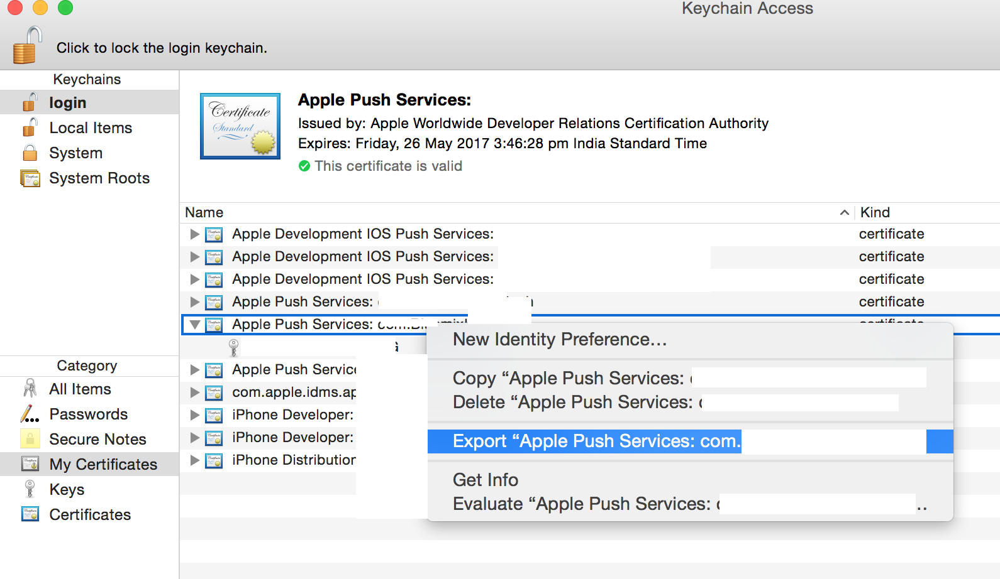
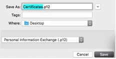

---

copyright:
 years: 2015, 2016

---

{:new_window: target="_blank"}
# Configuration des données d'identification pour le service APNs
{: #create-push-credentials-apns}
Dernière mise à jour : 17 octobre 2016
{: .last-updated}

Apple Push Notification Service (APNs) permet aux développeurs d'applications d'envoyer des notifications distantes depuis l'instance de service {{site.data.keyword.mobilepushshort}} dans Bluemix (le fournisseur) à des applications et des appareils iOS. Les messages sont envoyés à une application cible sur l'appareil. 

Procurez-vous des données d'identification APNs et configurez-les. Les certificats APNs sont gérés de façon sécurisée par le service {{site.data.keyword.mobilepushshort}} et utilisés pour la connexion au serveur APNs en tant que fournisseur.

<!-- 1. Obtain an [Apple Developers](https://developer.apple.com/) account.-->

<!--2. [Register an App ID](#create-push-credentials-apns-register)
3. [Create a development and distribution APNs SSL certificate](#create-push-credentials-apns-ssl)
4. [Create a development provisioning profile](#create-push-credentials-dev-profile)
5. [Create a store distribution provisioning profile](#create-push-credentials-apns-distribute_profile)
6. [Creating .p12 push certificate file for Bluemix push](#create-p12-push-certificate-file-for-Bluemix-push)
7. [Set up APNs on the Push Dashboard](#create-push-credentials-apns-dashboard)
-->

##Enregistrement d'un ID d'appli
{: #create-push-credentials-apns-register}

L'ID d'application (l'identificateur de bundle) est un identificateur unique identifiant une application spécifique. Chaque application
requiert un ID d'application. Les services tels que le service {{site.data.keyword.mobilepushshort}} sont configurés avec l'ID
d'application.

1. Assurez-vous que vous disposez bien d'un compte [Apple Developers](https://developer.apple.com/).
2. Accédez au portail [Apple Developer](https://developer.apple.com), cliquez sur **Member Center**, puis sélectionnez **Certificates, Identifiers & Profiles**.
3. Accédez à la section **Registering App IDs** dans [Apple Developer Library](https://developer.apple.com/library/mac/documentation/IDEs/Conceptual/AppDistributionGuide/MaintainingProfiles/MaintainingProfiles.html#//apple_ref/doc/uid/TP40012582-CH30-SW991) et suivez les instructions d'enregistrement de l'ID d'appli.

Lorsque vous enregistrez un ID d'application, sélectionnez les options suivantes :

* Push Notifications

* Suffixe d'ID explicite

4. Création d'un certificat SSL APNs pour le développement et la distribution

##Création d'un certificat SSL APNs pour le développement et la distribution
{: #create-push-credentials-apns-ssl}

Pour pouvoir obtenir un certificat APNs, vous devez d'abord générer une demande de signature de certificat et la soumettre à Apple, l'autorité de
certification. La demande de signature de certificat contient des informations qui identifient votre société, ainsi que votre clé publique et votre clé
privée que vous utilisez pour signer vos notifications push Apple. Ensuite, générez le certificat SSL dans le portail des développeurs iOS. Le
certificat, avec sa clé publique et sa clé privée, est stocké dans Keychain Access.

<!-- ###Before you begin -->
<!-- {: before-you-begin-certificate} -->

<!--[Register an App ID](#create-push-credentials-apns-register)-->

Vous pouvez utiliser APNs dans deux modes : 

* Mode bac à sable pour le développement et le test.
* Mode production lors de la distribution des applications via l'App Store (ou d'autres mécanismes de distribution d'entreprise).

Vous devez vous procurer des certificats distincts pour vos environnements de développement et de distribution. Les certificats sont
associés à un ID d'application pour l'application qui est le destinataire des notifications distantes. Pour la production, vous pouvez créer jusqu'à deux certificats. Bluemix utilise les certificats afin d'établir une connexion SSL à APNs.

<!-- Create a development and distribution SSL certificate. -->

1. Accédez au site Web [Apple Developer](https://developer.apple.com), cliquez sur **Member Center** puis sélectionnez **Certificates, Identifiers & Profiles**.
2. Dans la zone **Identifiers**, cliquez sur **App IDs**.
3. Dans la liste des ID d'application, sélectionnez votre ID d'application <!--newly created--> puis choisissez **Settings**.
4. Dans la zone **Push Notifications**, créez un certificat SSL de développement, puis un certificat SSL de production.

	

5. Quand l'écran **About Creating a Certificate Signing Request (CSR)** s'affiche, démarrez l'application **Keychain Access** sur votre Mac afin de créer une demande de signature de certificat.
6. Dans le menu, sélectionnez **Keychain Access > Certificate Assistant > Request a Certificate From a Certificate Authority…** 
7. Dans **Certificate Information**, entrez l'adresse électronique qui est associée à votre compte App Developer et un nom usuel. Attribuez un nom significatif qui permet d'identifier s'il s'agit d'un certificat pour le développement (bac à sable) ou pour la distribution (production), *certificat_apns_bacAsable* ou *certificat_apns_production*, par exemple.
8. Sélectionnez **Save to disk** pour télécharger le fichier `.certSigningRequest` sur votre bureau puis cliquez s ur **Continue**.
9. Dans l'option de menu **Save As**, attribuez un nom au fichier `.certSigningRequest` puis cliquez sur **Save**.
10. Cliquez sur **Done**. A présent, vous possédez une demande de signature de certificat.
11. Revenez à la fenêtre **About Creating a Certificate Signing Request (CSR)** puis cliquez sur **Continue**. 
12. Dans l'écran **Generate**, cliquez sur **Choose File...** et sélectionnez le fichier de demande de signature de
certificat que vous avez sauvegardé sur votre bureau. Ensuite, cliquez sur **Generate**.
	
13. Lorsque votre certificat est prêt, cliquez sur **Done**.
14. Sur l'écran **Push Notifications**, cliquez sur **Download** pour télécharger votre certificat, puis cliquez sur **Done**. 
	
15. Sur votre Mac, accédez à **Keychain Access > My Certificates** et localisez le certificat que vous venez d'installer. Cliquez deux fois sur le certificat pour l'installer dans Keychain Access.
16. Sélectionnez le certificat et la clé privée puis sélectionnez **Export** pour convertir le certificat au format d'échange d'informations personnelles (format .`.p12`).
	
17. Dans la zone **Save As**, donnez au certificat un nom parlant, `certificat_p12.apns_bacAsable` ou `certificat_p12.apns_production`, par exemple, puis cliquez sur **Save**.
	
18. Dans la zone **Enter a password**, entrez un mot de passe pour protéger les éléments exportés, puis cliquez sur **OK**. Vous pouvez utiliser ce mot de passe pour configurer vos paramètres APNs dans le tableau de bord Push.{: #step18}
	
19. **Key Access.app** vous invite à exporter votre clé depuis l'écran **Keychain**. Entrez le mot de passe administrateur pour votre Mac afin de permettre au système d'exporter ces éléments puis sélectionnez l'option **Always Allow**. Un certificat `.p12` est généré sur votre bureau.

##Création d'un profil de mise à disposition pour le développement
{: #create-push-credentials-dev-profile}

Le profil de mise à disposition est utilisé conjointement avec l'ID d'application pour déterminer quels sont les appareils qui
peuvent installer et exécuter votre application et quels sont les services auxquels votre application peut accéder. Pour chaque ID d'application, vous créez deux profils de mise à disposition : un pour le développement et un pour la distribution. Xcode utilise le profil de mise à disposition pour le développement afin de déterminer quels sont les développeurs qui sont autorisés à construire
l'application et quels sont les appareils qui peuvent être testés avec l'application.

###Avant de commencer
{: before-you-begin-provisioning-file}

Prenez soin d'enregistrer un ID d'application, de l'activer pour le service de notification push et de le configurer pour qu'il utilise un certificat SSL APNs à des fins de développement et de production.

Créez un profil de mise à disposition pour le développement, comme suit :

1. Accédez au portail [Apple Developer](https://developer.apple.com), cliquez sur **Member Center**, puis sélectionnez **Certificates, Identifiers & Profiles**.
2. Accédez au site [Mac Developer Library](https://developer.apple.com/library/mac/documentation/IDEs/Conceptual/AppDistributionGuide/MaintainingProfiles/MaintainingProfiles.html#//apple_ref/doc/uid/TP40012582-CH30-SW62site), faites défiler la page jusqu'à la section **Creating Development Provisioning Profiles** et suivez les instructions de création d'un profil de développement.
**Remarque** : Lorsque vous configurez un profil de mise à disposition pour le développement, sélectionnez les options suivantes :
	* **iOS App Development**
	* **For iOS and watchOS apps **

##Création d'un profil de mise à disposition pour la distribution dans un magasin
{: #create-push-credentials-apns-distribute_profile}

Utilisez le profil de mise à disposition dans un magasin afin de soumettre votre application pour la distribution dans l'App Store.

1. Accédez au portail [Apple Developer](https://developer.apple.com), cliquez sur **Member Center**, puis sélectionnez **Certificates, Identifiers & Profiles**.
2. Cliquez deux fois sur le profil de mise à disposition téléchargé afin de l'installer dans Xcode.

##Configuration d'APNs dans le tableau de bord {{site.data.keyword.mobilepushshort}}
{: #create-push-credentials-apns-dashboard}

Afin d'utiliser le service {{site.data.keyword.mobilepushshort}} pour envoyer des notifications, téléchargez les certificats SSL requis pour Apple Push Notification Service (APNs). Vous pouvez également utiliser l'API REST pour télécharger un certificat APNs.

###Avant de commencer
{: before-you-begin-dashboard}

<!-- Get your development and production APNs SSL certificate and the password associated with each type of certificate. For information, see Creating and configuring push credentials for APNs.-->

Les certificats requis pour APNs sont des certificats `.p12`, qui contiennent la clé privée et des certificats SSL nécessaires pour la
génération et la publication de votre application. Vous devez générer les certificats depuis le Member Center du site Web Apple Developer (pour lequel un
compte Apple Developer valide est requis). Des certificats distincts sont requis pour l'environnement de développement (bac à sable) et l'environnement de production
(distribution).

**Remarque** : une fois le fichier `.cer` dans votre accès à la chaîne de certificats, exportez-le sur votre ordinateur pour créer un certificat .p12..`.p12` certificate.

Pour plus d'informations sur l'utilisation d'APNS, voir [iOS Developer Library: Local and Remote Notification Programming Guide](https://developer.apple.com/library/ios/documentation/NetworkingInternet/Conceptual/RemoteNotificationsPG/Chapters/ProvisioningDevelopment.html#//apple_ref/doc/uid/TP40008194-CH104-SW4).

Configurez APNs sur le tableau de bord Push, comme suit :

1. Ouvrez votre application de back end dans le tableau de bord Bluemix puis cliquez sur le service **IBM Push Notifications** afin d'ouvrir le tableau de bord Push.

	Le tableau de bord Push s'affiche : 
2. Sur l'onglet **Configuration**, accédez à la section **Apple Push Certificate**,  sélectionnez **Sandbox** (développement) ou **Production** (distribution) puis téléchargez le certificat `p.12` que vous avez créé à l'[étape](#step18) précédente.
	
3. Dans la zone **Mot de passe**, entrez le mot de passe qui est associé au fichier de certificat `.p12`, puis cliquez sur **Sauvegarde**.

Une fois les certificats téléchargés avec un mot de passe valide, vous pouvez commencer à envoyer des notifications.
