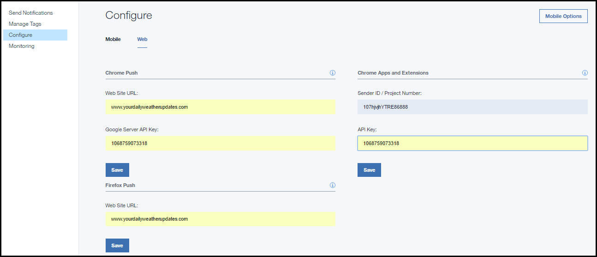

---

copyright:
 years: 2015, 2016

---

{:new_window: target="_blank"}
# Configurazione delle credenziali per FCM
{: #create-push-enable-gcm}
Ultimo aggiornamento: 17 ottobre 2016
{: .last-updated}

FCM (Firebase Cloud Messaging) è il gateway utilizzato per consegnare le notifiche di push ai dispositivi Android e ai browser web Google Chrome e Mozilla. FCM ha sostituito GCM (Google Cloud Messaging). Ottieni le tue credenziali FCM e configura quindi il servizio {{site.data.keyword.mobilepushshort}} sul dashboard. Assicurati di utilizzare le configurazioni FCM per le nuove applicazioni. Le applicazioni esistenti possono continuare a funzionare con le configurazioni GCM.

##Come ottenere il tuo ID mittente e la chiave API
{: #android-senderid-apikey}

La chiave API è archiviata in modo protetto e utilizzata dal servizio {{site.data.keyword.mobilepushshort}} per stabilire una connessione al server FCM e l'ID mittente (numero progetto) viene utilizzato dall'SDK Android e dall'SDK JS per Google Chrome e Mozilla Firefox sul lato client.  

Per configurare FCM, generare la chiave API e l'ID mittente, completa la seguente procedura:

1. Visita il sito [Firebase Console](https://console.firebase.google.com/?pli=1).
2. Seleziona **Create new project**. 
3. Nella finestra Create a project, fornisci un nome progetto, scegli una regione/paese e fai clic su **Create project**.
3. Nel pannello di navigazione, fai clic sull'icona delle impostazioni e seleziona **Project settings**.
4. Scegli la scheda Cloud Messaging per generare la chiave API server e un ID mittente.

##Configurazione del servizio {{site.data.keyword.mobilepushshort}} per Android e per le estensioni e le applicazioni Chrome
{: #setup-push-android}

**Nota:** ti serviranno i tuoi chiave API FCM/GCM e ID mittente (numero progetto).

1. Apri il tuo dashboard Bluemix e fai quindi clic sull'istanza del servizio {{site.data.keyword.mobilepushfull}} che hai creato, per aprire il dashboard. Viene visualizzato il dashboard Push. Per configurare un servizio {{site.data.keyword.mobilepushshort}} senza binding per Android, selezione l'icona del servizio {{site.data.keyword.mobilepushshort}} senza binding per aprire il dashboard del servizio {{site.data.keyword.mobilepushshort}}. 

2. Fai clic sul pulsante **Setup Push** per configurare le credenziali FCM/GCM per le applicazioni Android e per le estensioni e applicazioni Google Chrome.
3. Nella pagina **Configuration**, per Android, vai alla scheda **Mobile** e configura l'ID mittente (numero progetto GCM) e la chiave API. Per le estensioni e applicazioni Google Chrome, vai alla scheda **Web** e configura l'ID mittente (numero progetto FCM/GCM) e la chiave API in modo appropriato.
4. Fai clic su **Save**.
5. Fasi successive. [Abilitazione delle notifiche per Android](c_enable_push.html) o [Abilitazione delle notifiche per le estensioni & applicazioni Google Chrome](c_enable_push.html).

###Configurazione del push web per Google Chrome e Mozilla Firefox (utilizzando FCM/GCM)
{: #config-gcm-mozilla}

1. Nel pannello di navigazione del dashboard Push, seleziona **Configure**.
2. Seleziona la scheda Web.
	
3. Configura la chiave API FCM/GCM e l'URL del tuo sito web che sarà registrato per ricevere le notifiche push. 
4. Fai clic su **Save**.
5. Fasi successive. [Abilitazione delle notifiche per i browser Google Chrome e Mozilla Firefox](c_enable_push.html).
