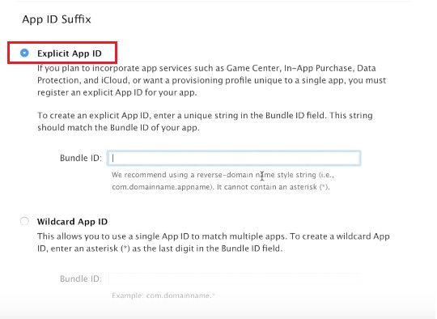
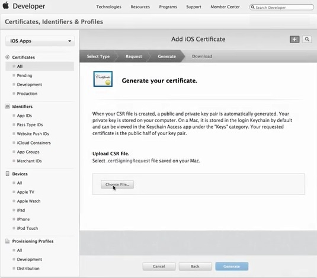
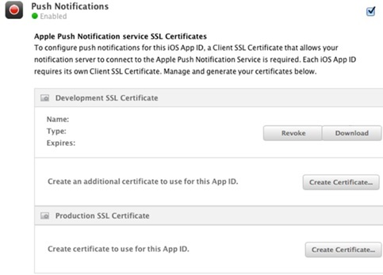
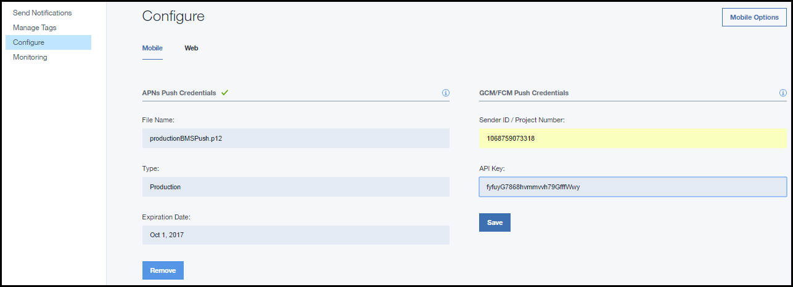

---

copyright:
 years: 2015, 2016

---

{:new_window: target="_blank"}
# Configurazione delle credenziali per APNs
{: #create-push-credentials-apns}
Ultimo aggiornamento: 17 ottobre 2016
{: .last-updated}

Il servizio APNS (Apple Push Notification Service) consente agli sviluppatori dell'applicazione di inviare notifiche remote dall'istanza del servizio {{site.data.keyword.mobilepushshort}} su Bluemix (il provider) alle applicazioni e ai dispositivi iOS. I messaggi sono inviati a un'applicazione di destinazione sul dispositivo. 

Ottieni e
        configura le tue credenziali APNS. I certificati APNS sono gestiti in modo sicuro dal servizio {{site.data.keyword.mobilepushshort}} e utilizzati per stabilire una connessione al server APNs come un provider.

<!-- 1. Obtain an [Apple Developers](https://developer.apple.com/) account.-->

<!--2. [Register an App ID](#create-push-credentials-apns-register)
3. [Create a development and distribution APNs SSL certificate](#create-push-credentials-apns-ssl)
4. [Create a development provisioning profile](#create-push-credentials-dev-profile)
5. [Create a store distribution provisioning profile](#create-push-credentials-apns-distribute_profile)
6. [Creating .p12 push certificate file for Bluemix push](#create-p12-push-certificate-file-for-Bluemix-push)
7. [Set up APNs on the Push Dashboard](#create-push-credentials-apns-dashboard)
-->

##Registrazione di un ID applicazione
{: #create-push-credentials-apns-register}

L'ID applicazione (l'identificativo del bundle) è un identificativo univoco che identifica una specifica
             applicazione. Ogni applicazione richiede un ID applicazione. I servizi come {{site.data.keyword.mobilepushshort}} sono configurati sull'ID applicazione.

1. Assicurati di disporre di un account [Apple Developers](https://developer.apple.com/).
2. Vai al portale [Apple Developer](https://developer.apple.com), fai clic su **Member Center** e seleziona **Certificates, Identifiers & Profiles**.
3. Vai alla sezione **Registering App IDs** nella [Apple Developer Library](https://developer.apple.com/library/mac/documentation/IDEs/Conceptual/AppDistributionGuide/MaintainingProfiles/MaintainingProfiles.html#//apple_ref/doc/uid/TP40012582-CH30-SW991) e attieniti alle istruzioni per registrare l'ID applicazione.

Quando registri un ID applicazione, seleziona le seguenti opzioni:

* Push Notifications

* Explicit ID Suffix

4. Crea un certificato SSL di APNS di sviluppo e distribuzione.

##Crea un certificato SSL di APNS di sviluppo e distribuzione
{: #create-push-credentials-apns-ssl}

Prima di poter ottenere un certificato APNS, devi generare una CSR (certificate
            signing request) e inoltrarla ad Apple, l'autorità di certificazione (CA). La CSR contiene informazioni che identificano la tua società e la tua chiave pubblica e privata che usi per firmare le tue notifiche di push Apple. Genera quindi il certificato SSL
            nel portale per sviluppatori iOS. Il certificato, insieme alla sua chiave pubblica e a quella privata,
             viene archiviato in Keychain Access.

<!-- ###Before you begin -->
<!-- {: before-you-begin-certificate} -->

<!--[Register an App ID](#create-push-credentials-apns-register)-->

Puoi utilizzare le APNs in due modi: 

* Modalità sandbox per lo sviluppo e il test.
* Modalità produzione quando si distribuiscono le applicazioni tramite l'App Store (o altri meccanismi di distribuzione aziendali).

Devi ottenere dei certificati separati per gli ambienti di sviluppo e
                    distribuzione. I certificati sono associati a un ID applicazione per l'applicazione
                    destinataria delle notifiche remote. per la produzione, è possibile creare fino a
                    due certificati. Bluemix utilizza i certificati per stabilire una connessione SSL
                    con APNS.

<!-- Create a development and distribution SSL certificate. -->

1. Vai al sito web [Apple Developer](https://developer.apple.com), fai clic su **Member Center** e seleziona **Certificates, Identifiers & Profiles**.
2. Nell'area **Identifiers**, fai clic su **App
                            IDs**.
3. Dall'elenco di ID applicazione, seleziona il tuo ID applicazione <!--newly created--> e seleziona quindi **Settings**.
4. Nell'area **Push Notifications**, crea un certificato SSL di sviluppo e quindi
                        un certificato SSL di produzione.

	

5. Quando viene visualizzata la **schermata About Creating a Certificate Signing Request (CSR)**, avvia l'applicazione **Keychain Access** nel tuo Mac per creare una CSR (Certificate Signing Request).
6. Dal menu, seleziona **Keychain Access > Certificate Assistant > Request a Certificate From a Certificate Authority…** 
7. In **Certificate Information**, immetti l'indirizzo email che è associato al tuo account di sviluppatore di applicazioni e un nome comune. Fornisci un nome significativo che ti aiuta a identificare se si tratta di un certificato per lo sviluppo (sandbox) o la distribuzione (produzione); ad esempio, *sandbox-apns-certificate* o *production-apns-certificate*.
8. Seleziona **Save to disk** per scaricare il file `.certSigningRequest` sul tuo desktop e fai quindi clic su **Continue**.
9. Nell'opzione del menu **Save As**, denomina il file `.certSigningRequest` e fai clic su **Save**.
10. Fai clic su **Done**. Ora hai una CSR.
11. Ritorna nella finestra **About Creating a Certificate Siging Request (CSR)** e fai clic su **Continue**. 
12. Dalla schermata **Generate**, fai clic su **Choose
                            File ... **e seleziona il file CSR che avevi salvato sul tuo
                        desktop. Fai quindi clic su **Generate**.
	
13. Quando il tuo certificato è pronto, fai clic su **Done**.
14. Sulla schermata **Push Notifications**, fai clic su **Download** per scaricare il tuo certificato e fai quindi clic su **Done**. 
	
15. Sul tuo Mac, vai a **Keychain Access > My Certificates**, e individua il certificato appena installato. Fai doppio clic sul certificato per installarlo in Keychain Access.
16. Seleziona il certificato (certificate) e la chiave privata (private key) e seleziona quindi **Export** per convertire il certificato nel formato Personal Information Exchange (formato `.p12`).
	
17. Nel campo **Save As**, dai al certificato un nome significativo. Ad esempio, `sandbox_apns.p12_certifcate` o `production_apns.p12` e fai quindi clic su **Save**.
	
18. Nel campo **Enter a password**, immetti una password per proteggere gli elementi esportati e fai quindi clic su **OK**. Puoi utilizzare questa password per configurare le tue impostazioni APNS sul dashboard Push.{: #step18}
	
19. **Key Access.app** ti chiede di esportare la tua chiave dalla schermata **Keychain**. Immetti la tua password amministrativa per il tuo Mac per consentire al tuo sistema di esportare questi elementi e seleziona quindi l'opzione **Always Allow**. Sul tuo desktop viene generato un certificato `.p12`.

##Creazione di profilo di provisioning di sviluppo
{: #create-push-credentials-dev-profile}

Il profilo di provisioning utilizza l'ID applicazione per determinare quali sono
            i dispositivi su cui può essere installata ed eseguita la tua applicazione e quali sono
            i servizi a cui la tua applicazione può accedere. Per ogni ID applicazione, crei
            due profili di provisioning: uno per lo sviluppo e l'altro per la distribuzione. Xcode utilizza il profilo di provisioning di sviluppo per determinare quali sono
            gli sviluppatori a cui è consentito creare l'applicazione e quali sono i dispositivi
            di cui è consentita l'esecuzione di test sull'applicazione.

###Prima di cominciare
{: before-you-begin-provisioning-file}

Assicurati di aver registrato un ID applicazione, di averlo abilitato
                    per Push Notification Service e di averlo configurato per utilizzare un certificato SSL di
                    APNS di sviluppo e produzione.

Crea un profilo di provisioning di sviluppo nel seguente modo:

1. Vai al portale [Apple Developer](https://developer.apple.com), fai clic su **Member Center** e seleziona **Certificates, Identifiers & Profiles**.
2. Vai al sito [Mac Developer Library ](https://developer.apple.com/library/mac/documentation/IDEs/Conceptual/AppDistributionGuide/MaintainingProfiles/MaintainingProfiles.html#//apple_ref/doc/uid/TP40012582-CH30-SW62site) , passa alla sezione **Creating Development Provisioning Profiles** e attieniti alle istruzioni per creare un profilo di sviluppo.
**Nota**: quando configuri un profilo di provisioning di sviluppo, seleziona le seguenti opzioni:
	* **iOS App Development**
	* **For iOS and watchOS apps **

##Creazione di un profilo di provisioning di distribuzione di archivio
{: #create-push-credentials-apns-distribute_profile}

Utilizza il profilo di provisioning di archivio per inoltrare la tua applicazione per la distribuzione all'App Store.

1. Vai al portale [Apple Developer](https://developer.apple.com), fai clic su **Member Center** e seleziona **Certificates, Identifiers & Profiles**.
2. Fai doppio clic sul file di provisioning scaricato per installarlo in Xcode.

##Configurazione APNs sul dashboard {{site.data.keyword.mobilepushshort}}
{: #create-push-credentials-apns-dashboard}

Per utilizzare il servizio {{site.data.keyword.mobilepushshort}} per inviare notifiche, carica i certificati SSL richiesti per APNS (Apple Push Notification Service). Puoi inoltre utilizzare l'API REST per caricare un certificato APNS.

###Prima di cominciare
{: before-you-begin-dashboard}

<!-- Get your development and production APNs SSL certificate and the password associated with each type of certificate. For information, see Creating and configuring push credentials for APNs.-->

I certificati necessari per APNs sono i certificati `.p12`, che contengono la chiave privata, e i certificati SSL richiesti per creare e pubblicare la tua applicazione. Devi generare i certificati dal Member Center del sito Web Apple
                    Developer (per il quale è richiesto un account Apple Developer
                valido). Sono richiesti dei certificati separati per l'ambiente di sviluppo (sandbox) e
                    l'ambiente di produzione (distribuzione).

**Nota**: dopo che il file `.cer` è presente nel tuo accesso alla catena di chiavi, eseguine l'esportazione sul tuo computer per creare un certificato `.p12`.

Per ulteriori informazioni sull'utilizzo di APNS, vedi [iOS Developer Library: Local and Push
                    Notification Programming Guide](https://developer.apple.com/library/ios/documentation/NetworkingInternet/Conceptual/RemoteNotificationsPG/Chapters/ProvisioningDevelopment.html#//apple_ref/doc/uid/TP40008194-CH104-SW4).

Configura APNS sul dashboard Push nel seguente modo:

1. Apri la tua applicazione di backend nel dashboard Bluemix e fai quindi clic sul servizio **IBM Push Notifications**
                        per aprire il dashboard Push.

	Viene visualizzato il dashboard Push:
	
2. Nella scheda **Configuration**, vai alla sezione **Apple Push Certificate**, seleziona **Sandbox** (sviluppo) o **Production** (sviluppo) e quindi carica il certificato `p.12` che hai creato utilizzando il precedente [passo](#step18).
	
3. Nel campo **Password**, immetti la password associata al file di certificato `.p12` e quindi fai clic su **Save**.

Dopo che i certificati sono
                     stati caricati correttamente con una password valida, puoi iniziare a inviare notifiche.
