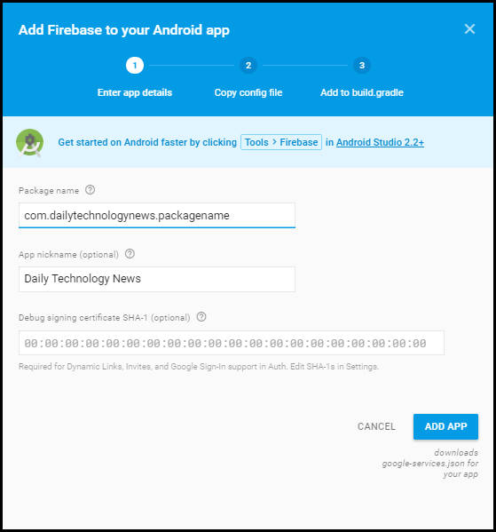
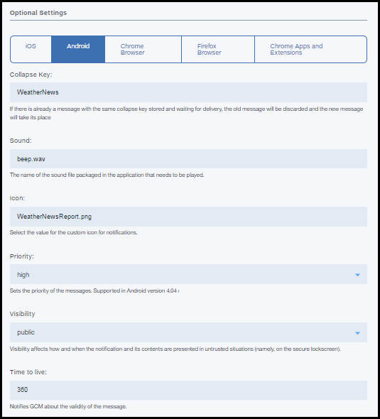

---

copyright:
years: 2015, 2017

---

{:new_window: target="_blank"}
{:shortdesc: .shortdesc}
{:screen:.screen}
{:codeblock:.codeblock}

# Android アプリケーションによる{{site.data.keyword.mobilepushshort}}受け取りの可能化
{: #tag_based_notifications}
最終更新日: 2017 年 1 月 16 日
{: .last-updated}

Android アプリケーションでデバイスへのプッシュ通知を受け取れるようにすることができます。Android Studio が前提条件であり、Android プロジェクトをビルドするための推奨方式です。Android Studio の基本知識が必要です。

## Gradle を使用したクライアント Push SDK のインストール
{: #android_install}

このセクションでは、Android アプリケーションをさらに開発するためにクライアント Push SDK をインストールして使用する方法について説明します。

Bluemix® Mobile Services Push SDK は、Gradle を使用して追加できます。Gradle は自動的に成果物をリポジトリーからダウンロードして、Android アプリケーションで使用できるようにします。Android Studio および Android Studio SDK が正しくセットアップされていることを確認してください。システムのセットアップ方法について詳しくは、[Android Studio の概要](https://developer.android.com/tools/studio/index.html "外部リンク・アイコン"){: new_window}を参照してください。Gradle について詳しくは、[Gradle でのビルドの構成](http://developer.android.com/tools/building/configuring-gradle.html "外部リンク・アイコン"){: new_window}に関する資料を参照してください。

モバイル・アプリケーションを作成して開いてから、Android Studio を使用して以下の手順を実行します。

1. モジュール・レベルの **build.gradle** ファイルに、依存関係を追加します。 	

	- 以下の依存関係を追加して、Bluemix™ Mobile サービスの Push クライアント SDK と Google Play サービス SDK を、コンパイル有効範囲の依存関係に含めます。
	```
	com.ibm.mobilefirstplatform.clientsdk.android:push:3.+
	```
    	{: codeblock}
	
	- コード・スニペットに必要なインポート・ステートメントに、以下の依存関係を追加します。
	```
	import com.ibm.mobilefirstplatform.clientsdk.android.core.api.BMSClient;
	import com.ibm.mobilefirstplatform.clientsdk.android.push.api.MFPPush;
	import com.ibm.mobilefirstplatform.clientsdk.android.push.api.MFPPushException;
	import com.ibm.mobilefirstplatform.clientsdk.android.push.api.MFPPushResponseListener;
	import com.ibm.mobilefirstplatform.clientsdk.android.push.api.MFPPushNotificationListener;
	import com.ibm.mobilefirstplatform.clientsdk.android.push.api.MFPSimplePushNotification;
	```
    	{: codeblock}

	- 次の依存関係をモジュール・レベルの **build.gradle** ファイルの最後に追加します。
	```
		apply plugin: 'com.google.gms.google-services'
	```
		{: codeblock}
3. プロジェクト・レベルの **build.gradle** ファイルに、以下の依存関係を追加します。
```
dependencies {
classpath 'com.android.tools.build:gradle:3.0.0'
    classpath 'com.google.gms:google-services:3.0.0'
}
``` 
    {: codeblock}
5. **AndroidManifest.xml** ファイルに、以下のアクセス権を追加します。サンプル・マニフェストを表示するには、[Android helloPush Sample Application ](https://github.com/ibm-bluemix-mobile-services/bms-samples-android-hellopush/blob/master/helloPush/app/src/main/AndroidManifest.xml "外部リンク・アイコン"){: new_window}を参照してください。サンプル Gradle ファイルを表示するには、[build.gradle のサンプル・ファイル](https://github.com/ibm-bluemix-mobile-services/bms-samples-android-hellopush/blob/master/helloPush/app/build.gradle "外部リンク・アイコン"){: new_window}を参照してください。
```
<uses-permission android:name="android.permission.INTERNET"/>
<uses-permission android:name="android.permission.GET_ACCOUNTS" />
<uses-permission android:name="android.permission.USE_CREDENTIALS" />
<uses-permission android:name="android.permission.WRITE_EXTERNAL_STORAGE" />
<uses-permission android:name="android.permission.ACCESS_WIFI_STATE"/>
```
	{: codeblock}
ここをクリックすると、[Android のパーミッション](http://developer.android.com/guide/topics/security/permissions.html "外部リンク・アイコン"){: new_window}の詳細情報が表示されます。
4. アクティビティーの通知インテント設定を追加します。この設定により、ユーザーが通知エリアで受信した通知をクリックすると、アプリケーションが開始します。
```
<intent-filter>
	<action android:name="Your_Android_Package_Name.IBMPushNotification"/>
	<category  android:name="android.intent.category.DEFAULT"/>
</intent-filter>
```
	{: codeblock}
**注**: 上記のアクション内の *Your_Android_Package_Name* を、アプリケーションで使用されているアプリケーション・パッケージ名に置き換えてください。

5. RECEIVE および REGISTRATION のイベント通知用に、Firebase Cloud Messaging (FCM) または Google Cloud Messaging (GCM) のインテント・サービスとインテント・フィルターを追加します。
```
<service android:name="com.ibm.mobilefirstplatform.clientsdk.android.push.api.MFPPushIntentService"
    android:exported="true" >
    <intent-filter>
        <action android:name="com.google.firebase.MESSAGING_EVENT" />
    </intent-filter>
</service>
<service
    android:name="com.ibm.mobilefirstplatform.clientsdk.android.push.api.MFPPush"
    android:exported="true" >
    <intent-filter>
        <action android:name="com.google.firebase.INSTANCE_ID_EVENT" />
    </intent-filter>
</service>
```
    {: codeblock}

6. {{site.data.keyword.mobilepushshort}} サービスは、通知トレイからの個々の通知の取り出しをサポートします。通知トレイから通知にアクセスする場合、クリックしている通知のみへのハンドルが提供されます。アプリケーションを通常どおりに開いた場合は、すべての通知が表示されます。この機能を使用するには、以下のスニペットを使用して **AndroidManifest.xml** ファイルを更新します。

```
<activity android:name="
com.ibm.mobilefirstplatform.clientsdk.android.push.api.MFPPushNotificationHandler"
android:theme="@android:style/Theme.NoDisplay"/>
```
    {: codeblock}

FCM プロジェクトのセットアップおよび資格情報の取得については、[送信側 ID と API キーの取得](t_push_provider_android.html)を参照してください。Firebase Cloud Messaging (FCM) コンソールを使用して、以下の手順を実行します。

1. Firebase コンソールで、**「Project Settings (プロジェクト設定)」** アイコンをクリックします。

3. アプリケーション・ペインの「General (一般)」タブから、**「ADD APP」**または**「Android アプリへの Firebase の追加 (Add Firebase to your Android app)」アイコン**を選択します。

4. 「Android アプリへの Firebase の追加 (Add Firebase to your Android app)」ウィンドウで、パッケージ名として **com.ibm.mobilefirstplatform.clientsdk.android.push** を追加します。「アプリのニックネーム (App nickname)」フィールドはオプションです。**「ADD APP」**をクリックします。

5. 「Android アプリへの Firebase の追加 (Add Firebase to your Android app)」ウィンドウにパッケージ名を入力して、アプリケーションのパッケージ名を組み込みます。「アプリのニックネーム (App nickname)」フィールドはオプションです。**「ADD APP」**をクリックします。 

	

6. `google-services.json` ファイルが生成されます。`google-services.json` ファイルを Android アプリケーション・モジュールのルート・ディレクトリーにコピーします。この `google-service.json` ファイルには、追加されたパッケージ名が含まれていることに注意してください。

    

5. 「Android アプリへの Firebase の追加 (Add Firebase to your Android app)」ウィンドウで、**「続行」**をクリックして、**「終了 (Finish)」**をクリックします。 

  

アプリケーションをビルドして、実行します。

## Android アプリ用の Push SDK の初期化
{: #android_initialize}

初期化コードを配置する一般的な場所は、Android アプリケーション内のメインアクティビティーの onCreate メソッド内です。初期化を必要とする SDK のコンポーネントが 2 つあります。1 つは Core SDK であり、もう 1 つは Core SDK の上にビルドされた Push SDK です。

###Core SDK を初期化します。

```
// Initialize the SDK for Android
    BMSClient.getInstance().initialize(this, BMSClient.REGION_US_SOUTH);
```
    {: codeblock}

####bluemixRegionSuffix
{: bluemixRegionSuffix}

アプリがホストされている場所を指定します。次の 3 つの値のいずれかを使用できます。

- BMSClient.REGION_US_SOUTH
- BMSClient.REGION_UK
- BMSClient.REGION_SYDNEY

###クライアント Push SDK を初期化します。

```
//Initialize client Push SDK for Java
MFPPush push = MFPPush.getInstance();
push.initialize(getApplicationContext(), "appGUID", "clientSecret");
```
	{: codeblock}

####AppGUID
{: appguid_initialize_client_push_sdk}

これは、{{site.data.keyword.mobilepushshort}}サービスの AppGUID キーです。この値では、大/小文字が区別されます。「Push Notification」ダッシュボードを開き、「構成」タブを選択します。「Push Notification」サービス・ダッシュボード上の「構成」タブの「モバイル・オプション」から、この値を取得できます。 

## Android デバイスの登録
{: #android_register}

`MFPPush.register()` API を使用して、デバイスを{{site.data.keyword.mobilepushshort}}サービスに登録します。Android デバイスを登録するには、Firebase Cloud Messaging (FCM) または Google Cloud Messaging (GCM) の情報を、Bluemix {{site.data.keyword.mobilepushshort}} サービス構成ダッシュボードに追加します。詳しくは、[Google Cloud Messaging の資格情報の構成](t_push_provider_android.html)を参照してください。

以下のコード・スニペットを Android モバイル・アプリケーションにコピーします。

```
//Register Android devices
	push.registerDevice(new MFPPushResponseListener<String>() {
	    @Override
    public void onSuccess(String deviceId) {
        //handle success here
	    }
	    @Override
    public void onFailure(MFPPushException ex) {
         //handle failure here
	    }
	});
```
	{: codeblock}


```
//Handles the notification when it arrives
	MFPPushNotificationListener notificationListener = new MFPPushNotificationListener() {
	    @Override
	    public void onReceive (final MFPSimplePushNotification message){
	      // Handle Push Notification
	    }
	};
```
	{: codeblock}

## Android デバイスでのプッシュ通知の受け取り
{: #android_receive}

notificationListener オブジェクトを Push に登録するには、**MFPPush.listen()** メソッドを呼び出します。このメソッドは通常、プッシュ通知を処理しているアクティビティーの **onResume()** メソッドから呼び出されます。

1. notificationListener オブジェクトを Push に登録するには、**listen()** メソッドを呼び出します。このメソッドは通常、プッシュ通知を処理しているアクティビティーの **onResume()** メソッドおよび **onPause** メソッドから呼び出されます。


```
@Override
	protected void onResume(){
	   super.onResume();
	   if(push != null) {
	       push.listen(notificationListener);
	   }
	}
```
	{: codeblock}


```
@Override
protected void onPause() {
    super.onPause();
    if (push != null) {
        push.hold();
    }
}
```
	{: codeblock}

2. プロジェクトをビルドし、デバイスまたはエミュレーター上で実行します。register() メソッド内で応答リスナーに対する onSuccess() メソッドが呼び出されたら、デバイスは{{site.data.keyword.mobilepushshort}}サービスに正常に登録されていると確定されます。この時点で、『基本プッシュ通知の送信』に説明されている方法でメッセージを送信できます。
3. デバイスが通知を受信していることを確認します。アプリケーションがフォアグラウンドにある場合は、通知は **MFPPushNotificationListener** により処理されます。アプリケーションがバックグラウンドにある場合は、メッセージが通知バーに表示されます。

## Android デバイスでのプッシュ通知のモニター
{: #android_monitor}

アプリケーション内で通知の現在の状況をモニターするには、`com.ibm.mobilefirstplatform.clientsdk.android.push.api.MFPPushNotificationStatusListener` インターフェースを実装し、メソッド onStatusChange(String messageId, MFPPushNotificationStatus status) を定義します。 

**messageId** は、サーバーから送信されたメッセージの ID です。**MFPPushNotificationStatus** は、以下のように、通知の状況を値として定義します。

- **RECEIVED** - アプリは通知を受信済みです。 
- **QUEUED** - アプリは通知リスナーを呼び出すために、通知をキューに入れました。 
- **OPENED** - ユーザーが、トレイ内の通知をクリックするか、アプリ・アイコンから起動するか、またはアプリがフォアグラウンドにあるときに起動して、通知を開きました。 
- **DISMISSED** - ユーザーがトレイ内の通知をクリアまたは破棄しました。

**com.ibm.mobilefirstplatform.clientsdk.android.push.api.MFPPushNotificationStatusListener** クラスを MFPPush に登録する必要があります。

```
push.setNotificationStatusListener(new MFPPushNotificationStatusListener() {
@Override
public void onStatusChange(String messageId, MFPPushNotificationStatus status) {
// Handle status change
}
});
```
    {: codeblock}


### DISMISSED 状況の listen

以下のいずれかの条件に基づいて DISMISSED 状況を listen することを選択できます。

- アプリがアクティブのとき (フォアグラウンドまたはバックグラウンドで実行中)

  次のスニペットを `AndroidManifest.xml` ファイルに追加します。

```
<receiver android:name="com.ibm.mobilefirstplatform.clientsdk.android.push.api.MFPPushNotificationDismissHandler">
<intent-filter>
<action android:name="Your_Android_Package_Name.Cancel_IBMPushNotification"/>
</intent-filter>
</receiver>
```
	{: codeblock}

- アプリがアクティブのとき (フォアグラウンドまたはバックグラウンドで実行中) と未実行 (クローズ済み) のときの両方

**com.ibm.mobilefirstplatform.clientsdk.android.push.api.MFPPushNotificationDismissHandler** ブロードキャスト・レシーバーを拡張して、メソッド **onReceive()** をオーバーライドする必要があります。ここで、**MFPPushNotificationStatusListener** は、基本クラスのメソッド **onReceive()** を呼び出す前に登録しておく必要があります。

```
public class MyDismissHandler extends MFPPushNotificationDismissHandler {
@Override
public void onReceive(Context context, Intent intent) {
MFPPush.getInstance().setNotificationStatusListener(new MFPPushNotificationStatusListener() {
@Override
public void onStatusChange(String messageId, MFPPushNotificationStatus status) {
// Handle status change
}
});
super.onReceive(context, intent);
}
}
```
    {: codeblock}


以下のスニペットを `AndroidManifest.xml` ファイルに追加します。

```
<receiver android:name="Your_Android_Package_Name.Your_Handler">
<intent-filter>
<action android:name="Your_Android_Package_Name.Cancel_IBMPushNotification"/>
</intent-filter>
</receiver>
```
    {: codeblock}

## 基本{{site.data.keyword.mobilepushshort}}の送信
{: #send}

アプリケーションの開発が完了したら、基本プッシュ通知を送信できます。

基本プッシュ通知を送信するには、以下の手順を実行します。

1. **「通知の送信 (Send Notifications)」**を選択し、**「送信先 (Send To)」**オプションを選択することでメッセージを構成します。サポートされるオプションは、**「タグ指定によるデバイス (Device by Tag)」**、**「デバイス ID (Device Id)」**、**「ユーザー ID」**、**「Android デバイス (Android devices)」**、**「iOS デバイス (iOS devices)」**、**「Web 通知 (Web Notifications)」**、および**「すべてのデバイス」**です。
**注**: **「すべてのデバイス」**オプションを選択すると、{{site.data.keyword.mobilepushshort}}をサブスクライブしているすべてのデバイスが通知を受け取ることになります。

2. **「メッセージ」**フィールドで、メッセージを構成します。必要に応じてオプションの設定を構成してください。
3. **「送信」**をクリックします。
3. デバイスが通知を受信していることを確認します。

次のスクリーン・ショットは、Android デバイスのフォアグラウンドでプッシュ通知を処理しているアラート・ボックスを示しています。


次のスクリーン・ショットは、Android のバックグラウンドでのプッシュ通知を示しています。
	


### 通知を送信するためのオプションの Android 設定
{: #send_otpional_setting}

Android デバイスに通知を送信するための{{site.data.keyword.mobilepushshort}}設定をさらに詳細にカスタマイズできます。以下の任意指定のカスタマイズ・オプションがサポートされます。


- **省略キー (Collapse Key)**:  省略キーは通知にアタッチされます。デバイスがオフラインのときに、同じ省略キーを持つ複数の通知が連続して到着すると、それらは省略されます。デバイスがオンラインになると、FCM/GCM サーバーから通知を受け取り、同じ省略キーを持つ最新の通知のみを表示します。省略キーが設定されていない場合、新しいメッセージと古いメッセージの両方が将来の配信のために保管されます。
- **音 (Sound)**: 通知の受信時に音声クリップを再生するかどうかを示します。デフォルト、またはアプリにバンドルされている音声リソースの名前がサポートされます。
- **アイコン (Icon)**: 通知用に表示されるアイコンの名前を指定します。クライアント・アプリケーションを使用して、アイコンを res/drawable フォルダーにパッケージしてあることを確認してください。
- **優先度 (Priority)**: メッセージに配信の優先度を割り当てるためのオプションを指定します。`high` または `max` の優先度は注意喚起の通知になり、一方、`low` または `default` の優先度のメッセージは、スリープ中デバイスに対してネットワーク接続を開きません。このオプションが `min` に設定されたメッセージの場合、サイレント通知になります。
- **可視性 (Visibility)**: 通知の可視性オプションは `public` または `private` のいずれかに設定できます。`private` オプションにすると、公開表示は制限されます。デバイスが PIN またはパターンによって保護されており、通知設定が「機密の通知内容を隠す (Hide sensitive notification content)」に設定されている場合は、公開表示を有効にするように選択できます。可視性を `private` に設定する場合は、「redact」フィールドの指定が必要です。
「redact」フィールドに指定された内容のみが、保護されてロックされているデバイスの画面に表示されます。`public` を選択すると、通知は自由に読み取りされる状態になります。
- **存続時間**: この値は秒単位で設定します。このパラメーターを指定しないと、FCM/GCM サーバーはメッセージを 4 週間保管し、配信を試行します。4 週間が経過すると、有効期限が切れます。可能な値の範囲は、0 から 2,419,200 秒です。
- **アイドル時は遅延 (Delay when idle)**: デバイスがアイドル状態の場合、通知を配信しないように FCM/GCM サーバーに指示するには、この値を `true` に設定します。デバイスがアイドル状態であっても通知を配信できるようにするには、この値を `false` に設定します。
- **同期**: このオプションを `true` に設定すると、ユーザーのすべての登録済みデバイス間で通知が同期化されます。あるユーザー名を持つユーザーが、同じアプリケーションがインストールされている複数のデバイスを所持している場合、1 台のデバイスで通知を読むと、その他のデバイスの通知は削除されます。
このオプションが機能するためには、ユーザーが userId を指定して
{{site.data.keyword.mobilepushshort}}サービスに登録されていることを確認する必要があります。
- **追加のペイロード (Additional payload)**: 通知用のカスタム・ペイロードの値を指定します。


## 次のステップ
{: #next_steps_tags}

基本通知を正常にセットアップしたら、タグ・ベースの通知および詳細オプションの構成を行うことができます。


以下の Push Notifications Service の機能を、ご使用のアプリに追加します。
タグ・ベースの通知を使用する場合は、[タグ・ベースの通知](c_tag_basednotifications.html)を参照してください。
拡張通知オプションを使用する場合は、[拡張プッシュ通知の使用可能化](t_advance_badge_sound_payload.html)を参照してください。
