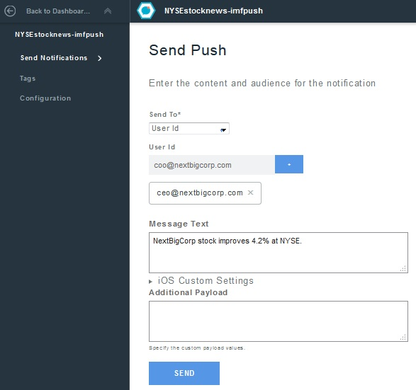

---

copyright:
 years: 2015, 2016

---


# ユーザー ID を使用したデバイスの登録
{: #register_device_with_userId}
最終更新日: 2016 年 8 月 16 日
{: .last-updated}

ユーザー ID ベースの通知への登録を行うには、以下の手順を実行します。

## Android
{: android-register}
 
{{site.data.keyword.mobilepushshort}}サービスの `AppGUID` および `clientSecret` キーを使用して MFPPush クラスを初期化します。

```
// Initialize the MFPPush
push = MFPPush.getInstance();
push.initialize(getApplicationContext(),"AppGUID", "clientSecret");
```

####AppGUID
{: push-app-guid}

これは、{{site.data.keyword.mobilepushshort}}サービスの AppGUID キーです。

####clientSecret
{: android-client-secret}

これは、{{site.data.keyword.mobilepushshort}}サービスの clientSecret キーです。

**registerDeviceWithUserId** API を使用して、デバイスを{{site.data.keyword.mobilepushshort}}に登録します。

```
// Register the device to {{site.data.keyword.mobilepushshort}}.
push.registerDeviceWithUserId("userId",new MFPPushResponseListener<String>() {
    @Override
    public void onSuccess(String deviceId) {
        Log.d("Device is registered with Push Service.");
    }

    @Override
    public void onFailure(MFPPushException ex) {
        Log.d("Error registering with Push Service...\n"
        + "Push notifications will not be received.");
    }
});
```

####userId
{: android-user-id}

{{site.data.keyword.mobilepushshort}}への登録を行うための固有のユーザー ID 値を渡します。

**注:** UserId によってターゲット指定される{{site.data.keyword.mobilepushshort}}を有効にするには、必ず、デバイスを UserId に登録し、{{site.data.keyword.mobilepushshort}}サービスのプロビジョン時に割り振られる「clientSecret」も渡してください。有効なクライアント秘密鍵を渡さないと、デバイスの登録は失敗します。


## Cordova
{: cordova-register}

userId ベースの通知への登録を行うには、次のコード・スニペットをモバイル・アプリケーションにコピーします。

`clientsecret` を使用して `MFPPush` を初期化します。 

```
MFPPush.initialize("appGUID", "clientSecret");
```

###appGUID 
{: cordova-pushappguid}

これは、{{site.data.keyword.mobilepushshort}}サービスの AppGUID キーです。 

####clientSecret 
{: cordova-client-secret}

これは、{{site.data.keyword.mobilepushshort}}サービスの clientSecret キーです。

```
//Register for {{site.data.keyword.mobilepushshort}} with userId
var userId = "userId";
MFPPush.registerDevice({},success,failure,userId);
```
####userId
{: cordova-user-id}

{{site.data.keyword.mobilepushshort}}サービスへの登録を行うための固有のユーザー ID 値を渡します。


## Objective-C
{: objc-register}

以下の API を使用して、UserId ベースの{{site.data.keyword.mobilepushshort}}への登録を行います。

```
// Initialize the MFPPush
IMFPushClient* push = [IMFPushClient sharedInstance];
[push initializeWithAppGUID:@"appGUID" clientSecret:@"clientSecret"];
```
###AppGUID 
{: objc-pushappguid}

これは、{{site.data.keyword.mobilepushshort}}サービスの AppGUID キーです。

####clientSecret
{: objc-client-secret}

これは、{{site.data.keyword.mobilepushshort}}サービスの clientSecret キーです。

**registerWithUserId** API を使用して、デバイスを{{site.data.keyword.mobilepushshort}}に登録します。

```
// Register the device to push notifications service.
[push registerWithDeviceToken:deviceToken WithUserId:@"userId" completionHandler:^(IMFResponse *response, NSError *error) {
    NSString *message=@"";

	if (error){
        message = [NSString stringWithFormat:@"Error registering for push notifications: %@", error.description];
        NSLog(@"%@",message);
    } else {
        message=@"Successfully registered for push notifications";
        NSLog(@"%@",message);
    }
}];
```


####userId 
{: objc-user-id}

{{site.data.keyword.mobilepushshort}}への登録を行うための固有のユーザー ID 値を渡します。

## Swift
{: swift-register}

```
// Initialize the BMSPushClient
let push =  BMSPushClient.sharedInstance
push.initializeWithAppGUID("appGUID", clientSecret:"clientSecret")
```

####AppGUID 
{: swift-pushappguid}
これは、{{site.data.keyword.mobilepushshort}}サービスの AppGUID キーです。

####clientSecret
{: swift-client-secret} 

これは、{{site.data.keyword.mobilepushshort}}サービスの clientSecret キーです。

**registerWithUserId** API を使用して、デバイスを{{site.data.keyword.mobilepushshort}}に登録します。

```
// Register the device to Push Notifications service.
push.registerWithDeviceToken("deviceToken", WithUserId: "userId")  { (response, statusCode, error) -> Void in
if error.isEmpty {

    print( "Response during device registration : \(response)")

        print( "status code during device registration : \(statusCode)")

    }  else {
print( "Error during device registration \(error) ")
    }
}
```

####userId 
{: swift-user-id}

{{site.data.keyword.mobilepushshort}}への登録を行うための固有のユーザー ID 値を渡します。


# ユーザー ID ベースの通知の使用
{: #using_userid}


ユーザー ID ベースの通知は、特定のユーザーをターゲットとする通知メッセージです。1 つのユーザーで複数のデバイスを登録できます。以下の手順では、ユーザー ID ベースの通知の送信方法を説明します。 

1. **「Push Notification」**ダッシュボードで、**「通知」**タブをクリックします。
1. ユーザー ID ベースの通知を送信するために、**「UserId」**オプションを選択します。
1. **「ユーザー ID の検索 (Search UserId)」**フィールドで、使用するユーザー ID を検索し、**「+ 追加 (+Add)」**ボタンをクリックします。
1. **「メッセージ・テキスト (Message Text)」**フィールドに、通知で送信するテキストを入力します。
1. **「送信」**ボタンをクリックします。
