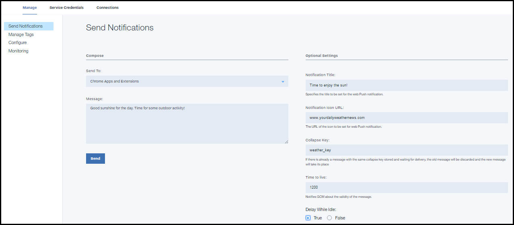

---

copyright:
 years: 2015 2016

---


# Ativando os Apps Chrome e Extensões para receber {{site.data.keyword.mobilepushshort}}
{: #web_notifications}
Última atualização: 17 de outubro de 2016
{: .last-updated}

Agora é possível ativar os Apps Chrome e Extensões para receber {{site.data.keyword.mobilepushshort}}.

## Instalando o SDK do cliente para {{site.data.keyword.mobilepushshort}}
{: #web_install}

Este tópico descreve como instalar e usar o SDK de Push do JavaScript do cliente para desenvolver ainda mais os seus Apps Chrome e Extensões.

### Inicialização nos Apps Google Chrome e Extensões

Para instalar o SDK do Javascript nos Apps Chrome e Extensões, conclua as etapas:

Faça download do `BMSPushSDK.js` e do `manifest_Chrome_Ext.json` (para Extensões do Chrome) ou
do `manifest_Chrome_App.json` (para Apps Chrome) a partir do
[SDK de push da Web do Bluemix](https://codeload.github.com/ibm-bluemix-mobile-services/bms-clientsdk-javascript-webpush/zip/master).


- Para Apps Chrome, configure o arquivo manifest:
 1. No arquivo `manifest_Chrome_App.json`, forneça o nome, a descrição e os ícones.
 2. Inclua o `BMSPushSDK.js` no `app.background.scripts`.
 3. Mude o `manifest_Chrome_App.json` para `manifest.json`.

- Para Extensões do Chrome, configure o arquivo manifest:
 1. No arquivo `manifest_Chrome_Ext.json` forneça o nome, a descrição e os ícones.
 2. Inclua o `BMSPushSDK.js` no `background.scripts`.
 3. Mude o `manifest_Chrome_Ext.json` para `manifest.json`.

No arquivo `background.js` inclua o seguinte para receber notificações push 
```
chrome.gcm.onMessage.addListener(BMSPushBackground.onMessageReceived)
chrome.notifications.onClicked.addListener(BMSPushBackground.notification_onClicked);
chrome.notifications.onButtonClicked.addListener(BMSPushBackground.notifiation_buttonClicked); 
```
	{: codeblock}


## Inicializando o SDK de Push 
{: #web_initialize}

Inicialize o push SDK com o `app GUID` e `app Region` do serviço Bluemix {{site.data.keyword.mobilepushshort}}.  

Para obter o GUID do app, selecione a opção **Configuração** na área de janela de navegação para seus serviços de push inicializados e clique em **Opções móveis**. Modifique o fragmento de código para usar o parâmetro appGUID do serviço de notificações push do Bluemix.

O `App Region` especifica o local no qual o serviço {{site.data.keyword.mobilepushshort}} é hospedado. É possível usar um destes três valores:

 - Para Dalas EUA:	 `.ng.bluemix.net`
 - Para Reino Unido:			 `.eu-gb.bluemix.net`
 - Para Sydney:		 `.au-syd.bluemix.net`

```
 var bmsPush = new BMSPush();
    function callback(response) {
 alert(response.response)
    }
  var initParams = {
  "appGUID":"push app GUID",
  "appRegion":"Region where service hosted",
   "clientSecret":"clientSecret of your push service"
    }
  bmsPush.initialize(params, callback)
```
	{: codeblock}

## Registrando os Apps Chrome e Extensões
{: #web_register}

Use a API `register()` para registrar o dispositivo no serviço
{{site.data.keyword.mobilepushshort}}. Para o registro a partir do Google Chrome, inclua a Chave API do Firebase Cloud Messaging (FCM) ou do Google Cloud
Messaging (GCM) e a URL do website no painel de configuração da web de serviço {{site.data.keyword.mobilepushshort}} do Bluemix. Para obter mais informações, consulte [Configurando as credenciais do Google Cloud Messaging](t_push_provider_android.html) na configuração do Chrome.

Para registro a partir do Mozilla Firefox, inclua a URL do website no painel de configuração da web do serviço Bluemix {{site.data.keyword.mobilepushshort}} na configuração do Firefox.

Use o fragmento de código a seguir para registrar o serviço Bluemix
{{site.data.keyword.mobilepushshort}}.
```
var bmsPush = new BMSPush();
    function callback(response) {
     alert(response.response)
    }
  var initParams = {
  "appGUID":"push app GUID",
  "appRegion":"Region where service hosted",
  "clientSecret":"clientSecret of your push service"
  }
  bmsPush.initialize(params, callback)
    bmsPush.register(function(response) {
    alert(response.response)
  })
```
    {: codeblock}

## Enviando {{site.data.keyword.mobilepushshort}} básicas
  {: #send}

Depois de ter desenvolvido seus aplicativos, é possível enviar uma notificação push. 

1. Selecione **Enviar notificações** e componha uma mensagem escolhendo **Notificações da web** como a opção **Enviar para**. 
2. Digite a mensagem que precisa ser entregue no campo **Mensagem**.
3. É possível optar por fornecer configurações opcionais:
  - **Título da notificação**: esse é o texto que seria exibido como título de alerta de mensagem.
  - **URL do ícone de notificação**: se sua mensagem precisar ser entregue com um ícone de notificação de app, forneça o link para o ícone no campo.
  - **Chave de redução**: as chaves de redução são anexadas às notificações. Se diversas notificações chegarem sequencialmente com a mesma chave de redução quando o dispositivo estiver off-line, elas serão reduzidas. 
Quando um dispositivo fica on-line, ele recebe notificações a partir do servidor FCM/GCM e exibe somente a notificação mais recente que comporta a mesma chave de
redução. Se a chave de redução não estiver configurada, as mensagens novas e antigas serão armazenadas para entrega futura.
  - **Tempo de vida**: esse valor é configurado em segundos. Se esse parâmetro não for especificado, o servidor FCM/GCM armazenará a
mensagem por quatro semanas e tentará entregar. A validade expira após quatro semanas. A faixa de valores possíveis vai de 0 a 2.419.200 segundos.
  - **Atrasar quando inativo**: configurar esse valor como `true` instruirá o servidor FCM/GCM a não entregar a notificação
se o dispositivo estiver inativo. Configure esse valor como `false` para assegurar a entrega de notificação mesmo que o dispositivo esteja inativo.
  - **Carga útil adicional**: especifica os valores de carga útil customizados para suas notificações.

A imagem a seguir mostra a opção de notificações da web no painel.

  
  
## Etapas Seguintes
  {: #next_steps_tags}

Depois de configurar com êxito notificações básicas,
é possível configurar notificações baseadas em tag e opções
avançadas.

Inclua esses recursos do serviço {{site.data.keyword.mobilepushshort}} em seu app. Para usar notificações baseadas em tag, consulte [Notificações baseadas em tag](c_tag_basednotifications.html). 
Para usar opções de notificações avançadas, veja [Notificações avançadas](t_advance_badge_sound_payload.html).


