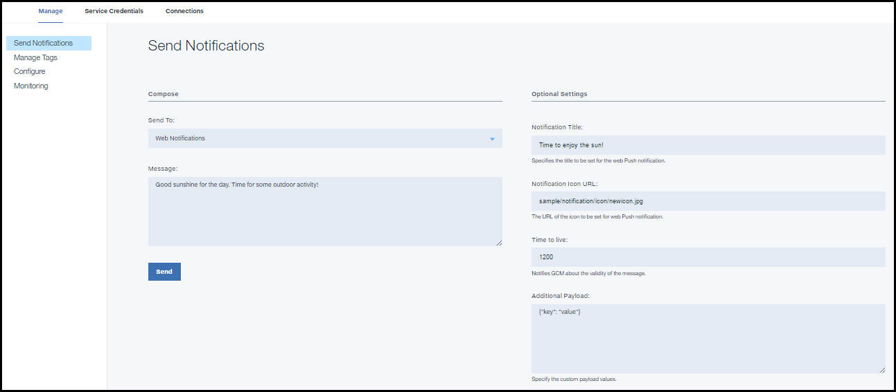

---

copyright:
 years: 2015 2016

---

# 向 Web 浏览器发送基本通知
{: #web_notifications}
上次更新时间：2016 年 11 月 15 日
{: .last-updated}

开发应用程序后，可以发送推送通知。 

1. 选择**发送通知**，并通过选择 **Web 通知**作为**发送至**选项来编辑消息。 
2. 键入需要在**消息**字段中传递的消息。
3. 您可以选择提供可选设置：
  - **通知标题**：这是作为消息警报标题显示的文本。
  - **通知图标 URL**：如果您的消息需要与应用程序通知图标一起传递，请在字段中提供图标的链接。
  - **其他有效内容**：为您的通知指定定制的有效内容值。

下面的图像显示仪表板中的 Web 通知选项。

  
  
## 后续步骤
  {: #next_steps_tags}

成功设置基本通知后，可以选择配置基于标记的通知和高级选项。

将这些 {{site.data.keyword.mobilepushshort}} 服务功能添加到应用程序中。要使用基于标记的通知，请参阅[基于标记的通知](c_tag_basednotifications.html)。要使用高级通知选项，请参阅[高级通知](t_advance_badge_sound_payload.html)。

