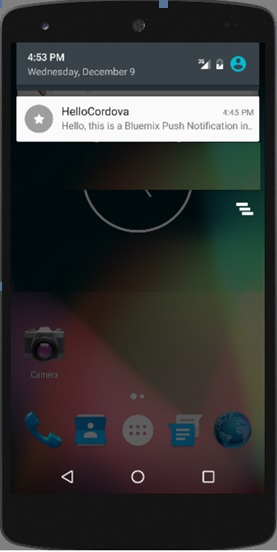

---

copyright:
 years: 2015, 2016

---

# 讓 Cordova 應用程式可接收推送通知
{: #cordova_enable}
前次更新：2016 年 8 月 16 日
{: .last-updated}

Cordova 是一個平台，可使用 JavaScript、CSS 及 HTML 來建置混合式應用程式。{{site.data.keyword.mobilepushshort}} 支援開發 Cordova 型 iOS 及 Android 應用程式。

您可讓 Cordova 應用程式接收推送通知，並將其傳送至您的裝置。


## 安裝 Cordova Push 外掛程式
{: #cordova_install}

安裝及使用 Client Push 外掛程式來進一步開發 Cordova 應用程式。這也會安裝起始設定您的 Bluemix 連線的 Cordova Core 外掛程式。

### 開始之前

1. 下載最新的 Android Studio SDK 及 Xcode 版本。
1. 設定您的模擬器。若為 Android Studio，請使用支援 Google Play API 的模擬器。
1. 安裝 Git 指令行工具。若為 Windows，請確保選取**從 Windows 命令提示字元執行 Git** 選項。如需如何下載並安裝此工具的相關資訊，請參閱 [Git](https://git-scm.com/downloads)。
1. 安裝 Node.js 及「Node 套件管理程式 (NPM)」工具。NPM 指令行工具與 Node.js 組合在一起。如需如何下載並安裝 Node.js 的相關資訊，請參閱 [Node.js](https://nodejs.org/en/download/)。
1. 從指令行中，使用 **npm install -g cordova** 指令來安裝 Cordova 指令行工具。若要使用 Cordova Push 外掛程式，這是必要動作。如需如何安裝 Cordova 以及設定 Cordova 應用程式的相關資訊，請參閱 [Cordova Apache](https://cordova.apache.org/#getstarted)。

	**附註**：若要檢視 Cordova Push 外掛程式 Readme 檔，請移至 [https://github.com/ibm-bluemix-mobile-services/bms-clientsdk-cordova-plugin-push](https://github.com/ibm-bluemix-mobile-services/bms-clientsdk-cordova-plugin-push)
1. 切換至您要在其中建立 Cordova 應用程式的資料夾，並執行下列指令來建立 Cordova 應用程式。如果您有現存的 Cordova 應用程式，請移至步驟 3。

```
cordova create your_app_name
cd your_app_name
```

1. 選用項目：（選用）編輯 **config.xml** 檔案，並將 <name> 元素中的應用程式名稱變更為您選擇的名稱，而不是預設 HelloCordova 名稱。

	**附註**：請確定指定正確的軟體組 ID。如果您未指定，則會在 Xcode 中顯示錯誤訊息。
	* 以無效的授權簽署執行檔。
	* 應用程式的「程式碼簽署授權」檔案中指定的授權，不符合佈建設定檔中指定的授權。

	若要修正此問題，請在 Xcode 或 Cordova 應用程式 **config.xml** 檔案中指定正確的「軟體組 ID」。

1. 將最低支援的 API 或部署目標宣告新增至 Cordova 應用程式的 config.xml 檔案。minSdkVersion 值必須高於 15。targetSdkVersion 值必須一律反映可從 Google 取得的最新 Android SDK。
	* **Android** - 使用編輯器來開啟 config.xml 檔案，並將
`<platform name="android">` 元素更新為最小及目標 SDK 版本：

	```
	<!-- add deployment target declaration -->
	<platform name="android">
			  <preference name="android-minSdkVersion" value="15" />
			  <preference name="android-targetSdkVersion" value="23" />
			</platform>
	```
   * **iOS** - 使用部署目標宣告更新 &lt;platform name="ios"> 元素：

	```
	<platform name="ios">
	    <preference name="deployment-target" value="8.0" />
	    <!-- other properties -->
	</ platform>
	```

1. 從 Cordova 指令行介面 (CLI) 中，使用下列指令新增平台：iOS 及（或）Android：

	```
	cordova platform add ios@3.9.0
	cordova platform add android
	```
1. 從 Cordova 應用程式根目錄中，輸入下列指令來安裝 Cordova Push 外掛程式：**cordova plugin add ibm-mfp-push**。

	根據您新增的平台，您會看到與下列類似的內容：

	```
	Installing "ibm-mfp-push" for android
	Installing "ibm-mfp-push" for ios
	```
1. 從 *your-app-root-folder* 中，使用下列指令，驗證已順利安裝 Cordova Core 及 Push 外掛程式：**cordova plugin list**。

根據您新增的平台，您會看到與下列類似的內容：

	```
	ibm-mfp-core 1.0.0 "MFPCore"
	ibm-mfp-push 1.0.0 "MFPPush"
	```
1. （僅限 iOS）- 配置 iOS 開發環境。
	a. 使用 Xcode 開啟 *your-app-name***/platforms/ios** 目錄中的 your-app-name.xcodeproj 檔案。

	b. 新增橋接標頭。移至**建置設定 > Swift 編譯器 - 產生程式碼 > Objective-C 橋接標頭**，然後新增下列路徑：*your-project-name***/Plugins/ibm-mfp-core/Bridging-Header.h**

	c. 新增 Frameworks 參數。移至**建置設定 > 鏈結 > Runpath 搜尋路徑**，然後新增下列參數：

	```
	@executable_path/Frameworks
```
	d. 解除註解橋接標頭中的下列 Push import 陳述式。移至 *your-project-name***/Plugins/ibm-mfp-core/Bridging-Header.h**

	```
	//#import <IMFPush/IMFPush.h>
	//#import <IMFPush/IMFPushClient.h>
	//#import <IMFPush/IMFResponse+IMFPushCategory.h>
	```
	e. 使用 Xcode 建置並執行應用程式。
1. （僅限 Android）- 使用下列指令建置 Android 專案：**cordova build android**。

	**附註**：在 Android Studio 中開啟專案之前，請先透過 Cordova CLI 建置 Cordova 應用程式。這將有助於避免建置錯誤。


## 起始設定 Cordova 外掛程式
{: #cordova_initialize}

您需要透過傳遞應用程式路徑及應用程式 GUID 來起始設定 {{site.data.keyword.mobilepushshort}} Service Cordova 外掛程式，才能使用該外掛程式。在起始設定外掛程式之後，您可以連接至在 Bluemix 儀表板中所建立的伺服器應用程式。Cordova 外掛程式是 Android 及 iOS Client SDK 的封套，可讓 Cordova 應用程式與 Bluemix 服務通訊。

1. 複製下列程式碼 Snippet，並將其貼入您的主要 JavaScript 檔案（通常位於 **www/js** 目錄下），以起始設定 BMSClient。

	```
	BMSClient.initialize("https://myapp.mybluemix.net","abcd1234-abcd-1234-abcd-abcd1234abcd");
	```
1. 修改程式碼 Snippet，以使用您的 Bluemix「路徑」及「應用程式 GUID」參數。按一下「Push 儀表板」中的**行動選項**鏈結，以取得「應用程式路徑」、「應用程式 GUID」及「用戶端密碼」。請使用「路徑」及「應用程式 GUID」的值，作為 `BMSClient.initialize` 程式碼 Snippet 中的參數。

	**附註**：如果您已使用 Cordova CLI（例如，Cordova create app-name 指令）建立 Cordova 應用程式，請將此 JavaScript 程式碼放置在 **index.js** 檔案中 `onDeviceReady: function()` 函數內的 `app.receivedEvent` 函數後面，以起始設定 BMS 用戶端。

```
onDeviceReady: function() {
    app.receivedEvent('deviceready');
    BMSClient.initialize("https://myapp.mybluemix.net","abcd1234-abcd-1234-abcd-abcd1234abcd");
    },
```

## 登錄裝置
{: #cordova_register}

登錄之前，請起始設定 {{site.data.keyword.mobilepushshort}} Service。
```
var appGUID = "your push service appGUID";
MFPPush.initialize(appGUID);

```

若要向 {{site.data.keyword.mobilepushshort}} Service 登錄裝置，請呼叫 register 方法。將下列程式碼 Snippet 複製至 Cordova 應用程式，以登錄裝置。

```
	var success = function(message) { console.log("Success: " + message); };
	var failure = function(message) { console.log("Error: " + message); };
	MFPPush.registerDevice({}, success, failure);
```

### Android
{: #cordova_register_android}
Android 不使用 settings 參數。如果您只是建置 Android 應用程式，請傳遞空物件。例如：

```
	MFPPush.registerDevice({}, success, failure);
	MFPPush.unregisterDevice(success, failure);
```

### iOS
{: #cordova_register_ios}
若要自訂警示、徽章及音效內容，請將下列 JavaScript 程式碼 Snippet 新增至 Cordova 應用程式的 Web 組件。

```
	var settings = {
	   ios: {
	       alert: true,
	       badge: true,
	       sound: true
	   }
	}
	MFPPush.registerDevice(settings, success, failure);
```


### JavaScript
{: #cordova_register_js}

```
MFPPush.registerDevice({}, success, failure);
```

您可以使用 JSON.parse 存取 JavaScript 中成功回應參數的內容：**var token = JSON.parse(response).token**


可用的索引鍵為：`token`、`userId` 及 `deviceId`。

下列 JavaScript 程式碼 Snippet 顯示如何起始設定 Bluemix Mobile Services Client SDK、向 {{site.data.keyword.mobilepushshort}} Service 登錄裝置，以及接聽推送通知。請在 Javascript 檔案中併入此程式碼。


```
//Register device token with Bluemix Push Notification Service
funcapplication(application: UIApplication, didRegisterForRemoteNotificationsWithDeviceToken deviceToken: NSData){
  CDVMFPPush.sharedInstance().didRegisterForRemoteNotifications(deviceToken)
}
```

```
//Handle error when failed to register device token with APNs
funcapplication(application: UIApplication, didFailToRegisterForRemoteNotificationsWithError error: NSErrorPointer){
CDVMFPPush.sharedInstance().didFailToRegisterForRemoteNotifications(error)
}
```

在 **onDeviceReady: function()** 內。

```
onDeviceReady: function() {
     app.receivedEvent('deviceready');
     BMSClient.initialize("https://http://myroute_mybluemix.net","my_appGuid");
     var success = function(message) { console.log("Success: " + message); };
     var failure = function(message) { console.log("Error: " + message); };
     var settings = {
         ios: {
             alert: true,
             badge: true,
             sound: true
         }
     };
     MFPPush.registerDevice(settings, success, failure);
     var notification = function(notif){
         alert (notif.message);
     };
     MFPPush.registerNotificationsCallback(notification);

 }
```

### Objective-C
{: #cordova_register_objective}
將下列 Objective-C 程式碼 Snippet 新增至應用程式委派類別

```
	// Register the device token with Bluemix Push Notification Service
	- (void)application:(UIApplication *)application didRegisterForRemoteNotificationsWithDeviceToken:(NSData *)deviceToken {
	  [[CDVMFPPush sharedInstance] didRegisterForRemoteNotifications:deviceToken];
	}
	// Handle error when failed to register device token with APNs
	- (void)application:(UIApplication*)application didFailToRegisterForRemoteNotificationsWithError:(NSError*)error {
	   [[CDVMFPPush sharedInstance] didFailToRegisterForRemoteNotificationsWithError:error];
	}
```

###Swift
{: #cordova_register_swift}
將下列 Swift 程式碼 Snippet 新增至應用程式委派類別。

```     
funcapplication(application: UIApplication, didRegisterForRemoteNotificationsWithDeviceToken deviceToken: NSData){
   CDVMFPPush.sharedInstance().didRegisterForRemoteNotifications(deviceToken)
}
// Handle error when failed to register device token with APNs
funcapplication(application: UIApplication, didFailToRegisterForRemoteNotificationsWithError error: NSErrorPointer){
   CDVMFPPush.sharedInstance().didFailToRegisterForRemoteNotifications(error)
}
```

##後續步驟

{: #cordova_register_next}

使用下列指令建置專案，然後執行專案：

####Android
{: android-next-steps}

```
cordova build android
```

```
cordova run android
```

####iOS
{: ios-next-steps}

```
cordova build ios
```

```
cordova run ios
```

## 在裝置上接收推送通知
{: #cordova_receive}

複製下列程式碼 Snippet，以在裝置上接收推送通知。

###JavaScript

將下列 JavaScript 程式碼 Snippet 新增至 Cordova 應用程式的 Web 組件。


```
var notification = function(notification){
    // notification is a JSON object.
    alert(notification.message);
};
MFPPush.registerNotificationsCallback(notification);
```

###Android 通知內容

下節列出 Android 通知內容：

* message - 推送通知訊息
* payload - 包含通知有效負載的 JSON 物件


###iOS 通知內容

下節列出 iOS 通知內容：

* message - 推送通知訊息
* payload - 包含通知有效負載的 JSON 物件
action-loc-key - 此字串用來作為索引鍵，在現行本地化中取得一個本地化字串，以用於適當的按鈕標題，而取代 `View`。
* badge - 顯示為應用程式圖示徽章的號碼。如果沒有此內容，則不會變更徽章。若要移除徽章，請將此內容的值設為 0。
* sound - 應用程式組合或者應用程式資料容器之 Library/Sounds 資料夾中的音效檔名稱。

###Objective-C

將下列 Objective-C 程式碼 Snippet 新增至應用程式委派類別。

```
// Handle receiving a remote notification
-(void)application:(UIApplication *)application didReceiveRemoteNotification:(NSDictionary *)userInfo fetchCompletionHandler:(void (^)(UIBackgroundFetchResult))completionHandler {

 [[CDVMFPPush sharedInstance] didReceiveRemoteNotification:userInfo];
}
```

```
// Handle receiving a remote notification on launch
- (BOOL)application:(UIApplication*)application didFinishLaunchingWithOptions:(NSDictionary*)launchOptions

    [[CDVMFPPush sharedInstance] didReceiveRemoteNotificationOnLaunch:launchOptions];
}
```

###Swift

將下列 Swift 程式碼 Snippet 新增至應用程式委派類別。

```
// Handle receiving a remote notification
funcapplication(application: UIApplication, didReceiveRemoteNotification userInfo: [NSObject : AnyObject], fetchCompletionHandler completionHandler: ){

    CDVMFPPush.sharedInstance().didReceiveRemoteNotification(userInfo)
}
```

```
// Handle receiving a remote notification on launch
func application(application: UIApplication, didFinishLaunchingWithOptions launchOptions: [NSObject: AnyObject]?) -> Bool {

    CDVMFPPush.sharedInstance().didReceiveRemoteNotificationOnLaunch(launchOptions)
}

```

## 傳送基本推送通知
{: #push-send-notifications}

開發應用程式之後，您可以傳送基本推送通知（不需要使用標籤、徽章、其他有效負載或音效檔）。


傳送基本推送通知。

1. 在**選擇對象**中，選取下列其中一個對象：**所有裝置**，或依平台：**僅限 IOS 裝置**或**僅限 Anroid 裝置**。

	**附註**：當您選取**所有裝置**選項時，所有已訂閱 {{site.data.keyword.mobilepushshort}} 的裝置都會接收到通知。


2. 在**建立您的通知**中，輸入您的訊息，然後按一下**傳送**。
3. 驗證您的裝置已接收到通知。

下列擷取畫面顯示在 Android 及 iOS 裝置的前景中處理 {{site.data.keyword.mobilepushshort}} 的警示框。


   下列影像在 Android 的背景中顯示 {{site.data.keyword.mobilepushshort}}。



## 後續步驟
{: #next_steps_tags}

順利設定基本通知之後，您就可以配置標籤型通知及進階選項。

將 {{site.data.keyword.mobilepushshort}} Service 特性新增至您的應用程式。
若要使用標籤型通知，請參閱[標籤型通知](c_tag_basednotifications.html)。若要使用進階通知選項，請參閱[進階推送通知](t_advance_notifications.html)。
