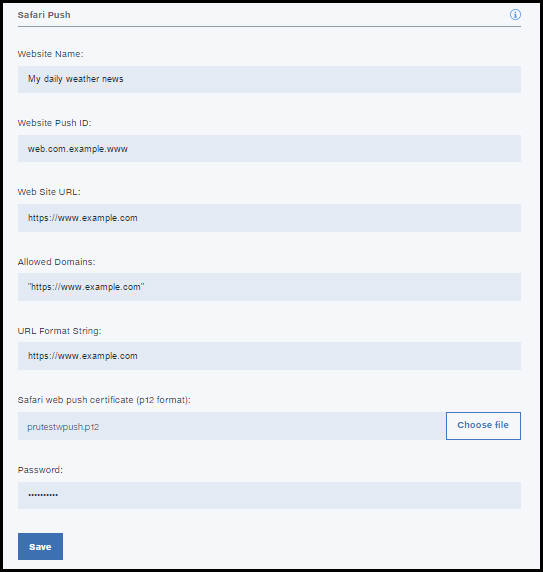

---

copyright:
years: 2015, 2016

---

{:new_window: target="_blank"}
# Configuring credentials for Safari web browser
{: #configure-credential-for-safari}
Last updated: 18 November 2016
{: .last-updated}

The IBM {{site.data.keyword.mobilepushshort}} service now extends capabilities to send notifications to your Safari browser. 

## Generating a certificate
  {: #certificate-generation}

Ensure that you have an Apple Developer account. You need to register a Website Push ID and generate a certificate to configure your Safari browser to receive notifications. The following steps will help you get started.

1. In the Apple Developer Member center, click **Certificates, ID & Profiles**. 
2. Click **Identifiers** and then **Website Push IDs**.
3. Choose to create a new entry by selecting the plus icon.
  

4. In the Register Website Push ID panel, provide an appropriate Website Push ID description and identifier ID. It is recommended that this is in reverse-domain name format, starting with 'web'. For example: web.com.example.dailyweatherreports.
5. Register the Website Push ID. You now have your Website Push ID 
6. Select **Edit** to update the Website Push ID.
7. In the Certificate Assistant window for Certificate Information, provide your email ID, and a common name. Leave the Certificate Authority email address as blank.
8. Click **Save to disk** and select **Continue**.
9. Choose to save the certificate to an appropriate folder.

## Configuring for notifications
  {: #configuration-notification}
 
After generating the certificate, you can configure the service to send notifications. 

Complete the steps:

1. In the Push Notifications service dashboard, **click Configure**. 
2. Select the Web tab. 
3. In the Safari Push section, update the form with the required information. 
	- **Website Name**: This is the name that you have provided in the Notification center.
	- **Website Push ID**: Update with the reverse-domain string for your Website Push ID. Copy this string from REST API. For example, web.com.example.www.
	- **Website URL**: Provide the URL of the website that should be subscribed to push notifications. Copy this string from REST API. For example, https://www.example.com.
	- **Allowed Domains**: This is optional parameter. This is the list of websites that requests permission from the user. Ensure that the URLs are comma separated values. Note that the value in Website URL will be used if this is not provided. Copy this string from REST API.
	- **URL Format String**: The URL to resolve when the notification is clicked. For example, ["https://www.example.com"]. Copy this string from REST API. Ensure that the URL use the http or https scheme.
	- **Safari web push certificate**: Upload the .p12 certificate and provide the password.
4. Click **Save**.	

	

You are now configured to send push notifications to the Safari browser.

	